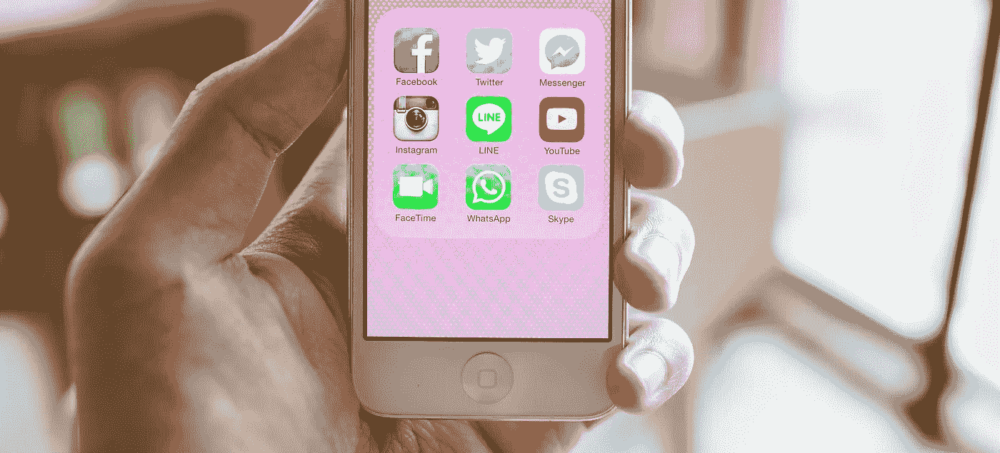

# 一个应用程序统治所有人

> 原文：<https://medium.com/hackernoon/one-app-to-rule-them-all-aa1cba497e62>

Is it possible to unify all communication apps into one?

 [## 每当彼得·施罗德发表文章时，就收到一封电子邮件。

### 每当彼得·施罗德发表文章时，就收到一封电子邮件。通过注册，您将创建一个中型帐户，如果您还没有…

medium.com](/subscribe/@peterschroederr) 

最近有大量的通讯应用程序涌入，迅速席卷全球，我有点不知所措。

随着我们从翻盖手机发展到智能手机，这些神秘的小玩意催生了应用程序的增长。这些应用程序已经超出了智能手机的创造者所能想到的任何东西，现在我们正在经历感官超负荷。

让我告诉你一个典型的一天，你告诉我这听起来是否熟悉。

早上 7 点——我起床后查看 Slack，看看我的团队中是否有人给我发了短信(WhatsApp、Facebook Messenger 等)。)然后，我检查对讲机以确保我睡觉时没有错过任何客户请求。接下来，在开始新的一天之前，我会继续处理我的电子邮件。最后，我浏览了我所有的社交媒体账户，看看是否有人试图通过它们与我联系。

上午 10 点——我和团队一起站起来，经历了和我醒来时一样的过程。这一次，我有更多的信息和电子邮件，以回应其中汇编从早上到现在。

一整天——我继续这个过程，以保持我的头在水面上。这个过程包括我不断地检查 Slack、HipChat、Snapchat、WhatsApp、微信、iMessage、Intercom、脸书、Facebook Messenger、Twitter、Instagram、Pinterest、LinkedIn、Medium、Viber、Kik、Skype、Line、Hike、Google Hangouts 和其他应用程序。这对我来说是不间断的。

在我一天的剩余时间里——我重复这个过程，在此期间——我利用醒着的每一分钟来跟上我迫切需要参与的对话。

这些事件发生在我典型的一天中，我知道我不是唯一一个经历这些的人。我相信这对于很多人来说是正常的。

解决眼前问题的一个显而易见的方法是我不要参与太多的对话。提议的解决方案对我来说可能不是好兆头，因为我需要这些对话来保持事情的运行。

一个更实际的解决方案是开发一个应用程序，统一所有的通信方式，并将其结合成一个。如果我可以利用一个应用程序来满足我所有的通信需求，我的生活将变得轻而易举(或者至少简单一点)。

出于这个原因，也仅仅是这个原因，我决定开发一个应用程序来解决眼前的问题。

我正在开发的应用程序将把所有形式的通信结合到一个简单的应用程序中，从一个中心位置汇总和发送消息和电子邮件。

我目前正处于统一消息平台的早期开发阶段，我将其命名为 UNUM messenger。我计划在 2017 年 3 月推出 UNUM messenger 作为测试版。

由 [API 经济](https://www.apifirst.tech/welcome?ref=medium)带给你。或者在[推特](https://twitter.com/peterschroederr)上联系我了解更多信息。

如果你想在我的旅程中跟随我，请务必跟随我[来到灵媒](/@peter.e.schroeder)。此外，如果你喜欢这篇文章，一定要喜欢它！

> [黑客中午](http://bit.ly/Hackernoon)是黑客如何开始他们的下午。我们是 [@AMI](http://bit.ly/atAMIatAMI) 家庭的一员。我们现在[接受投稿](http://bit.ly/hackernoonsubmission)并乐意[讨论广告&赞助](mailto:partners@amipublications.com)机会。
> 
> 如果你喜欢这个故事，我们推荐你阅读我们的[最新科技故事](http://bit.ly/hackernoonlatestt)和[趋势科技故事](https://hackernoon.com/trending)。直到下一次，不要把世界的现实想当然！

