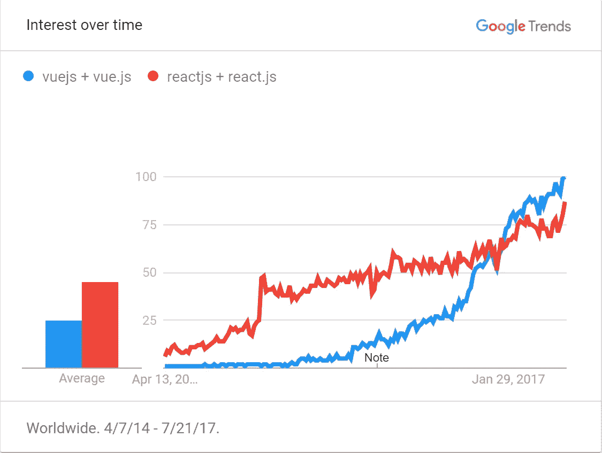

# 一个主要的反应方式是

> 原文：<https://medium.com/hackernoon/one-major-reason-vuejs-gt-react-4edcb400e383>

## 牢不可破的纽带


在我读过的所有比较和对比 [VueJS](https://vuejs.org/) 和 [React](https://facebook.github.io/react/) 之间差异的文章中，有一个关键缺陷我还没有看到详细讨论。请耐心听我解释细节。

如果您不熟悉 Vue 和 React 之间最常引用的典型差异，它们包括以下内容:

*   渲染速度(优势:Vue【直到[反应纤维](https://github.com/acdlite/react-fiber-architecture))
*   学习曲线/易用性(优势:Vue)
*   新应用设置时间(优势:Vue)
*   主要功能集(equal [ReactNative？ [Weex](https://weex.incubator.apache.org/) 。])
*   自定义指令(优势:Vue)
*   条件元素/渲染(优势:Vue)
*   灵活性(优势:Vue)
*   严格的 JavaScript(优势:React)

(你可以清楚地看到，这位作者非常不偏不倚。)

上面没有提到的关键区别是关于你*可以*或者*必须*实现你的代码的方式，以及你*能够*使用每个框架的上下文。

# 遗留系统

例如，想象一下，如果您面对一个大型、笨重的数据输入表单，在一个遗留系统中有许多字段和逻辑，并且您被分配了一个任务，用一个奇特的新前端框架使它现代化。该表单的结构可能如下所示:

如果你选择 VueJS 作为你的前端框架来处理这个项目，你可以通过对标记和一个新的`.js`文件做一些调整来完成这项工作。例如:

请记住，这是一个基本的、粗糙的示例，仅用于说明目的。这里突出的一点是，不管 Vue 实现的细节如何，现有的标记*都可以*被重用，只需要一点重构。

有了 React，您将无法使用任何现有实现的*。相反，您必须将所有标记粘贴到新的 React 组件中，并相应地进行重构。*

此外，即使您使用全新的 React 组件进行重写，您也不能只将新代码加载到页面上。相反，您必须扩充整个开发流程，在工作流程中加入与 babelify/trans filing 和部署新 React 代码相关的额外步骤。这让我想到了本文的症结所在，这是一个相关但更广泛的问题。

# 紧密结合

React 的一个核心难点是它的标记是如何编写的: **JSX** 。Vue 和 React 之间最广为人知和最重要的区别之一是,*React 中的一切*都是严格基于 JavaScript 的，然而 Vue 足够灵活，可以让组件基于真实的 DOM 元素、文本 HTML 标记，甚至是*JSX(我相信这种支持有助于吸引胆小的 React 开发人员转向*光明的*)。*

有一些经验丰富的资深开发人员喜欢 React，因为他们喜欢它完全基于 JS。我听说过这样的开发商:

> “在 React 中做任何事情都感觉更自然，因为它完全是 JavaScript，但 Vue 使用 HTML 属性来操作 DOM，这是不自然的。”

嗯，好吧，人各有志……至少就*的观点*而言。但是客观地说，这意味着你必须使用脸书发明的自定义语法来创建所有的 DOM 标记(顺便说一下，这对于作者来说很不自然)。而且因为是用这种非标准的、自定义的方式编写的，你的 React 代码不能直接在页面上执行；必须先翻译成*实际*自然 JavaScript。

为了进一步说明，请考虑以下标记:

```
<div id="some-block">
  <h1>arbitrary content</h1>
</div><script type="text/x-template" id="my-template">
  <p>Lorem ipsum dolor sit foobar</p>
</script>
```

您可以通过附加到 DOM 中的实际元素来实例化 Vue 组件:

`new Vue({ el: '#some-block' })`

或者通过使用标记字符串(无论是页面上的`<script>`模板、JS 中的字符串、通过 Ajax 获取的数据等等)。):

`Vue.component('my-component', { template: '#my-template' })`

如果您正在使用 Vue，这是很好的，尽管因为您既不能在 React 中编写普通的 HTML，也不能将 React 组件与现有的 DOM 元素挂钩，所以您的手脚被束缚住了。我的意思是，你不能代替 JSX 点在 DOM 中的一个现有 ID 上作出反应，并让 React 隐式地将该子树解析为 JSX。

要在 React 中执行等效操作，不能只引用现有的 DOM 或外部 HTML。相反，您必须在组件中定义新的 JSX。例如，(假设我们打算构建一个有状态的组件):

```
class MyComponent extends Component {
  constructor(props) {
    super(props) // ... set state ...
  } render() {
    // don't let its appearance fool you - this isn't HTML
    return (
      <p>Lorem ipsum dolor sit foobar</p>
    )
  }
}// ...define props and their defaults...
```

因为 React 在这方面是如此僵硬和不灵活，所以它意味着:

> 在 React 组件中，不重新编译就不能修改标记。

对于许多团队或项目来说，这可能不是一个重要的问题，但最近当我意识到产品经理、市场营销和任何其他非技术利益相关者将*永远*不能像他们过去通常做的那样做出甚至简单的静态文本标记调整时，这就成了我日常工作中的一个重要问题。

通常，将控制器逻辑从表示视图中分离出来是显而易见的最佳实践。这在较低的级别上是可能的，在内部中的*使用容器/视图(也称为智能/非智能)组件模式进行反应，但是在通用浏览器级别上，逻辑和视图在防弹玻璃后面的水泥块中紧密耦合，密不可分。*

简单的视图层标记纠缠在底层编程中，这意味着不仅从遗留代码转移到 React 需要重写而不是重构，而且未来从到*的*转移到另一个*框架可能需要从头开始重写，而不仅仅是重构。这在今天不一定是一个问题，但是在未来的某个时候，随着下一代框架的出现，你我可能会面临这个难题。我认为一个好的原则是选择一个不仅在开始时容易实现，而且允许你在以后容易地将*从*转移的实现。*

# 结论

本文的目的不是为了赞美 Vue 而抨击 React，也不是为了劝阻每个人使用 React 而支持 Vue。正如谚语所说:无论工具是什么，你都应该为工作使用正确的工具。我只希望阐明我认为对于一个公司或开发团队来说，在可预见的未来，当他们决定锁定哪个前端框架时，什么可能是潜在的主要考虑因素。(谁知道呢？也许这是计划的一部分，每个人都被迫依赖 React，并通过代理人依赖脸书。这对微软很有效。)

# 同时…



[Vue is trending above React](https://trends.google.com/trends/explore?date=2014-04-07%202017-07-21&q=vuejs%20%2B%20vue.js,reactjs%20%2B%20react.js) for the first time

[](http://bit.ly/HackernoonFB)[](https://goo.gl/k7XYbx)[](https://goo.gl/4ofytp)

> [黑客中午](http://bit.ly/Hackernoon)是黑客如何开始他们的下午。我们是 AMI 家庭的一员。我们现在[接受投稿](http://bit.ly/hackernoonsubmission)并乐意[讨论广告&赞助](mailto:partners@amipublications.com)机会。
> 
> 如果你喜欢这个故事，我们推荐你阅读我们的[最新科技故事](http://bit.ly/hackernoonlatestt)和[趋势科技故事](https://hackernoon.com/trending)。直到下一次，不要把世界的现实想当然！

