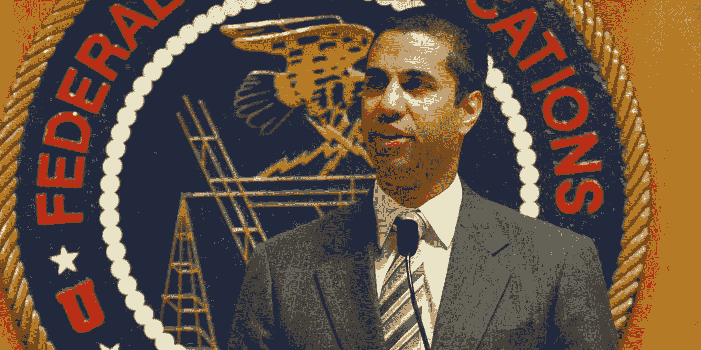

# 一个人的观点可以改变我们所知的互联网。

> 原文：<https://medium.com/hackernoon/one-mans-opinion-could-change-the-internet-as-we-know-it-778150128a08>

就在感恩节的时候，FCC 主席 Ajit Pai 给了全国的互联网服务提供商一个感恩的理由。他[宣布联邦通信委员会将对一项提案进行投票](https://www.theverge.com/2017/11/21/16680290/fcc-end-net-neutrality-vote-announced)，该提案将推翻一项终结网络中立的裁决。

> 但是什么是[网络中立](https://en.wikipedia.org/wiki/Net_neutrality)？我们以前没谈过这个吗？

我们有。简单来说，是 2015 年 FCC 的一项规定，要求所有 ISP 平等对待互联网；*中立地*。确保每个网站为每个客户获得相同的带宽和相同的速度。

如果没有网络中立性，理论上宽带提供商能够给他们的品牌内容优惠待遇，同时限制竞争网站，如果不是完全阻止它们的话。但是，正如 Pai 先生很快指出的那样，这种情况只是一种假设。

虽然 Pai 声称相信开放和自由的互联网，但他更担心联邦政府的越权行为。在多次声明中，他哀叹网络中立的危险。指责该机构对宽带提供商进行微观管理，阻止他们进一步建设基础设施。

正是基于这种推理，Pai 声称网络中立的真正受害者是生活在农村和低收入地区的人们。

根据 Pai 先生的说法，这场辩论的任何一方似乎都要为某个人付出代价*(大公司或大多数公众)*，因此了解这场辩论的一些背景很重要。但是，如果联邦通信委员会已经在 2015 年对此进行了投票，那么他们为什么已经试图废除它呢？

整理出一个答案的表象，只需要看看主席本人就够了。

从哈佛大学毕业后，Pai 在担任威瑞森通信公司副总法律顾问之前曾在司法部工作。两年后，他将离开威瑞森，开始他在参议院司法小组委员会和司法部的晋升。最后，2012 年，Pai 被时任总统奥巴马任命为 FCC 成员。

在联邦通信委员会的第一个五年任期内，Pai 似乎从不缺少不受欢迎的意见。他反对电视广播公司要求他们放弃未使用的频道。2014 年， [Pai 在华盛顿邮报](https://www.washingtonpost.com/opinions/truthy-project-is-unworthy-of-tax-dollars/2014/10/17/a3274faa-531b-11e4-809b-8cc0a295c773_story.html?utm_term=.286c59a98c4b)上写了一篇专栏文章，声称联邦通信委员会在印第安纳大学资助的一项名为 [Truthy](http://cnets.indiana.edu/blog/2014/08/27/the-truth-about-truthy/) 的研究违宪。这项研究的目标是试图找到破译人们在社交媒体上发布的内容将如何传播的方法。Pai 谴责违反第一修正案，称机器学习算法只会帮助政府审查党派评论。

2015 年，Pai 取得了最不令人惊讶的成就，当时他直接反对 FCC 投票启用网络中立。他发表了一份反对声明，承认相信一个开放的、监管宽松的互联网。称赞克林顿政府和国会在 90 年代末推出了围绕商业互联网的最初政策。如果我们假装宽带公司本身是高尚和透明的，这本身就是一种高尚的情感吗？

> 投票:如果你曾经因为网速不合理的慢、账单上的意外费用/费率上涨而不得不打电话给你的互联网提供商，或者不得不请假让某人出来看看为什么互联网停止工作，请举手表决？没错。

现在，我们在这里，在 FCC 首次通过网络中立两年后，再次进行同样的战斗。

在最近为《洛杉矶时报》撰写的一篇专栏文章中，现任联邦通信委员会委员杰西卡·罗森沃塞尔解释了她反对废除该法案的原因。重要的是要记住 Rosenworcel 和 Pai 不是陌生人。他们曾在 2015 年 Pai 的第一个任期内合作，当时网络中立性第一次被提到桌面上。

Rosenworcel 回顾了废除的多个问题，从未回避如何处理整个局势的额外问题。

她引用了纽约司法部长 Eric Schneiderman 写的一封公开信，信中称“成千上万的美国人”被冒用身份向委员会提交有利的评论。但是因为这不是一个公开的投票，[机构已经承认](https://www.washingtonpost.com/news/the-switch/wp/2017/11/24/fcc-net-neutrality-process-corrupted-by-fake-comments-and-vanishing-consumer-complaints-officials-say/?utm_term=.430fa27ffb58)他们的妥协系统。并表示不打算对此进行补救，以更准确地了解美国人对这一政策的反应。

所以今天，网络中立仍然存在，声音已经被[忽略，在某些情况下，完全被忽视。](https://www.theverge.com/2017/11/22/16689838/fcc-net-neutrality-comments-were-largely-ignored)

但是对于公众来说，接受这种命运仍然有很大的风险。虽然坊间传闻，但似乎大多数人都担心这将如何影响他们的网飞信息流或社交媒体订阅。这一废除将对人们的生活产生长期影响，对一些人来说，将完全改变他们与世界其他地方的联系方式。

那么，下一次这个话题回到桌面上会发生什么呢？当社会变得越来越依赖互联网，宽带提供商可以合法地屏蔽联邦通信委员会的网站吗？

谢天谢地，对许多美国人来说，仍然有时间对抗这种衰退，并确保他们的声音被听到。FCC 直到 12 月 14 日才会对此进行投票。给像 BattleForTheNet.com 和 gofccyourself.com 这样的网站一个机会，把人们聚集在一起，给他们可操作的步骤来帮助拯救互联网。当然，你也可以选择通过电话或电子邮件向联邦通信委员会和国会议员提出一些传统的上诉。

谁知道呢，也许在投票前的某个时刻，2017 年的 Ajit Pai 会听从 [2015 年 Ajit Pai](https://apps.fcc.gov/edocs_public/attachmatch/FCC-14-61A5.pdf) 的话:

> 这一根本性的争论不是我们五个未经选举的个人能够决定的。相反，它应该由人民选出的代表来解决，那些选择政府方向的人，以及那些美国人民可以对其选择负责的人。