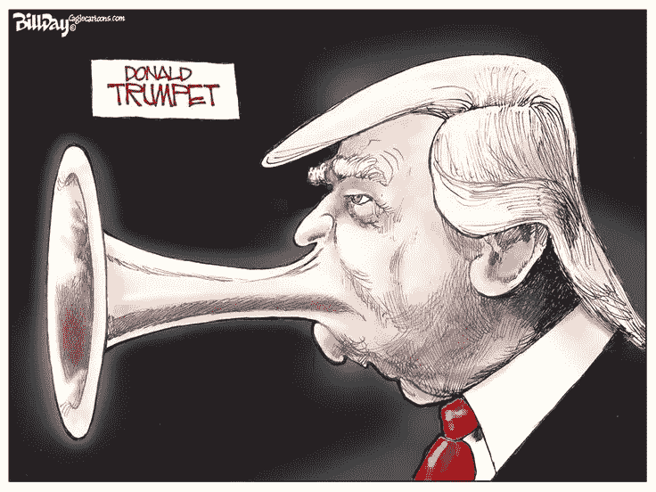

# 沟通作为一种文化

> 原文：<https://medium.com/hackernoon/one-of-the-reasons-that-i-found-myself-working-in-venture-capital-is-that-im-fascinated-by-b9b5ebe6ebdc>

我发现自己从事风险投资的原因之一是我对商业很着迷。

在风险投资领域，我频繁接触到不同的首席执行官如何经营他们的企业，并对风险投资支持的公司进行了无数次深入研究，很明显，只有当首席执行官拥有*的沟通技巧时，超高增长才能实现。*

*那是‘很棒’，不是‘很好’，非常难得。这种差异往往比你想象的要微妙得多。*

> *“如果首席执行官不明白他们 90%的职责是沟通，那么他们就不值得长期投资”*

**

*Credit: strategyzer.com*

*因此，信息传递就是一切。“你买的不是游艇，而是梦想”等等。
那是 CEO 沟通 101。如果没有一些信息传递技巧，你就无法招募一个团队、筹集一轮资金或销售很多产品。*

*但是，好的信息传递往往掩盖了糟糕的/一般的沟通，而好的沟通对于招聘、管理和保持团队团结至关重要。*

*让我举几个例子:*

## *让你的团队保持专注:永远让他们知道他们的立场*

*我们都曾向人们发送电子邮件，强调非对称重要性的问题——无论是谈判费用、加薪、休假等。—他们对你来说意义重大，但对 CEO 来说只是另一回事。*

***场景 1:** 在接下来的 24 小时里，你仔细检查每一次互动，想知道他们是否读过这封邮件，他们在想什么，为什么他们会从桌子上那样看着你——你让自己陷入了困境，这正影响着你现在的心态。作为一名员工、合作伙伴或顾问，这真是一个令人沮丧的地方。*

*假设你几天没有听到任何消息。与此同时，你的工作远低于标准，因为你的思想在别处，而不仅仅是在你和家人在一起的时候工作。首席执行官现在一定已经看过了——他们为什么什么都不说？*

***场景 2:** CEO 收到电子邮件，立即快速回复说*

*“嘿，我正忙着整理董事会文件，直到周三。但乍一看，我不认为这是一个问题。我将在周四上午更全面地回复"*

*或者，如果有问题*

**“…我不确定这是否会很简单，但我相信我们可以找到双方都满意的解决方案。我知道这对你很重要，但我在周四之前都排满了——那我们坐下来谈吧。”**

*无论是在个人层面还是在职业层面，这两种情况都有很大的不同。这不仅显示了对某人个人问题的基本尊重和关心，而且有助于他们管理自己的心态，重新专注于日常工作，因为他们可以相信首席执行官知道存在问题，并正在处理问题。*

*这是很好的交流——而且对每个人都有帮助，对吗？你可以把它应用到无数的情况中，得到同样的复合效果。*

**

## *保持团队参与:不要单方面行动*

*每个初创公司都需要定期做出重大决定，无论是关于产品开发、营销还是人力资源——这些都是挑战，但也是让团队感到受到重视和尊重的机会。*

*我曾经遇到过这样的情况，某一天，一位首席执行官宣布他正在领导公司方向的重大变革，而团队的其他人第一次听到这个消息是在他的决定已经做出之后——并且被说成是不可撤销的。*

*这位“有远见”的 CEO 是个笨蛋的几个原因:*

*   *没有人分享这个计划的所有权，他们只是服从命令。因此，CEO 的创造力减少了，激励团队、确保交付的压力增加了，与 CEO 需要注意的其他事情(投资者、合作伙伴、指标等)相比，这是一场艰苦的斗争。*
*   *人们被雇佣大概是因为他们的技能和才能——他们在某些事情上比首席执行官做得更好，对自己的领域了解得更透彻——如果不咨询他们，这个决定不仅可能是一个糟糕的决定，而且对他们自己在组织中的价值感(缺乏)的影响将是巨大的。*
*   *小团队中的单方面决策对信任来说是灾难性的。没有人知道接下来事情会在什么时候或者如何改变——现在它是一艘可以随时改变目的地的船。有更好的地方工作。人们会找到他们的。*
*   *不花些时间仔细考虑就不可能做出重大决定。因此，这要么是一个草率的决定，要么是首席执行官在思考过程中懒得沟通。*

*当一个伟大的沟通者不得不在时间压力下行动时，他会怎么做？把人们拉到一边，迅速征求他们的意见和直觉，在短时间内制定一个计划，分享它，让他们参与测试，然后根据结果实施它。*

*每个人都有机会演奏海螺。不允许使用扩音器。*

*伟大的沟通。没有冲击，没有信任危机，没有死亡之谷。*

**

## *沟通不需要成为一种超能力，只需要优先考虑*

*我的观点是，良好的沟通不是一种天赋，而是一种可以学习、发展和不断完善的技能。*

*这不是事后带着一个完整而坦率的“我搞砸了”的道歉转身，公开列举你的错误。*作为一名初创公司的首席执行官，如果你发现自己处于那个位置，那么你已经让你的团队和投资者失望了。**

*首先，我想投资一个伟大的沟通者。不管你的 LTV 与注册会计师的比率是破了顶，还是你的增长率是 50%，如果一个 CEO 不明白他们的角色是 90%的沟通，那么他们就不是一个值得长期投资的 CEO。*

*所以，忘了制造一种充斥着办公室迷你高尔夫球场和按需奶昔的公司文化吧——你只是在外包一些会让你吃不了兜着走的东西。*

*你的公司所能拥有的最好的“文化”是鼓励所有层面良好沟通的文化。首席执行官越早优先考虑这一点，并真正开始实践，他们的公司就会表现得越好。
手放下。*

## *彻底的坦白*

*几周前，我读了金·斯科特写的关于激进坦率的书。这是一本好书。可能比它应该的要长，但是它显示了坦诚的交流是如何让建立一个公司(以及其他事情)变得如此容易。*

*[https://www.youtube.com/watch?v=4yODalLQ2lM](https://www.youtube.com/watch?v=4yODalLQ2lM)*

*其中一个警告是，超级坦率并不仅仅意味着发出生硬的反馈——它需要伴随着彻底的同情和关怀。在你告诉人们一些真相之前，你需要关心他们，否则你只是在冒犯他们。*

*无论你打什么位置，这绝对值得一试。*