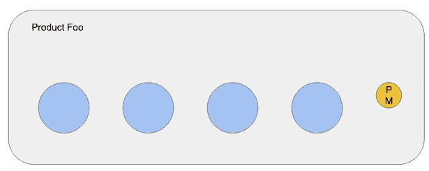
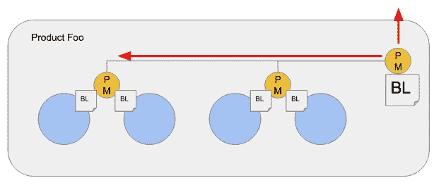
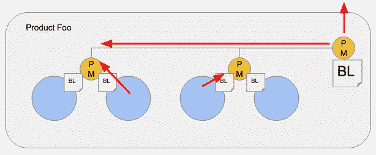
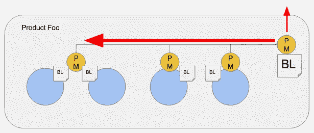
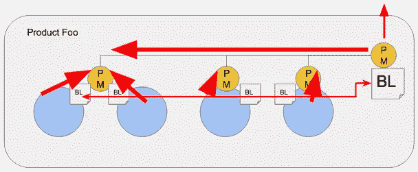
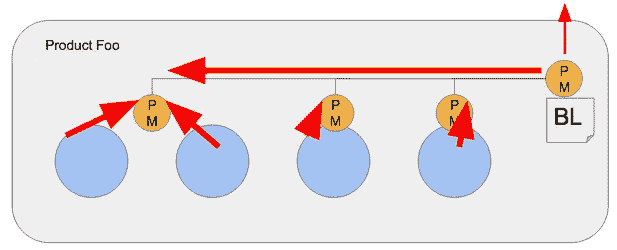
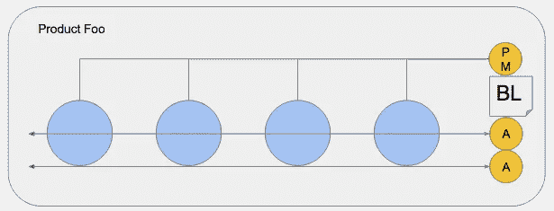
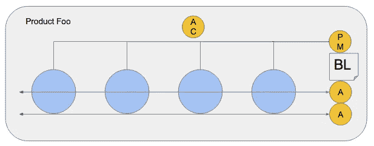
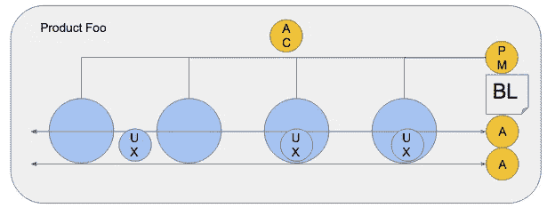
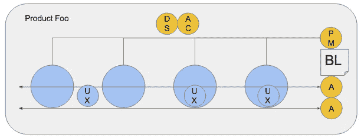

# 一个产品经理，四个团队？

> 原文：<https://medium.com/hackernoon/one-product-manager-four-teams-f8ea9a5a17fc>

关于加强产品管理的几点思考？

你有四个团队在开发一个产品。你只有一个产品经理，但是那个项目经理已经不堪重负了。

你听到“每个团队都需要一个项目经理！”所以你雇佣了一些缺乏经验的项目经理在原来的项目经理下面工作。

但是有一些问题。最初的项目经理在管理外部利益相关者和教导缺乏经验的项目经理方面有困难。

此外，团队中也酝酿着紧张气氛。越是初级的项目经理越是被团队压垮。

所以我们雇佣了另一个项目经理。这增加了管理开销。

同时，需要大量的协调工作来将单个团队的待办事项/路线图与“真正的待办事项”和路线图同步。

但是紧张情绪一直在酝酿……“我们需要更有经验的项目经理！”

你如何“解决”这个问题？一些想法…

首先，消除单个团队的积压工作(因为他们的积压工作是由单个产品的需求驱动的)。

接下来——这很难——找到最有潜力的初级项目经理，让他们成为首席项目经理的学徒。他们不是 APM(团队认为首席 PM 是他们的 PM)，而是真正的学徒，因为他们有一个结构化的学习计划，并承担特定的任务/责任。

学徒承担的任务包括:

*   非常定期的客户电话和研究
*   简易化
*   竞争研究
*   数据分析和展示

但是没有项目经理，团队如何运作呢？嗯，1)他们有一个，2)目标是拥有自给自足的团队。自给自足的团队应该能够承担更广泛定义的问题。

为此，雇佣一个敏捷的蔻驰来帮助团队变得更加自给自足。空调以拉的方式工作(不是推)。

确保团队有专门的 UX(或尽可能接近专门的)。

看看你是否能为这个团队找到一名数据科学家或分析师。

我已经看到这建立了必要的弹性/成熟度。所有的帽子都在。

为什么会这样？

1.  更现实的职业发展。在最初的模型中，其中一个项目经理能够进步的唯一方式是他们的老板离开。对学徒的期望有点不同。
2.  将一个初级项目经理加入一个团队会导致紧张(尤其是对于更有经验的工程师)。学徒模式组织了他们的学习。
3.  处理单个待办事项使团队保持专注，并防止不健康的局部优化。消除各种积压工作之间的协调工作。
4.  专注。如果团队没有在“产品”上工作，那么他们真的不需要产品经理。这里有一个单品。该模型使整个群体更有弹性。
5.  一个经验丰富的项目经理*应该*能够为四个团队提供足够的指导，前提是这些团队更加成熟，能够处理更广泛的问题并分解它们。如果您发现自己在这种情况下需要一个“PO”，那么这通常是一个信号，表明各个团队需要更多的实践/支持。

总之。只是一些头脑风暴。感谢反馈。