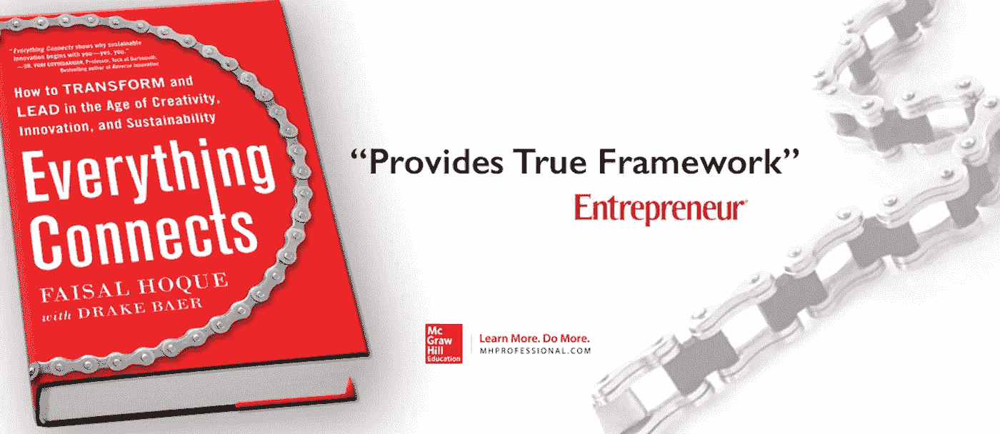

# 如果你想成功，你应该掌握的一项心理技能

> 原文：<https://medium.com/hackernoon/one-psychological-skill-you-should-master-if-you-want-to-be-successful-bfeca9d3d020>

**Image: Unplash use** [**Matthew Wiebe**](https://unsplash.com/@matthewwiebe?grid=multi)**.**

## 正念与其说是一次精神之旅，不如说是关于专注和专注。

几十年前,“正念”一词意味着东方神秘主义，与一个人的精神旅程有关，植根于佛教、印度教和中国古代哲学。

所有这些传统都认为，健康、快乐和平静来自于练习正念生活。

今天，正念与其说是一次精神之旅，不如说是关于专注和专注。这是一种全神贯注于当下的能力。

科学界现在一致认为，通过练习日常正念，我们可以利用大脑的神经可塑性的[优势，从而改善我们的生活状态。](http://www.theemotionmachine.com/mindfulness-and-neuroplasticity)

所以毫不奇怪，根据[福布斯报道](http://fortune.com/2016/03/12/meditation-mindfulness-apps/)，去年“冥想和正念行业收入近 10 亿美元”。

专注在我们的头脑中是一种巨大的力量。任何一个掌握并发展完全专注于当下的能力的人，都可以避免担心、怀疑、恐惧或转移他们对不安全感的关注，以及对旅程中每一步无休止的质疑。保持我们现在的注意力，不要转移到未来的任务或目标，这是成功实现我们所有目标的关键。

# 1.专注控制我们的思想

头脑是一个强大的信息、数据和每天形成、发出或接收的成千上万个想法的网络。无论你的职业或受教育程度如何，你都拥有这种创造自己的生活和世界的创造力、想象力和力量的永恒源泉。

积极的想法建立在积极的想法之上，只要你养成了关注好的方面的习惯，积极的想法就会越来越多——即使看起来没有什么积极的东西值得关注。这种心态加速了你发现如何改进工作以超越过去努力的能力。

# 2.过去只是我们过去的经历

在过去的个人或职业交往中，你是否经历过失败并不重要，因为失败只是教会你如何做和如何不做某事。关注从错误中吸取的教训是至关重要的，因为这些是走向成功的实际步骤。

许多(如果不是全部的话)科学、创新和进步领域的伟人犯了许多错误并坚持下来，他们知道所有这些错误都是等待他们的成功的基石。

正如电影中的角色穆里尔·唐纳利(玛吉·史密斯饰演)深刻地说的那样，“第二好的异国情调万寿菊酒店”:

> “没有所谓的结局，只有你留下故事的地方。现在这是你的故事…你不知道你会变成什么样，不要试图去控制它。放手吧。这才是有趣的开始。因为我曾听到有人说‘没有比时间更好的礼物了’。"

# 3.集中你的思想来保护你的能量

有没有和一群人坐在一个房间里，笑着玩得很开心，当有人走进来的时候，突然整个房间的气氛都变了？或者你一直心情很好，然后身边来了个人突然情绪低落甚至加重？

我坚信每件事和每个人都拥有和携带能量:他们自己的能量和他们周围人的能量。冲突时有发生，生活时有发生，这些时候我们需要努力集中注意力，以避免吸收或应对我们周围有毒的人和情况。

正念，或专注于当下，是帮助我们学会防范负面能量的东西。

# 4.你有这种力量——只要你知道你有

专注和走向成功的积极步骤的力量存在于每个人心中，并且一直如此。神奇之处在于意识到我们拥有的力量，并每天、每周或每月利用它来改善我们的生活——从而改善我们周围人的生活。

这种能量和创造的无限源泉得益于对我们目标的视觉化和关注当下当我们达到目标时的感受。

我们头脑中的这种感觉是一种额外的能量涌动，它告诉我们最终目标已经实现，尽管我们在实现目标的过程中可能会遇到困难和障碍，但我们需要记住，将这些困难和障碍转化为优势和机遇是让我们同时成为人类和神的原因。

所以，让我们抛开所有的恐惧，通过专注于当下来实现我们的目标，从而战胜自我怀疑和过去的不安全感。

**精选图片:未使用** [**马修·维贝**](https://unsplash.com/@matthewwiebe?grid=multi) **。**

**原创文章**[**@ business insider**](http://www.businessinsider.com/one-psychological-skill-you-should-master-if-you-want-to-be-successful-2016-8/#-1)**和**[**@ BIDeutschland**](http://www.businessinsider.de/diese-psychologische-technik-solltet-ihr-beherrschen-wenn-ihr-erfolg-haben-wollt-2016-8?IR=Thttp://www.businessinsider.de/diese-psychologische-technik-solltet-ihr-beherrschen-wenn-ihr-erfolg-haben-wollt-2016-8?IR=T)**。**

—

*连环企业家兼作者* [*费萨尔·霍克*](http://faisalhoque.com/) *是* [*沙多卡*](http://www.shadoka.com/) *等公司的创始人。Shadoka 促进企业家精神、增长和社会影响。他著有《* [*万物互联:如何在创意、创新和可持续发展的时代进行变革和领导》*](http://everythingconnectsthebook.com/) *》和《* [*生存并茁壮成长:有韧性的企业家、创新者和领导者的 27 种做法*](http://survivetothrive.pub/) *》等书。版权所有 2016 年由费萨尔霍克。保留所有权利。在推特上关注他*[*@ fais al _ hoque*](https://twitter.com/faisal_hoque)*。*

> [黑客中午](http://bit.ly/Hackernoon)是黑客如何开始他们的下午。我们是 [@AMI](http://bit.ly/atAMIatAMI) 家庭的一员。我们现在[接受投稿](http://bit.ly/hackernoonsubmission)并乐意[讨论广告&赞助](mailto:partners@amipublications.com)机会。
> 
> 如果你喜欢这个故事，我们推荐你阅读我们的[最新科技故事](http://bit.ly/hackernoonlatestt)和[趋势科技故事](https://hackernoon.com/trending)。直到下一次，不要把世界的现实想当然！

