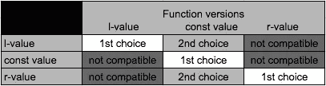

# 一次性学习 C++右值、&&和移动

> 原文：<https://medium.com/hackernoon/one-shot-learning-of-c-r-value-and-move-27e5d6bcec3b>


Photo by [Sean McAuliffe](https://unsplash.com/photos/vmvlzJz1lHg?utm_source=unsplash&utm_medium=referral&utm_content=creditCopyText) on [Unsplash](https://unsplash.com/?utm_source=unsplash&utm_medium=referral&utm_content=creditCopyText)

> C++很难，新版本变得更难。本文将讨论 C++中的一些难点，右值、右值引用(`**&&**`)和移动语义。我将对这些复杂且相关的主题进行逆向工程(不是比喻)，这样你就可以一步到位地完全理解它们。

首先，让我们检查

# 什么是右值？

一个 ***r*** 值应该在等号的右边。

**举例:**

```
int **var**; // too much JavaScript recently:)
**var** = 8; *// OK! lvalue (yes, there is a lvalue) on the left*

8 = **var**; *// ERROR! rvalue on the left*
(**var** + 1) = 8; *// ERROR! rvalue on the left*
```

很简单。那么让我们来看一个更微妙的情况，函数返回的一个 ***r*** 值:

```
#include <string>
#include <stdio.h>

int g_var = 8;
int& returnALvalue() {
   **return** g_var; *//here we return a lvalue*
}

int returnARvalue() {
   **return** g_var; *//here we return a rvalue*
}

int main() {
   printf("%d", returnALvalue()++); *// g_var += 1;*
   printf("%d", returnARvalue());
}
```

**结果:**

```
8
9
```

值得注意的是，返回一个[左值](https://hackernoon.com/tagged/lavalue)(在示例中)的方式被认为是一种不好的做法。所以不要在现实世界编程中这样做。

# 超出理论水平

一个变量是否是一个 **r** 值甚至在`**&&**`发明之前就能在实际编程中产生差异。

例如，这一行

```
**const** int& var = 8;
```

可以很好地编译，而这:

```
int& var = 8; *// use a lvalue reference for a rvalue*
```

生成以下错误:

```
rvalue.cc:24:6: error: non-const lvalue reference to type 'int' cannot bind to a
      temporary of type 'int'
```

该错误消息意味着编译器对 **r** 值强制使用*常量引用*。

一个更有趣的**例子:**

```
#include <stdio.h>
#include <string>

**void** print(**const** std::string& name) {
    printf("rvalue detected:%s\n", name.c_str());
}**void** print(std::string& name) {
    printf("lvalue detected:%s\n", name.c_str());
}int main() {
    std::string name = "lvalue";
    std::string rvalu = "rvalu"; print(name); //compiler can detect the right function for lvalue
    print(rvalu + "e"); // likewise for rvalue
}
```

**结果:**

```
lvalue detected:lvalue
rvalue detected:rvalue
```

这种差异实际上非常显著，编译器可以确定重载的函数。

## 所以 rvalue 是常量值？

不完全是。这就是`**&&**` ( **r** 参考值)的用武之地。

**例如:**

```
#include <stdio.h>
#include <string>void print(const std::string& name) {
  printf(“const value detected:%s\n”, name.c_str());
}void print(std::string& name) {
  printf(“lvalue detected%s\n”, name.c_str());
}void print(std::string&& name) {
  printf(“rvalue detected:%s\n”, name.c_str());
}int main() {
  std::string name = “lvalue”;
  const std::string cname = “cvalue”;
  std::string rvalu = "rvalu"; print(name);
  print(cname);
  print(rvalu + "e");
}
```

**结果:**

```
lvalue detected:lvalue
const value detected:cvalue
rvalue detected:rvalue
```

如果函数为 **r** value 重载，则 **r** value 变量选择更具体的版本，而不是采用两者兼容的常量引用参数的版本。因此， `**&&**` **可以从常量值进一步多样化右值。**

下面我总结了默认设置下重载函数版本对不同类型的兼容性。您可以通过有选择地注释掉上面示例中的行来验证结果。



进一步区分 **r** 值和常量值听起来很酷，因为它们实际上并不完全相同。但是有什么实用价值呢？

# &&到底解决了什么问题？

当参数是一个 **r** 值时，问题是不必要的深度复制。

更具体地说。`**&&**`符号用于指定 **r** 值，当 **r** 值，1)作为*构造函数*或*赋值运算符*的参数传递，以及 2)其类包含一个(或多个)指向动态分配资源(内存)的指针时，可用于避免深度复制。

可以用**例子更具体:**

```
#include <stdio.h>
#include <string>
#include <algorithm>

using namespace std;

**class** ResourceOwner {
public:
  ResourceOwner(**const** char res[]) {
    theResource = **new** string(res);
  }
  ResourceOwner(**const** ResourceOwner& other) {
    printf("copy %s\n", other.theResource->c_str());
    theResource = **new** string(other.theResource->c_str());
  }
  ResourceOwner& operator=(**const** ResourceOwner& other) {
    ResourceOwner tmp(other);
    swap(theResource, tmp.theResource);
    printf("assign %s\n", other.theResource->c_str());
  }
  ~ResourceOwner() {
    **if** (theResource) {
      printf("destructor %s\n", theResource->c_str());
      **delete** theResource;
    }
  }

private:
  string* theResource;
};void testCopy() { // case 1
  printf("=====start testCopy()=====\n"); ResourceOwner res1("res1");
  ResourceOwner res2 = res1;  *//copy res1* printf("=====destructors for stack vars, ignore=====\n");
}void testAssign() { // case 2
  printf("=====start testAssign()=====\n"); ResourceOwner res1("res1");
  ResourceOwner res2("res2");
  res2 = res1; *//copy res1, assign res1, destrctor res2* printf("=====destructors for stack vars, ignore=====\n");
}void testRValue() { // case 3
  printf("=====start testRValue()=====\n");

  ResourceOwner res2("res2");
  res2 = ResourceOwner("res1"); //copy res1, assign res1, destructor res2, destructor res1 printf("=====destructors for stack vars, ignore=====\n");
}int main() {
  testCopy();
  testAssign();
  testRValue();
}
```

**结果:**

```
=====start testCopy()=====
copy res1
=====destructors for stack vars, ignore=====
destructor res1
destructor res1
=====start testAssign()=====
copy res1
assign res1
destructor res2
=====destructors for stack vars, ignore=====
destructor res1
destructor res1
=====start testRValue()=====
copy res1
assign res1
destructor res2
destructor res1
=====destructors for stack vars, ignore=====
destructor res1
```

对于前两个测试用例，即`testCopy()`和`testAssign()`，结果都是好的，其中`res1`中的的*资源被复制给了`res2`。复制资源是合理的，因为它们是两个实体，都需要它们的非共享资源(字符串)。*

然而，在第三种情况下，`res1`中资源的(深度)复制是多余的，因为匿名 **r** 值(由`ResourceOwner(“res1”)`返回)将在赋值后立即被析构，因此它不再需要该资源:

```
res2 = ResourceOwner("res1"); // Please note that the destructor res1 is called right after this line before the point where stack variables are destructed.
```

我认为这是重复问题陈述的好机会:

> `**&&**`符号用于指定一个 **r** 值，当 **r** 值 1)作为构造函数或赋值操作符的参数传递，2)其类包含一个(或多个)指向动态分配的资源(内存)的指针时，该符号可用于避免深度复制。

如果复制一个即将消失的资源不是最优的，那么什么是正确的操作呢？答案是

# 移动

这个想法很简单，如果参数是一个 r 值，我们不需要复制。相反，我们可以简单地“移动”资源(即 **r** 值指向的内存)。现在让我们使用新技术重载*赋值操作符*:

```
ResourceOwner& operator=(ResourceOwner&& other) {
  theResource = other.theResource;
  other.theResource = NULL;
}
```

这个新的*分配操作符*被称为**移动**分配操作符*。一个**移动**构造*构造*可以用类似的方式编程。*

理解这一点的一个好方法是:当你卖掉你的旧房子并把它搬到新房子时，你不必像我们在案例 3 中那样扔掉所有的家具，对吗？相反，你可以简单地把家具搬到新家。

一切都好。

# 什么是 std::move？

除了上面讨论的**移动** *赋值操作符*和**移动** *构造器*之外，这个拼图还缺少最后一块`std::move`。

同样，我们先看问题:

当 1)我们知道一个变量实际上是一个 **r** 值，而 2)编译器不知道。无法调用重载函数的正确版本。

一个常见的情况是当我们添加另一层资源所有者`ResourceHolder`时，三个实体的关系如下所示:

```
holder
 |
 |----->owner
         |
         |----->resource
```

(注意，在下面的例子中，我也完成了`ResourceOwner`的**move***constructor*的实现)

**例如:**

```
#include <string>
#include <algorithm>using namespace std;class ResourceOwner {public:
  ResourceOwner(const char res[]) {
    theResource = new string(res);
  } ResourceOwner(const ResourceOwner& other) {
    printf(“copy %s\n”, other.theResource->c_str());
    theResource = new string(other.theResource->c_str());
  }++ResourceOwner(ResourceOwner&& other) {
++ printf(“move cons %s\n”, other.theResource->c_str());
++ theResource = other.theResource;
++ other.theResource = NULL;
++} ResourceOwner& operator=(const ResourceOwner& other) {
    ResourceOwner tmp(other);
    swap(theResource, tmp.theResource);
    printf(“assign %s\n”, other.theResource->c_str());
  }++ResourceOwner& operator=(ResourceOwner&& other) {
++ printf(“move assign %s\n”, other.theResource->c_str());
++ theResource = other.theResource;
++ other.theResource = NULL;
++} ~ResourceOwner() {
    if (theResource) {
      printf(“destructor %s\n”, theResource->c_str());
      delete theResource;
    }
  }private:
  string* theResource;
};class ResourceHolder {……ResourceHolder& operator=(ResourceHolder&& other) {
  printf(“move assign %s\n”, other.theResource->c_str());
  resOwner = other.resOwner;
}……private:
  ResourceOwner resOwner;
}
```

在`ResourceHolder`的**移动** *赋值运算符*中，我们要调用`ResourceOwner`的**移动** *赋值运算符*，因为“一个 **r** 值的无指针成员也应该是一个 **r** 值”。然而，当我们简单地编写`resOwner = other.resOwner`时，被调用的实际上是`ResourceOwner`的普通*赋值操作符*，这又会导致额外的副本。

这是再次重复问题陈述的好机会:

> 当 1)我们知道一个变量实际上是一个 **r** 值，而 2)编译器不知道。无法调用重载函数的正确版本。

作为解决方案，我们使用`std::move`将变量转换为 **r** 值，这样就可以调用`ResourceOwner`的*赋值运算符*的正确版本。

```
ResourceHolder& operator=(ResourceHolder&& other) {
  printf(“move assign %s\n”, other.theResource->c_str());
  resOwner = std::move(other.resOwner);
}
```

# std::move 到底是什么？

我们知道*类型转换*不仅仅是告诉编译器“我知道我在做什么”的编译器安慰剂。它有效地生成指令`mov`的一个值给更大或更小的寄存器(例如`%eax` - > `%cl`)来进行“强制转换”。

那么`std::move`到底在幕后做什么。当我写这一段时，我不知道我自己，所以让我们一起找出答案。

首先我们稍微修改一下主要部分(我试图保持风格一致)

**举例:**

```
int main() {
  ResourceOwner res(“res1”);
  asm(“nop”); // remeber me
  ResourceOwner && rvalue = std::move(res);
  asm(“nop”); // remeber me
}
```

编译它，并使用

```
clang++ -g -c -std=c++11 -stdlib=libc++ -Weverything move.cc
gobjdump -d -D move.o
```

**结果:**

```
0000000000000000 <_main>:
 0: 55 push %rbp
 1: 48 89 e5 mov %rsp,%rbp
 4: 48 83 ec 20 sub $0x20,%rsp
 8: 48 8d 7d f0 lea -0x10(%rbp),%rdi
 c: 48 8d 35 41 03 00 00 lea 0x341(%rip),%rsi # 354 <GCC_except_table5+0x18>
 13: e8 00 00 00 00 callq 18 <_main+0x18>
 18: 90 nop // remember me
 19: 48 8d 75 f0 lea -0x10(%rbp),%rsi
 1d: 48 89 75 f8 mov %rsi,-0x8(%rbp)
 21: 48 8b 75 f8 mov -0x8(%rbp),%rsi
 25: 48 89 75 e8 mov %rsi,-0x18(%rbp)
 29: 90 nop // remember me
 2a: 48 8d 7d f0 lea -0x10(%rbp),%rdi
 2e: e8 00 00 00 00 callq 33 <_main+0x33>
 33: 31 c0 xor %eax,%eax
 35: 48 83 c4 20 add $0x20,%rsp
 39: 5d pop %rbp
 3a: c3 retq
 3b: 0f 1f 44 00 00 nopl 0x0(%rax,%rax,1)
```

我简单解释一下两者之间发生了什么`nop`。

1.  将一个堆栈变量(假定为`ResourceOwner res`)的地址分配给`%rsi`
2.  将`%rsi`的值赋给另一个堆栈变量(这个变量是匿名的)
3.  将匿名堆栈变量的值赋回`%rsi`(什么？)
4.  将%rsi 的值赋给另一个堆栈变量(大概是`ResourceOwner && rvalue`)
5.  所以整个操作可以总结为“将`ResourceOwner res`的地址分配给`ResourceOwner && rvalue`”，这与正常的引用分配是一样的。

如果我们为编译器打开`O (-O1)`，所有那些伪指令都将消失。

```
clang++ -g -c -O1 -std=c++11 -stdlib=libc++ -Weverything move.cc
gobjdump -d -D move.o
```

此外，如果将临界线更改为正常参考分配:

```
ResourceOwner & rvalue = res;
```

除了变量偏移量上的一些微小差异，生成的汇编代码大部分是相同的，正如我们在上面第 5 点中假设的那样。

测试表明 **move** 语义是纯粹的语法糖果，机器根本不关心。

总结一下，


如果你喜欢这篇文章，请为它鼓掌，或者点击按钮跟随我。感谢您的光临，希望下次再见。

这个帖子也存档[在这里](http://holmeshe.me/cpp-rvalue-and-move/)。