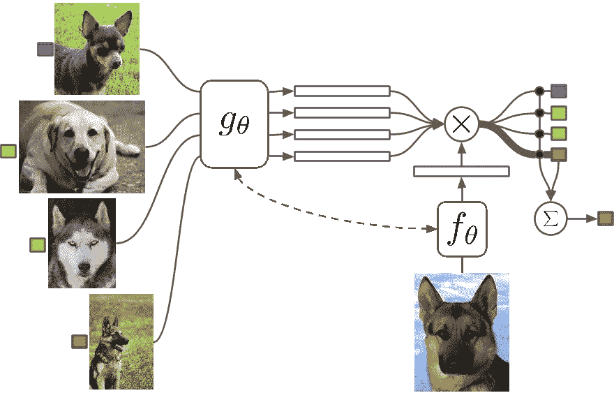
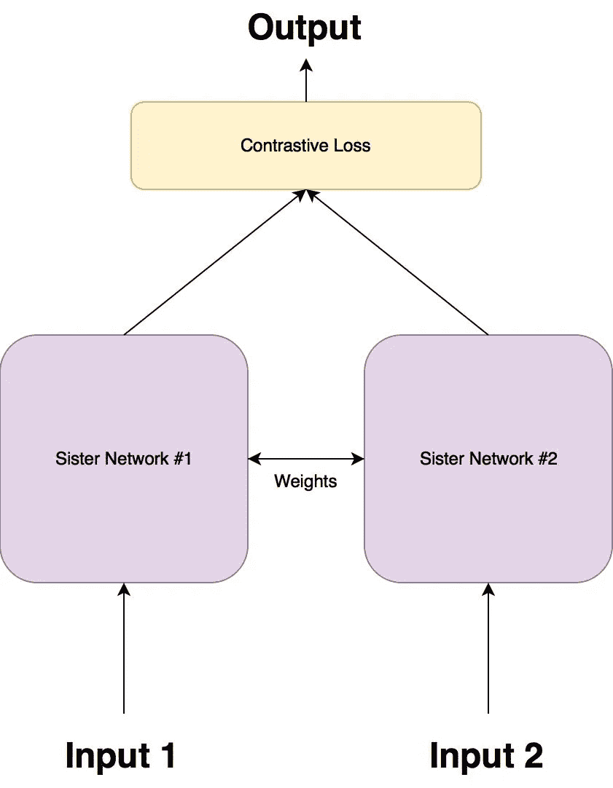
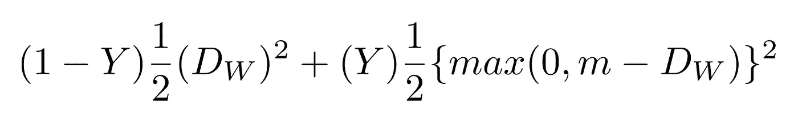
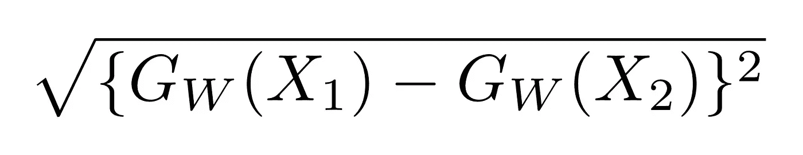
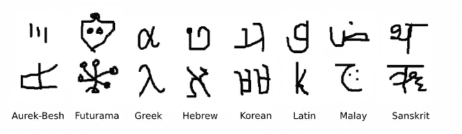

# 用 PyTorch 的暹罗网络一次性学习

> 原文：<https://medium.com/hackernoon/one-shot-learning-with-siamese-networks-in-pytorch-8ddaab10340e>

Example of One Shot learning. [Source](https://arxiv.org/pdf/1606.04080v1.pdf)

> 这是由两部分组成的文章的第 1 部分。你可以在这里阅读第二部分

D eep 神经网络是图像分类的首选算法。这部分是因为它们可以具有任意大量的可训练参数。然而，这是以需要大量数据为代价的，而这些数据有时是不可用的。我将在 PyTorch 中讨论一次[学习](https://hackernoon.com/tagged/learning)，它旨在缓解这样的问题，以及如何实现一个能够使用它的神经网络。

*本文假设对* ***神经网络*** *有些熟悉。*

## 这篇文章的结构

这是一篇由两部分组成的文章。我将在**第一部分**中讲述**理论**，在**第二部分**中讲述理论的 PyTorch **实现**。

这篇文章从这篇论文中得到启示。

# 标准分类与一次性分类

几乎所有的分类模型都使用标准分类。输入被输入到一系列层中，最后，输出类别概率。如果您想要从猫中预测狗，您可以在预测时间内使用您预期的相似(但不相同)的狗/猫图片来训练模型。当然，这要求您拥有一个与使用模型进行预测时的预期相似的数据集。

**一次分类**模型，另一方面，要求你只有**一个你想预测的每一类的训练例子**。该模型仍然在几个实例上被训练，但是它们只需要在与你的训练示例相似的域中。

面部识别就是一个很好的例子。您可以在包含各种角度、光照等的数据集上训练一个单镜头分类模型。一些人。然后，如果您想要识别某个人 X 是否在某个图像中，您可以拍摄该人的一张照片，然后询问模型该人是否在该图像中(*注意，该模型没有使用任何人 X 的照片进行训练*)。

作为人类，我们只要见过一次面就可以通过他/她的脸来识别一个人，这对计算机来说是可取的，因为很多时候数据是最少的。

# 进入暹罗网络

暹罗网络是一种特殊类型的神经[网络](https://upscri.be/hackernoon/network)架构。不是模型学习*对其输入进行分类*，而是神经网络学习*区分两个输入之间的*。它学习它们之间的相似性。

## 建筑

连体网络由两个相同的神经网络组成，每个神经网络获取两个输入图像中的一个。然后，两个网络的最后一层被馈送到对比损失函数，该函数计算两幅图像之间的相似性。我制作了一个插图来帮助解释这个架构。

*Figure 1.0*

有两个姐妹网络，它们是相同的神经网络，具有完全相同的权重。

图像对中的每个图像都被馈送到这些网络之一。

使用对比损失函数优化网络(我们将得到精确的函数)。

## 对比损失函数

暹罗架构的目标不是分类输入图像，而是*区分它们之间的*。因此，分类损失函数(如交叉熵)并不是最合适的。相反，这种架构更适合使用对比函数。直观地说，这个函数只是评估网络如何区分给定的一对图像。

你可以阅读更多细节[这里](http://yann.lecun.com/exdb/publis/pdf/hadsell-chopra-lecun-06.pdf)

对比损失函数如下所示:

Equation 1.0

其中 ***Dw*** 被定义为姐妹连体网络的输出之间的欧几里德距离。数学上欧几里得距离是:

Equation 1.1

其中 ***Gw*** 是其中一个姐妹网络的输出。 **X1** 和 **X2** 是输入数据对。

## 等式 1.0 解释

**Y** 不是 1 就是 0。如果输入来自同一个类，则 Y 的值为 0，否则 Y 为 1

**max()** 是表示 **0** 和 **m-Dw** 之间较大值的函数。

**m** 是大于 0 的**余量**值。具有裕量表示超出该裕量的不同线对不会造成损耗。这是有意义的，因为你只想基于实际上不相似但网络认为相当相似的对来优化网络。

# 数据集

我们将使用两个数据集，经典的 MNIST 和 OmniGlot。MNIST 将用于训练模型，以了解如何区分字符，然后我们将在 OmniGlot 上测试该模型。

## OmniGlot 数据集

OmniGlot 数据集包含来自 50 种国际语言的示例。每种语言的每个字母只有 20 个例子。这被认为是 MNIST 的“转置”,那里的班级数量较少(10 个),训练的例子很多。在 OmniGlot 中，类的数量非常多，但每个类的例子很少。

Figure 2.0\. Some examples from the OmniGlot dataset

OmniGlot 将被用作我们的 on shot 分类数据集，能够从少数几个例子中识别许多不同的类别。

# 结论

我们掩饰了一次性学习的一般前提，并试图使用一种称为暹罗网络的神经网络架构来解决它。我们讨论了区分输入对的损失函数。

在本文的第 2 部分，我们将实现这样一个架构，并在 MNIST 上训练它，然后在 OmniGlot 上预测它。

## 附言

如果你喜欢这篇文章，一定要留下❤.它让我知道我在帮忙。继续阅读[第 2 部分](https://hackernoon.com/facial-similarity-with-siamese-networks-in-pytorch-9642aa9db2f7)，该部分涵盖了所讨论想法的实施。

继续第二部分:

[面部与 PyTorch 中的暹罗网络相似](https://hackernoon.com/facial-similarity-with-siamese-networks-in-pytorch-9642aa9db2f7)