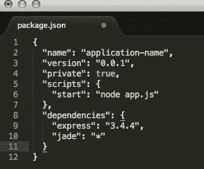
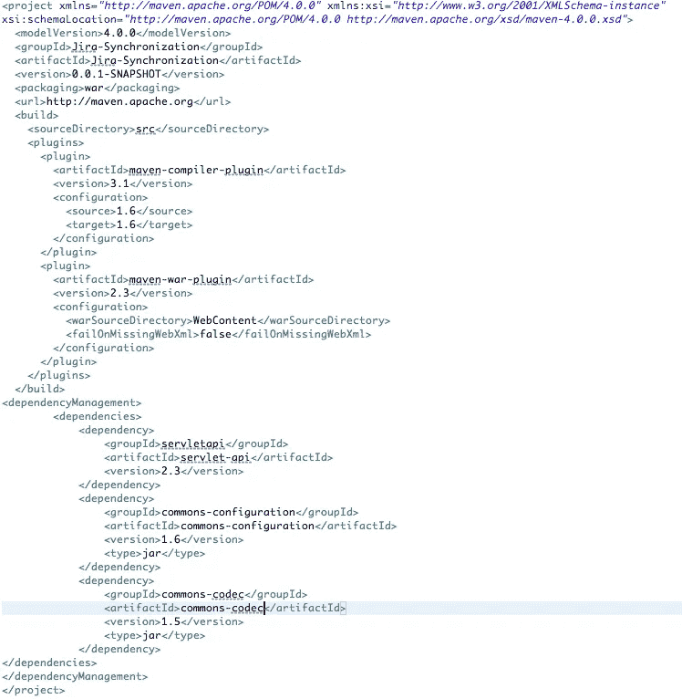
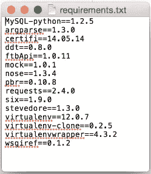
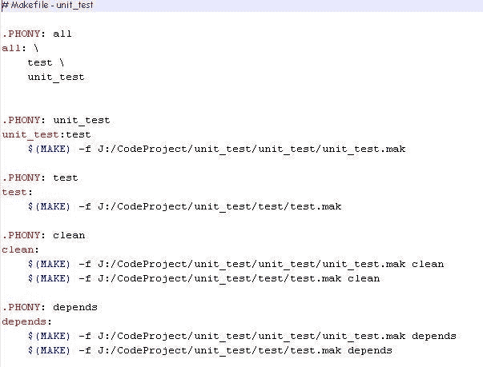
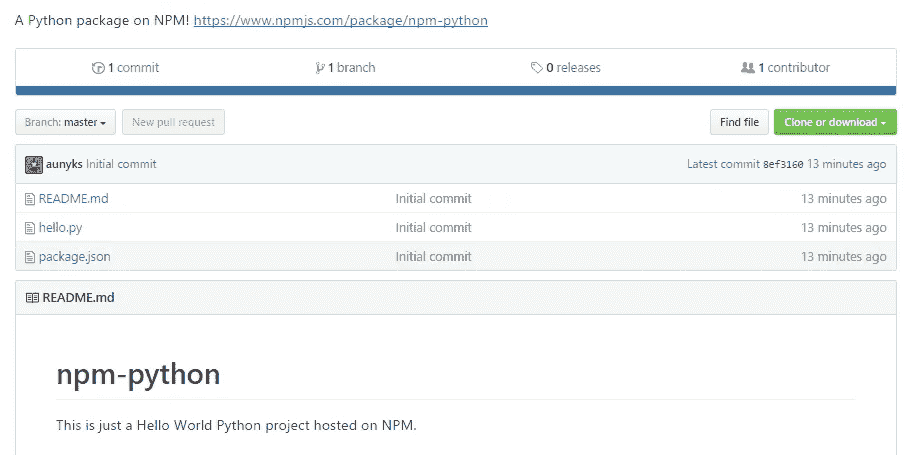

# 一刀切

> 原文：<https://medium.com/hackernoon/one-size-fits-all-593441a9403f>

## 使用 NPM 不仅仅是为了 JavaScript

节点包管理器，或 NPM，是所有 Node.js 项目事实上的包管理器。每当你安装 [Node.js](https://hackernoon.com/tagged/nodejs) 的时候，它就会被安装，所以从一开始它就被硬塞到你面前。由于 Node 和 NPM 之间的这种联系，人们经常认为 NPM 就像其他包管理器一样，只能用于它的默认语言。但是，NPM 不仅仅可以用于 T2、JavaScript 和 T3。

当你读到这里时，你可能会想，“什么？你为什么要为另一种语言使用 JS 包管理器？好吧，NPM 是一个非常直观的、复杂的包管理者，很大程度上是不固执己见的，这意味着没有真正的假设 NPM 上的包是用 JavaScript 构建的。这是一个很好的工具，所以真正的问题是…

NPM 很容易拥有最好的项目文件。它的 package.json 结合了出色的可读性、强大的依赖管理和项目细节。我保证我不是樊博英；NPM 是*的那个*比其他项目文件好多了。

A skeleton package.json

看看那个。JSON 文件格式使我们很容易找到项目的名称、版本、依赖项和构建脚本，同时仍然使它可以被机器读取。这是因为 JSON 被设计成容易被人类阅读，同时也容易被机器解析(这是多么美丽的妥协)。而且，我们不要忘记，它比其他语言(如 Java、Python 或 C/C++)的项目文件要超前好几光年。

Maven’s complicated pom.xml

Apache 的 Maven Java 项目管理工具依赖于一个复杂的、难以阅读的 pom.xml。这对于人类来说是非常难以阅读的，并且对于有许多贡献者的项目来说会减慢开发速度。

Pip’s requirements.txt only contains dependencies

Python Packaging Authority 的 pip 使用 requirements.txt，但是它非常简单，只用于列出所需的依赖项。有时简单是最好的方法，但是 requirements.txt 变得无用，因为它不包含其他项目特定的信息，比如正式名称或必要的构建脚本。

GNU’s complicated Makefile looks like a source file

甚至不要让我从 GNU 的 Makefile 开始。它看起来甚至不像一个项目管理文件。它看起来只是另一个源文件(尽管变量是一个有趣的特性)。它基本上只是一个用于构建脚本的文件，并且缺少项目的名称和依赖项。json 被证明是最终的项目管理文件。

另一个让 NPM 与众不同的地方是它的包裹登记系统。所有用 NPM 构建的包都可以快速部署到一个共享的注册系统，任何人都可以从这个系统安装它们。这个包注册系统位于[npmjs.com](https://www.npmjs.com/)，使得所有的包都可以被搜索，所以你可以在为你自己的项目安装它们之前快速找到执行你想要的任何操作的包。NPM 的软件包注册也非常社会化，因为你可以搜索其他用户，并关注你最喜欢的开发者和组织的新发布。另外，命令行界面可以让您在几秒钟内构建并发布一个新的包…当然，前提是您有一个帐户。

Even wombats can make NPM packages!

现在，如果你不相信你能在 NPM 上托管非 Javascript 项目，看看[我在 Github](https://github.com/aunyks/npm-python) 上的示例项目，在那里我创建并发布了一个 Python“Hello World”项目。

我将在另一篇文章中更深入地讨论*创建*非 Javascript 包，但是现在我知道，尽管一开始不常见，但是使用 NPM 作为其他语言的包管理器是一个非常好的主意。

感谢阅读！如果你喜欢这篇文章，请推荐或分享。

You’re awesome!

> [黑客中午](http://bit.ly/Hackernoon)是黑客如何开始他们的下午。我们是 [@AMI](http://bit.ly/atAMIatAMI) 家庭的一员。我们现在[接受投稿](http://bit.ly/hackernoonsubmission)并乐意[讨论广告&赞助](mailto:partners@amipublications.com)机会。
> 
> 如果你喜欢这个故事，我们推荐你阅读我们的[最新科技故事](http://bit.ly/hackernoonlatestt)和[趋势科技故事](https://hackernoon.com/trending)。直到下一次，不要把世界的现实想当然！

