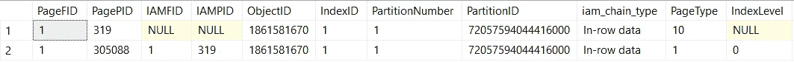
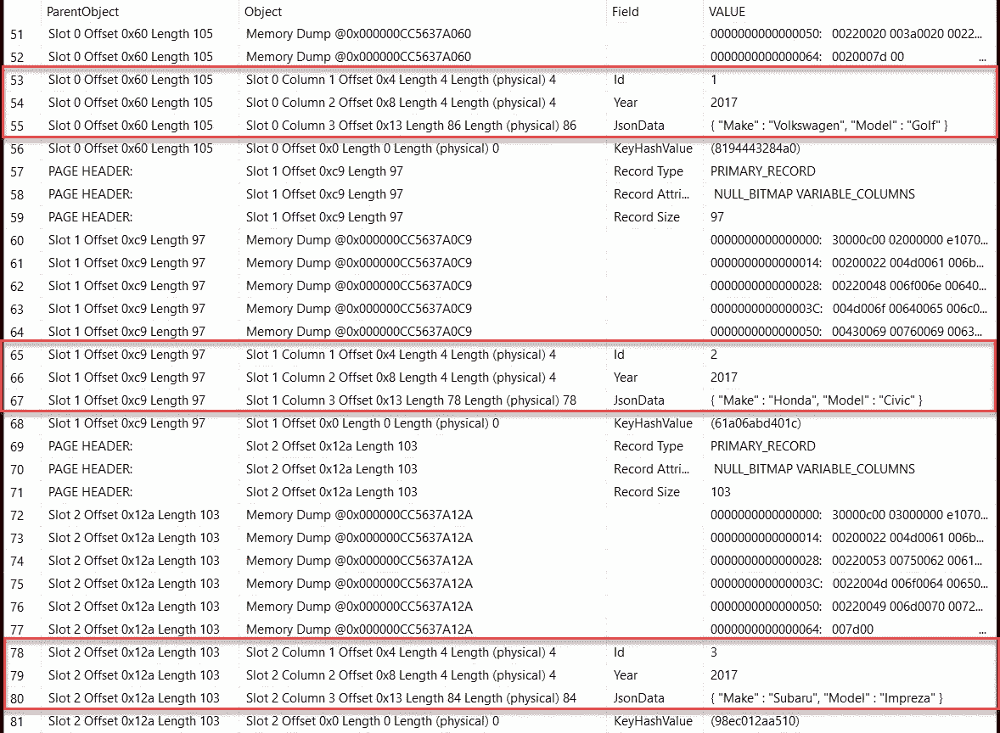
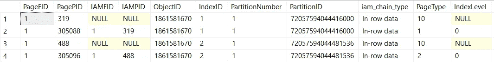
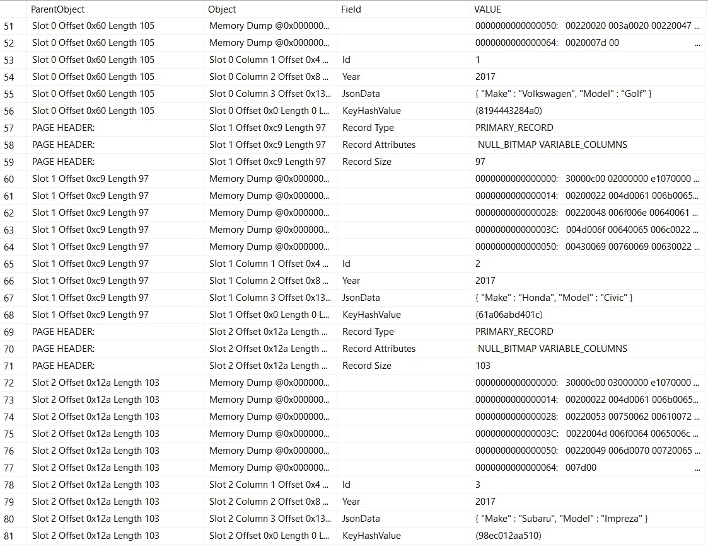
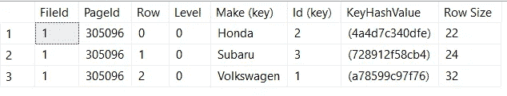

# 一个快速 JSON 查询的 SQL 欺骗代码

> 原文：<https://medium.com/hackernoon/one-sql-cheat-code-for-blazing-fast-json-queries-d0cb6160d380>

## 非持久化计算列索引如何提高 JSON 查询的性能


最近在[SQL](https://blog.bertwagner.com/video-json-usage-and-performance-in-sql-server-2016-524edcc5a610)服务器 2016[a](https://blog.bertwagner.com/when-is-it-appropriate-to-store-json-in-sql-server-8ed1eed1520d)[lot](https://blog.bertwagner.com/who-stuck-these-letters-in-my-datetimes-b42cbd6e987d)做 JSON。

许多人对在 [SQL Server](https://hackernoon.com/tagged/sql-server) 中使用 [JSON](https://hackernoon.com/tagged/json) 感到犹豫的一个原因是，他们认为查询它一定很慢——SQL 应该擅长关系数据，而不是字符串解析，对吗？

事实证明，独立的 SQL Server JSON 函数的性能非常好。更好的是，通过在 JSON 解析的计算列上使用索引，可以使针对 JSON 数据的查询以可笑的速度运行。在这篇文章中，我想看看 SQL 是如何以如此高的性能解析*的。

**“Parse”在这里其实是一个谎言——它在幕后做别的事情。你会明白我的意思的，继续读！*

# SQL Server 中的计算列

让 JSON 索引在 SQL server 上工作的唯一方法是使用一个[计算列](https://technet.microsoft.com/en-us/library/ms191250(v=sql.105).aspx)。计算列基本上是执行函数来计算其值的列。

例如，假设我们有一个包含一些汽车 JSON 数据的表:

```
DROP TABLE IF EXISTS dbo.DealerInventory;
CREATE TABLE dbo.DealerInventory
(
  Id int IDENTITY(1,1) PRIMARY KEY,
  Year int,
  JsonData nvarchar(300)
);INSERT INTO dbo.DealerInventory (Year, JsonData) VALUES (2017, '{ "Make" : "Volkswagen", "Model" : "Golf" }');INSERT INTO dbo.DealerInventory (Year, JsonData) VALUES (2017, '{ "Make" : "Honda", "Model" : "Civic" }');INSERT INTO dbo.DealerInventory (Year, JsonData) VALUES (2017, '{ "Make" : "Subaru", "Model" : "Impreza" }');SELECT * FROM dbo.DealerInventory;/* Output:
Id    Year     JsonData
----- -------- ---------------------------------------------
1     2017     { "Make" : "Volkswagen", "Model" : "Golf" }
2     2017     { "Make" : "Honda", "Model" : "Civic" }
3     2017     { "Make" : "Subaru", "Model" : "Impreza" }
*/
```

我们可以向表中添加一个新的计算列“Make ”,它从每一行的 JSON 字符串中解析并提取 Make 属性:

```
ALTER TABLE dbo.DealerInventory
ADD Make AS JSON_VALUE(JsonData, '$.Make');SELECT * FROM dbo.DealerInventory;/* Output:
Id Year  JsonData                                    Make
-- ----- ------------------------------------------- ----------
1  2017  { "Make" : "Volkswagen", "Model" : "Golf" } Volkswagen
2  2017  { "Make" : "Honda", "Model" : "Civic" }     Honda
3  2017  { "Make" : "Subaru", "Model" : "Impreza" }  Subaru
*/
```

默认情况下，上面的 Make computed 列是非持久化的，这意味着它的值永远不会存储到数据库中(也可以创建持久化的计算列，但这是另一个时间的主题)。相反，每次对我们的`dbo.DealerInventory`表运行查询时，SQL Server 都会计算每一行的值。

这样做的性能不是很好——它本质上是一个标量函数，针对我们输出的每一行运行:(。但是，当您将计算列与索引结合使用时，会发生一些有趣的事情。

# 是时候深入了解 DBCC·佩奇了

`DBCC Page`是一个未记录的 SQL Server 函数，显示了存储在 SQL 页面文件中的原始数据的样子。页面文件是 SQL Server 存储数据的方式。

在本文的其余部分，我们将研究数据页(存储 SQL 中实际表数据的地方)和索引页(存储我们的索引数据的地方)如何受到非持久化计算列的影响——以及它们如何使 JSON 查询超快。

首先，让我们看看我们现有的数据。我们首先打开跟踪标志 3604，并使用`DBCC IND`来获取数据的页面 id。关于`DBCC IND`和`DBCC PAGE`中列定义的更多细节可以在 [Paul Randal 关于主题](https://www.sqlskills.com/blogs/paul/inside-the-storage-engine-using-dbcc-page-and-dbcc-ind-to-find-out-if-page-splits-ever-roll-back/)的博客文章中找到。

```
DBCC TRACEON(3604);-- "Sandbox" is the name of my database
DBCC IND('Sandbox','dbo.DealerInventory',-1);
```



如果您查看上面的结果，第 2 行包含我们的数据页面(由 PageType = 1 表示),该页面的 PagePID 是 305088(如果您在家玩，您的 PagePID 很可能是别的什么)。如果我们使用`DBCC PAGE`来查找 PagePID，我们会得到这样的结果:

```
DBCC PAGE('Sandbox',1,305088,3) WITH TABLERESULTS
```



你可以看到我们用红色突出显示的三行数据。这里需要注意的重要一点是，我们解析的“Make”值的计算列是真正非持久化的，并且在哪里都找不到，这意味着它必须在查询执行期间为每一行生成。

现在，如果我们向非持久化计算列添加一个索引，然后再次运行`DBCC IND`会怎么样:

```
CREATE NONCLUSTERED INDEX IX_ParsedMake ON dbo.DealerInventory (Make)DBCC IND('Sandbox','dbo.DealerInventory',-1);
```



您现在会注意到，除了数据页 305088 (PageType = 1)，我们还有一个索引页 305096 (PageType = 2)。如果我们同时检查数据页和索引页，我们会发现一些有趣的事情:

```
DBCC PAGE('Sandbox',1,305088,3) WITH TABLERESULTSDBCC PAGE('Sandbox',1,305096,3) WITH TABLERESULTS
```

我们的数据页面没有任何变化:



但是我们的索引页面包含“Make”列的解析值:



# 这是什么意思？我以为非持久化的计算列不会保存到磁盘上！

完全正确:我们的非持久化计算列“Make”没有保存到磁盘上的数据页。然而，如果我们在非持久化的计算列上创建索引，计算值*将在索引页面上持久化*！

这基本上是一个为计算列建立索引的欺骗代码。

SQL 将仅在向表中插入或更新行时(或在初始索引创建期间)计算“Make”值—我们计算列的所有未来检索都将来自预先计算的索引页。

这就是 SQL 能够如此快速地解析索引 JSON 属性的原因；SQL Server 可以在索引中查找预先解析的值，并以惊人的速度返回正确的数据，而不需要扫描表并解析表中每行的 JSON 数据。

就个人而言，我认为这使得 JSON 在 SQL Server 2016 中更容易(和实用)使用。即使我们在数据库中存储了大量的 JSON 字符串，我们仍然可以索引单个属性并以惊人的速度返回结果。

喜欢这篇文章吗？请推荐给它一颗绿色的心💚*下文。*

*你对你的表使用计算列索引吗？在下面的评论中告诉我他们的情况吧！*

[](http://bit.ly/HackernoonFB)[](https://goo.gl/k7XYbx)[](https://goo.gl/4ofytp)

> [黑客中午](http://bit.ly/Hackernoon)是黑客如何开始他们的下午。我们是 [@AMI](http://bit.ly/atAMIatAMI) 家庭的一员。我们现在[接受投稿](http://bit.ly/hackernoonsubmission)并乐意[讨论广告&赞助](mailto:partners@amipublications.com)机会。
> 
> 如果你喜欢这个故事，我们推荐你阅读我们的[最新科技故事](http://bit.ly/hackernoonlatestt)和[趋势科技故事](https://hackernoon.com/trending)。直到下一次，不要把世界的现实想当然！

