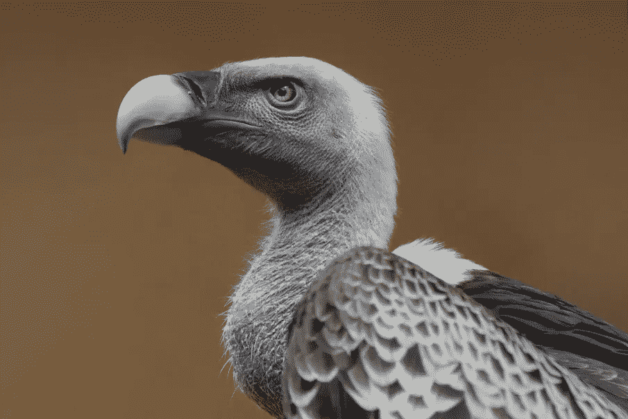
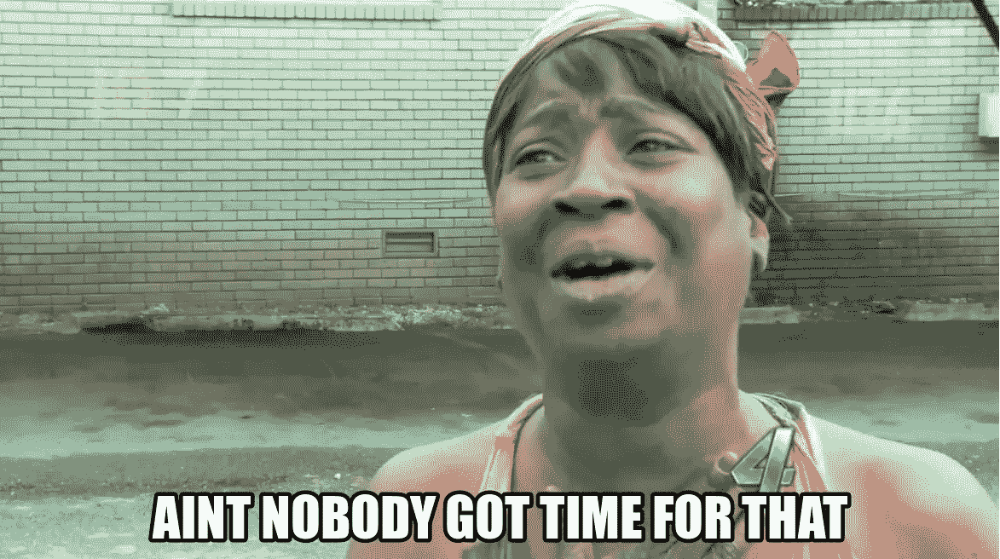
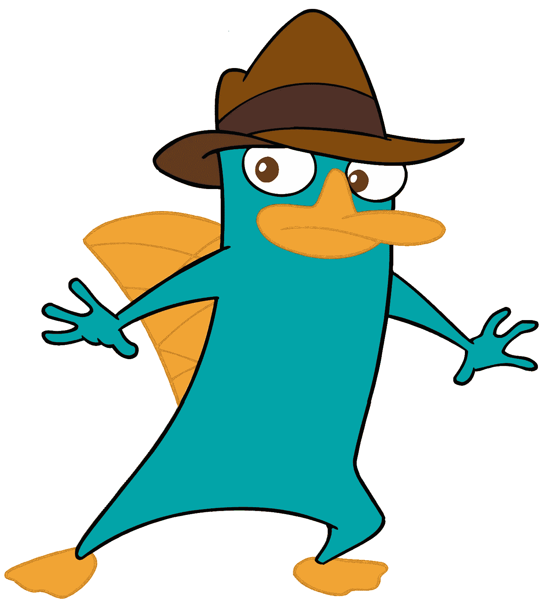
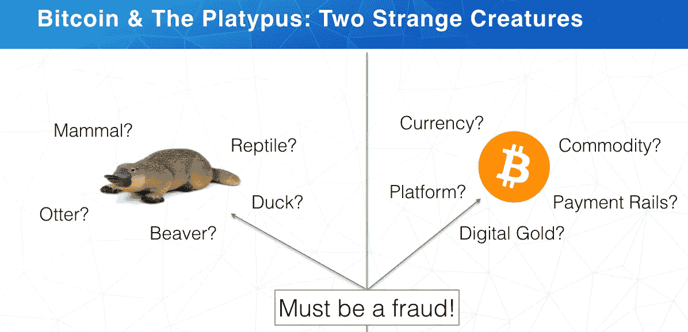

# 有一次在加密货币会议上

> 原文：<https://medium.com/hackernoon/one-time-at-a-cryptocurrency-conference-a3bebdf01785>

随着每一次[加密货币](https://hackernoon.com/tagged/cryptocurrency)会议的召开，一场新的“行业状态”在加密世界响起，而共识:投资(上周在纽约举行)正是传递了这一点。

这不是一次小聚会。房间挤满了人。人们听着。兴奋在空气中弥漫。事情是这样的。

## 比特币的价格

随着会议进入事后饮酒模式，[比特币](https://hackernoon.com/tagged/bitcoin)运费突破 1 万美元。是的，人们在讨论比特币的价格，是的，人们经常讨论比特币是否是“唯一”。

但是比特币及其价格——作为这个行业深度的证明——实际上只是讨论的一小部分。当然，有人在谈论以太坊；关于看似无限的其他 altcoins 和 ICOs 关于技术限制和机会；关于监管；全球市场动向；机构；[数据解决方案](http://www.flipsidecrypto.com)；安全和密码保管。

进入任何一个单独的对话，感觉就像你试图把 100 磅的加密货币塞进一个 2 磅的尼龙，有标志的会议包。为了解决这个问题，大多数人尽可能快地喷洒他们的加密 POV，让你以 1.4 倍的速度尝试理解对话。

对，感觉是精神分裂，但那不是最重要的。

事实是:这个行业的繁荣不是因为比特币的价格持续上涨；它繁荣是因为有无限量的狗屎可以谈论。

# 西装来了，西装来了！

共识:Invest 在纽约市举行。在时代广场的中央。

能量是电的，但也…打你的脸侵略性。

零道歉肩撞和训练有素的不经意插队盛行。

与我上次在悠闲的旧金山参加的活动相比:*少了愉快的微笑，多了严肃的目光。*

“西装”泄露了秘密:财富管理公司和股票交易员已经意识到这是金融的未来。无论是出于自我保护、好奇还是纯粹的贪婪，那些在传统金融机构内部度过企业生活的人已经意识到，这是一个挣脱束缚的时刻。在这里，他们可以利用多年的日内交易股票、做空、对冲和铁腕政策获得巨大优势。

The Iron Condor

财务人员意识到了摆在他们面前的潜力:将他们的技能应用到一个新的、有可能蓬勃发展的边缘行业。

他们正以最快的速度向暗光冲刺。

# 监护权，是一件事。

每一次走廊谈话最终都陷入了监管的死胡同。

无可争议的事实是，这些机构——富达(Fidelity)、摩根大通(JP Morgan)、高盛(Goldman)——拥有数十亿美元投资于加密货币。虽然有些人可能会在资产负债表外投资，但在有一个声誉良好的托管解决方案之前，没有一家机构会将客户资产投资于加密货币。

规模较小的基金可以通过提供加密、气隙、单 IP 访问数据库或双签名钱包解决方案的国产解决方案脱身；但这些机构需要更强大的东西，能够通过数百名合规官的嗅觉测试和美国证券交易委员会的目光。

一个潜在客户是 Xapo，他有一个复杂的托管解决方案，但有一个主要问题:它不够“合格”。也就是说，监管者并不致力于他们的程序，所以机构…嗯，他们没有时间做这些。

The Institutions Awaiting Crypto Custody Solutions

*【编者注:* [*迈克·诺沃格拉茨*](/stayawhile-presents-faces-of-crypto/whos-who-in-crypto-2017-10706ca65d79) *舞台——盛赞 Xapo CEO* [*文塞斯·卡萨雷斯*](https://medium.com/u/7096ccd0251b?source=post_page-----a3bebdf01785--------------------------------) *为传播加密福音的“零号病人”。光是这一点就值得称赞。】*

但人们对即将出现的潜在解决方案感到兴奋。有传言说富达将要发布一些东西。高盛就快成功了。还有圈？他们可能正处于吞噬世界的边缘，而监护权是其中很大的一部分。

虽然监护权的问题还没有解决，但似乎迫在眉睫。有一点是肯定的:一旦机构变得舒适，投资者的闸门将真正打开。

# 数据，不，它从不说谎

来自[占位符](https://medium.com/u/2fc03186b285?source=post_page-----a3bebdf01785--------------------------------) VC 的 Chris burn iske([cburniske](https://medium.com/u/2a8f9285c9aa?source=post_page-----a3bebdf01785--------------------------------))永远不会失望。

他主持了一场演讲，满足了那些寻求适应传统股票环境的投资经理的需求。

> “加密资产就像 400 年前的股票一样具有创新性”——T21
> 
> 如果你看看 2016 年，Twitter 和石油的波动性与比特币相同

当然，Burniske——实际上每一次都充满了迷因素材——并不只是提供适合季度收益电话会议的报价。他向那些聚集在足球尾门狂欢会上的人发表了讲话——狂热的粉丝们聚集在象征性的秘密知识桶周围，分析性的颂歌从附近一辆窗户着色、溅满泥浆的福特 F-150 中涌出。

> “如果你想买一公斤可卡因，你最好用现金而不是比特币”——T2

# 比特币不是鸡蛋人。是鸭嘴兽。

区块链资本的[斯潘塞·博加特](https://medium.com/u/8bb2bf06d30a?source=post_page-----a3bebdf01785--------------------------------)的一些严肃而公正的分析可能只会让伯尼斯克的赞美之辞黯然失色。

首先:没有废话，这家伙是我见过的最好的主持人之一。如果说密码空间膨胀有一个原因的话，那就是因为思想领袖们的清晰表述。这个领域中最聪明的头脑可以带着即兴的自信展示他们的事实和哲学，这种自信甚至会催眠最坚强的人。

斯潘塞注意到我们仍处于第一局；他的哈里斯民意调查(Harris Poll)数据证明，千禧一代在对加密资产的兴趣和所有权方面处于领先地位，而你祖父的投资顾问去年几乎还停留在传统的债券购买状态。

但是这个数据仅仅是当年全垒打类比的前戏。**比特币:加密货币世界的鸭嘴兽。**

Bitcoin: the Platypus

根据 Bogart 的说法，比特币(和密码)如此迷人的原因是——像鸭嘴兽一样——它是许多巨大、独特的东西的某种无法辨认的大杂烩，这些东西不应该放在一起，但不知何故却放在一起。玩具兽，它有带爪子的蹼足；有毒的骨刺；海狸尾巴；它们产奶。鸭嘴形；水獭皮的。

对于那些试图定义比特币的人来说:是的，它是一种价值储存手段；是的，这是一个支付网络；是的，这是一个第三方非中介；是的，它是分散的；是的，这是一个密码奇迹。

然而，更重要的是，所有这些加在一起。

比特币是一种不协调的自然力量。

外卖？比特币的美妙之处在于，你不能把它仅仅与一件事联系在一起——尽管每个特征本身都很特别，但合在一起，那就是一个鸭嘴兽的奇迹。

Spencer Bogart’s Platypus/Bitcoin Analogy

# 当你戳破泡沫时，你会发现欺诈的污秽吗？

最后，让我们粉碎那些认为这群人是现实的顽固反对者的想法，比如说…特朗普的支持者。

他们不是。这些人看到现实时会认出它。

每一个。单身。人。知道。这个。是。a .泡沫。

是的，这很大程度上可以追溯到 1994 年、1996 年或 1999 年互联网的全盛时期(似乎没有人知道我们实际上处于哪个时代)。

> 迈克·诺沃格拉茨尖锐地指出:“这是我们一生中最大的泡沫。”

The Cryptocurrency Bubble, it Will Pop.

好吧，那么泡沫不是，比特币和它的加密货币兄弟在某种程度上是欺诈性的吗？

是假货吗？我们在全球范围内都被麦道夫骗了吗？这一论点很容易被驳回，它指向数学事实和点对点全球足迹的制衡。

在泡沫方面:每个人都认为泡沫会破裂。

黑暗的日子将会到来。

**但是，如果你有勇气、毅力和必要的资金来坚持下去，度过加密货币泡沫破裂后的黑暗、核冬天，你肯定会升入天堂，在那里你将保证进入金色来世的宁静日子。**

下次野餐时见。