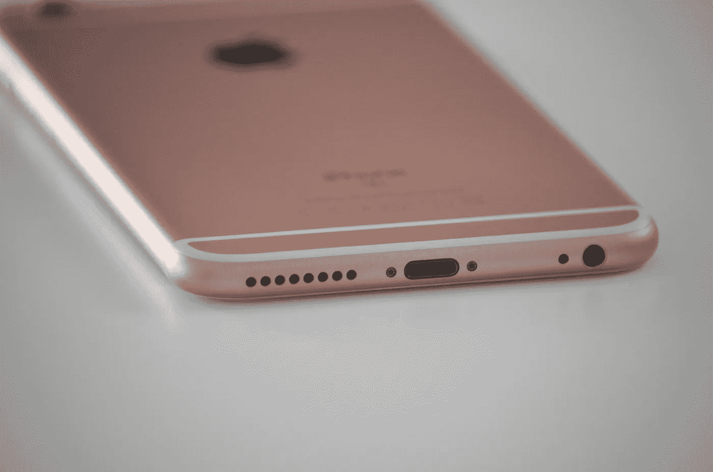
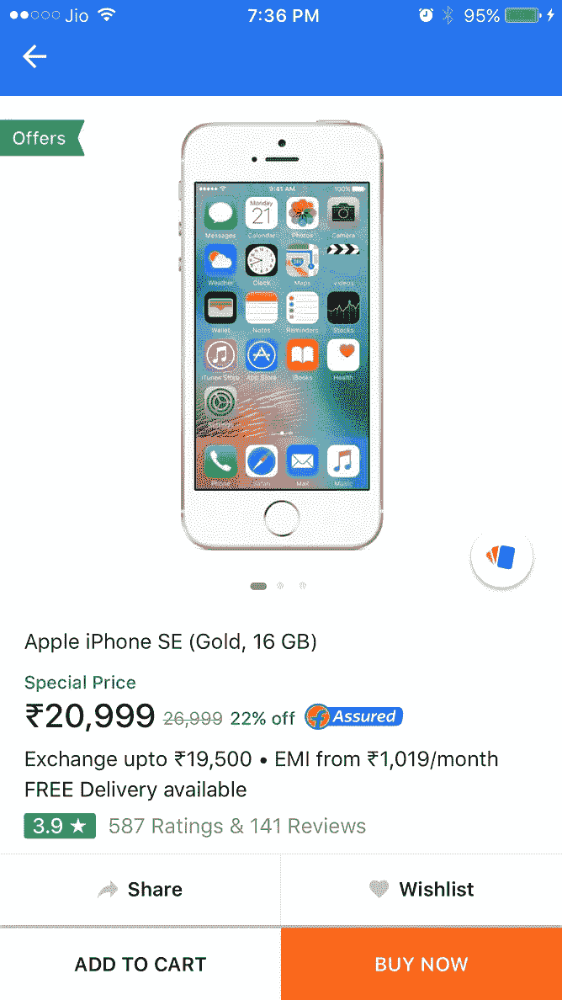
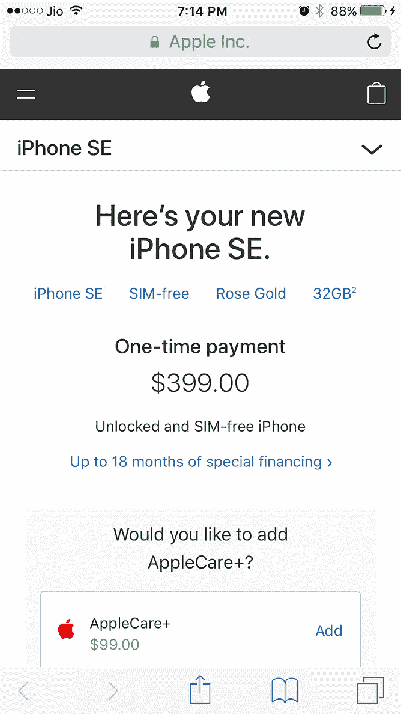
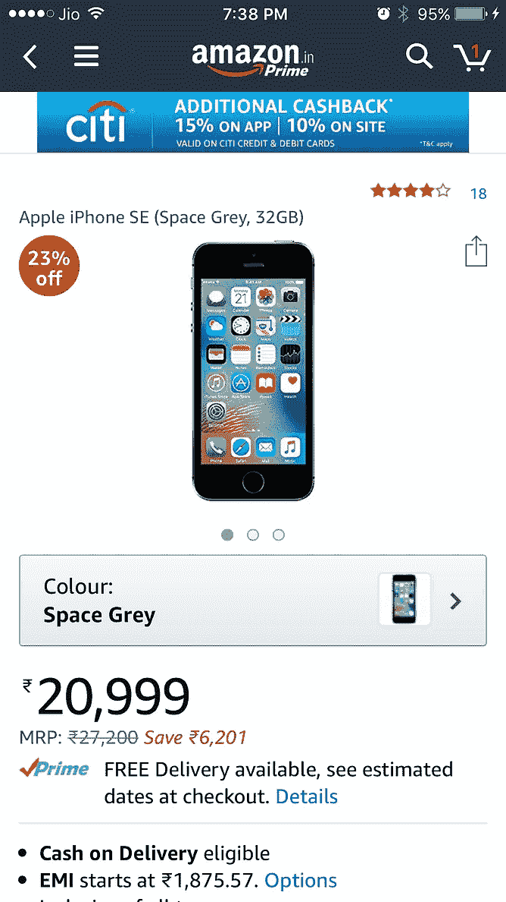
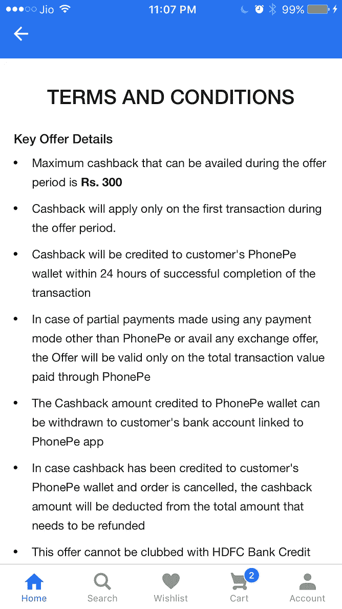

# 为我的钱包而战

> 原文：<https://medium.com/hackernoon/online-battles-for-my-wallet-8cae943bc196>

Amazon and Flipkart fight to sell me an iPhone

印度一年中大部分时间都很热，去购物中心是一件乏味的事情，要排长队，还要堵车。如果你不小心的话，两个轮子的车中的一个从错误的方向切入可能会擦到你的车，然后整个购物之旅就会变成一件紧张的事情。

因此，几年前，我对网上购物热潮的到来感到非常兴奋。现在，我可以在自己舒适的客厅里查看任何我想要的小工具的所有细节，与类似的产品进行比较，阅读实际客户的评论，并让它送货上门。

在印度网上购物的早期，Flipkart 是我的首选商店。信用卡黑客是一个令人担忧的问题，所以我的第一部手机是用 Flipkart 当时创新的货到付款(COD)功能在网上购买的。但是印度的银行很快通过 OTP 对你的手机实施了双重信用验证。在那之后，我开始在网上使用我的信用卡，小心地保持我的信用额度较低，以便在万一被黑客攻击时限制我的损失。

然后亚马逊出现了。这些评论更有帮助，因为如果印度网站上没有评论，你可以链接到 Amazon.com 网站上的客户。所以我开始把我的顾客分成两部分，看谁能给我想要的东西提供更好的价格。

在这一点上，亚马逊认真对待印度，投入了大约 50 亿美元，建立了自己的配送中心，以大约₹500/year(7.5 美元)的价格推出了亚马逊 Prime，等等。

现在，他们似乎在追赶他们的主要竞争对手 Flipkart。

以大宗销售业务为例。一年中，Flipkart 和亚马逊有几次大减价，以数十亿计出售。最近的一次是 Flipkart 宣布从 5 月 14 日到 5 月 18 日进行大减价。

亚马逊展示了其掠夺性的本能，出人意料地迅速行动，从 5 月 11 日至 5 月 14 日推出了自己的印度大减价，抢了 Flipkart 的风头。这是一场极具侵略性的营销战，尽管我确信亚马逊已经为此做好了计划。基本上，我们的目标是任何有钱消费的顾客都应该通过亚马逊来消费，而不是通过 Flipkart。

我是那些顾客中的一个，尽管是偶然的一个。

一些背景知识会有所帮助。我妻子已经使用 iPhone 4 很长时间了(它属于她工作的组织)。她喜欢小巧的尺寸，不太喜欢高科技，也不喜欢在小玩意上花钱。此外，iPhones 很贵，这让我妻子很难接受。她坚决拒绝给自己买一部新的 iPhone，称如果需要的话，她会买一部低价的 Android 手机。看起来是时候了，因为她的 iPhone 4 现在经常死机。

总之，一个朋友打电话来说他的 Android 没电了，让我在₹13000 的预算内(200 美元)推荐一款好的。现在，Android 手机有数百种型号和品牌，具有各种各样的功能。然而，很难找到一部拥有你想要的一切的手机，所以我建议热卖的 Redmi Note 4 或 Honor 6X。

在检查市场时，我再次被 Android 的场景如此不同于苹果的场景所震惊，苹果只有三种型号可供选择。可悲的是，印度的 iPhones 比世界上任何地方都贵(由于税收)。

出于好奇，我还是去查了一下 iPhone 的价格。并且惊讶地发现 Flipkart 为₹21000 提供 iphone se(325 美元)。我查了一下 apple.com 的价格，是 399 美元。这似乎难以置信！

印度以近 950 美元的价格推出了入门级 iPhone 7，不久前，这款 iPhone SE 在₹28000 的定价为 450 美元。它现在的售价低于美国苹果商店的价格。

我仔细看了看，想抓住什么。这时我注意到在印度销售的是 16GB 的型号。我不知道苹果还生产 16GB 的 iPhone SE 机型。

真是虎头蛇尾！

对于不允许与 USB pendrive 进行 OTG 连接的设备来说，16GB 太小了。当我退出 Flipkart 时，我偶然在亚马逊上查了一下它们的价格。

你知道什么？他们有相同的₹21000(325 美元)报价，但 32GB 的 iPhone SE。

Flipkart VS Apple VS Amazon

突然间，我妻子反对 iPhones 太贵的理由不再成立了。我所需要看到的是我是否能进一步降低价格。

我可以获得旧 Android 的交换报价吗？(它需要去，因为它没有 VoLTE，我经常错过电话。)亚马逊有换货优惠，但我住的地方没有。

Flipkart 的交换条件是。我发现我能让₹3200 脱罪。但是我总是可以卖机器人，而且可能比₹3200.卖得更多

还有什么？返现优惠怎么样？

Flipkart 与 HDFC 银行合作，提供 10%的现金返还(马克斯·₹1500)，而亚马逊与花旗银行合作，提供 15%的现金返还(马克斯·₹2000).

亚马逊在更高的存储和更高的返现上胜出。这两张信用卡我都没有，但是我姐夫有一张花旗银行的卡。

不到 48 小时后，亚马逊以₹19000 的价格(295 美元)交付了玫瑰金的 32gb iphone se。我的孩子声称有权用它给她妈妈一个惊喜。

第二天，Flipkart 又一次“失败”。在我对 Flipkart 的调查中，我注意到谷歌 Pixel 将在 Big 10 大拍卖中面向₹35000 销售(545 美元)，而不是₹57000 的原价(890 美元)。我认识一个对此感兴趣的朋友，并告诉了他这件事。我还告诉他，通过 Flipkart 的在线钱包 Phone Pe 支付可以享受 30%的折扣。

Misleading ads: Google Pixel isn’t selling at ₹34999 while the 30% cashback has a limit of ₹300 in small type.

我的朋友最初对这笔交易非常不满。然后，他查看了价格下方的小型型号，并回电说，₹34999 的价格包括一部旧手机在₹9000 的交换价格。

这个交换价值是由 Flipkart 决定的。一个 Mi4i Android 获得₹3200，而 iPhone 6S Plus 获得₹12000，这意味着如果你想为₹34999 获得谷歌像素，你必须以 iPhone 6S 这样的高端手机为代价。

至于通过 Flipkart 的钱包购物的 30%返现，其最高限额为₹300.

突然 Flipkart 的整个报价开始发臭。

这件事也影响到了 Flipkart，他给人的印象是一个圆滑的推销员来欺骗我。

我知道亚马逊有剥削员工的坏名声，但与 Flipkart 相比，亚马逊闻起来像玫瑰。

所以亚马逊打赢了我的钱包之战也就不足为奇了。

> [黑客中午](http://bit.ly/Hackernoon)是黑客如何开始他们的下午。我们是 [@AMI](http://bit.ly/atAMIatAMI) 家庭的一员。我们现在[接受投稿](http://bit.ly/hackernoonsubmission)，并乐意[讨论广告&赞助](mailto:partners@amipublications.com)机会。
> 
> 如果你喜欢这个故事，我们推荐你阅读我们的[最新科技故事](http://bit.ly/hackernoonlatestt)和[趋势科技故事](https://hackernoon.com/trending)。直到下一次，不要把世界的现实想当然！

