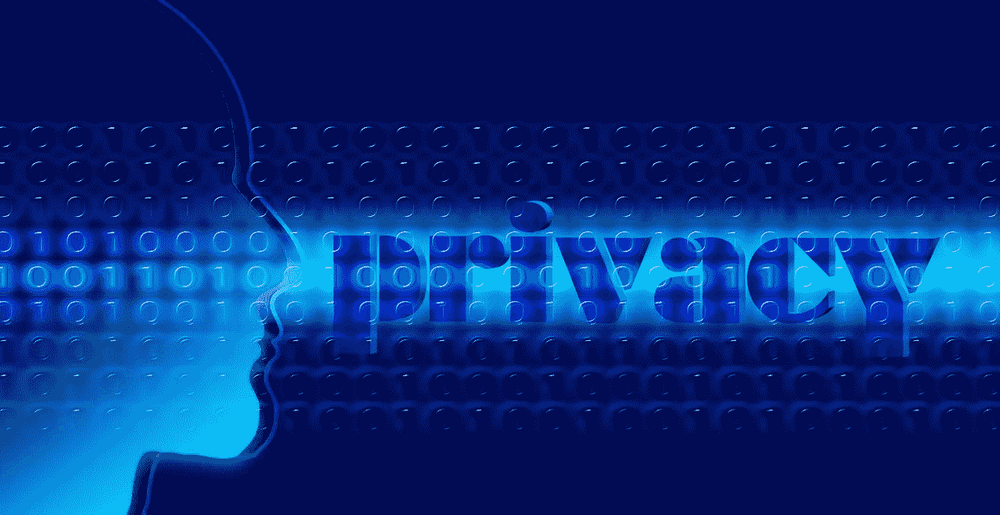

# 社交媒体时代的在线隐私

> 原文：<https://medium.com/hackernoon/online-privacy-in-the-social-media-age-e5d79bf2888a>

## 创始人访谈

> 披露:[在线隐私公司 Abine](https://goo.gl/3iEZxb) 曾赞助过黑客 Noon。

今天，我们将了解这家初创公司的状况，并找出是什么让[首席执行官罗布·沙维尔](https://goo.gl/rdbNZU)做他所做的事情。

**你能分享一些关于 Abine 的进展、规模和使用的数据吗？**

没有。我们是一家隐私公司，所以我们从不与任何人共享数据:)

玩笑归玩笑，我们故意不跟踪很多关于我们用户的事情，因为那不是我们的业务。只有当客户直接向我们支付订阅 [Blur](https://goo.gl/4nDrp2) 和 [DeleteMe](https://goo.gl/9thXhh) (我们的主要解决方案)的费用时，我们才赚钱。

我们能够分享的是，我们拥有超过 300 万注册用户，我们每年创造数百万美元的收入，并且现金流是正的——仅从我们客户的订阅收入上。由于新闻中出现的所有数据泄露和隐私问题，例如 [Equifax](https://hackernoon.com/equifax-cybersecurity-aftermath-stop-talking-about-basics-heres-what-you-can-do-today-8c19416bc3f0) ，我们看到客户同比增长约 100%。

**数据经纪人贩卖用户数据是一个黑暗的行业。用户数据源有很多很多。DeleteMe 如何确保阻止数据经纪人出售用户数据？**

[DeleteMe](https://goo.gl/9thXhh) 列出了一组数据代理，我们可以选择让我们的客户完全退出。我们通过一年四次发布报告来证明这一点，这些报告显示了我们在哪里发现了我们的客户的个人信息被列出和出售，以及它何时被删除。客户喜欢这些隐私报告，因为当他们得到这些报告时，证据很容易看到；“之前和之后”，如果你愿意的话。

当然，DeleteMe 不能删除所有数据经纪人的所有个人信息。没人能做到。新的数据经纪人经常出现，其中一些来自美国，不受任何法律或监管威胁的约束。所以没有一个搬家服务是 100%有效的。也就是说，DeleteMe 已经成为网络上排名第一的信息删除服务，因为它是有效的，并且确实降低了你的形象。

**Blur 的技术实力如何？即，什么使它成为管理身份和密码的最佳技术解决方案？**

[Blur](https://goo.gl/4nDrp2) 的技术基础与 1Password、Dashlane、LastPass 等其他现代密码管理器非常相似。在自动填充的准确率%和其他类似的技术方面，我们以他们和谷歌 Chrome 为基准。让模糊与众不同的是隐私。模糊不仅阻止追踪器(用一个复杂的白名单来使这变得平滑)，而且模糊还“掩盖”客户想要从他们选择的任何网站保留的任何个人信息。55%的用户会屏蔽邮件。60%的人会屏蔽自己的手机号码。75%的人掩盖了他们的信用卡。[屏蔽](https://goo.gl/GpDGrC)简单来说就是任何你不想拥有真实私人邮箱、电话号码或信用卡的网站都得不到。他们得到了屏蔽的版本，可以将电子邮件、电话和费用私下转发到你真实的电子邮件、电话和信用卡上。它只是工作。

**你最近获得了一项相当** [**宽泛的隐私保护专利**](http://www.prnewswire.com/news-releases/abine-receives-broad-patent-for-privacy-and-identity-protection-300485888.html) **。你如何用通俗的语言描述这项专利？专利对你的科技公司有什么重要性？你会如何推荐其他科技初创公司的首席执行官在他们的整体商业战略中处理专利问题？**

我们的专利保护我们的反跟踪和身份屏蔽技术，我们让一个人立即保护他们的电子邮件，电话和信用卡，而不必向其他公司披露它们。

我个人认为，知识产权“产业”，尤其是技术专利，都搞砸了。也就是说，我认为专利是某些初创公司的材料——尤其是那些在大型市场进行创新、周围有许多大型企业的初创公司。支付和身份保护当然符合 Abine 的要求。首席执行官需要简单地评估他们是否在这样的市场中，是否有真正的发明。如果是这样，为你的创新申请专利是游戏的一部分。

**Abine 于 2011 年 7 月从 Atlas Venture 和 General Catalyst 筹集了**[**【647 万美元**](https://www.crunchbase.com/funding-round/6dd104a50b0547bd870cea2ae41a76b1) **】。那是 6 年前的事了。你打算再加注吗？当谈到通过收入增长与通过投资增长时，您的总体战略是什么？**

我们是盈利的，没有额外风险投资的计划。创始人应该不择手段地成长，只要这种成长是真正的成长——而不是靠一些无机的诡计制造出来的。作为一家隐私公司，我们希望其他公司在不背着用户出售用户个人数据的情况下发展。

当您思考互联网的未来时，它会如何更好地保护用户隐私？

这么简单的问题，谢谢提问:)互联网一直对全球隐私不好。移动电话和摄像机的普及也是如此。我认为一些较新的区块链协议和技术支持可信的分散式交换，这是有希望的。我对网络隐私的未来持谨慎悲观的态度。我担心它会变成奢侈品，只有某些人才买得起。Abine 最近有一个用户评论，其中的女性或男性抱怨我们收取了额外的费用(每年 39 美元)来屏蔽和同步他们的数据。当然，我们认为我们的定价是公平的，但如果你习惯了“背后广告模式”，服务似乎是免费的，那么一切有价格的东西似乎都很贵。

尽管如此，我绝对不同意马克·扎克伯格——[和这位最近的黑客漫画作家](https://hackernoon.com/privacy-is-dead-and-we-have-killed-it-603df3727f22) ( [萨尔瓦夫·库尔帕蒂](https://medium.com/u/2d5aff86a200?source=post_page-----e5d79bf2888a--------------------------------))——隐私已死，我们选择了扼杀它。这些观点是错误的，哲学上是乏味的，技术上是不合理的。匿名上网非常困难，但对隐私的合理预期是完全可行的——即使对于像我姑姑这样的人——她曾经不小心给她的新丰田佳美加满了柴油。

**作为特别优惠，我们给《骇客正午》读者** [**七五折模糊&删除我**](https://goo.gl/Wnqe64) **！**

[**享受七五折优惠。**](https://goo.gl/Wnqe64) **跟上阿宾上** [**脸书**](https://www.facebook.com/AbineInc)**&**[**推特**](https://twitter.com/abine?lang=en) **。**