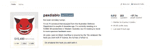
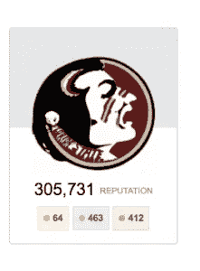

# 前 100 名中只有一名女性

> 原文：<https://medium.com/hackernoon/only-1-woman-in-top-100-stack-overflow-accounts-1c9ded763684>

最近有很多关于科技行业女性的讨论。头条新闻既有令人反感的，也有令人振奋的。从丑陋的一面来看，我们都读过著名科技公司的性骚扰和虐待事件。更令人振奋的是，更多的[活动](https://twitter.com/search?q=%23womenoftheweb&src=tyah)和[电影](http://www.inc.com/maria-aspan/hidden-figures-tech-diversity.html)在庆祝女性对科技的贡献——以及[激励未来的女性](https://techcrunch.com/2017/01/13/hidden-figures-inspiring-stem-heroes-for-girls/)从事 [STEM](https://hackernoon.com/tagged/stem) 职业。

为了庆祝国际妇女节，我们决定用空气污染指数来解决这个问题。我们建立了一个项目来确定 Stack Overflow 排名前 3479 的用户中有多少是女性。我们通过 [RapidAPI](https://rapidapi.com/?utm_source=HackerNoon&utm_medium=WomensDaySmash&utm_content=Women's%20Day%20Smash) 连接到公共 API(堆栈溢出和 Clarifai 的视觉识别 API)来收集这些数据。

# 我们是如何得到这些数字的

由于 [RapidAPI](https://rapidapi.com/?utm_source=HackerNoon&utm_medium=WomensDaySmash&utm_content=Women's%20Day%20Smash) 通过一个抽象层连接到多个 API，找到这些数据相对容易。以下是我们通过 RapidAPI 使用的 API。

> **堆栈交换 API**
> 
> 我们使用堆栈交换 API 导出了前 3，500 个堆栈溢出用户。我们根据堆栈溢出[信誉](http://stackoverflow.com/help/whats-reputation)对用户进行排序。用 Stack Overflow 的话来说，一个用户通过“发布好的问题和有用的答案”来获得或失去声誉。
> 
> Clarifai API
> 
> 我们使用 [Clairfai 视觉识别 API 的人口统计模型](https://rapidapi.com/package/ClarifaiPublicModels/functions/detectAgeGenderEtnicity?utm_source=HackerNoon&utm_medium=WomensDaySmash_Home&utm_content=Women's%20Day%20Smash)根据用户的个人资料图片来确定用户的性别。Clarifai API 的工作原理是返回图像中的人脸是男性还是女性的概率。当 API 在图像中找不到人脸时，我们将结果分类为未分类。

现在，看看结果！

# **结果**

你可以自己挖掘[的原始数据](https://docs.google.com/spreadsheets/d/1FgLRFOBrohbeN2Uo2OCPpTH2yzVfqizErMTEgYUPZGc/edit#gid=2059569289)，但这里是关键的统计数据和一些额外的分析。

*   在排名前 3，479 的简档中，视觉识别 API 将 1，515 个简档图像分类为具有可辨别的性别。
*   在具有可辨别性别的概况中，视觉识别 API 将 5.6%归类为女性，94.4%归类为男性。
*   前 100 个堆栈溢出用户包括 77 个男性档案、21 个未分类档案和 1 个女性档案。
*   视觉识别 API 总共将 1，428 个档案分类为男性，84 个分类为女性，1，964 个分类为未分类。

## 发现 0:大多数堆栈溢出配置文件图片是中性的

绝大多数堆栈溢出配置文件都有一个中性的图片或图标作为配置文件图片，这使得分类更加困难。**在排名前 3，500 的个人资料中，有 1，512 份有可辨别性别的个人资料图片**。

为了给你一些背景，这里有一些 API 不会(明显地)用性别分类的个人资料图片的例子。

## 发现 1:前 100 名堆栈溢出用户中只有一名女性

由于 Clarifai 人口统计模型仍处于 alpha 阶段，我们也手动浏览了前 100 个结果。我们发现 **77 个男性特征，21 个未分类，1 个女性特征。**未分类用户要么具有中性特征(见调查结果 0)，没有提供足够的信息来确定性别，要么在男性/女性二元性别之外被识别。一个用户甚至被认定为非人类！

## 发现 Clarifai 人口统计模型仍处于初级阶段

Clairfai API 的人口统计模型非常有趣——你可以通过 [RapidAPI 包](https://rapidapi.com/?utm_source=HackerNoon&utm_medium=WomensDaySmash&utm_content=Women%27s%20Day%20Smash)在浏览器中测试一个调用。然而，我们注意到该模型肯定仍处于 alpha 阶段。例如，这个塞米诺球迷的个人资料图片被返回为“女性化”

当涉及到图示字符或图标时，API 可能会有一些限制。

# 结论和后续步骤

确定堆栈溢出的性别比我们最初预期的要复杂。许多用户更喜欢图标或插图，而不是个人资料图片，这使得识别性别更加困难。为了获得更好的结果，这个实验的[未来](https://hackernoon.com/tagged/future)迭代可以包括[性别 API](https://www.gender-api.com/) ，它确定一个名字与男性或女性性别相关联的概率。准确性随着位置的变化而提高，所以我们也导出了这些数据。

> [黑客中午](http://bit.ly/Hackernoon)是黑客如何开始他们的下午。我们是 [@AMI](http://bit.ly/atAMIatAMI) 家庭的一员。我们现在[接受投稿](http://bit.ly/hackernoonsubmission)并乐意[讨论广告&赞助](mailto:partners@amipublications.com)机会。
> 
> 如果你喜欢这个故事，我们推荐你阅读我们的[最新科技故事](http://bit.ly/hackernoonlatestt)和[趋势科技故事](https://hackernoon.com/trending)。直到下一次，不要把世界的现实想当然！

