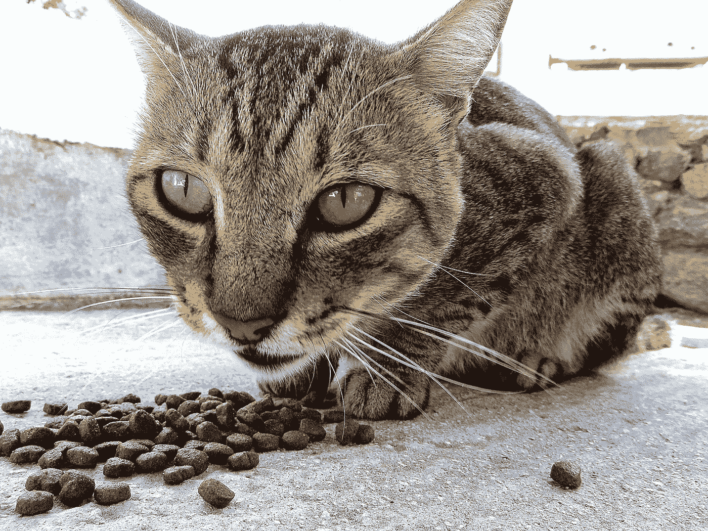

# 仅在 Node.js Interactive:从 Rachel White 看物联网与 Arduino 的演进

> 原文：<https://medium.com/hackernoon/only-at-node-js-interactive-the-evolution-of-iot-with-arduino-from-rachel-white-e682b6830af3>

[Rachel](https://twitter.com/ohhoe) 是一名自学成才的前端工程师，NodeBots 社区的活跃成员，也是一名猫鉴赏家！她目前在微软工作，致力于让开发人员对新技术感到兴奋的项目。

在她使用 Node.js、socket.io、微控制器和 johnny-five 的第一个项目中，她构建了一个基于网络的喂食器，可以根据可配置的时间表或远程触发来提供美味的猫食。

今年，在[节点。js Interactive Europe，](http://events.linuxfoundation.org/events/node-interactive-europe) Rachel 将带我们经历一次引人入胜的体验，让我们发现与 Arduino 集成的许多不同模块。Arduino(如果您不熟悉的话)是一个开源平台，用于构建由物理可编程电路板和 IDE(集成开发环境)组成的项目。它在您的计算机上运行，可以编写计算机代码并上传到物理板上。

Rachel 旨在展示 Node.js 硬件、创造性编码、交互式机器人等领域的可能性。通过图表和详细的代码示例，她的演示“[Alt-Ctrl:Scream into this Arduino](https://eventmobi.com/nieu16/agenda/176233/928562)”将为我们呈现加速度计、电容触摸、光线和声音的内部视图。她将向我们展示某些模块如何轻松地与 Arduino 集成，它们在日常生活中的用途，以及这些应用如何推动物联网世界的发展。还将有各种传感器模块的演示，如控制视频游戏的铜触摸传感器和控制 led 亮度的叫喊。

Node.js Interactive Europe 将于 9 月 15 日至 18 日在阿姆斯特丹举行。当涉及到编码的局限性时，我们期待着学习更多关于跳出框框思考的知识。[务必今天就注册！](http://events.linuxfoundation.org/events/node-interactive-europe)

> [黑客中午](http://bit.ly/Hackernoon)是黑客如何开始他们的下午。我们是 [@AMI](http://bit.ly/atAMIatAMI) 家庭的一员。我们现在[接受投稿](http://bit.ly/hackernoonsubmission)，并乐意[讨论广告&赞助](mailto:partners@amipublications.com)机会。
> 
> 如果你喜欢这个故事，我们推荐你阅读我们的[最新科技故事](http://bit.ly/hackernoonlatestt)和[趋势科技故事](https://hackernoon.com/trending)。直到下一次，不要把世界的现实想当然！

