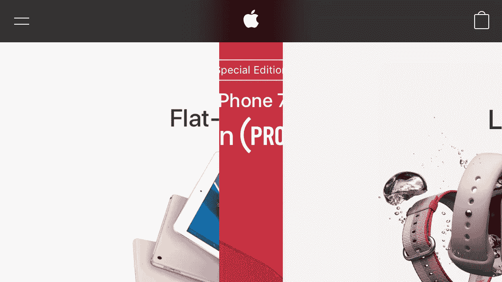

# Mobile Safari 中的“调整大小”事件中断

> 原文：<https://medium.com/hackernoon/onresize-event-broken-in-mobile-safari-d8469027bf4d>

苹果最新的移动 Safari (iOS 10.3.1)打破了 [*调整*](https://developer.mozilla.org/en-US/docs/Web/Events/resize) 的行为。

直到最近，Mobile [Safari](https://hackernoon.com/tagged/safari) 已经正确发布了调整视窗大小后的 *resize* 事件和页面布局 *后的**事件。***然而，情况不再是这样了。相反，它是在页面完全布局之前发布的。任何 [JavaScript](https://hackernoon.com/tagged/javascript) 依赖[*client width*](https://developer.mozilla.org/en-US/docs/Web/API/Element/clientWidth)*，*[*client height*](https://developer.mozilla.org/en-US/docs/Web/API/Element/clientHeight)*，*[*getBoundingClientRect*](https://developer.mozilla.org/en/docs/Web/API/Element/getBoundingClientRect)等。在一个 *onresize* 回调现已中断。

在观察这种新行为时，我的第一个想法是“移动 Safari 团队怎么没有注意到这一点呢？肯定冲击了苹果自己的网站！”

于是我着手查看[苹果的主页](https://www.apple.com/)。

现在，任何使用纯 CSS 调整大小的元素都不会受到影响，只有由 JavaScript *resize* 回调调整大小的 DOM 元素会受到影响。对我来说幸运的是，在苹果主页的正上方是一个图像转盘，目前正在为红色的 iPhone 7、Apple Watch Series 2 和 iPad 做广告。旋转木马通常非常依赖 JavaScript 来确定大小，事实上，是我自己的旋转木马没有工作，导致我陷入了这场徒劳的追逐！

好吧，让我们看着这个旋转木马，我从肖像旋转到风景。果然，就在旋转完成的时候…

“啊，真讨厌！”

奇怪的是，这种故障布局，虽然 100%可复制，但只是非常短暂地可见，然后网页布局以某种方式恢复。

我想知道他们是如何解决这个问题的。让我们看看他们的旋转木马代码…

拜托，说真的！？500 毫秒超时…“去抖”…这是什么废话？为什么是 500 毫秒？为什么不是 400 毫秒，或者 600 毫秒？

好吧，所以在这一点上，我觉得我的旋转木马打破了一点点。毕竟，苹果自己也依靠可怕的黑客来解决浏览器的恶劣行为。然而，这种放松是短暂的，因为我意识到，如果我要“修理”我的旋转木马，我将不得不实现一些同样糟糕的事情。

*感叹！*

好吧，苹果，看来你又赢了一轮苹果对开发者的比赛。拜托，我不想看记分牌。

https://openradar.appspot.com/radar?id=5040881597939712

> [黑客中午](http://bit.ly/Hackernoon)是黑客如何开始他们的下午。我们是 [@AMI](http://bit.ly/atAMIatAMI) 家庭的一员。我们现在[接受投稿](http://bit.ly/hackernoonsubmission)并乐意[讨论广告&赞助](mailto:partners@amipublications.com)机会。
> 
> 如果你喜欢这个故事，我们推荐你阅读我们的[最新科技故事](http://bit.ly/hackernoonlatestt)和[趋势科技故事](https://hackernoon.com/trending)。直到下一次，不要把世界的现实想当然！

