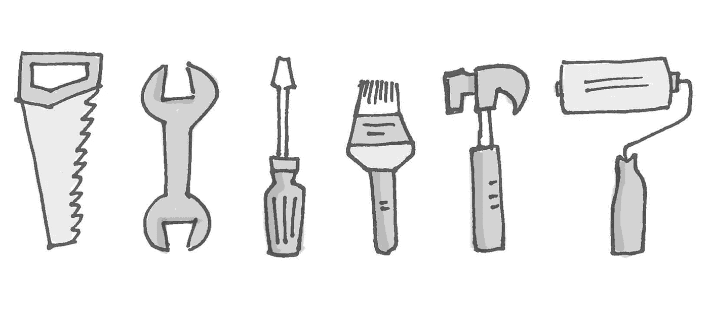
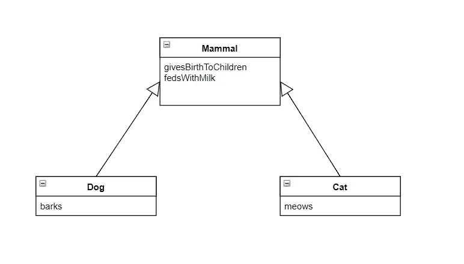
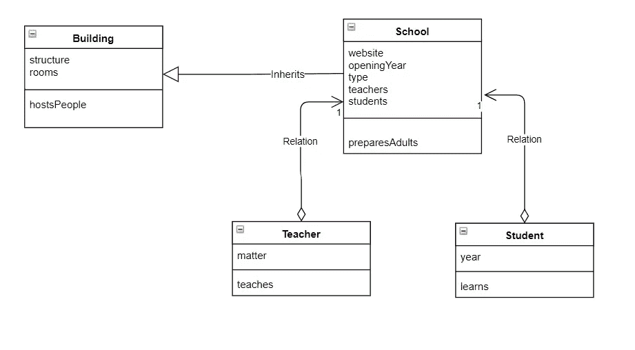
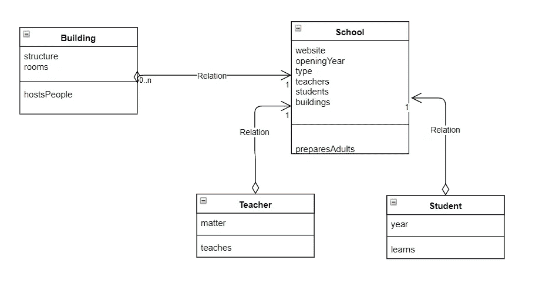

# OOP 设计:可组合对象支持变化

> 原文：<https://medium.com/hackernoon/oop-design-composible-objects-support-change-336d96a1a60f>

Best tools for the job

我相信“组合重于继承”是最重要的 OOP 原则，只有极少数用 OOP 语言写代码的人理解它，应用它的开发者就更少了。自从 2003 年开始写第一行代码并获得报酬以来，我在 4 家公司担任开发人员和采访人员的全部经历就是我的肯定的基础。老实说，这也是基于我过去几年的阅读，我也可以告诉你，有很多比我更好的开发人员这样说。

在我参加的所有面试中，每当我问及这个问题时，没有人知道如何解释“组成优于继承”。另一方面，我不经常问这个组成问题，我只把它放在我认为高于平均水平的开发人员面前。我知道我们都有偏见，所以也许我错过了一个很好的解释，因为我对“高于平均水平”的开发人员的看法。

优秀的开发人员的工作效率是普通开发人员的 10 倍，但这不是打字速度快几倍，而是做出更好的决策。当你的客户想出新的伟大的特性来添加时，这些决定给你所需要的灵活性。

## 一切以此为基础

我们很多 Java/C#开发人员至少参与过一个项目，在这个项目中，我们可以找到像 BaseService 或 BaseManager 或 BaseClient 或 BaseHandler 这样的类，甚至所有这些类。这样一个类清楚地表明继承被用于错误的目的:放置重复代码的地方。我相信，如果我们以正确的方式使用继承，它仍然可以帮助我们，这将意味着达到多态设计。我也看到继承可能是我们代码中最被滥用的 OOP 概念，所以也许去掉它并用接口来代替它，可能对我们的代码有更大的好处。在这种事情发生之前，让我来解释为什么使用复合对象比使用派生对象更好。

当我们在学校(计算机科学系)学习遗传时，通常我们有一个例子，比如狗是哺乳动物，所以我们可以有哺乳动物类，它们的行为比如生孩子，用牛奶喂养孩子，然后我们有从哺乳动物继承的狗类，我们可以添加特定的狗行为，比如吠叫。这是一个很好的例子，因为只要我们使用狗的哺乳动物行为，我们就可以使用基类。所以我们达到了多态状态，因为除了狗，我们还可以有其他从哺乳动物继承来的物体。

Inheritance

## 设计一所学校

现在考虑设计一个学校系统。当我们说“学校”时，我们大多数人会想到建筑，因此设计的第一步是创建一个建筑类，它成为学校类的基类。我们认为这是合理的，因为无论建筑物有什么属性和行为，它们都将被学校继承。然后我们看到学校是一个我们上课学习，学习新东西，参加考试，庆祝圣诞节等等的地方。如果学校继承了一栋建筑，这并不矛盾。您仍然可以使用这种继承来设计一个工作系统。

School inherits from building

让我们用一种更面向对象的方式来问这个问题:学校有一栋建筑还是一栋建筑？就像我们之前说的，没有正确的答案，你可以从建筑类继承或者拥有学校的建筑部分，在这两种情况下，你都可以为你的客户的问题提出一个可行的解决方案。它更多的是关于未来的变化，那些甚至你的客户现在都不知道的变化。

我们可以获得创建在线课程和考试的功能请求，使学习材料成为其他语言等等。当你继承学校建筑时，一些要求可能会给你带来麻烦，比如支持其他城镇的新建筑。在这种情况下，学校需要支持一个以上的建筑，所以一个组合会更好。因此，对于简单的系统来说，继承可能是可行的，但是对于需要改变的系统(可能现在所有的系统)来说，组合将是更好的选择。

School & building composition

学校和建筑是一个简单的例子，我们通常不会在代码中处理如此简单的概念。狗和哺乳动物也是如此。但这些概念是解释更复杂概念的最佳起点。我正在考虑举办一个关于面向对象设计的研讨会，其中一个主要的讨论点将会是复合而不是继承。你可以在这里找到更多关于[的信息。](https://mailchi.mp/6c944dd6daac/oop-design-workshop)