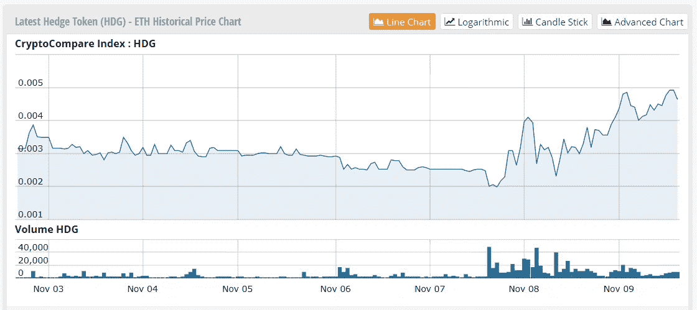
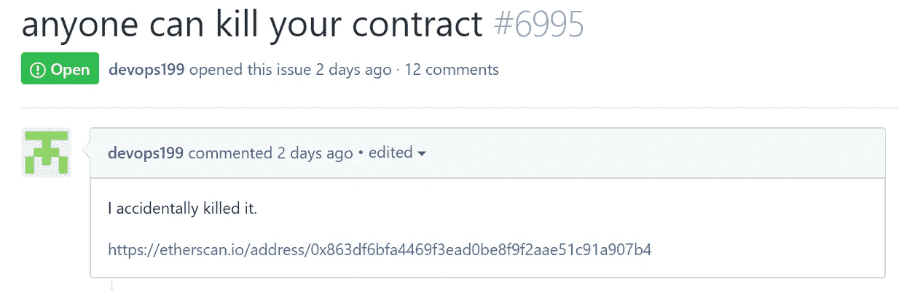
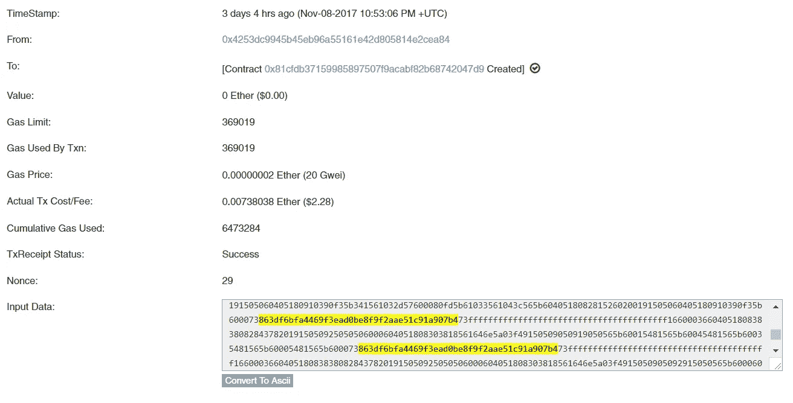
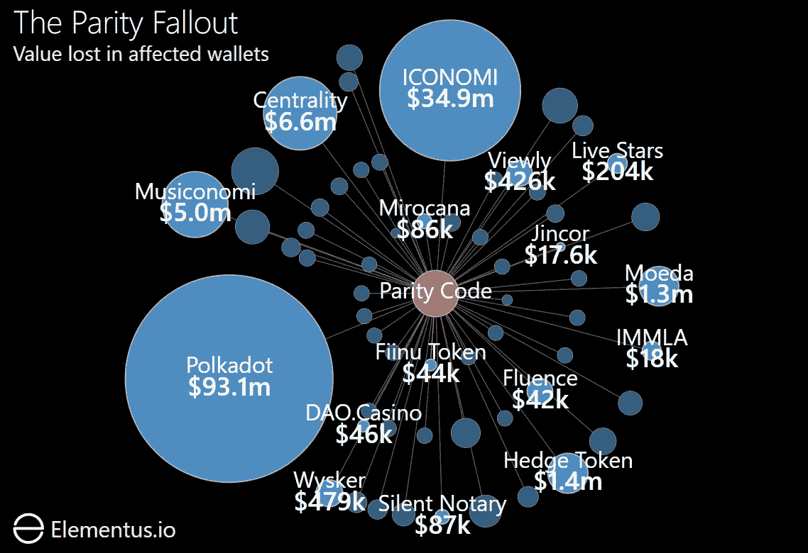

# 哎呀，我刚刚损失了 1 . 56 亿美元——这是一个以太坊新手开发者“意外”的后果

> 原文：<https://medium.com/hackernoon/oops-i-just-lost-156m-the-fallout-from-one-novice-ethereum-developers-accident-8d532c827a3c>

自从奇偶钱包漏洞在周二首次被报道以来，我们已经遇到了许多关于问题的规模和范围的相互矛盾的信息。

一些消息来源称[损失了价值高达](https://www.cnbc.com/2017/11/08/accidental-bug-may-have-frozen-280-worth-of-ether-on-parity-wallet.html)**3 亿美元的乙醚，而其他人则报出了更低的数字**1 . 5 亿美元。至于受影响的钱包数量，一份流传的谷歌文档电子表格显示共有 151 个钱包。然而，[平价自己的网站](https://affected.parity.io/)显示影响要大得多，有 **584 个钱包**受到影响。****

****更重要的是，**我们几乎没有看到任何关于拥有这些钱包的组织的信息。如果你不确定为什么这很重要，考虑下面的图表。******

********

****[*The Hedge Project*](https://www.hedge-crypto.com/)*, one of the companies impacted by the wallet freeze, has seen their token value* **rise** *since the incident occurred. (price chart courtesy of* [*CryptoCompare*](https://www.cryptocompare.com/)*)*****

****许多这样的钱包属于通过 ICO 筹集资金的公司。如果这笔钱没了，那不仅仅是公司的问题。这对每个拥有代币的人来说都是个问题。****

****根据我们收集的数据，这是我们对形势的评估。我们检查影响的程度和受影响的公司/ico 列表。****

# ****发生了什么事？****

****11 月 6 日(上周一)，一名以太坊开发者“意外”触发了一个错误，删除了奇偶校验的多签名钱包所依赖的[代码库](https://etherscan.io/address/0x863df6bfa4469f3ead0be8f9f2aae51c91a907b4)。随着代码的删除，那些钱包里的以太实际上是不可及的。****

********

****[*Discussion of the issue on Github*](https://github.com/paritytech/parity/issues/6995)****

****这位开发者并不隶属于 Parity，他的 [Github 账户](https://github.com/ghost)已经被删除。****

****要全面解释入侵是如何发生的，Comaelo 的 Matt Suiche 做了一个很棒的解释。****

# ****有什么影响？****

****我们统计了 598 个受影响的钱包，总余额为 514，000 美元，基于 304 美元的 ETH 价格，总价值为 1 . 56 亿美元。****

****我们用来达到这些数字的脚本是[贴在这里](https://github.com/elementus-io/parity-wallet-freeze/blob/master/index.js)。本质上，这些是它的步骤:****

*   ****循环查看自 7 月 20 日以来以太坊上部署的所有智能合约。这是有问题的代码库的创建日期，因此任何依赖于它的智能合约都必须在此日期之后部署。****
*   ****通过在智能协定初始化代码的正文中查找字符串“863 df 6 BFA 4469 F3 EAD 0 be 8 f 9 F2 aae 51 c 91 a 907 b 4”来识别受影响的钱包。这个字符串是奇偶校验代码库的[地址，它被硬编码到他们的钱包中。](https://etherscan.io/address/0x863df6bfa4469f3ead0be8f9f2aae51c91a907b4)****

********

*****Affected wallets are identifiable by the presence of the string* “863df6bfa4469f3ead0be8f9f2aae51c91a907b4” *in their initialization code (image from* [*Etherscan*](https://etherscan.io/)*)*****

*   ****为了确定损失了多少乙醚，使用 [JSON RPC API](https://github.com/ethereum/wiki/wiki/JSON-RPC) 遍历每个受影响的钱包并获取其当前余额。****

****你可以在这里找到这个脚本的代码和受影响地址的完整列表。****

****如上所述，我们统计了 598 个受影响的钱包。但是损失远没有这个数字所暗示的那么广泛。钱包里有 496 个是空的(平衡< 1 ether). And of the remainder, the loss is heavily concentrated in a few large wallets.****

****Most notably, 60% of the entire loss ($93m of the $156m total) comes from a single wallet belonging to the [Web3 基金会](/web3foundation/web-3-multi-sig-wallet-update-245d30df0fb3)，一个与平价本身密切相关的组织)。几周前刚刚在 ICO 为基金会的新多链项目 [Polkadot](https://polkadot.io/) 筹集到资金。****

****更多关于 ico 受影响的信息，请见下文。****

# ****为什么报告的损失数字有如此大的差异？****

****与我们估计的 1 . 56 亿美元的损失相比，许多消息来源报告的数字要高得多，大约在 3 亿美元左右。这些报道似乎都可以追溯到伦敦大学学院区块链研究员 Patrick McCorry 的一条推文，他估计损失总额为 2 . 78 亿美元。****

****在发出这条推文后不久，麦考利发现了计算中的一个错误，并发布了一个[更正](https://twitter.com/paddyucl/status/927927727482654720)，将数字下调至 1 . 54 亿美元。这个数额也在[平价自己的 Gitter chat](https://gitter.im/paritytech/parity?at=5a01d63186d308b755bbbd1f) 上得到独立证实。然而，夸大的数字不断出现在新闻中，就在今天早些时候的。****

# ****哪些 ico 受到影响？****

****下图显示了每个余额至少为 33 ETH(约 10，000 美元)的受影响钱包。我们的数据显示其中 16 个钱包与 ICO 筹款有关。****

********

****ICOs impacted by the wallet freeze (graphic and data by: [Elementus](https://elementus.io/))****

*****注意:这些钱包的所有权尚未得到公司的证实。这些关联是我们根据收集的数据做出的估计。*****

# ****总之…****

******598 个钱包**受到影响，但其中只有 60 个钱包的余额超过 10，000 美元(如上图所示)。****

****总损失是 51.4 万 ETH/1.56 亿美元，而不是许多新闻报道的 3 亿美元。****

****所有这一切的最大输家是平价本身。他们拥有 9300 万美元的钱包，占全部损失的 60%。****

****至少有 16 个受影响的钱包与通过 ICO 筹集资金的公司有关。****

****在这 16 个案例中，受影响的不仅仅是公司。它们的令牌持有者也会受到影响。****

*****原载于 2017 年 11 月 10 日*[*elementus . io*](https://elementus.io/blog/which-icos-are-affected-by-the-parity-wallet-bug/)*。*****