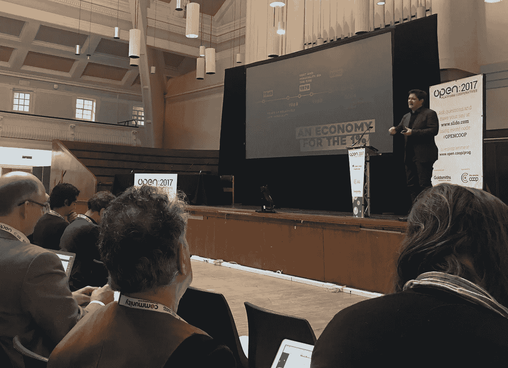

# Open 2017:平台合作主义会议—公民技术与合作

> 原文：<https://medium.com/hackernoon/open-2017-platform-cooperativism-conference-civic-tech-meets-co-ops-a10f5255da4d>

Trebor Scholz on an economy for the 1% (via @OuishareUK)

当马克·扎克伯格把脸书重新包装成一个产品来弥合它所造成的分歧时，你可能会想，让一个 32 岁的人来控制网络是我们能想到的最好的治理方法吗？他显然认为，从长远来看，T2 应该摆脱 T3。如果你想要一种不那么盲目乐观的方法，合作可能是答案。

【2017 年公开赛包含两种不同的合作视角。如果你是英国人，你可能会立即将合作公寓与葬礼和超市联系起来。作为一种员工也是股东的法律安排，它们已经存在了几个世纪。从国际上看，他们在全球经济中所占的份额惊人的大。一座难以逾越的制度大山。

然后是[平台](https://hackernoon.com/tagged/platform)合作主义，你通过开采一块合作社山，将其熔化，并将其倒入数字模具中来制作。Trebor Scholz 和 Nathan Schneider 是平台合作运动的创始人。舒尔茨做了第一个[会议的发言](https://hackernoon.com/tagged/conference)。当我写作时，我在参议院图书馆安顿下来，把一个博士的句子串在一起，就像圣诞节以来我一直做的那样。舒尔茨的演讲是一个回到世界的连接，一个受欢迎的提醒，即其他人正和我一样关注同样的话题，甚至以相似的方式思考它们。

他的实用主义吸引了我。合作是一种找回网络积极政治潜力的方式——它们是一条回到我们认为网络将“民主化”的日子的路线。2013 年，iStock photos 的创始人推出了一个名为 [Stocksy United](https://www.stocksy.com/) 的平台合作社，有 220 名贡献摄影师，每个人都可以分享公司的利润。现在它有 900 名会员，并且是一个盈利的企业——这对优步来说可不是什么好事。这是一个传统的合作组织，但通过一个数字平台协调，这是零工经济的[道德面孔](/@trebors/platform-cooperativism-vs-the-sharing-economy-2ea737f1b5ad#.iua6j1unv)。

“这与技术无关，这与人有关”是一个老生常谈的话题，任何人都可以说出来，但有一种特定的方式是正确的。很多关于市政科技的讨论都围绕着如何利用区块链、比特币或其他去中心化或分布式系统实现一个完美的扁平层级结构。

这些技术经常会导致糟糕的用户体验。[我在](https://www.opendemocracy.net/open2017/jimmy-tidey/what-would-twitter-be-with-wikipedia-politics)[mastosdon . social](http://Mastodon.social)上详细看过，这是一个“道德”的 Twitter 替代品，它有许多优秀的功能，但由于其分布式方法，它牺牲了搜索工具等功能——没有一个中央服务器来进行搜索。我预测这个缺陷，以及其他类似的小问题，将会限制它的牵引力。

无论如何，尽管在有限的技术意义上没有集中的权力，但区块链和类似的技术在任何现实世界的部署中都有更模糊的含义——你仍然可以在区块链之上建立集中的机构，这正是许多老牌银行感兴趣的原因。

合作基金不是一种技术解决方案，而是一种合法的解决方案——一种你现在就可以使用的、有着长期成功记录的解决方案。我并不是说区块链不重要，但在我看来，Stocksy 是一个比 [BlockAI](https://blockai.com/) 更有前途的模板，BlockAI 是一种“概念上纯粹的”使用比特币管理图像权利的尝试。

也许有一天，分布式系统有能力承担机构承诺，比如合作社的成员资格，但你不必等到那个时候，就可以创建一个功能性的合作数字平台。

Scholz 的演讲提到了占领华尔街运动。许多人钦佩“占领运动”在表达挫折感方面取得的巨大成功，以及引起如此共鸣的 1%口号。但占领运动似乎也知道自己反对什么，但不知道该用什么来取代它。舒尔茨大概希望某种平台驱动的平等主义能够填补这一空白。这可能是一个艰巨的任务，年轻人比以往任何时候都对民主更不感兴趣[右翼](https://www.ft.com/content/8352aa06-e7cc-11e6-893c-082c54a7f539)和[。平台合作社作为可扩展的加州嬉皮士公社 vs 4chan 的数字麦卡锡主义？我知道哪个对我来说更好。](https://qz.com/848031/harvard-research-suggests-that-an-entire-global-generation-has-lost-faith-in-democracy/)

另一个让我印象深刻的会议是由詹姆斯·图兹、贾斯蒂娜·斯瓦特和阿拉斯泰尔·帕尔文组成的分布式制造小组。阿利斯泰尔·帕尔文的介绍性发言将维基屋定位为公共、私营和合作部门之间的一个项目，随后的讨论主要集中在全球供应链的道德地位和制造业的能源投入上。这是一次很棒的会议，因为很多人都想贡献自己的力量——不幸的是，这意味着我永远没有机会做出我那令人着迷的、可能会改变世界的贡献。

如果有人打电话给我，我会提到我最近在参议院图书馆的工作经历，寻找符合伦理的方法来支持我的研究。我发现国际发展有丰富的伦理文献，非常适合于公民技术讨论。它通常适用于公共和私营部门不起作用的国家，或者政府不是民主选举产生的国家。在这种情况下，法律没有指导作用，相反，必须发展当地协商的方法。这种方法也可以用于设计市政技术方法，例如合作平台。

国际发展的伦理方法也是超越西方“新自由主义”经济体中常见的严格以市场为中心的伦理框架的方法。

这就是我会说的，虽然可能会更加漫无边际。我可能还注意到了一些我在整个会议中一直渴望发泄的事情。越来越多的人意识到，城市是现代世界真正的政治单位，而不是国家。对于英国退出欧盟和川普来说，人口鸿沟是大城市和其他地方之间的鸿沟。这是一种政治转变，可能会开启新的治理方式，对城市来说，没有什么比供应链更重要了。他们在经济因素之间的关系决定了他们的地位；对于那些从供应链政治的角度来看待设计的项目来说，这可能是一个真正的机会。

带着那崇高的思想，回到正题...

> [黑客中午](http://bit.ly/Hackernoon)是黑客如何开始他们的下午。我们是 [@AMI](http://bit.ly/atAMIatAMI) 家庭的一员。我们现在[接受投稿](http://bit.ly/hackernoonsubmission)并乐意[讨论广告&赞助](mailto:partners@amipublications.com)机会。
> 
> 如果你喜欢这个故事，我们推荐你阅读我们的[最新科技故事](http://bit.ly/hackernoonlatestt)和[趋势科技故事](https://hackernoon.com/trending)。直到下一次，不要把世界的现实想当然！

