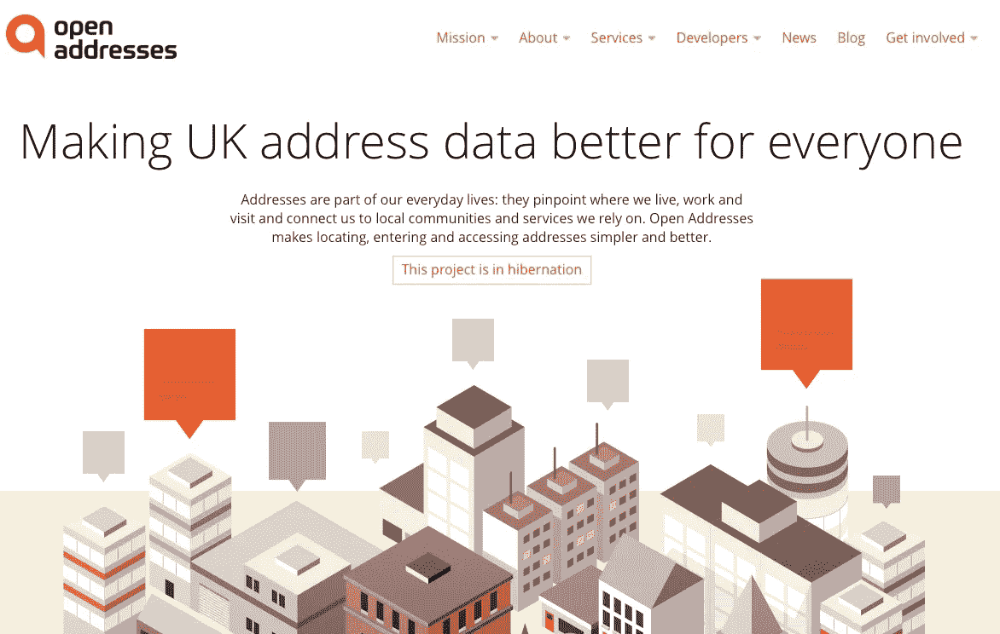
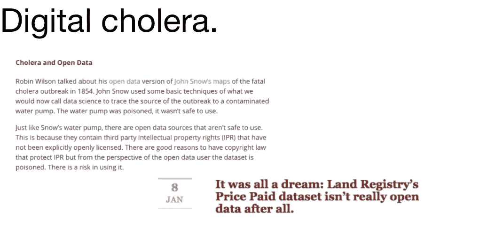
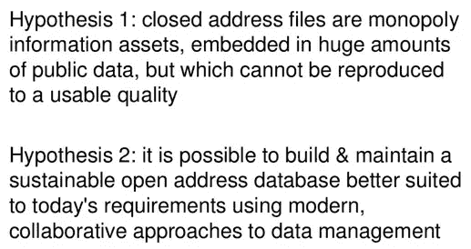
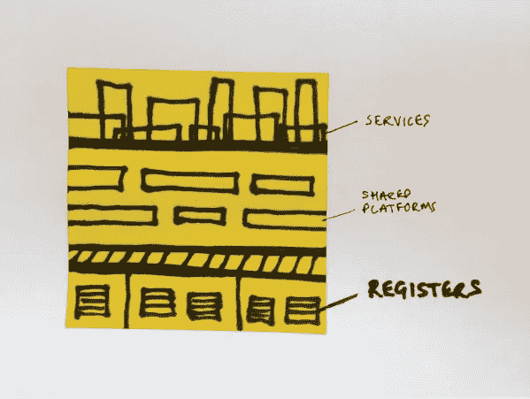
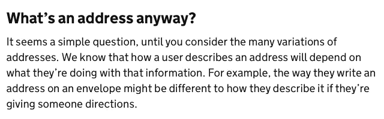
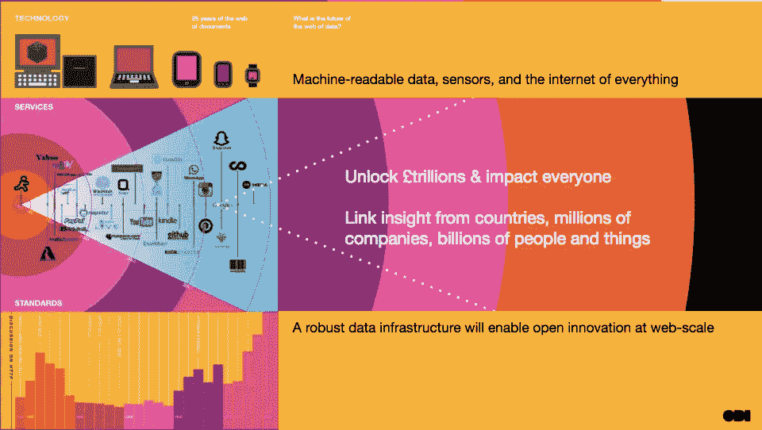

# 开放地址:地址大战会结束吗？

> 原文：<https://medium.com/hackernoon/open-addresses-will-the-address-wars-ever-end-f1241bd24283>

*这是我在 2016 年 8 月* [*英国计算机学会(BCS)位置信息专家组第三届年度寻址更新研讨会*](http://www.bcs.org/content/conEvent/10494) *上的一次演讲的(粗略)文字。当面说的笑话更多。还有一些皮卡丘。我演讲的* [*幻灯片也在网上*](http://www.slideshare.net/peterkwells/bcs-address-seminar-open-addresses) *还有蚂蚁贝克演讲的***。**

*嗨，我是彼得。我在[开放数据研究所](http://theodi.org) (ODI)做一些事情。ODI 成立于三年前。它的使命是连接、装备和激励世界各地的人们利用数据进行创新。它的总部在英国，但是它在世界各地工作。*

*我来谈谈英国的公开地址。为了理解这个故事，从一段(简短的)历史开始是有用的。*

# *古代历史…*

*地址和其他类型的地理空间数据是[开放数据](https://hackernoon.com/tagged/open-data)版本的早期目标。它们是至关重要的数据集，使得构建许许多多的服务和产品成为可能。早在 2006 年，查尔斯·亚瑟和迈克尔·克罗斯在《卫报》上撰文要求英国政府“归还我们的王冠”。他们指出了[维护](https://hackernoon.com/tagged/maintaining)地址数据的复杂安排，以及这些数据是如何被出售以资助这些复杂安排的。他们甚至指出了它给 2001 年人口普查带来的问题。*

*2009 年[英国政府宣布 ODI 的创始人之一蒂姆·伯纳斯·李将帮助其开放数据](https://www.theguardian.com/technology/2009/jun/10/berners-lee-downing-street-web-open)，2010 年政府表示[邮政编码和地址数据将提前发布](http://news.bbc.co.uk/1/hi/technology/8402327.stm)。胜利！*

**

*Some of the tales from 2013*

*但这是一场得不偿失的胜利。虽然政府发布了成千上万的数据集，但承诺的地址数据并不在其中。2013 年，皇家邮政及其帮助创建和出售地址数据的权利被私有化。2006 年指出的复杂安排变得更加复杂。与此同时，[不可避免地发生了另一次人口普查，而且代价高昂，需要建立另一个新的地址列表](http://www.ons.gov.uk/ons/guide-method/census/2011/how-our-census-works/how-did-we-do-in-2011-/evaluation---address-register.pdf)。*

*[开放数据社区理所当然地感到悲伤](http://www.telegraph.co.uk/news/uknews/royal-mail/9994741/Everyones-postcodes-to-be-privatised-in-Royal-Mail-flotation-despite-objections-from-Sir-Tim-Berners-Lee.html)，可能还有点生气。他们知道这些数据有多重要。他们继续努力让事情变得更好。他们不仅发微博，还组织起来了。*

# *更近的历史…*

*2014 年[内阁办公室发布的数据基金](https://data.blog.gov.uk/2014/06/26/funding-agreed-for-important-new-open-data-projects/)为 ODI 提供了一些资金[以探索是否有可能重建英国的地址列表并将其作为开放数据发布](http://theodi.org/blog/open-addresses-discovery-phase)。ODI 召集了许多从事地址工作的人来分享和讨论想法。*

**

*The homepage of [Open Addresses](https://alpha.openaddressesuk.org)*

*这导致了英国[开放地址](https://alpha.openaddressesuk.org/)的[发布](https://theodi.org/news/free-and-open-address-list-launches-today-open-addresses-uk-calls-for-individuals-and-organisations-to-get-involved)。我是为公开地址工作的团队成员之一。我们尽可能公开地与常规的[博客](https://alpha.openaddressesuk.org/blog)和[开源代码](https://github.com/openaddressesuk)合作。*

*我们探讨了更好的地址数据对英国的好处。我们发现，我们可以帮助解决一些问题，比如在新地址被添加到全国各地的计算机系统之前需要[个月的时间](https://alpha.openaddressesuk.org/blog/2015/02/09/living-breathing-problem)。在这几个月里，有些人可能无法订购比萨饼、获得家庭保险或登记投票。我们从其他国家的案例研究中寻找经济证据，比如丹麦，他们已经将地址数据作为公开数据发布。如果[丹麦的成功与该国的人口成比例，那么英国可以期望看到每年额外的 1 . 1 亿英镑的社会和经济价值](https://alpha.openaddressesuk.org/mission/benefits)。我们目前没有得到的价值，因为[付费数据创造的经济价值不如开放数据](http://theodi.org/research-economic-value-open-paid-data)。*

*我们研究了融资模式。我们从内阁办公室获得了 38.3 万英镑的资金。我们从 BCS 得到了一些[额外的资助(谢谢)。我们知道，在开始从地址服务的用户那里筹集资金之前，我们需要能够向人们展示我们的服务是什么样的。](https://alpha.openaddressesuk.org/news/2015/04/20/bcs-press-release)*

*通过与这些服务的潜在用户交谈，我们了解到在许多网站上输入地址的挑战。[用户研究支持了我们的理论](https://alpha.openaddressesuk.org/blog/2015/05/13/free-format-user-research),即转向自由格式的地址输入不仅会让许多人的生活变得更轻松，还会让组织获得更高质量的地址数据。我们为服务构建了一个[工作演示。](https://alpha.openaddressesuk.org/blog/2015/01/23/give-our-sorting-office-a-try)*

*我们知道我们需要收集地址数据。在发现阶段之后，我们建立了一个模型，允许任何组织或个人贡献他们自己的地址数据；这将允许任何人添加大量包含地址的开放数据，如果他们遵循指南并确认他们在法律上被允许将地址数据作为开放数据发布的话；并制定删除政策，以调查和删除任何侵权数据。从法律的角度来看，[我们被设置为托管数据](http://www.out-law.com/page-431)。这很重要。在过去[人们曾因地址数据](http://blog.okfn.org/2009/10/05/ernest-marples-uk-postcode-site-has-been-taken-down/)受到皇家邮政的法律诉讼威胁，托管模式提供了一个辩护理由。*

*不幸的是，我们遇到了障碍。*

**

*Digital cholera makes me sad.*

*我们了解到政府拥有的最大的公开数据集之一被我们称之为“数字霍乱”所污染。它包含第三方权利，政府没有被授权许可作为开放数据。这是不好的。我们希望[发布可以安全使用的地址数据](https://alpha.openaddressesuk.org/blog/2015/01/26/making-address-data-safe)。*

*我们不想把有限的资助资金花在越来越多的法律建议或诉讼上(对不起，律师们……)。所以我们专注于其他方法。*

*我们使用干净的开放数据集和统计技术来乘以我们已经拥有的地址数据。例如，“如果 1 号房屋存在，5 号房屋存在，那么 3 号房屋可能存在”。*

*我们开始开发[一个协作维护模型](https://alpha.openaddressesuk.org/about/collaborative-maintenance)。人们可以使用我们的地址服务来改善他们自己的服务和每个人都在使用的地址数据。随着人们开始使用新的地址信息，该模型将使我们能够学习和发布新的地址信息(如[替代地址——如 Rose Cottage 而不是 8 Acacia Avenue](https://alpha.openaddressesuk.org/blog/2015/04/28/better-addresses-3) 和新地址)。这将加快发布新信息的速度，提高数据质量。通过 API 众包数据，随着越来越多的人使用数据，数据会变得更好。*

*该团队认识到，这些收集地址数据的新方法会影响信心。因此，我们开始开发[模型，允许平台在每个地址](https://alpha.openaddressesuk.org/blog/2015/02/20/confidence  )中声明一个信任级别。该模型根据我们看到某个地址的频率、谁报告了该地址以及他们多久前报告了该地址，考虑了不同的信任级别。数据用户可以使用[API 来确定可信度，并选择是否信任某个地址](https://alpha.openaddressesuk.org/blog/2015/02/20/confidence)用于他们的特定用例。*

*但是时间一直在流逝。资金有限。从一开始我们就知道我们在测试两个假设。*

**

*Two hypotheses. Both are true.*

*不幸的是，我们发现这两个假设都是正确的。我们可以使用现代方法构建更好的地址服务，但是知识产权问题会一直阻碍我们。*

*发表了一份报告:分享成功的经验和失败的教训。正如您将在报告中看到的，即使我们针对知识产权侵权采取了所有缓解措施，Open Addresses 也只能找到一家保险公司为其提供针对知识产权侵权索赔的保险。保险公司过于担心皇家邮政会采取法律行动来保护他们的地址数据收入。*

*一篇关于[公开数据中的灰色阴影](http://theodi.org/blog/shades-of-grey-in-open-data)的博客发表了。然后打开地址[进入睡眠](https://alpha.openaddressesuk.org/blog/2015/07/27/a-time-for-going-to-bed)。*

*其他人必须接受开放地址数据的挑战，让所有人都受益。*

# *同时…*

*在公开演讲的同时，其他事情也在发生。很多事情。我显然对数据感兴趣。*

*ODI 正在考虑谁拥有我们的数据基础设施。数据是现代社会的基础设施。就像道路一样。道路帮助我们导航到一个地方。数据帮助我们做决定。*

**

*Spot the infrastructure in this excellent picture by [Paul Downey.](https://gds.blog.gov.uk/2015/09/01/registers-authoritative-lists-you-can-trust/)*

*政府还在制定政府作为平台的政策。[公司正在开放他们的数据并放到网上](https://gds.blog.gov.uk/2015/06/22/congratulations-companies-house/)。土地注册处把自己描述成[一根钢丝](https://gds.blog.gov.uk/2015/07/24/building-on-the-steel-thread/)，我们都可以在上面建造。*

*随着[注册成为我们都可以信任的权威名单](https://gds.blog.gov.uk/2015/09/01/registers-authoritative-lists-you-can-trust/)的描述，事情开始变得明朗起来。我们都可以在政府公开注册的基础上建造东西。*

*寄存器是数据基础设施。数据基础设施的一个重要部分是地理空间数据，如地址。*

# *现在*

*在 2016 年的预算中，政府宣布拨款 500 万英镑来探索开放地址数据的选择。*

*重要的是要理解这是关于*探索选项。*正如 Open Addresses 了解到的那样，英国地址相当复杂。我们有几个世纪的遗产要处理。*

*声明发布时，内阁办公室部长马特·汉考克(Matt Hancock)将其比作 20 世纪 80 年代美国政府允许 GPS 数据免费供民用的决定，他说这“启动了数十亿美元的数字产品和服务的扩散”。*

*他知道数据公开的重要性。当你知道他的父母经营着一家开发“[软件的公司，该软件可以让你在互联网上输入你的邮政编码并调出你的地址](https://www.ft.com/content/027bd85e-0290-11e4-a68d-00144feab7de)”时，这就不足为奇了。*

**

*Government is building [a common language about addresses](https://data.blog.gov.uk/2016/08/19/the-language-of-addresses/).*

*政府正在尽可能公开地探索各种选择。他们正在分享他们的研究课题，如[地址匹配](https://data.blog.gov.uk/2016/08/09/tackling-address-matching-together/)的需求和复杂性。以及[需要一种称呼的通用语言](https://data.blog.gov.uk/2016/08/19/the-language-of-addresses/)。他们正在试验技术方法，[你可以自己看看源代码:它是开放的](https://github.com/openregister/addressbase-data)。这一切都是构建[注册](https://www.gov.uk/government/collections/registers-guidance)作为政府即平台战略基础设施的更大图景的一部分。事实上，就在本周，政府公布了英国地方当局权威登记册的早期版本。*

*虽然并非所有的工作都是公开的(请记住，英国地址数据的安排在商业和法律上都很复杂)，但很明显，许多政府组织——如内阁办公室、英国国家测绘局、BEIS 和财政部——正在合作探索开放注册的选项和商业案例。好☺*

# *地址大战会结束吗？*

*以上是我在 [BCS 寻址更新研讨会](http://www.bcs.org/content/conEvent/10494)上的发言。最后，观众对提出的一些问题进行了辩论。法律问题似乎让一些人感到困惑——[派生的数据库权限](https://blog.ldodds.com/2015/09/05/what-is-derived-data/)很棘手。最终，我被问到了一个最重要的问题:英国政府创建公开地址注册的新举措会成功吗？*

*诚实的回答是“我不知道”,但我相信从事这项工作的人。它们是好的，而且有明确的政治意愿来解决这个问题。有了优秀的人才和政治支持，做艰难的事情是可能的。我选择乐观。我认为他们会成功。好☺*

**

*The web of data is coming.*

*这对英国很重要。我们需要为未来构建数据网络。*

*其他国家认识到尽可能开放的数据基础设施的价值。美国的、[澳洲的](https://blog.data.gov.au/news-media/blog/geocoded-national-address-data-be-made-openly-available)和[法国的](https://www.etalab.gouv.fr/the-first-french-collaborative-national-address-database-is-now-online-and-freely-accessible)最近都采取了强有力的措施来公开他们的地址数据。*

*数据基础设施是 21 世纪的竞争优势。我们需要摆脱旧的许可和资助模式，这种模式不能充分利用网络和数据的质量。*

*让我们[建立更好的数据基础设施，让所有人都受益](http://theodi.org/guides/principles-for-strengthening-our-data-infrastructure)。*

******

> *[黑客中午](http://bit.ly/Hackernoon)是黑客如何开始他们的下午。我们是 AMI 家庭的一员。我们现在[接受投稿](http://bit.ly/hackernoonsubmission)并乐意[讨论广告&赞助](mailto:partners@amipublications.com)机会。*
> 
> *如果你喜欢这个故事，我们推荐你阅读我们的[最新科技故事](http://bit.ly/hackernoonlatestt)和[趋势科技故事](https://hackernoon.com/trending)。直到下一次，不要把世界的现实想当然！*

**