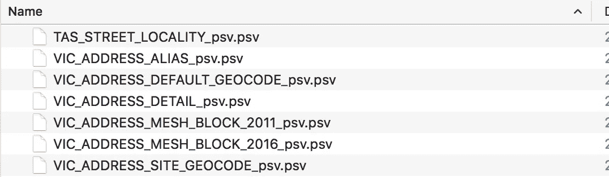
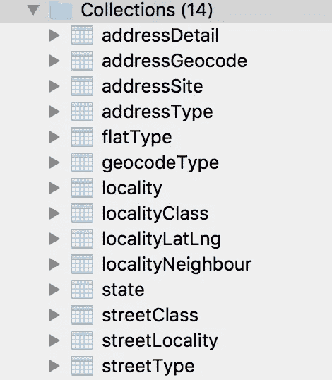

# 打开数据+节点。JS+elastic search——1300 万个街道地址，并且还在增加

> 原文：<https://medium.com/hackernoon/open-data-node-js-elasticsearch-13-million-street-addresses-and-counting-7a20f14e006f>

您可以在这里查看该项目的代码。[https://github.com/matthaywardwebdesign/aus-search](https://github.com/matthaywardwebdesign/aus-search)

几个月前，在我的最新项目——SaaS 一家物业管理初创公司——工作中，我被要求开发一个相当标准的自动完成地址输入功能。如果你和我一样，你可能会想到与谷歌地图地理编码 API 集成，然后就此收工。这正是我所做的。很简单，用 Java 写了几行。

Geocoding addresses is pretty easy, thanks Google!


One has to wonder whether it should be this easy.

## **谷歌的地理编码 API**

我只想说，谷歌的地理编码 API 很棒，不可怕(你会发现)，但仍然很好。易于实施和超快只是其中的几个例子。然而，当使用任何形式的第三方 API 时，它都有一些缺点。

*   费率限制
*   可能不容易切换到另一个提供商(不想被锁定)
*   某些领域的准确性值得怀疑
*   仅在一定程度上免费(每天约 2500 个请求)

现在，对于像验证电子商务网站的用户居住地址或显示最近的麦当劳这样的事情，大多数这些“缺点”都可以忽略，但是对于某些用例来说，它们可以产生很大的影响。对于我正在进行的项目，我们需要高度准确的地址数据，这样我们就可以做一些很酷的事情，比如生成合法的租赁协议，准确性非常重要。在我最初的测试中，谷歌地理编码 API 工作得很好，我输入了我的地址，很快就得到一个 5 条建议的列表，然而，在不太多的用户测试中，我很快发现了一个小问题。

## **嗯，我们有一个问题**

假设我住在 grave pit Terrace 342 号 12 号公寓(如果你有参考资料，我会给你加分)，有很多方法可以输入这个地址，但假设我输入的是以下地址。

```
13/342 Gravelpit Terrace
```

现在，人们可能会期望将相同的地址及其关联的元数据返回给我，但是您永远不知道将会得到什么。相反，得到的回应是:

```
342/13 Gravelpit Terrace
```

除了这个问题之外，我们还发现了一些找不到地址、公寓号码显示不正确以及许多其他小问题的情况。现在，在把这个项目留在“待办事项”列表上一段时间后，我决定最终尝试修复它。我问自己“肯定有一个开放的数据地址数据库在某个地方吗？”低下头，瞧……

## NAF

> " G-NAF 是澳大利亚所有物理地址的数据库."

啊哈！这看起来很有趣！我已经达到极限了。

现在，乍一看，有一些事情降低了我寻找免费开放解决方案的信心。第一个是单词 **products** 在 URL 中的事实，第二个是下面的行:

> “由于 G-NAF 的复杂性，PSMA 与增值经销商网络合作……”

我几乎离开了页面，直到我在页面的侧边栏发现了这个美丽的小句。

> *G-www.data.gov.au 与行政区的界限也可从*[](http://www.data.gov.au)

**好了，现在我们有进展了！看起来正是我们需要的。一位 Reddit 用户**称赞 B** 总结了我发现数据集非常好的激动心情…**

> **“我们要为访问其中一部分数据支付一笔相当于 kton 的费用”**

**所以我下载了相当大的 **1.39gb** zip 文件打开它，发现它是由大约 180 个管道分隔值文件组成的，他们可以再次说“复杂的性质”，这是肯定的。但是谁不喜欢挑战呢。**

****

**Too many files**

## **这里有大量的数据**

**首先，我想将数据转换成更容易理解的形式，这样我就可以将数据简化成正确的形式，并去掉不适用于我的用例的属性。知道我的最终目标是索引文档后，我决定解析文件并将每个文档插入到 Mongo 数据库中。虽然关系数据库可能更适合这项任务，但当我知道我想要的最终目标是每个地址有一个单独的文档，而非关系数据库完全符合这一要求时，我不想花时间设置模式。**

**代码是这样的…**

**实际上要复杂一点，因为我将一些数据标准化，然后分批插入，但你会发现偏差。因此，我使用 Docker 的强大功能快速创建了一个 MongoDB 实例，并运行了我的节点脚本，过了一会儿(最初花了很长时间，直到我发现批量插入要快得多)，我最终将所有数据文件很好地导入了 Mongo 数据库。**

****

**Getting better but lots and lots of collections**

**现在，数据的格式变得更加用户友好，我可以浏览数据并找到数据的属性和部分，我需要将所有这些数据简化为一种格式，以便为搜索做好索引。正如你在左边看到的，许多集合是相互关联的。例如，addressDetail、addressGeocode、addressSite 和 addressType 都与单个地址的属性相关。**

**基于此，我决定将数据简化为 4 个集合**

*   **地址**
*   **街道**
*   **位置**
*   **状态**

**地址集合包含来自街道、地点和州集合的数据。**

**现在，我已经将数据转换为更加用户友好的形式，并且已经确定了要丢弃哪些数据，以及需要从不同部分提取哪些数据来创建大约 180+文件数据集的更简化版本，我可以使用另一个节点脚本来处理数据。**

## **快速补充说明**

**毫无疑问，读完这篇文章后，有人会问我“你为什么使用 Node？JS，语言 X 要好得多”，毫无疑问，可能有很多更好、更快的语言来进行数据处理。然而，我非常相信使用你最熟悉的[工具](https://hackernoon.com/tagged/tool)，最近我写了很多 [Javascript](https://hackernoon.com/tagged/javascript) ，感觉这是一个快速简单的解决方案。**

****

**[https://xkcd.com/378/](https://xkcd.com/378/)**

## **回到代码**

**所以现在我已经弄清楚了我想要的数据格式，我开始编写另一段代码，把所有的集合简化成几个。**

**这是进行简化的一小段代码。我真的很喜欢我的解决方案，所以我想我应该快速浏览一下。**

**例如，我创建了几个 ES6 类来表示数据`Locality`，以及几个助手类，如`Simplifier`。在上面的例子中，我的输入集合是`locality`,输出集合是`LocalitySimple`,顾名思义，这是一个地方(城镇的别称)的简化版本。**

**我们正在读取的集合中的每一个文档都被传递到提供的函数中，在那里我对它进行简化，并从其他集合和地方提取我需要的数据，最后用简化的文档调用`resolve`函数。然后将其插入到新的简化集合中。**

**我在所有数据上运行我的脚本，过了一段时间……**

## **终于有好数据了！**

**在简化了我们所有的数据之后，我们现在有了一个地址集合，其中的数据是一种结构格式，所有的属性都在一个点上。**

****注意:**此地址是随机选取的，为简洁起见，一些字段已被删除。**

**最后，我们现在可以为大约 1350 万个地址建立索引进行搜索。**

## **是时候搜索了**

**现在我已经得到了澳大利亚几乎每个地址的详细信息，我所要做的就是把它编入索引以便搜索。对于这个项目的这一部分，我决定使用 Elasticsearch。**

**[](https://github.com/elastic/elasticsearch) [## 弹性/弹性搜索

### elastic Search——开源、分布式、RESTful 搜索引擎

github.com](https://github.com/elastic/elasticsearch) 

顾名思义，GitHub repo 的描述表明 Elasticsearch 非常适合搜索数据。在这个项目之前，我没有用过它，所以我非常想尝试一下。

让 Elasticsearch 运行起来就像在我的`docker-compose.yml`文件中添加几行代码并运行`docker-compose up`一样简单。天哪，我爱码头工人！

剩下的唯一一步是再次将所有简化的地址批量导入到 Elasticsearch 中，并让它对它们进行索引。大约一个小时后，我终于有了我想要实现的东西，一个完全可搜索的、超快的澳大利亚地址数据库，带有一个超级简单的 REST API，使得查询所有 1350 万条记录像对下面的链接发出一个 GET 请求一样简单。

```
http://localhost:9200/address/singleAddress/_search?q=address_here
```

## 最终注释

通过开源软件和开放数据集的结合，我能够用谷歌地理编码 API 解决我们团队的问题，同时为我们的用户提供更好的用户体验和更高质量的数据。所有这些都不依赖于第三方提供商。

随着世界各地许多政府开始意识到发布开放数据对他们的企业和公民的好处，我迫不及待地想看到我们在未来几年能够实现的东西！

## 想看看代码吗？

这个项目中使用的所有代码都可以在 GitHub 上获得

 [## matthaywardwebdesign/aus-search

### aus-search -一个节点 JS 脚本的集合，用来创建澳大利亚地址的弹性搜索索引。

github.com](https://github.com/matthaywardwebdesign/aus-search) 

## 与我联系

[](https://www.linkedin.com/in/matt-hayward-6786a5a5/) [## 马特·海沃德|领英

### 福克斯和李是一个屡获殊荣的墨尔本设计工作室，专门从事网站设计和开发，品牌…

www.linkedin.com](https://www.linkedin.com/in/matt-hayward-6786a5a5/) [](https://github.com/matthaywardwebdesign) [## 马特·海沃德

### matthaywardwebdesign 有 23 个可用的存储库。在 GitHub 上关注他们的代码。

github.com](https://github.com/matthaywardwebdesign) 

感谢阅读！

*采用澳大利亚联邦根据* [*开放地理编码国家地址文件(G-NAF)最终用户许可协议*](https://data.gov.au/dataset/geocoded-national-address-file-g-naf/resource/09f74802-08b1-4214-a6ea-3591b2753d30) 授权的 G-NAF PSMA 澳大利亚有限公司开发。

[](http://bit.ly/HackernoonFB)[](https://goo.gl/k7XYbx)[](https://goo.gl/4ofytp)

> [黑客中午](http://bit.ly/Hackernoon)是黑客如何开始他们的下午。我们是 [@AMI](http://bit.ly/atAMIatAMI) 家庭的一员。我们现在[接受投稿](http://bit.ly/hackernoonsubmission)并乐意[讨论广告&赞助](mailto:partners@amipublications.com)机会。
> 
> 如果你喜欢这个故事，我们推荐你阅读我们的[最新科技故事](http://bit.ly/hackernoonlatestt)和[趋势科技故事](https://hackernoon.com/trending)。直到下一次，不要把世界的现实想当然！

**