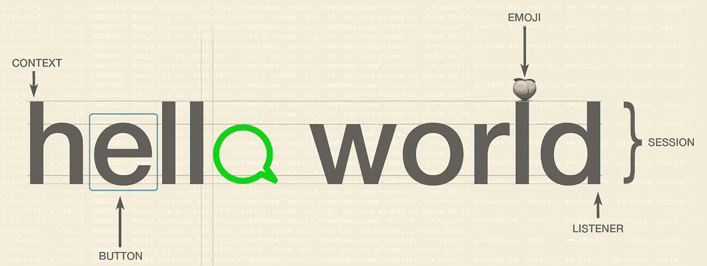
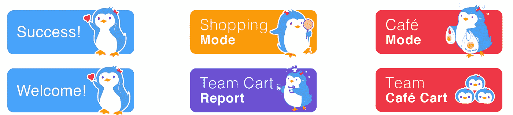
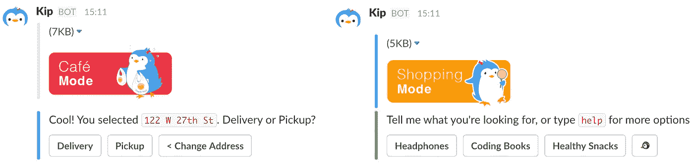
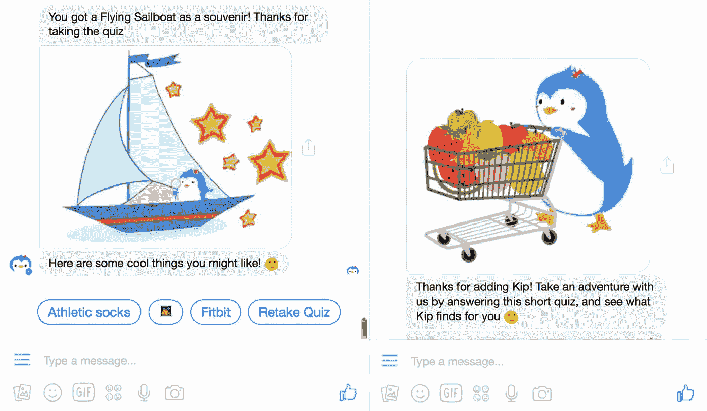
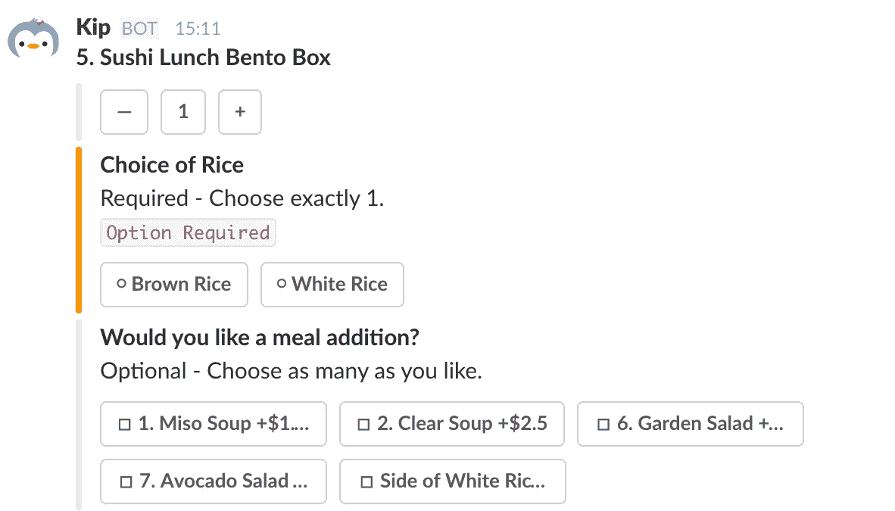
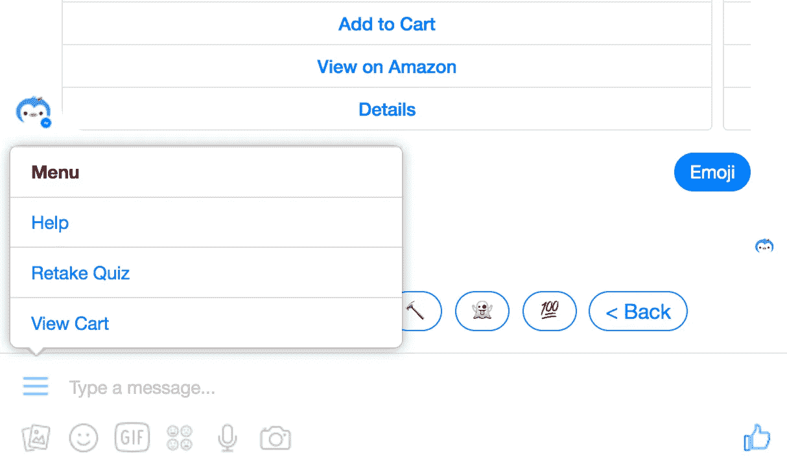
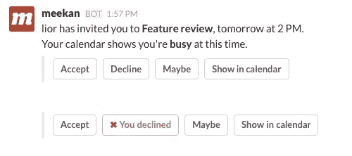

# 聊天 UX 的开放设计标准

> 原文：<https://medium.com/hackernoon/open-design-standards-for-chat-ux-f9f786b3a68e>

*让机器漂亮地说话*

随着消息领域的出现，初创公司如雨后春笋般涌现，以应对跨多个消息平台开发聊天机器人的挑战和复杂性。像 [Dexter](https://rundexter.com/) 、 [Reply.ai](http://www.reply.ai) 、 [Manychat](https://manychat.com/) 、[Pandora bot](http://www.pandorabots.com/)、 [Message.io](http://message.io/) 、 [Botkit](https://howdy.ai/botkit/) 等初创公司正在解决加速部署所需的技术开发标准，而像 [Rivescript](https://www.rivescript.com/) 这样的开源标记已经帮助创建了更丰富的交互。

在 Kip，我们首先关注的是用户，并设计大规模的最佳 UX 体验。我们为对话 UX 提出了一套最佳实践设计标准，并以我们在不同平台上的对话商务中的经验为例。

我们的目标是开发人员和设计人员都可以利用它来进一步设计聊天 UI 元素，为用户创造更好的体验。

# 作为谈话标志的贴纸

在聊天中，人们以单一的连续流交谈。这可能会让用户感到困惑，因为信息隐藏在持续不断的文本流中。新用户将不得不向上滚动以查看以前的响应，或者不断地向机器人键入 *help* ，这会中断对话流。

我们的设计解决方案是使用贴纸——一种流行的聊天互动方式——并在对话的不同部分将它们作为“地标”。这意味着用户可以离开对话，回到对话，快速浏览文本流，找出他们在哪里。

这方面的一个例子是模式标签。这些标签出现在每种对话的开头，让用户知道期待什么样的体验。

priming the user for different types of shopping experiences

例如， **Kip** **Café是一种*服务*购物体验**，用户可以购买一种服务——在这种情况下，它是一个团队的送餐和点餐服务。

相比之下，**标准 Kip 购物是一种*项目*购物体验**，用户可以购买不同类型的商品，如包装好的零食、电子产品、书籍等等。

贴纸也可以用来从一种体验过渡到另一种体验。我们在 Messenger 中使用贴纸来显示购物体验入门(Buzzfeed 式测验)的结束:

# 用对话形式投票

聊天机器人正处于实用的早期阶段。为了开发更好的产品，拥有表单或调查功能对于收集反馈至关重要。对此，我们设计了对话形式。

可对话表单是内嵌的更新聊天对话，带有类似 HTML 的元素，如复选框、复选标记、单选按钮和对话按钮形式的必填*字段的颜色编码错误处理。

在线更新表单是对话体验中极其重要的一部分，因为大多数用户不希望受到多条消息和通知的轰炸。

特别是在像客户反馈调查这样的事情中，最好是将它作为一个单独的消息，在它自己内部更新，而不是每次用户选择一个响应就发送一个通知的多个消息。

# 持久菜单按钮

当你浏览一个网站或应用程序时，通常会有一个汉堡菜单、底部标签或某种目录来导航。你不必记得那么多，因为你可以随时点击'*回*或'*家*。在对话 UI 中，您受到可以发送回用户的消息的约束和限制。**没有菜单。**

经过多次反复试验和用户反馈，我们想出了一个“主页”按钮。这是一个非常简单的设计方案。在每个 Kip 消息的底部，我们有一个持续存在的企鹅表情按钮**。当你点击它时，它会打开一组菜单选项:查看购物车、设置、成员和返回。**

让一个按钮在所有消息中持续存在意味着用户可以在对话的任何部分随时改变偏好*而不需要*向上滚动、耐心等待或记住特定的超级用户命令。

对于 Facebook Messenger，他们在左下角有一个**内置持久菜单**。他们的持久菜单是一个位于文本区域而不是消息中的弹出菜单，所以当用户点击它时，你要小心菜单弹出菜单后面的消息内容。正如你在下面的例子中看到的，我们保持了主要的体验，集中在菜单中的*帮助*、*入职*和*查看*、*购物车*，而表情符号修改被隐藏在后面。

在这种情况下，您需要考虑信息层次结构。虽然持久菜单是隐藏的(二次交互)，但当点击时，它也在所有连续消息信息的前面或上面。因此，如果你有一个包含大量行动号召的图片的转盘，你应该确保点击弹出菜单不会“覆盖”或偏离主要的行动号召。

如果您有任何反馈或建议，或者在创建聊天机器人时发现了一个关键的 UI 元素，[请让我们知道](mailto:hello@kipthis.com)！我们将尽可能更新本文档，让它成为设计消息传递体验的有用垫脚石。

**其他创业公司的例子:**

[Meekan](http://meekan.com) 使用类似的表单类型来确认消息中的日历事件。他们的表单没有复选框样式的按钮符号，但是 x 标记和红色用于表示拒绝邀请。

[Kip](http://kipthis.com) 是一只人工智能企鹅，帮助你收集和协调团队的购物订单。通过点击下面的按钮来尝试 Kip 松弛:

Push this button

如果你喜欢阅读，请推荐💚

> [黑客中午](http://bit.ly/Hackernoon)是黑客如何开始他们的下午。我们是 [@AMI](http://bit.ly/atAMIatAMI) 家庭的一员。我们现在[接受投稿](http://bit.ly/hackernoonsubmission)并乐意[讨论广告&赞助](mailto:partners@amipublications.com)机会。
> 
> 如果你喜欢这个故事，我们推荐你阅读我们的[最新科技故事](http://bit.ly/hackernoonlatestt)和[趋势科技故事](https://hackernoon.com/trending)。直到下一次，不要把世界的现实想当然！

