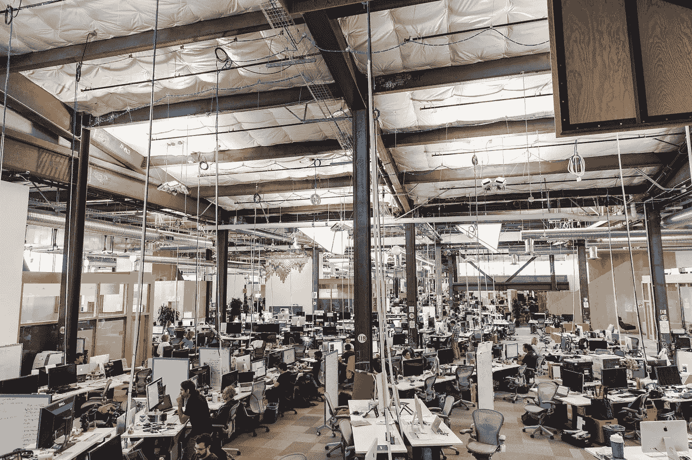

# 这就是为什么开放式办公室文化可能不适合你的团队

> 原文：<https://medium.com/hackernoon/open-office-open-distractions-7b1035c01943>

开放式办公工作区。他们说，这是团队合作的一大好处。但真的是这样吗？最近我在 Twitter 上看到很多讨论开放式办公室趋势的文章。

作为一名软件工程师，我习惯于和我的同事在一个开放的空间工作。我一直在不同规模的团队中工作，也在许多不同类型的办公楼里工作过。

2015 年 8 月，布雷克·索恩已经在我的博客上写了一篇文章，内容是开放式办公室的趋势可能不适合你的公司。我完全同意他的想法，即开放式办公室只在有志同道合的同事的环境中工作。

One of the open floors at the Facebook HQ

在我作为一名工程师的所有时间里，从实习到今天，我一直和我的团队在开放的空间里工作。在我职业生涯的初期，这是在一个开放的回音(旧车库)空间，有一个大约 20 人的团队。工程师、支持、销售、财务，每个人都共享同一个开放空间。
这是个好地方，但每次电话铃响都让我分心。这在开始时还不错，但是让我分心的事情从一天几个电话增加到一百多个！

一两年后，我们从空地搬到了一个典型的阿姆斯特丹多层运河屋。这迫使我们将团队分开，因此我们为工程师们准备了一个专用房间。这对于福克斯来说是一个巨大的进步！没有其他部门和行人的干扰。房间非常安静祥和。

> *被开发价值所吸引的人注重分析、基于系统的思维和平静的环境。放在真空中，它们会维持这种环境。*

在那之后的几年里，我作为一名内部自由开发人员在几个地方工作过，我可以诚实地说，开放式办公空间确实有效，但有一些条件。

把角色相同的人放在一起。不要混淆你的部门或强迫他们在同一个房间工作。当然，人们会工作，但是他们的注意力持续时间会更短，完成的工作也会更少。

正如布莱克在他的文章中所说:

*被发展价值所吸引的人善于分析、基于系统的思维和平静的环境。放在真空中，它们会维持这种环境。*

是我们这些讨厌的销售和营销人员把事情搞砸了。我们无法摆脱死刑，但我们可以和任何人交谈。把我们都放在一个没有隔板的房间里，这正是我们要做的。

这些天，我在一家营销公司([温室集团](https://www.greenhousegroup.com))工作，为大公司开展(在线)营销活动，我是 [LemonPI](http://lemonpi.io) 的软件工程师，这是一个内部开发的 SaaS 应用程序，允许广告商基于用户背景开展横幅广告活动。

在这里，在温室集团，我们都工作在几个开放的空间与封闭的会议室的部门。直到几个月前，我们还在一个单独的房间里工作，那里只有两个 scrum 团队紧密合作。自从我们搬到新的楼层，我注意到我的注意力持续时间比以前短了很多。如今，我们被路过的设计师、营销人员和商人包围着，他们向我们提问，在会议室和空地上开会和交谈。

老实说，我不得不承认，我们失去了真空，浪费了很多注意力和精力。对我来说，这是一个很好的学习点，可以再次尝试在一个封闭的办公空间工作(比如在会议室工作半天)，并阻止我集中注意力，尽管这可能有点颠倒了。

One of the open floors at my current office at [Greenhouse Group](http://www.greenhousegroup.com)

在你们评论我必须买一个(降噪)耳机之前，我想指出，我已经/一直有一个多显示器设置，并拥有/佩戴一个好的[降噪耳机](https://www.bose.nl/nl_nl/products/headphones/over_ear_headphones/quietcomfort-25-acoustic-noise-cancelling-headphones-apple-devices.html) **。虽然这通常不足以让我专注于日常工作，但我不喜欢整天戴着耳机。**

你的工作环境如何？你也遇到过这些问题吗？请与我分享，这样我们可以学习和改善我们的工作生活平衡！

> [黑客中午](http://bit.ly/Hackernoon)是黑客如何开始他们的下午。我们是 [@AMI](http://bit.ly/atAMIatAMI) 家庭的一员。我们现在[接受投稿](http://bit.ly/hackernoonsubmission)并乐意[讨论广告&赞助](mailto:partners@amipublications.com)机会。
> 
> 如果你喜欢这个故事，我们推荐你阅读我们的[最新科技故事](http://bit.ly/hackernoonlatestt)和[趋势科技故事](https://hackernoon.com/trending)。直到下一次，不要把世界的现实想当然！

