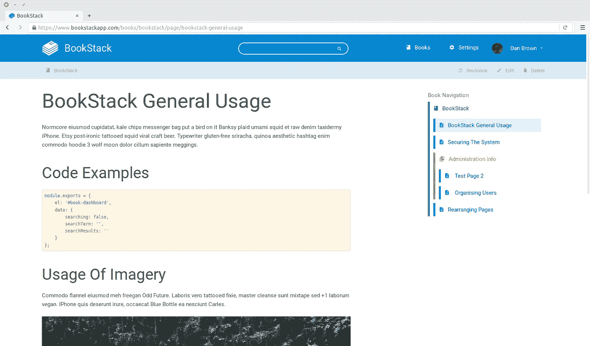
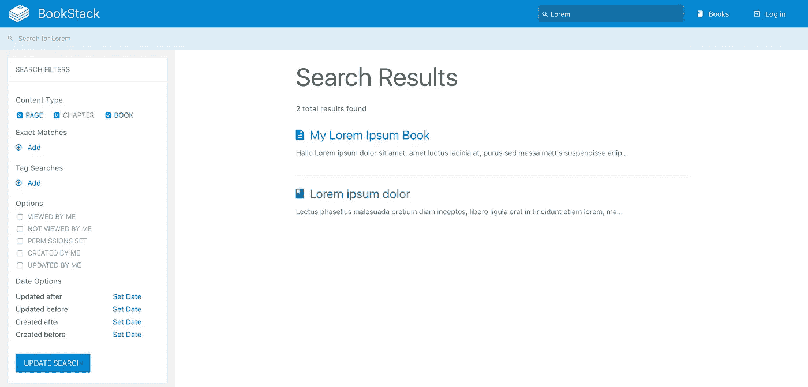
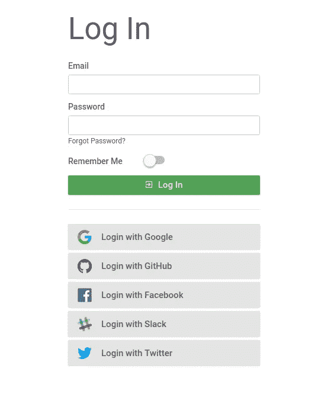
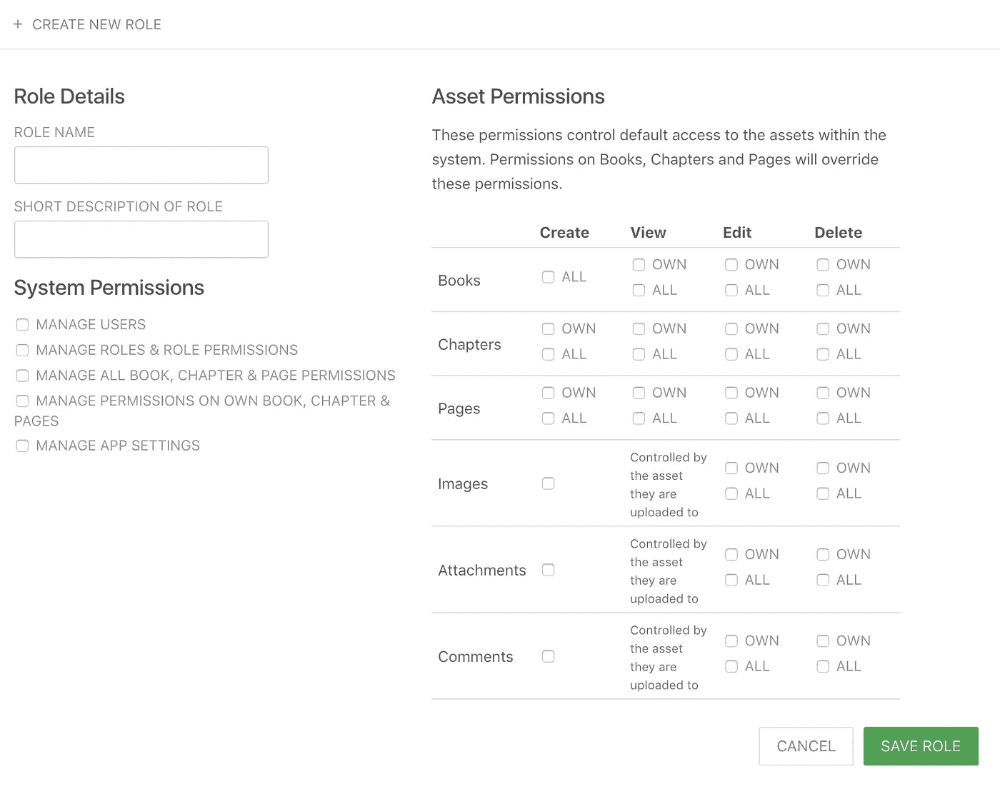

# 开源评论——book stack

> 原文：<https://medium.com/hackernoon/open-source-exploration-bookstack-4d242c0ccbb2>

# 开源评论系列

有很多伟大的[开源](https://hackernoon.com/tagged/open-source)项目，但是安装、配置和学习新系统的耗时过程甚至不能保证软件能够支持你的用例，这可能是产生摩擦的主要原因。

开源回顾系列的目的是深入不同的开源项目，这样读者就可以了解不同开源软件的特性集和功能，而不必花时间自己去弄清楚。

# BookStack —文档管理平台

我们正在看 [BookStack](https://github.com/BookStackApp/BookStack) ，一个管理你的文件的平台。它允许你将你的工作分成三组:书籍、章节和页面。这提供了一个非常简单但强大的组织策略。 [BookStack](https://hackernoon.com/tagged/bookstack) 是 Atlassian 的 [Confluence](https://www.atlassian.com/software/confluence) 或其他文档平台的替代解决方案。

View of a page in a book, navigation seen on the right.

# 项目概述—截至 2017 年 12 月 2 日

> 一个用 PHP & Laravel 构建的创建文档/维基内容的平台—[https://www.bookstackapp.com/](https://www.bookstackapp.com/)

存储库—[https://github.com/BookStackApp/BookStack](https://github.com/BookStackApp/BookStack)

创建者— [ssddanbrown](https://github.com/ssddanbrown)

首次提交—2015 年 7 月 12 日

最新提交—2017 年 11 月 19 日

星数— 938 ( [点击和⭐️本！](https://github.com/BookStackApp/BookStack))

提交数量— 804

# 装置

## 方法 1 —手动安装:[遵循这些说明](https://www.bookstackapp.com/docs/admin/installation/)

## 方法 2 —自动安装:[在没有信用卡的情况下在 ServiceShop 上部署 book stack](https://serviceshop.io/service-catalog/2/request)

# 主要特征

## 简单的文档管理

BookStack 的目的是试图简化组织和管理内容的过程。通过将您的内容放入书籍、章节和页面中，它可以让您对所有文档进行有组织的概述，而不会让您感到头痛。您可以使用 WYSWIG 编辑器直接在系统中添加文档，并通过点击按钮导出为 PDF/HTML/TXT。

## **强大的搜索**

很多平台都被拙劣的搜索工具所阻碍。BookStack 不在其中。由于其简单的架构，BookStack 的搜索非常全面，只需要一个简单的界面就可以启动。按页面、章节、标签、日期等过滤。

Searching allows for tags, dates, and type filtering

## 白色标签定制

BookStack 提供了品牌和定制应用程序的能力。如果您不太喜欢默认主题，后端还支持创建定制 HTML(用于 intercom 之类的集成)或 CSS 覆盖的能力。

## 集成点

*   **LDAP 认证—** LDAP 是一种用于认证用户的协议，是 SSO(单点登录)的常用解决方案，BookStack 可以使用 LDAP 而不是自己的数据库来认证用户。
*   **社交登录—** [BookStack 支持登录众多网络](https://www.bookstackapp.com/docs/admin/social-auth/)包括 Google、Twitter、Github、脸书、Slack、AzureAD。

Social Login Capability

## 用户管理

BookStack 支持用户注册和分配不同权限角色的能力(查看者、编辑者、管理员)。当大型组织有许多员工或实习生创建、编辑和查看相同的内容，并且希望限制每个用户可以做的事情时，他们会发现这很有用。

BookStack has a powerful Role based access control system

# 谁应该考虑使用 BookStack？

我认为 BookStack 非常适合小型企业或自由职业者，他们在文档管理方面寻求极其简单的东西。如果你正在寻找复杂的工作流程和与项目管理的集成，BookStack 不适合你。BookStack 擅长的是在你的文档之上添加一些简单的抽象，在大多数情况下，这与 Confluence 或 MediaWiki 这样的复杂系统做得一样好。

# 结论

BookStack 提供了很多简单的文档管理。由于它得到了积极的维护，我期待着看到这个令人敬畏的开源项目将走向何方。试试 BookStack out，别忘了在 Github **上 [**星它！**](https://github.com/BookStackApp/BookStack)**

# [点击此处，无需信用卡即可在 ServiceShop 上部署 book stack](https://serviceshop.io/service-catalog/2/request)