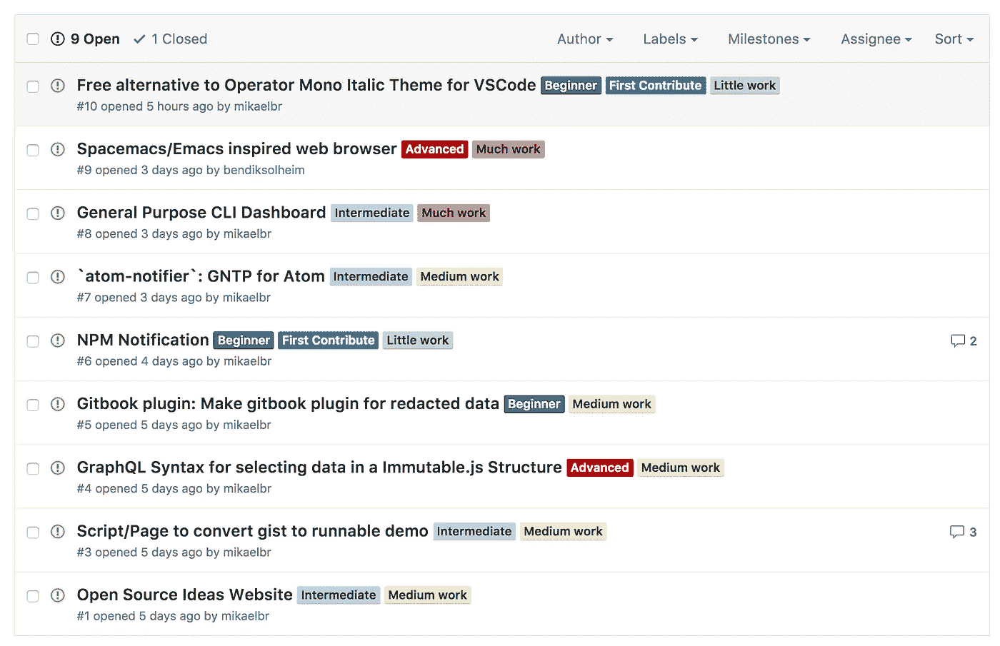

# 开源思想倡议

> 原文：<https://medium.com/hackernoon/open-source-ideas-initiative-ca747121ac34>

开源不仅仅是公开源代码。它是关于一个集体社区走到一起解决问题，推动行业向前发展。为了实现这一点，我们需要让更多的人参与到开源开发中来，并鼓励开源思维。我认为，做到这一点的一个方法是降低新的和有经验的开发者开始使用[开源](https://hackernoon.com/tagged/open-source)的门槛。我的一个假设是，如果一个开发者维护开放项目，他们更有可能贡献并尊重其他开源项目。

为了检验这个假设，我们需要帮助更多的人起步，跨越最初的障碍:做什么。我认为有很多人对做业余项目和为开源世界做贡献感兴趣，但不知道从哪里开始。另一方面，我们有许多充满想法的开发商，但缺乏时间和资源来实现它们。我建议我们走到一起，互相帮助解决这两个问题。

我有一种感觉，分享制作什么或做什么项目的好主意并不常见。这导致许多想法在一些被遗忘很久的待办事项中逐渐消失，没有人看到它被实现——或者享受实现它的快乐。最好是忽略我们对自己想法的专有感觉，将想法分享给社区——在这个过程中帮助他人。

这就是为什么我要启动[开源思想倡议](https://github.com/mikaelbr/open-source-ideas)。这是一个知识库，任何人都可以在这里分享他们对新项目的想法。任何人都可以加入进来，为一个想法而工作——甚至与他人合作。你也可以就最初的想法展开讨论，以获得对已实施项目的反馈，让初学者感觉更舒服。为了改善开源世界，我们以身作则。

因此，如果你有任何想法想要分享，请过来[发布新一期](https://github.com/mikaelbr/open-source-ideas/issues/new)。如果你正在寻找想法或者想要开始做开源，有一些[想法已经在回购上发布](https://github.com/mikaelbr/open-source-ideas/issues)。它们应该按照难度和工作量来分类，以便更容易指导你选择最适合你的项目。

Categorised ideas of the Open Source Ideas Initiative

阅读更多关于该计划的信息，并在 https://github.com/mikaelbr/open-source-ideas[帮助完成该计划](https://github.com/mikaelbr/open-source-ideas)。

> [黑客中午](http://bit.ly/Hackernoon)是黑客如何开始他们的下午。我们是 [@AMI](http://bit.ly/atAMIatAMI) 家庭的一员。我们现在[接受投稿](http://bit.ly/hackernoonsubmission)，并乐意[讨论广告&赞助](mailto:partners@amipublications.com)机会。
> 
> 如果你喜欢这个故事，我们推荐你阅读我们的[最新科技故事](http://bit.ly/hackernoonlatestt)和[趋势科技故事](https://hackernoon.com/trending)。直到下一次，不要把世界的现实想当然！

