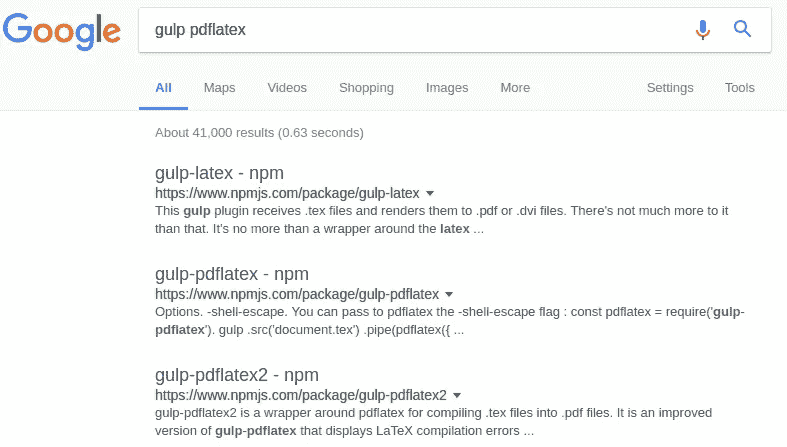
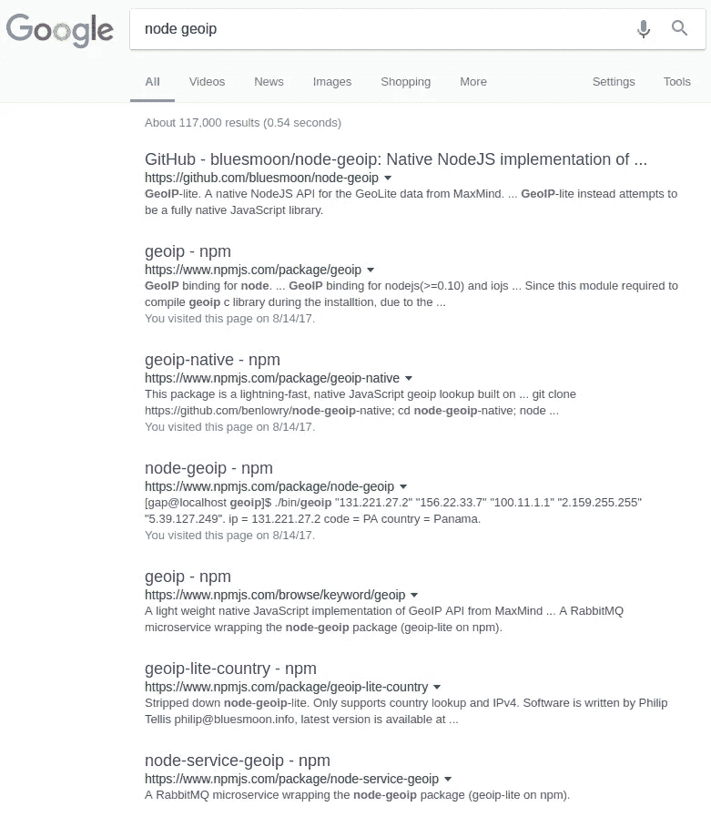

# 开源软件包有时有点糟糕

> 原文：<https://medium.com/hackernoon/open-source-packages-kind-of-suck-sometimes-19c2727bac26>

我喜欢开源社区。node.js 生态系统是一个奇妙的地方，你可以在 npm 上找到几乎所有东西的包。问题是，你可以为*找到几乎所有的*包，有时不止一个包完成同样的事情。

从最抽象的角度来看，这是开源代码最好的事情之一。任何人都可以发布任何东西，如果你不喜欢某个包或者你想要其他的东西，你可以派生出它，并根据你自己的目的修改它。这在过去被证明对我很有用。在[之前的一个帖子](https://hackernoon.com/automating-my-personal-note-taking-compilation-system-415696705657)中，我谈到了现有的 [gulp-pdflatex](https://www.npmjs.com/package/gulp-pdflatex) 包如何不能满足我的需求，所以我写了自己的版本，发布为 [gulp-pdflatex2](https://www.npmjs.com/package/gulp-pdflatex2) 。这很好，但它破坏了生态系统。如果你在谷歌上搜索 gulp pdflatex，你会找到三个匹配的包。

Searching ‘gulp pdflatex’ on Google

对于初学者来说，这可能非常烦人，因为不清楚最佳解决方案。除了包的用法略有不同之外，每个包可能有也可能没有错误或者处于损坏/过期的状态。

本周，我在做我的一个开源项目( [getnews.tech](https://github.com/omgimanerd/getnews.tech) )，我需要一个 node.js 库来处理 IP 地址的地理定位，通常称为 geoip。

Searching ‘node geoip’ on Google

废话。

让我们浏览一下:

*   [GeoIP](https://www.npmjs.com/package/geoip):libgeoip C 库的一个薄薄的包装，据所有者承认，它有内存泄漏，不应该选择它而不是 [node-geoip](https://www.npmjs.com/package/node-geoip) 。
*   [geoip-native](https://www.npmjs.com/package/geoip-native) :使用免费 MaxMind 数据库的本地 JavaScript geoip 库。我用了一段时间，直到我意识到软件包提供的 MaxMind 数据库已经过时了。
*   [node-geoip](https://www.npmjs.com/package/node-geoip) :原生 JavaScript 库，使用预打包的 CSV 文件查找 ip 地址，面临与 geoip-native 相同的问题。
*   [geoip-lite-country](https://www.npmjs.com/package/geoip-lite-country) :“剥离下来的节点-geoip-lite”。哦，现在还有 [node-geoip-lite](https://www.npmjs.com/package/node-geoip-lite) ？
*   [node-service-geoip](https://www.npmjs.com/package/node-service-geoip) :“包装 node-geoip 包的 RabbitMQ 微服务(npm 上的 geoip-lite)。”还有一个 geoip-lite 封装？

这里至少有 7 个处理地理定位的包，快速搜索 npm 包目录会发现更多。

Packages with the keyword ‘geoip’ on npmjs.

我说了一把吗？我指的是更多的性交。这证明是一个巨大的头痛给我。也不是所有的包都有好的输出文档，所以我没有立即排除它，而是安装它，试用它，如果它不符合我的目的，就删除它。

因为我希望能够从 IP 地址中确定国家和时区，所以我最终满足于使用 [maxmind](https://www.npmjs.com/package/maxmind) 包，这样我就可以提供我自己的 maxmind 二进制数据库，并独立于该包更新它。([这是为了检测 getnews.tech 的用户时区](https://twitter.com/omgimanerd/status/897386355818233856))

这只是困扰生态系统的一个问题的小小例证。它不仅仅局限于 npm 和 node.js，快速搜索“pip geoip”还会显示一些不同的 Python 包(尽管问题没有 npm 那么糟糕)。虽然 npm 确实包含了一个大的包库，可以做任何你能想到的事情，但是对它们进行分类可能会很混乱。

我不知道解决这个问题的好方法，但也许向社区展示这一点可以让我们讨论一种建设性的方法。我们应该鼓励开发人员取消发布他们不再维护的未使用/损坏的包吗？至少，我们应该鼓励他们清楚地标记过时的或不推荐的包，这样他们在搜索结果中的排名就会降低。npm 已经允许在搜索时根据[流行度和质量](https://npms.io/about)对包进行排名，但这并没有在我寻找合适的 geoip 包时帮助我太多。

如果你喜欢听我抱怨或谈论我的代码，请考虑在 Twitter 上关注我。感谢阅读！