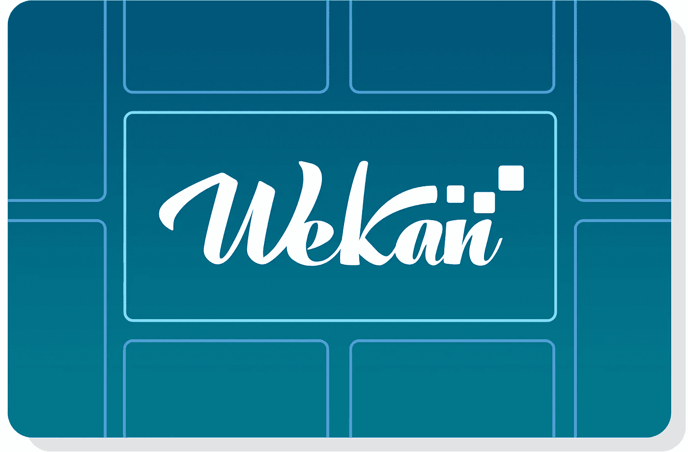
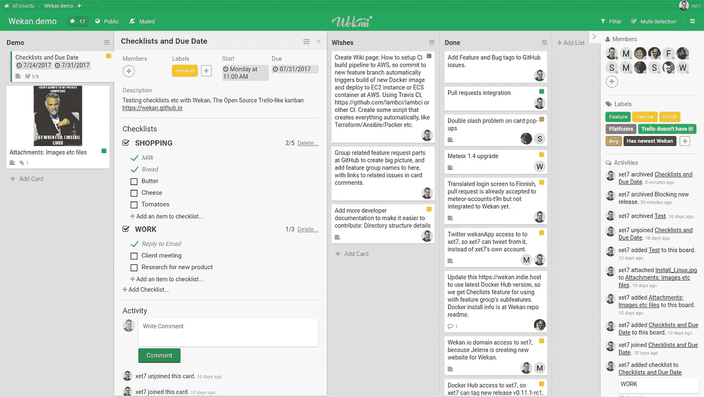
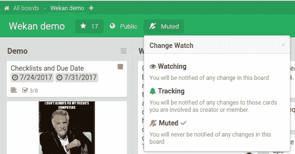
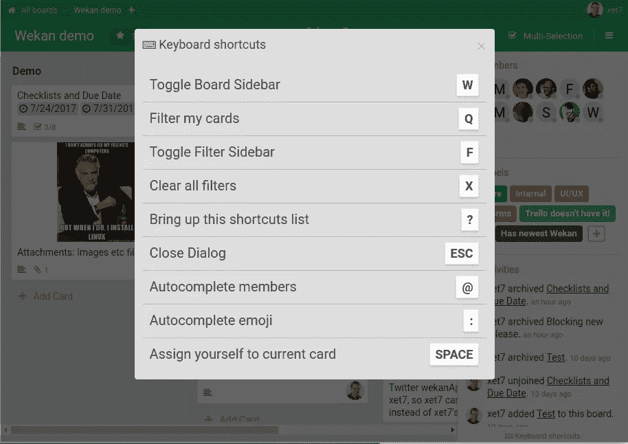
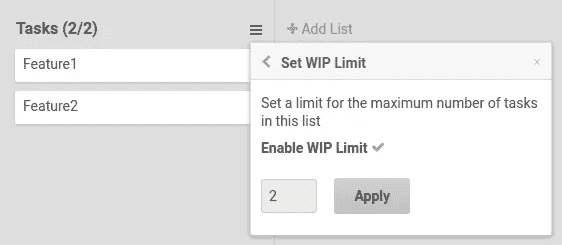

# 开源评论——Wekan

> 原文：<https://medium.com/hackernoon/open-source-review-wekan-2dd055f73f92>

# 开源探索系列#3 — Wekan

[开源](https://hackernoon.com/tagged/open-source)探索系列旨在让你深入了解各种开源[平台](https://hackernoon.com/tagged/platforms)。它们能做什么，为什么你可能想使用它们。

1.  ****—文档管理平台****
2.  ****[**依次**](/@ben_sears/open-source-exploration-countly-76b7d3c5730e) —产品分析引擎****

# ****Wekan — Trello 式看板****

****看板可以被描述为一种管理任务的方式。传统上，它是一个物理板，具有表示完成状态的列，如待办事项、进行中、完成，并且随着工作的完成，任务从左向右移动。Wekan 是一个开源应用程序，它提供了这个功能和我将深入研究的其他特性。****

********

****Wekan provides a trello style kanban board****

# ****项目概述—截至 2017 年 12 月 3 日****

## ****Github 描述****

> ****开源的类似 Trello 的看板(用 Meteor 构建)[https://wekan . github . io](https://wekan.github.io/)****

****创建者— [mquandalle](https://github.com/mquandalle)****

****维护者— [xet7](https://github.com/xet7)****

****首次提交—2015 年 5 月 12 日****

****最新提交—2017 年 12 月 2 日****

****星数—11918[(点击和⭐️这个！)](https://github.com/wekan/wekan)****

****提交数量— 1，539****

# ****开源安装****

## ****方法 1 —手动安装:[遵循这些说明](https://github.com/wekan/wekan/wiki/Install-and-Update#install-with-cloudron)****

## ****方法 2 —自动安装:[在没有信用卡的情况下在 ServiceShop 上部署 Wekan](https://serviceshop.io/service-catalog/6/request)****

# ****简单的项目管理****

****Wekan 和 Trello 等项目管理软件的吸引力在于它们背后的简单性。它只是一个巨大的棋盘，核心充满了各种完成状态的任务。****

****Wekan 提供了许多附加功能，通过许多与 Trello 或吉拉等专有软件相匹配的功能，使管理该电路板变得更加容易。****

## ****卡片跟踪****

****Wekan 允许你“观察”和跟踪你认为重要的牌。这将他们放在一个特殊的“监视”板上，显示所有你标记的牌。当您有大型项目和由许多开发人员开发的数百张卡片时，这非常有用。作为一个项目经理，能够建立一个你的高影响力和高重要性卡片的董事会是一个非常有价值的工具。当发生某些变化时，如卡片被移动或添加了评论，观看卡片也可以触发电子邮件通知。****

********

## ****快捷键****

****当我发现有快捷键的应用时，我总是很高兴。我个人发现，能够用键盘控制应用程序极大地提高了我的工作效率和速度。****

********

****Superusers love keyboard shortcuts for the speed and increased productivity****

## ****从特雷罗进口****

****你在用 Trello，想开始用 Wekan 吗？不要担心手动移动现有的项目、电路板和任务——Wekan 支持从 Trello 导入，因此您可以轻松地将所有项目数据导入 Wekan。****

## ****WIP 规则****

****拥有[在制品限制](https://pm.stackexchange.com/a/11303)是在使用 Kanaban 董事会时实施项目管理最佳实践的好方法。如果你只能有一定数量的任务在进行中，而你遇到了阻塞，你将被迫把那个任务转移到一个更适合的状态，比如“阻塞”，然后你可以把另一个任务转移到进行中。****

********

## ****降价支持****

****Markdown 是一种格式化文本的好方法。它可以被版本控制，表达复杂的东西，比如表格和代码片断，并且定义良好。Wekan 允许您在卡片中嵌入 markdown，这样您就可以在项目管理中随心所欲地表达自己。****

## ****文件附件****

****像任何好的项目管理系统一样，Wekan 把文件附件作为卡片的主要焦点。很多时候，卡片会产生文件形式的可交付成果，当你处理一个任务管理系统时，你希望能够简单有效地跟踪你的可交付成果。****

## ****过滤****

****凭借全面的标签系统和强大的搜索功能，项目经理可以轻松找到他们正在寻找的数据。使用 Wekan，您可以按截止日期、用户、标签、状态等进行过滤。****

# ****Wekan 适合你吗？****

****Wekan 非常适合喜欢看板的项目经理。虽然缺乏吉拉复杂的工作流程，但它在功能丰富性方面与特雷罗相当匹配，甚至更易于使用和管理电路板。如果你目前正在使用 Trello——考虑试用 Wekan，因为它甚至有一个导入功能，这样你就可以立即启动并运行你当前的项目。****

# ****结论****

****Wekan 是一个强大的看板应用程序，其功能与 Trello 等专有商业产品相匹配。我知道我尝试过很多项目管理软件，就完善度、功能性和易用性而言，Wekan 是最好的软件之一。试一试，在 Github 上开始使用吧！****

# ****[点击此处无需信用卡即可在 ServiceShop 上部署 Wekan](https://serviceshop.io/service-catalog/6/request)****