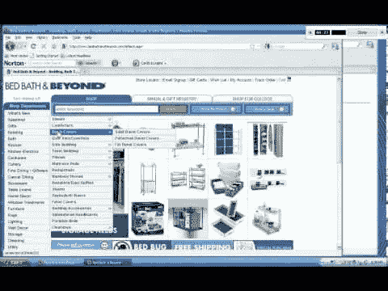

# 开放式与封闭式用户界面

> 原文：<https://medium.com/hackernoon/open-vs-closed-user-interfaces-46daf6e9a1b4>

或者为什么你手机上的所有东西看起来都很糟糕

一个*响应*的网站或应用了解不同的屏幕尺寸和分辨率，为不同的设备创造不同的体验。

一个应用程序没有响应式设计的原因有很多，但我今天想说的是开放与封闭 UI 的问题。

开放的用户界面，例如 web 标准，允许元素的动态和相对定位，理想地将本地组件和定制内容混合到一个干净的界面中。这种动态和本地组件的混合很少发生。错误通常在于布局引擎的性质(开放)，以及新组件必须如何从平台提供的牙签和胶水中不断构建。在 web 开发中，这些牙签从*表格布局*开始，然后进入 *div/css* 垃圾。在提供的预制组件之上没有抽象层:目前有 60 多个 html 标签和相当多的 css 字段。

封闭的用户界面，就像本地移动应用一样，不鼓励开放开发，而是支持定制本地库组件。这通常会导致简洁但僵硬的设计外观和感觉。如果你想要额外的东西，事情会变得非常复杂。

那么，一个人如何通过开放和封闭的平台来创建一个统一的、响应性强的设计呢？

像 React 或 Elm 这样的项目试图通过创建描述可重用语义组件的语言来回答这个问题。他们的方法非常不同，但他们的目标是相同的:构建优秀的应用程序。这说起来容易做起来难。

以在各种设备上全屏显示电影动画的问题为例。解决这个问题最简单也是最常见的方法是将电影的尺寸调整到最受约束的尺寸:高度或宽度。笔记本电脑往往宽于高，所以这至少在开发人员的笔记本电脑上运行良好！然而，将这种方法用于手机，问题突然出现了。手机有一个“方位”的概念。通过水平或垂直倾斜手机，用户希望设备重新调整内容以适应新的屏幕尺寸。对于我们的电影示例，这意味着用户可能想要水平地拿着手机，从而使用整个屏幕来播放内容。垂直方向的电影太小，看不清，但是标准的网络视频流通常以固定的垂直模式播放。忽视使用屏幕方向会导致非常糟糕的用户体验。

这是响应式设计的核心。创建专门为当前动态变化的环境定制的内容。

为了实现这一点，我们需要尚未标准化或广泛传播的抽象。这意味着原生代码要向 web 学习一点，web 也要向原生学习一点。我们需要更多的组件库，带来量身定制的体验，并将这些组件与 CSS 样式混合。这就是 [Lattice 实验 UI 框架](https://github.com/andrew-lucker/Lattice)的目标。通过从 web 标准和陷阱中获取灵感，然后将这些概念转移到一个严格的跨平台开发环境中，有望实现更高层次的东西。

当能够在移动、web 和桌面环境中实现标准且响应迅速的体验时，该项目就完成了。在面向对象的复兴过程中，许多人试图实现这些目标。然而，随着 Rust 的安全和轻微的功能，我们希望推翻过去失败的项目，并创造一些我们都可以学习的东西:一个新的 UI 和 UX 进展工具箱。