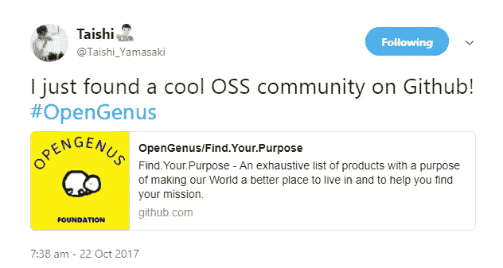
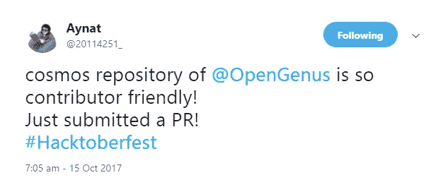
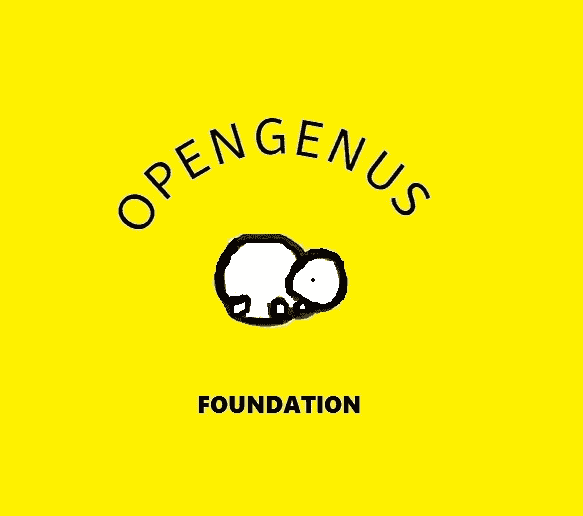
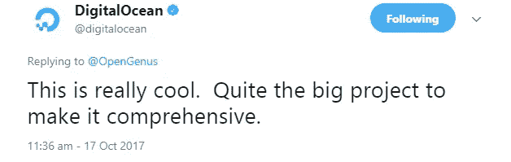

# OpenGenus:网络文明

> 原文：<https://medium.com/hackernoon/opengenus-a-civilization-on-the-web-d8978fc2fe19>

当人们聚在一起，非凡的事情就会发生。

在我看来，一个人应该获得足够的知识来领导整个人类军队从零开始奠定当前进步的基础，并用他或她的新文明改写历史。

> **OpenGenus** 是网络上的第一个文明。

[OpenGenus](http://www.opengenus.org/) 是一个大型的[社区](https://hackernoon.com/tagged/community)，趋向于大规模。它在 GitHub 有超过 1000 名贡献者，在 Slack group 有超过 500 名成员。它最近在 GitHub 上很流行，并且经常被宣称是 GitHub 上最友好的社区之一。

We love all and people love us too

不像现实世界，它没有歧视。每个人在社区中都有发言权，决策是通过集体努力做出的。他们正在解决直接影响他们生活的问题。

Everyone is everyone’s friend

线下是现实。连通性每天都在传播。他们正在为线下世界做准备。他们的目标是让人们在离线状态下也能长时间工作，让研究变得更加容易。

他们正在努力的另一个愿景是:

> 想象一个不用捐赠就能养活数百万儿童的世界

他们正致力于将网络货币化。捐款确实对人们的生活产生了影响，但是如果他们能够挖掘隐藏的潜力，那么这种影响将会增加几倍。

也有动物。如果你喜欢猫，那么你可能会喜欢 [OpenGenus](https://hackernoon.com/tagged/opengenus) 中最受喜爱的动物，它位于它的**标志**中。

OpenGenus Official Logo/ Flag

在快乐和纯真的 OpenGenus 中，恶棍确实存在。这是非常令人难过的，但幸运的是，他们人数很少，但他们留下的影响将被记住一段时间。

我们的大门(会员资格)对所有人开放了很长一段时间，这一点被利用了。为了 OpenGenus 的安全，他们关闭了他们的门，但当有人敲门时，他们会打开门(通过短信)。

他们正准备选举其领导人。一些思想领袖是好的，但其他人不喜欢它。尽管如此，举行选举是集体的决定。领导者将拥有最少的控制或权力，因为他们和我们都相信统一。

同时 [OpenGenus](http://www.opengenus.org/) 也不缺资源。他们的目标是每周种一棵树，花些时间回报社区。

这是一个有趣的一周，我很想再次和他们一起巡演。

> OpenGenus 正在为建立网络社会奠定基础。

在 [**网上抓到他们:OpenGenus.org**](http://www.opengenus.org) 、[**推特**](https://twitter.com/OpenGenus) 和 [**GitHub**](https://github.com/OpenGenus) **。**