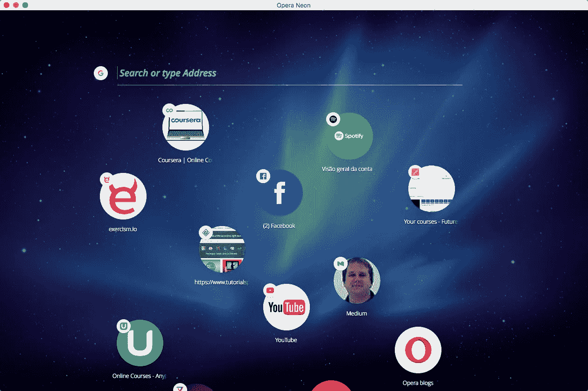

# Opera Neon::一个为网络未来而构建的概念浏览器

> 原文：<https://medium.com/hackernoon/opera-neon-a-concept-browser-built-for-the-future-of-the-web-5a26a5697650>

根据 Opera Software 的说法，虽然网络在过去二十年里发生了巨大的变化，但是网络浏览器却没有跟上新的需求。这就是为什么这家总部位于奥斯陆的公司的开发人员创造了 Opera Neon T1，这是一款为在线用户的未来需求而设计的实验性浏览器。

Neon 今天发布了 Windows 和 Mac 的免费下载，并不是为了取代 Opera 当前的浏览器，尽管 Neon 正在测试的一些新功能可能会在今年晚些时候出现在 Opera 浏览器的下一个版本中。

Neon 建立在 Blink 网络浏览器引擎的基础上，于 2013 年由谷歌、Opera 和其他几家科技公司共同发布。然而，Opera 表示，概念浏览器是从零开始开发的，旨在提供许多其他浏览器没有的新功能。

**关注内容，互动性**

“我们做的第一件事是问，‘什么真正让互联网变得伟大？’Opera 产品经理 Joanna Czajka 在一段关于 Neon 发布的视频中说道。她说，答案是网络上各种各样的内容，包括图像、视频等等。

> “我们意识到当前的浏览器不再关注这些 Web 部件，”Czajka 说。“他们对待网络就像公文包里的文件，只是让你来管理。这听起来不像是一种有趣的体验互联网的方式，对吗？”

Czajka 说，Opera 的开发者和设计者寻找“将互联网最好的部分带给人们”的方法。她说，他们的部分工作包括改变标准浏览器界面，使其对用户更具互动性。

**标签显示为“气泡”**

例如，Neon 的起始页以用户的个人桌面背景图像为特色，在右侧有一个标签“气泡”的视觉栏。与此同时，视频播放器、图片库和下载管理器出现在左侧的侧边栏中。位于顶部的是 Opera 所谓的“全新的 omnibox ”,支持开放搜索和顶级搜索引擎。

用户可以通过将网站的“气泡”拖放到右边的标签栏来添加任何新的网站。该视频播放器还允许用户在浏览其他网页时，在小屏幕上弹出视频进行播放。

另一个功能是让用户快速裁剪网页的任何部分来拍摄快照，他们可以将快照保存到浏览器的图库中，供以后查看或共享。还有一种分屏模式，可以同时并排查看两个独立的标签。

“虽然 Opera Neon 有许多新功能——以及许多你知道和喜欢的 Opera 浏览器功能——但还有一些关键功能我们没有包括在内，例如我们的原生广告拦截器、VPN 和添加扩展的能力，”执行副总裁王南钧·科龙德拉今天在公司博客上的一篇文章中写道。“原因很简单，Opera Neon 是一款概念浏览器，专为实验和游戏而打造。”

就目前而言，Neon 仍处于实验阶段，“这是浏览器未来发展的愿景，”Kolondra 补充道。然而，“我们确实计划最早在 2017 年春季将一些最好的新功能整合到 Opera for computers 中，”他说。

Opera Neon — The Future desktop browser

*最初发表于*[*【www.cio-today.com】*](http://www.cio-today.com/article/index.php?story_id=104146)*。*

> [黑客中午](http://bit.ly/Hackernoon)是黑客如何开始他们的下午。我们是 [@AMI](http://bit.ly/atAMIatAMI) 家庭的一员。我们现在[接受投稿](http://bit.ly/hackernoonsubmission)并乐意[讨论广告&赞助](mailto:partners@amipublications.com)机会。
> 
> 如果你喜欢这个故事，我们推荐你阅读我们的[最新科技故事](http://bit.ly/hackernoonlatestt)和[趋势科技故事](https://hackernoon.com/trending)。直到下一次，不要把世界的现实想当然！

