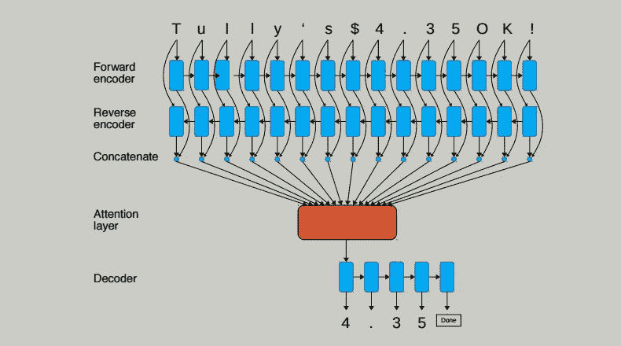

# 使用一次学习、RNN 和张量流的光学字符识别

> 原文：<https://medium.com/hackernoon/optical-character-recognition-using-one-shot-learning-rnn-and-tensorflow-4b8b0d08150b>

[光学字符识别](https://en.wikipedia.org/wiki/Optical_character_recognition) (OCR)推动将打字、手写或印刷符号转换成机器编码文本。然而，OCR 过程需要消除可能的错误，同时只从不断增长的数据中提取有价值的数据。这篇博文强调了在使用 TensorFlow 作为后端的 [Keras](https://keras.io/) 中使用[一次性注意力](https://en.wikipedia.org/wiki/One-shot_learning)机制进行令牌提取是如何有所帮助的。

 [## 光学字符识别使用一次性学习，RNN，和 TensorFlow -博客上的一切…

### 光学字符识别(OCR)将打字、手写或印刷符号转换成机器…

blog.altoros.com](https://blog.altoros.com/optical-character-recognition-using-one-shot-learning-rnn-and-tensorflow.html)