# 优化浏览器的前端

> 原文：<https://medium.com/hackernoon/optimising-the-front-end-for-the-browser-f2f51a29c572>

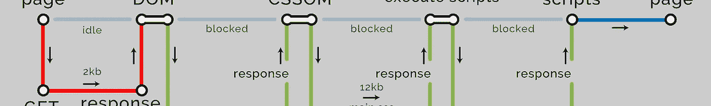

如果你在字典中查找优化(或为我们美国读者的优化)，它会说一些类似于*充分利用我们所拥有的*的东西。

接受有价值的努力和挑战。

# 背景

在 2016 年，我的整个团队有机会花一些时间对我们的代码库进行升级，这让我开始思考我们应该如何构建我们的前端。我很快意识到浏览器将是我们方法中的一个重要因素，也是我们知识中的一个同样大的瓶颈。

从那以后，我的团队有幸将大量的理论付诸实践，让我们学到了很多东西。

我也在网上和很多其他开发者交流过，也在关于优化的讲座上交流过，所以我想把我的知识传授给你们。

# 为什么要优化？

*   用户更高兴了，因为网页加载速度更快，并且可以提供更好的 UX。
*   开发人员更高兴了，因为您的代码库和架构遵循了最佳实践。
*   由于潜在的更低的跳出率和更高的转换率，业务变得更加愉快。
*   当速度和优化对 SEO 排名影响更大时，你可以在将来证明你的代码。
*   你可以帮助网络成为一个更好的地方。

# 方法

## 第一

我们无法控制浏览器或改变它的行为方式，但我们可以理解它是如何工作的，这样我们就可以优化我们提供的有效载荷。

幸运的是，浏览器行为的基本面相当稳定，[有据可查](https://developers.google.com/web/fundamentals/)，而且在很长一段时间内不太可能发生重大变化。

所以这至少给了我们一个努力的目标。

## 第二

另一方面，代码、堆栈、架构和模式是我们可以控制的。它们更加灵活，变化速度更快，为我们提供了更多的选择。

## 因此

我决定从外向内工作，弄清楚我们代码的最终结果应该是什么，然后形成关于编写代码的意见。在第一篇博客中，我们将集中讨论所有我们需要知道的关于浏览器的事情。

# 浏览器的功能

让我们积累一些知识。这里有一些我们希望浏览器运行的普通 HTML。

## 浏览器呈现页面的方式

当浏览器收到我们的 HTML 时，它会解析它，将其分解成它能理解的词汇，这在所有浏览器中都保持一致，这要归功于 [HTML5 DOM 规范](https://www.w3.org/TR/html5/dom.html)。然后，它通过一系列步骤来构建和呈现页面。这是非常高层次的概述。

1.  使用 HTML 创建文档对象模型( **DOM** )。
2.  使用 CSS 创建 CSS 对象模型( **CSSOM** )。
3.  在 DOM 和 CSSOM 上执行**脚本**。
4.  结合 DOM 和 CSSOM 形成**渲染树**。
5.  使用渲染树来**布局**所有元素的大小和位置。
6.  **在所有像素中绘制**。

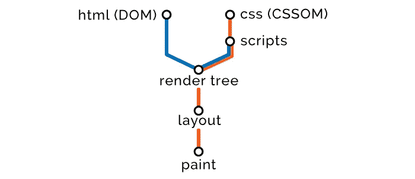

# 第一步— HTML

浏览器开始从上到下读取标记，并通过将其分解为节点来创建 DOM。

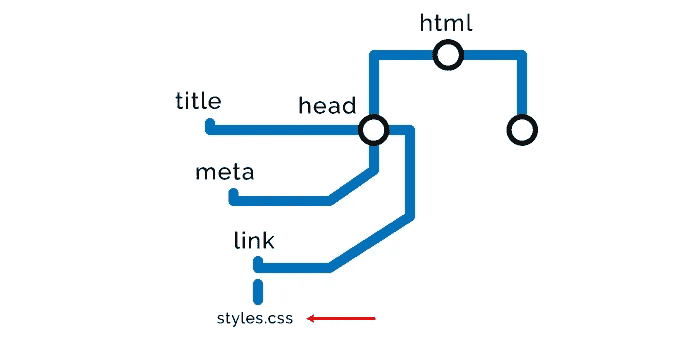

## HTML 交付优化策略

*   顶部是样式，底部是脚本

虽然这条规则也有例外和细微差别，但总的想法是尽可能早地加载样式，尽可能晚地加载脚本。这样做的原因是脚本需要 HTML 和 CSS 在执行之前完成解析，因此我们将样式放在高处，这样在我们在底部编译和执行脚本之前，它们有足够的时间进行计算。

接下来，我们将研究如何在优化的同时进行调整。

*   缩小和压缩

这适用于我们交付的所有内容，包括 HTML、CSS、 [JavaScript](https://hackernoon.com/tagged/javascript) 、图像和其他资产。

缩小删除任何多余的字符，包括空白、注释、多余的分号等。

压缩，例如 GZip，通过为代码或资产分配一个指向原始实例的指针来替换代码或资产中重复的数据。大规模压缩下载文件的大小，转而依靠客户端来解压文件。

通过这两种方法，你可以将有效载荷减少 80%或 90%。例如[仅在 bootstrap 上就节省了 87%](https://css-tricks.com/the-difference-between-minification-and-gzipping/#article-header-id-2)。

*   预加载、预取、预呈现、预连接

这四个 html 属性允许我们先发制人地加载资源或建立用户将来可能需要的网络连接。

属性允许我们预加载在当前页面导航中需要的资源。

属性允许我们为将来的导航预取资源和网络请求。

`prerender`属性在后台完全呈现页面。

`preconnect`属性预测未来的网络请求，并执行 DNS 查找、TLS 协商和 TCP 握手。

在 KeyCDN 和 CSS-tricks 上有大量关于这些非常强大的属性[的有用信息。](https://www.keycdn.com/blog/resource-hints/)

*   易接近

虽然这不会让你的页面下载更快，但它会大大提高受损用户的满意度。一定要给大家提供！在元素上使用`aria`标签，在图像上提供`alt`文本以及所有那些[其他好东西](http://www.clarissapeterson.com/2012/11/html5-accessibility/)。

使用像 [WAVE](http://wave.webaim.org/) 这样的工具来找出你可以提高可访问性的地方。

# 第二步— CSS

当它找到任何样式相关的节点时，即外部、内部或内联样式，它停止**呈现**DOM，并使用这些节点创建 CSSOM。这就是为什么他们把 CSS 叫做**渲染分块**。以下是不同类型风格的优缺点。

CSSOM 节点的创建就像 DOM 节点一样，稍后它们会被合并，但现在它们看起来是这样的。

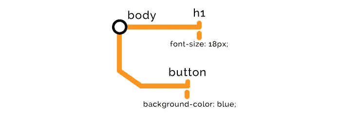

CSSOM 的构造阻碍了页面的呈现，所以我们希望在树中尽可能早地加载样式，使它们尽可能轻量级，并在有效的情况下延迟加载它们。

## CSS 交付优化策略

*   使用[媒体属性](https://developer.mozilla.org/en-US/docs/Web/CSS/@media)。

媒体属性指定了加载样式必须满足的条件，例如，是否有最大或最小分辨率？是为了屏幕阅读器吗？

台式机非常强大，但移动设备却不是，所以我们希望尽可能减轻它们的负载。我们可以先假设只提供移动样式，然后把桌面样式作为媒体的条件，虽然这不会阻止它下载，但会阻止它加载我们的页面并耗尽宝贵的资源。

*   推迟 CSS 的加载

如果你有样式，可以等到第一次有意义的绘制之后再加载和计算，例如，出现在折叠下面的内容，或者在页面有响应之前不重要的内容。在附加样式之前，您可以使用脚本等待页面加载。

这里有一个如何实现这一点的[示例](https://jakearchibald.com/2016/link-in-body/)，还有一个[示例](https://www.giftofspeed.com/defer-loading-css/)。我的团队已经非常成功地使用了 filamentgroup 的 [LoadCSS 包，我绝对推荐它。](https://github.com/filamentgroup/loadCSS)

*   特异性较低

一个明显的缺点是，随着更多的元素链接在一起，物理上有更多的数据要传输，从而扩大了 CSS 文件，但在计算具有更高特异性的样式时，也有客户端计算消耗。

*   仅交付您需要的东西

这听起来可能很傻或者很傲慢，但是如果你在前端工作过一段时间，你就会知道 CSS 的一个大问题是删除内容的不可预测性。从设计上来说，它被诅咒了要不停地生长。

为了尽可能地精简 CSS，可以使用像 [uncss](https://github.com/giakki/uncss) 包这样的工具，或者如果你想要一个网络替代品，那么就四处看看，有很多选择。

# 第三步— JavaScript

然后，浏览器继续构建 DOM/CSSOM 节点，直到找到任何 JavaScript 节点，即外部或内联脚本。

因为我们的脚本可能需要访问或操作先前的 HTML 或样式，所以我们必须等待它们全部构建完成。

因此，浏览器必须停止**解析**节点，完成构建 CSSOM，执行脚本，然后继续。这就是为什么他们称 JavaScript 为“**解析器阻塞**”。

浏览器有一种叫做“预加载扫描器”的东西，它会扫描 DOM 中的脚本并开始预加载它们，但是脚本只有在前面的 CSS 节点被构造之后才会按顺序执行。

如果这是我们的剧本:

那么这将是对我们的 DOM 和 CSSOM 的影响:

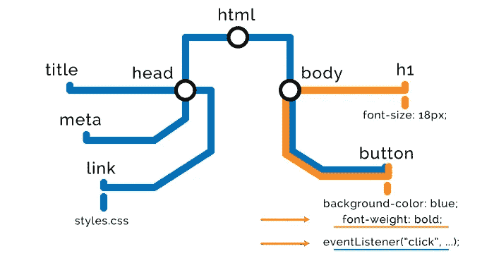

## JavaScript 交付优化策略

优化我们的脚本是我们能做的最重要的事情之一，也是大多数网站做得最差的事情之一。

*   异步加载脚本

通过在我们的脚本中使用一个`async`属性，我们可以告诉浏览器继续用另一个低优先级的线程下载它，但是不要阻塞其余的页面加载。一旦下载完成，它就会执行。

这意味着它可以在任何时候执行，这导致了两个明显的问题。首先，它可能会在页面加载后很久才执行，所以如果我们依赖它为 UX 做一些事情，那么我们可能会给用户一个次优的体验。第二，如果它碰巧在页面完成加载之前执行，我们不能预测它将访问正确的 DOM/CSSOM 元素，并且可能会中断。

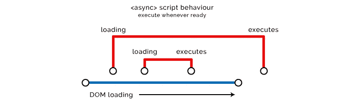

`async`对于不影响我们的 DOM 或 CSSOM 的脚本来说是非常好的，对于不需要了解我们的代码并且对于 UX 来说不是必要的外部脚本来说肯定是非常好的，比如分析或跟踪。但是如果你发现它的任何好的用例，那么就使用它。

*   延迟加载脚本

`defer`与`async`非常相似，它不会阻止页面的加载，但是，它会等到我们的 HTML 被解析后再执行，并按外观顺序执行。

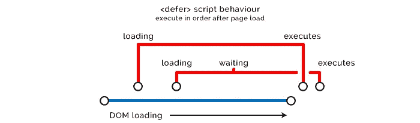

这对于脚本来说是一个非常好的选择，这些脚本将作用于我们的渲染树，但对于加载页面的折叠内容来说并不重要，或者需要之前已经运行的脚本。

这里有[另一个使用延迟策略的很好的选择](https://varvy.com/pagespeed/defer-loading-javascript.html)，或者你可以使用类似`addEventListener`的东西。如果你想知道更多，那么这里是开始阅读的好地方。

不幸的是，`async`和`defer`不能处理内联脚本，因为默认情况下，浏览器一有它们就会编译并执行它们。当它们在 HTML 中内联时，它们会立即运行，通过在外部资源上使用上述两个属性，我们只是抽象掉或延迟了我们的脚本到我们的 DOM/CSSOM 的发布。

*   操作前克隆节点

当且仅当您在对 DOM 执行多次更改时看到不必要的行为时，请尝试这样做。

首先克隆整个 DOM 节点，对克隆节点进行修改，然后用它替换原来的节点，这样可以避免多次重绘，降低 CPU 和内存负载，这样可能会更有效。它还可以防止页面的“抖动”变化和无样式内容的闪烁。

克隆时要小心，因为它不会克隆事件侦听器。有时候这可能正是你想要的。过去，当事件监听器不调用命名函数时，我们使用这种方法来重置事件监听器，并且我们没有 JQuery 的`.on()`和`.off()`方法可用。

# 第四步——渲染树

一旦读取了所有节点，并且准备好组合 DOM 和 CSSOM，浏览器就构建呈现树。如果我们把节点看作单词，把对象模型看作句子，那么渲染树就是一整页。现在，浏览器拥有了呈现页面所需的一切。

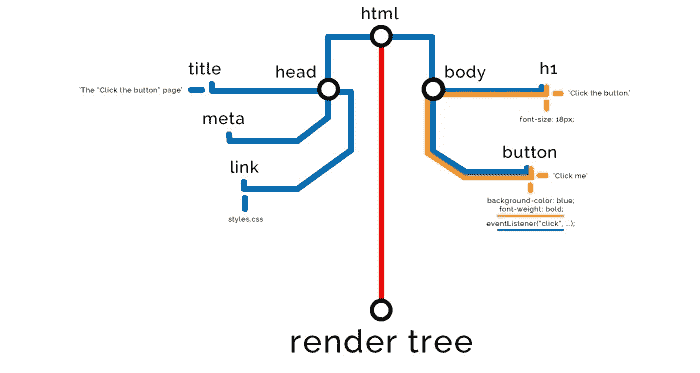

# 第五步—布局

然后我们进入布局阶段，确定页面上所有元素的大小和位置。

# 第六步——绘画

最后，我们进入绘画阶段，我们实际上将屏幕上的像素光栅化，为用户“绘画”页面。

而这一切通常发生在几秒或几十分之一秒内。我们的工作是加快速度。

如果 JavaScript 事件改变了页面的任何部分，就会导致渲染树的重绘，并迫使我们重新进行布局和绘制。现代浏览器足够智能，只进行部分重绘，但我们不能指望这是有效的或高性能的。

话虽如此，显然 JavaScript 在很大程度上是基于客户端事件的，我们希望它操纵我们的 DOM，所以它将会这样做。我们只需要限制它的不良影响。

到现在为止，你已经知道了足够多的东西来欣赏程昕婷·加西尔的演讲。这是 2012 年的数据，但信息仍然正确。她关于这个主题的综合论文可以在这里阅读。

如果你喜欢到目前为止所读的内容，但仍然渴望了解更多的低级技术内容，那么你所有知识的神谕就是 [HTML5 规范](https://www.w3.org/TR/html5/)。

我们就快到了，再陪我一会儿吧！现在我们发现了为什么我们需要知道以上所有的事情。

# 浏览器如何进行网络调用

在本节中，我们将了解如何最有效地向浏览器传输呈现页面所需的数据。

当浏览器请求一个 URL 时，我们的服务器用一些 HTML 来响应。我们将从非常小的开始，慢慢增加复杂性。

假设这是我们页面的 HTML。

我们需要学习一个新术语，关键渲染路径(CRP)。它只是意味着浏览器呈现页面需要的步骤数量。这是我们的 CRP 图表现在的样子。

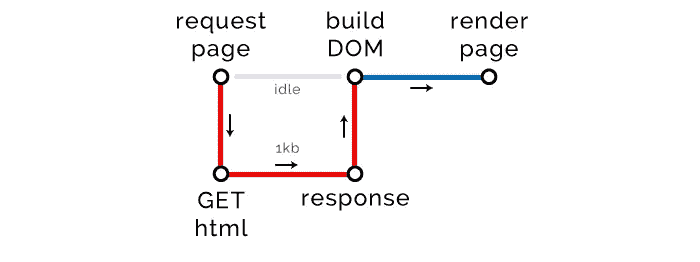

浏览器发出一个 GET 请求，它一直闲置，直到我们用页面所需的 1kb HTML(还没有 CSS 或 JavaScript)作出响应，然后它能够构建 DOM 并呈现页面。

## 关键路径长度

三个 CRP 指标中的第一个是路径长度。我们希望它尽可能的低。

浏览器与服务器进行一次往返，以检索呈现页面所需的 HTML，这就是它所需要的全部。因此我们的关键路径长度是 1，完美。

现在让我们把它提升一个档次，加入一些内部风格和 JavaScript。

如果我们检查我们的 CRP 图表，我们应该看到一些变化。

我们有两个额外的步骤，**构建 CSSOM** 和**执行脚本**。这是因为我们的 HTML 有需要计算的内部样式和脚本。然而，因为不需要发出外部请求，所以它们不会增加我们的关键路径长度，耶！

但是等等，不要这么快。还要注意，我们的 HTML 大小增加到了 2kb，所以我们不得不在某个地方做些改动。

## 关键字节

这就是我们三个指标中的第二个指标的用武之地，关键字节。这度量了呈现页面需要传输多少字节。并不是所有的字节都将下载到页面上，而是真正呈现我们的页面并使其响应用户所需的字节。

不用说，我们也想尽量减少这种情况。

如果你认为这很好，谁还需要外部资源，那你就错了。虽然这看起来很诱人，但在大规模上并不可行。实际上，如果我的团队必须交付一个包含内部或内联所需的所有内容的页面，这将是一个巨大的工程。并且浏览器不是为处理这样的负载而构建的。

看看这篇[有趣的文章](https://www.ctheu.com/2015/08/17/react-inline-styles-vs-css-stupid-benchmark/)关于像 React 推荐的那样内联所有样式时页面加载的影响。DOM 的大小增加了四倍，装载时间增加了一倍，响应时间增加了 50%。相当不能接受。

还要考虑这样一个事实，即外部资源可以被缓存，因此当再次访问我们的页面，或者访问使用相同资源的其他页面(例如`my-global.css`)时，浏览器将不会进行网络调用，而是使用其缓存版本，从而对我们来说是一个更大的胜利。

因此，让我们成长起来，并使用外部资源为我们的风格和脚本。注意，我们有 1 个外部 CSS 文件、1 个外部 JavaScript 文件和 1 个外部`async` JavaScript 文件。

这是我们的 CRP 图表现在的样子。

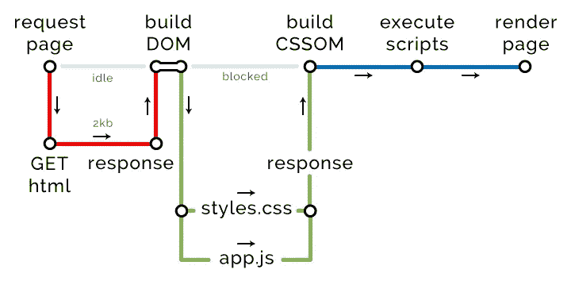

浏览器得到我们的页面，构建 DOM，一旦它发现任何外部资源，预加载扫描器就会启动。这将继续下去，并开始下载它可以在 HTML 中找到的所有外部资源。CSS 和 JavaScript 优先级较高，其他资源优先级较低。

它捡起了我们的`styles.css`和`app.js`，并开辟了另一条关键路径去拿它们。它没有选择我们的`analytics.js`，因为我们给了它`async`属性。浏览器仍然会用另一个低优先级的线程下载它，但是因为它不会阻止我们页面的渲染，所以它不会影响到关键路径。这正是谷歌自己的优化算法对网站进行排名的方式。

## 关键文件

最后，我们的最后一个 CRP 指标，关键文件。浏览器为呈现页面而必须下载的文件总数。在我们的案例 3 中，HTML 文件本身、CSS 和 JavaScript。`async`剧本不算。当然，越小越好。

## 回到关键路径长度

现在你可能会想，这肯定是有史以来最长的关键路径了吧？我的意思是，我们只需要下载 HTML、CSS 和 JavaScript 来呈现我们的页面，我们已经在两次往返中完成了。

## HTTP1 文件限制

再说一次，生活没那么简单。由于 HTTP1 协议，我们的浏览器一次只能从一个域同时下载设定的最大数量的文件。它的范围从非常老的浏览器的 2 到 Edge 的 10，Chrome 处理 6。

您可以在此查看您的用户浏览器可以从您的域[请求的最大并发文件数。](http://sgdev-blog.blogspot.co.uk/2014/01/maximum-concurrent-connection-to-same.html)

你可以也应该通过提供一些影子域之外的资源来最大化你的优化潜力。

**警告**:不要从你的根域之外的任何地方提供关键的 CSS，DNS 查找和延迟本身会抵消任何可能情况下的任何好处。

## HTTP2

如果你的网站是 HTTP2 并且你的用户的浏览器是兼容的，那么你可以完全取消这个限制。但是这些美好的事情还不太常见。

你可以在这里测试你网站的 HTTP2'ness。

## TCP 往返行程限制

另一个敌人靠近了！

在任何一次往返中可以传输的最大数据量是 14kb(它可以变化到 16kb)，这适用于所有 web 请求，包括 HTML、CSS 和脚本。这来自一个防止网络拥塞和数据包丢失的 [TCP 规范](https://hpbn.co/building-blocks-of-tcp/#slow-start)。

如果我们的 HTML 或请求中的任何资源累积大于 14kb，那么我们需要进行额外的往返来获取它们。所以，是的，这些巨大的资源确实为我们的 CRP 增加了许多途径。

## 大卡哈纳

现在让我们全力以赴制作我们庞大的网页。

我知道一个按钮需要很多 CSS 和 JavaScript，但它是一个非常重要的按钮，对我们来说意义重大。所以我们不要妄加评论，好吗？

我们的整个 HTML 被很好地缩小和压缩，大小为 2kb，远低于 14kb 的限制，所以它在 CRP 的一次往返中返回给我们，浏览器尽职尽责地开始用 1 个关键文件，即我们的 HTML，构建我们的 DOM。

`CRP Metrics: Length 1, Files 1, Bytes 2kb`

它获取一个 CSS 文件，并通过预加载扫描器识别所有外部资源(CSS 和 JavaScript ),并请求开始下载它们。但是等一下，第一个 CSS 文件是 14kb，最大化了一次往返的有效载荷，所以它本身就是一个 CRP。

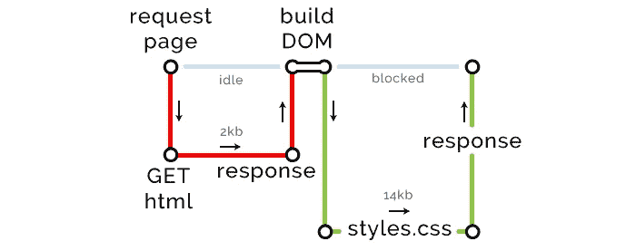

`CRP Metrics: Length 2, Files 2, Bytes 16kb`

然后它继续下载资源。其余的重量在 14kb 以下，所以可以在一次往返中完成，但有 7 个，因为我们的网站还没有在 HTTP2 上，我们使用的是 Chrome，所以在这次往返中我们只能下载 6 个文件。

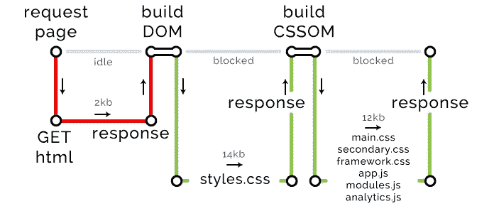

`CRP Metrics: Length 3, Files 8, Bytes 28kb`

现在我们终于可以下载最终文件并呈现 DOM 了。

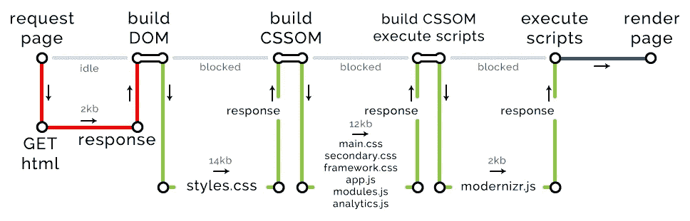

`CRP Metrics: Length 4, Files 9, Bytes 30kb`

使我们的 CRP 达到 9 个关键文件和 4 个关键路径中总共 30kb 的关键资源。有了这些信息和一些关于连接延迟的知识，您实际上可以开始对给定用户的页面性能做出真正准确的估计。

## 浏览器网络优化策略

*   Pagespeed 洞察

使用[洞察力](https://developers.google.com/speed/pagespeed/insights/)识别绩效问题。Chrome DevTools 中还有一个`audit`标签。

*   精通 Chrome 开发者工具

开发工具太神奇了。我可以单独写一整本书，但是已经有很多资源可以帮助你了。[这里有一篇真正有用的文章，可以用来开始解读网络资源。](https://developers.google.com/web/tools/chrome-devtools/network-performance/understanding-resource-timing)

*   在良好的环境中构建，在恶劣的环境中测试

当然，你希望在 Macbook Pro 上安装 1tb SSD 和 32gb RAM，但对于性能测试，你应该前往 Chrome 中的`network`选项卡，如果你使用的是 Chrome，并模拟低带宽、节流 CPU 连接，以真正获得一些有用的信息。

*   将资源/文件连接在一起

所以在上面的 CRP 图表中，我省略了一些你当时不需要知道的东西。但基本上，在收到每个外部 CSS 和 JavaScript 文件后，浏览器会构建 CSSOM 并在其上执行脚本。因此，即使您可能在一次往返行程中提交几个文件，它们每个都会使浏览器浪费宝贵的时间和资源，所以最好在可行的情况下将文件组合在一起，并消除不必要的负载。

*   页眉中折叠内容上方的内部样式

对于是否内化或内联 CSS 和 JavaScript 以停止获取外部资源，并没有真正的黑白之分，相反，将资源外化以便可以缓存它们以保持 DOM 轻量级。

但是有一个很好的理由来支持在折叠内容之上使用内部样式，这意味着你可以避免获取资源来进行第一次有意义的绘制。

*   缩小/缩小图像

非常简单的概念，有多种实现方式，选择你最喜欢的。

*   将图像加载延迟到页面加载之后

使用一些简单的普通 JavaScript，您可以推迟加载出现在文件夹下的图像或者对于第一个用户响应状态不重要的图像。这里有一个非常好的策略来做这件事。

你应该知道的关于图像优化策略的一切都可以在 Addy Osmani 的这本优秀的免费[电子书中找到。](https://images.guide/)

*   异步加载字体

加载字体是非常昂贵的，如果可以的话，你应该使用带有后备的网络字体，然后逐步渲染你的字体和图标。这可能看起来不太好，但是另一个选择是，如果字体没有加载，你的页面加载时没有任何文本，这被称为不可见文本的闪现。

有一个极好的来自易贝的[开发者博客，关于一个好的定制字体交付策略。](http://www.ebaytechblog.com/2017/09/21/ebays-font-loading-strategy/)

*   你真的需要那些 JavaScript/CSS 吗？

你知道吗？回答我！有没有一个本地的 HTML 元素可以产生你使用脚本的行为？有没有可以内联而不是内部/外部创建的样式或图标？例如[内联一个 SVG](https://css-tricks.com/using-svg/#article-header-id-7) 。

*   CDNs

内容交付网络(cdn)可用于从物理距离更近、延迟更低的位置向用户提供资产服务，从而降低加载时间。

*   服务器端优化

对于您的服务器必须获取并使用您的代码响应的每个请求，这会导致网络请求的延迟和等待时间。这里有很多不同的优化方法，这可能是一整本书的价值，所以我不能详细说明太多。但是，您可能希望了解静态 html 的服务器端缓存、代码缓存和内存化等内容。

现在你高兴极了，知道了足够多的东西，可以去那里自己发现更多关于这个主题的东西。我会推荐做这个[免费的 Udacity 课程](https://classroom.udacity.com/courses/ud884/lessons/1464158641/concepts/14734291220923)并阅读谷歌自己的关于优化的[文档。](https://developers.google.com/web/fundamentals/performance/)

如果你渴望更低级的知识，那么伊利亚·格里戈利克关于[高性能浏览器网络](https://hpbn.co/)的免费电子书是一个很好的起点。

# 包扎

关键的渲染路径是非常重要的，它给了我们一些非常可靠和合理的规则来优化我们的网站。重要的 3 个指标是:

1 —关键字节数。

2 —关键文件的数量。

3 —关键路径的数量。

我在这里写的东西应该足以让你掌握基本原理，并帮助你解释谷歌对你的表现的看法。

最佳实践的应用将与良好的 DOM 结构、网络优化和我们可用于最小化 CRP 指标的各种策略相结合。让用户更开心，让谷歌的搜索引擎更开心。

在任何企业规模的网站，这将是一个巨大的任务，但你迟早要做，所以停止招致更多的技术债务，开始投资于坚实的性能优化策略。

非常感谢您的阅读。现在你已经有了一个坚实的概述，你可以走出去，成为像我一样痴迷于性能优化，祝你好运，玩得开心！

> [黑客中午](http://bit.ly/Hackernoon)是黑客如何开始他们的下午。我们是 [@AMI](http://bit.ly/atAMIatAMI) 家庭的一员。我们现在[接受投稿](http://bit.ly/hackernoonsubmission)，并乐意[讨论广告&赞助](mailto:partners@amipublications.com)机会。
> 
> 如果你喜欢这个故事，我们推荐你阅读我们的[最新科技故事](http://bit.ly/hackernoonlatestt)和[趋势科技故事](https://hackernoon.com/trending)。直到下一次，不要把世界的现实想当然！

