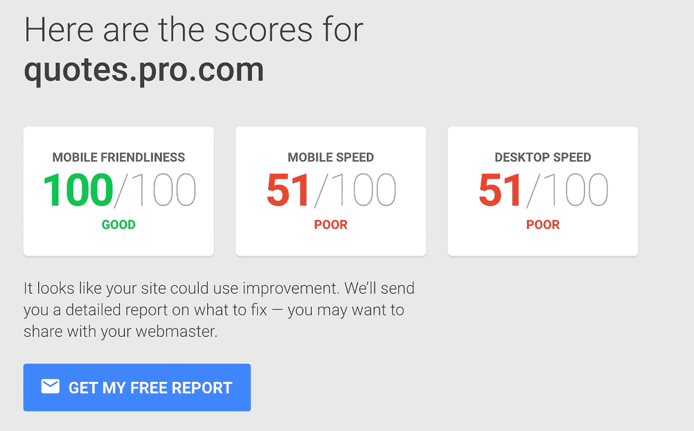
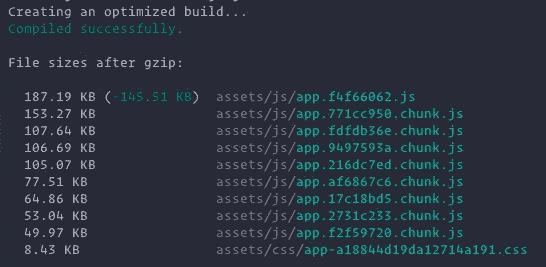

# 使用 webpack 优化您的应用捆绑包大小

> 原文：<https://medium.com/hackernoon/optimising-your-application-bundle-size-with-webpack-e85b00bab579>

我最近构建了一个 React.js 应用程序，它可以被评为中等复杂的单页面应用程序。我希望优化各种客户端的页面加载时间，并尝试在一个可用的工具上分析网站，以检查我们做得如何。

偶然发现谷歌的 [testmysite](https://testmysite.thinkwithgoogle.com/) 并对网页进行了分析，得到了以下结果:



该网站被评为在设计上非常响应，但在加载时间上却不太“响应”。我正在评估代码的各个部分，以解决页面加载时间的问题，这篇文章为那些寻求优化的人提供了指导。

检查的第一步是当前的包大小，并检查是否所有的依赖包都是绝对必要的。

```
$ webpack -p --progress
Hash: dbce3735c9520e2dc682
Version: webpack 1.14.0
Time: 54264ms
            Asset     Size  Chunks             Chunk Names
    dist/index.js  3.29 MB       0  [emitted]  main
dist/index.js.map  13.7 MB       0  [emitted]  main
   [0] multi main 40 bytes {0} [built]
    + 1374 hidden modules
```

当前的包大小超过 3 兆字节，这解释了性能分析工具的糟糕分数。

## 1.分析您的捆绑包依赖关系

我使用了 [webpack-bundle-analyzer](https://www.npmjs.com/package/webpack-bundle-analyzer) ，它分析 webpack 统计数据并给出一个很好的可视化效果，一眼就能知道漏桶！

为了快速参考，我列出了安装步骤。使用以下命令安装软件包

```
$ npm install --save-dev webpack-bundle-analyzer
```

修改您的`webpack.config.js`以包含插件。如果每个环境都有多个概要文件，那么最好在生产配置中这样做，并为该概要文件构建应用程序

```
var BundleAnalyzerPlugin **=** require('webpack-bundle-analyzer').BundleAnalyzerPlugin;*// ...* plugins**:** [**new** BundleAnalyzerPlugin()]
*// ...*
```

现在启动服务器应该会在 [http://localhost:8888](http://localhost:8888) 显示可视化效果。您应该看到类似下面的内容，并且您可以深入到任何级别，以了解需要调整或删除的包。


webpack-bundle-analyzer sample report

这应该有助于理解重量依赖性。此外，当导入依赖项时，最好只从库中导入必要的函数/组件，这样可以更有效地打包到包中。如下图所示的第二种方法更有效。

## 2.构建中的正确节点环境

向 webpack 指明正确的环境将确保开发和测试产品不会作为捆绑包的一部分打包。为此，您可以在插件配置中将`NODE_ENV`定义为 production

```
**plugins: [...
    new** webpack.DefinePlugin({
             **'process.env.NODE_ENV'**: **'"production"'** }),
..]
```

## 3.包括最少的源映射信息

当您为生产而构建时，在缩小和组合 JavaScript 文件的同时，您会生成一个包含原始文件信息的源映射。可以为开发或登台环境生成具有最大详细级别的源映射。但是，我们可以为生产选择最优化形式的源地图。

检查您的 webpack 配置，通常会看到`**devtool: ‘eval’**`，这是构建应用程序的最快方法之一，大多数开发代码信息都捆绑在输出中。让我们将该设置切换为`eval-source-map`或`cheap-module-source-map.`参考此[文档](https://webpack.github.io/docs/configuration.html#devtool)以了解关于这些配置参数的更多细节。

让我们在这个阶段再次检查捆绑包的大小，看看我们节省了多少。

```
$ webpack -p --progress
Hash: 68a52fddbcc2898a5899
Version: webpack 1.14.0
Time: 29757ms
            Asset     Size  Chunks             Chunk Names
    dist/index.js  1.71 MB       0  [emitted]  main
dist/index.js.map  464 bytes       0  [emitted]  main
   [0] multi main 40 bytes {0} [built]
    + 1365 hidden modules
```

从`3.29mb`到`1.71mb`，我们也注意到源文件的大小已经大大减小了！

## 4.优化包大小的其他著名插件

我列出了我用来进一步缩小尺寸的其他插件。评估适合您的用例的工具，并根据需要使用它们:

*   [compression-web pack-plugin](https://github.com/webpack/compression-webpack-plugin):一个用于压缩资产的插件，它将生成。gz 文件以及资产，并且根据客户端，资产服务器可以被配置为按需提供服务。
*   [重复数据删除插件](https://webpack.github.io/docs/list-of-plugins.html#dedupeplugin):搜索相同或相似的文件，并在输出中删除重复数据。这给条目块带来了一些开销，但是可以有效地减小文件大小。[编辑:在 Webpack v.2 中默认可用]
*   [uglifyjs-plugin](https://webpack.github.io/docs/list-of-plugins.html#uglifyjsplugin) :最小化所有块的 JavaScript 输出。关于这个插件处理的过多选项，请参考文档
*   [ignore-plugin](https://webpack.github.io/docs/list-of-plugins.html#ignoreplugin) :当你想从一个库中导入选择性模块时很方便。例如，当使用 [moment.js](https://momentjs.com/) 时，不需要包含库附带的所有语言环境，只需要包含需要的语言环境。下面的代码示例也说明了这一点。

最终的 webpack 配置可能如下所示:

让我们在最终配置就绪后再次检查一下包的大小…

```
$ webpack -p --progress
Hash: 68a52fddbcc2898a5899
Version: webpack 1.14.0
Time: 29757ms
            Asset     Size  Chunks             Chunk Names
    dist/index.js  1.54 MB       0  [emitted]  main
dist/index.js.gz   390 KB        0  [emitted]  main
dist/index.js.map  464 bytes     0  [emitted]  main   
   [0] multi main 40 bytes {0} [built]
    + 1365 hidden modules
```

注意压缩的 js 文件的大小，它下降到了`390kb`这将大大改善页面加载时间。让我们再运行一次 google profiler 测试，看看这个网站在最新的捆绑包中表现如何。


Final scores after applying all optimizations

编辑:

# 5.代码分割

我想在这篇文章中加入代码分割，作为优化 webpack 构建的另一个重要步骤。这个想法很简单。如果您使用类似于`react-router`的东西在应用程序中定义多个页面，那么很容易绘制一个依赖关系树，以路径中定义的组件作为起点，并将该页面所需的所有资产(js、css、images)捆绑为一个单独的块。如果你使用动态导入，这里讨论的，webpack 可以聪明地分割出每个页面所需的代码块。

按照这篇[写得很好的文章](http://serverless-stack.com/chapters/code-splitting-in-create-react-app.html)中的步骤为你的项目实现代码拆分。

完成更改后，当您启动 webpack prod 构建时，您应该会看到这样的输出，它为用户访问的每个页面创建了多个要下载的脚本块，从而大大减少了页面加载时间！



我*如果你喜欢这篇文章，请关注我的*[*Twitter*](https://twitter.com/rcdexta)*以获得更多类似主题的更新..*

> [黑客中午](http://bit.ly/Hackernoon)是黑客如何开始他们的下午。我们是 AMI 家庭的一员。我们现在[接受投稿](http://bit.ly/hackernoonsubmission)并乐意[讨论广告&赞助](mailto:partners@amipublications.com)机会。
> 
> 如果你喜欢这个故事，我们推荐你阅读我们的[最新科技故事](http://bit.ly/hackernoonlatestt)和[趋势科技故事](https://hackernoon.com/trending)。直到下一次，不要把世界的现实想当然！

