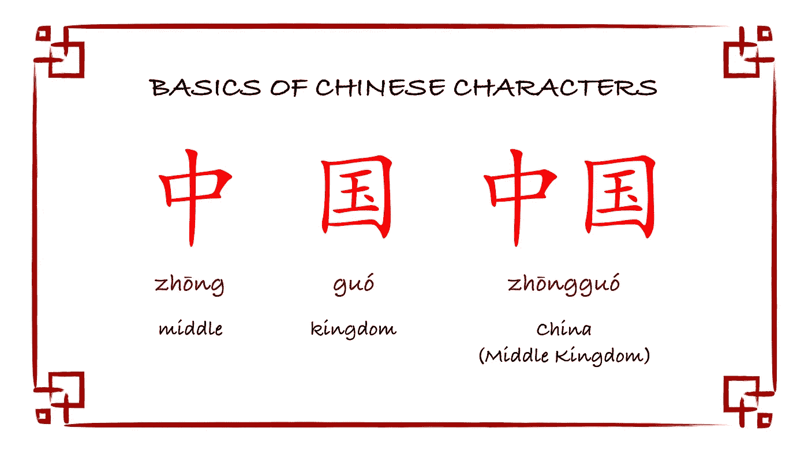
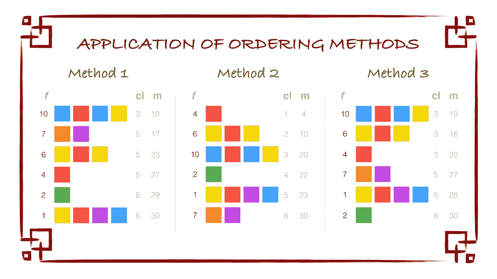
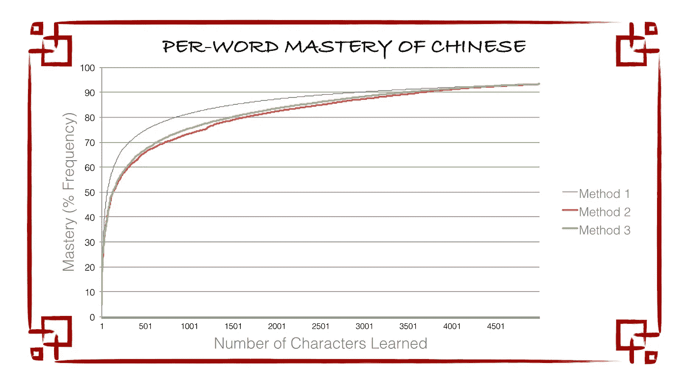
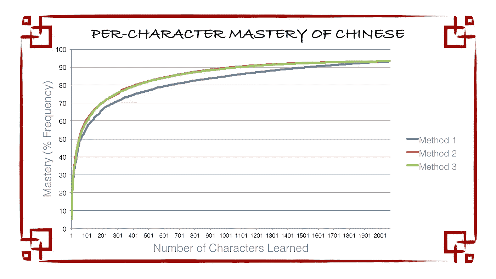

# 优化汉字学习

> 原文：<https://medium.com/hackernoon/optimizing-chinese-character-learning-a4b573e590e6>

## 一种更简单快捷的学习汉语的方法

大约一周前，一个朋友问了我一个问题，这个问题让我度过了许多个深夜:

> “我学习中文已经有几个月了，我已经学会了所有这些汉字来组成基本的单词。我知道很多单词可以重新排列，按照不同的顺序组合成其他单词，这样我就可以更容易地读、写、说，但我不知道这些单词是什么……我怎么才能知道我应该已经能够形成哪些单词，以及是否值得学习它们？”

这个问题引起了我的兴趣。学习中文已经 5 年了，我经常想知道同样的事情。但这一次，这个问题引起了我不同的共鸣。我不仅开始思考我的朋友*可以*学什么汉字，还开始思考如果她想尽快掌握中文，她*应该怎么学。*

带着这个问题，我踏上了寻找学习汉字最快顺序的旅程。

## 背景

(如果你已经学习过中文或者中文是如何工作的，请跳过这一部分。)

汉语被归类为一种基于音节的文字系统，其中每个音节都由一个图形字符来表示。其中一些字符单独代表完整的单词(就像英语中的单音节“I”或“me”)。在其他情况下，将多个字符串在一起会产生一个完整的单词(想想英语中的多音节“ **I** odine”或“ **me** ander”)。

**Basics of Chinese Characters.** Chinese words can be made from one character or from several combined characters.

在以字母为基础的语言中，阅读和发音之间有直接的联系，因此学生只需要记住一个单词的[发音](https://hackernoon.com/tagged/pronunciation) **或**拼写，就能够充分使用该单词。然而，在中文中，字符和发音之间没有直接联系(见下面的假设 3)，因此学生需要记住一个单词的发音(在一个称为拼音的系统中用拉丁字母罗马化)**和**基于字符的“拼写”，以便能够完全读、写、说和理解该单词。

For example, I can show you the Spanish word for house, *casa*, and you immediately have an idea of how to pronounce it. You can study this word with a two-sided flashcard, with the Spanish on one side and the English on the other. If I show you the Chinese character for house, 家, you have no clear signal of how the character should be pronounced (*jiā*). In order to study a Chinese word, you would need a *three-sided* flashcard, with the characters on one side, the pinyin pronunciation on another, and the English meaning on a third.

这种复杂性是学习中文如此困难的原因之一(见美国国务院的分类)。由于学习每一个汉字都需要付出巨大的努力，所以确定哪些汉字对学生来说最有价值是至关重要的。

## 这个问题

那么如何才能把学生背的字排序，让他们最快的学会最多的中文呢？

我们的第一直觉可能是根据单词的使用频率来教学生单词，并要求学生记住这些单词中的字符。这是一种相对标准的语言方法，对于非基于字符的语言来说是直观的。这也可能是大多数中文课程的基础，因为教学生最常遇到的单词是有意义的。

但是在像中文这样基于字符的语言中，*标准*方法可能不是最*优化的。中文中最常见的单词完全有可能包含不常见的字符，或者更确切地说，学生可以在不学习很多字符的情况下掌握更多的语言，只要他们最大限度地利用他们已经知道的字符。这几个“低垂的果实”的人物，就是我朋友这个问题和这个探索的前提。*

## 学习选项

为了测试这种着眼于“低挂果实”(LHF)的想法，以及汉语学习过程中的这种优先顺序将如何提高学习效率，我们可以考虑三种不同的学习方法:

**方法一:标准** 如上所述，学生要按照使用频率的顺序来学习汉语单词。推而广之，学生应该按照汉字在这些按频率排列的单词中出现的顺序来学习汉字。这种方法优先考虑日常使用和交流的便利性。

**方法二:LHF 词** 学生们应该学习那些能让他们最大程度掌握中文的汉字，用这些汉字组成的词来衡量。对于学生将要学习的每一个字，我们会考虑到学生能用这个字和他们已经认识的字组成的所有单词，而不是只关注最常见的单词。这种方法优先考虑学习字符的效率。

**方法三:标准与 LHF 字相结合的方法** 学生应该按照最常用的字的顺序学习汉语，但是当他们学习可以用来构成其他字的字(LHF)时，他们应该在尝试学习另一个字之前学习那些 LHF 字。这种组合方法使用了方法 1 和方法 2 的原理。它优先考虑日常使用和交流的便利性，但考虑到学生已经学习的字符，它也是高效的。

**Application of Ordering Methods.** Here, we see a visual representation of a set of Chinese words and their frequencies (*f). Colored blocks respond to Chinese characters with blocks of the same color representing the same character. Method 1 optimizes based on word frequency. Method 2 optimizes based on the best path to find LHF words. Method 3 finds LHF while going through the most frequent words. For each method, I show the characters learned at every step (cl) and the overall mastery that a student would have gained (m). Note how cl and m vary for each method.*

## **流程**

我决定对这些方法进行测试，以确定每种方法如何改变学生学习中文的能力。考虑到吸收大量有用的普通话需要时间，我没有教一群学生，而是选择通过模拟来教我的电脑普通话。方法如下:

*   我首先下载了一个中文单词及其频率的列表(也称为词典)。对于大多数语言来说，网上有许多这种性质的词典，每一个都有独特的性质(什么是或不是单词的定义，词汇的来源，测量频率的方法，等等)。)在这种情况下，我使用了蔡庆和马克·布里斯巴特的词典，该词典来自 6243 部中国电影和电视剧的[语料库](https://en.wikipedia.org/wiki/Text_corpus)。
*   我写了几个 Python 程序，按照这三种方法中的每一种“教”我的计算机中文，就好像它是一个没有任何经验的学生。对于每种方法，我跟踪了学生学习汉语单词的顺序，以及学生在每个单词后应该说多少汉语(按百分比)。我还跟踪了学生学习汉字的顺序，以及根据他们学了多少汉字，他们能读/写多少中文。如果你想访问我为这个项目写的代码，请随时联系我。
*   为了节省计算时间，我对 Cai 和 Brysbaert 词典中的前 5000 个单词运行了这些程序，而不是所有的 99121 个单词。根据词典，这前 5000 个词涵盖了汉语的 93.3%，与通过最高级别的汉语水平考试(HSK 级)的中国人的 5000 个词相当。
*   根据模拟的结果，我比较了三种方法，看看每种方法如何影响学生的语言掌握。

## **假设**

我的流程要求我做出以下假设:

1.  学生试图学习汉语进行口头和书面交流，而不仅仅是口头交流。换句话说，除了说和听，学生还想学习如何读和写，这意味着学生必须学习汉字。
2.  在这篇文章中，我指的是简体中文。理论上可以将相同的过程应用于使用不同频率的字/词的繁体字或不同的汉语方言。下载不同的单词词典可以解释这种变化。
3.  学生必须学习一个字，以便知道它的发音和意思。虽然熟悉中文的学生偶尔能够根据汉字的外观、它与其他已学汉字的相似性以及它的[部首](https://en.wikipedia.org/wiki/Radical_(Chinese_characters))来猜测汉字的发音或含义，但这种影响从来都不准确，并且用代码来解释它是不容易的。此外，虽然这种技巧有时在阅读时有用，但在写作时却困难得多。
4.  在我的代码中存在一些小的边缘情况，虽然可以避免，但对整体结果的影响很小。例如，我对方法 2 的模拟方式意味着对应于最近学习的字符的 LHF 单词可能不会以频率顺序出现。
5.  在这次探索中，我认为所有的汉字都一样难学。其他研究(如[本 2016 年的工作来自泥鳅和王](http://journals.plos.org/plosone/article?id=10.1371/journal.pone.0163623)或[本 2013 年的论文来自阎等人。艾尔。](http://journals.plos.org/plosone/article?id=10.1371/journal.pone.0069745))考虑具体字符的复杂性，甚至要求学生先学习简单的部件字符，然后再学习出现这些部件的字符。
6.  在极少数情况下，某些字符似乎有[多个发音](http://www.fluentinmandarin.com/content/chinese-characters-multiple-pronunciations/)。在代码中说明这一点也很重要，因此，我们假设当学生学习一个字符时，他们学习了它的所有发音。这在方法 2 和 3 中更为现实，因为更有可能的是，具有多个发音的字符将与包含该字符的其他单词一起被依次研究。
7.  For the sake of these simulations, we disregard the basic path dependency of a student’s first lessons while learning a language. For example, all three methods suggest learning the word 的 (*de,* of) first, but it would be unnatural for “of” to be the first word that students learn since it cannot be incorporated into a simple sentence. Given this path dependency, we should take the exact word/character orders proposed by the simulations with a grain of salt, particularly within the first few characters.

## **结果**

在运行了所有这三种方法之后，我比较了每种方法对学生掌握中文的影响。

首先，我们可以考虑学生学完每个单词后掌握的百分比。甚至在运行我们的探索性模拟之前，我们就已经能够凭直觉知道标准方法在每个单词的基础上是最有效的，因为这正是它优化的目的(在任何给定的时间学习下一个最常用的单词)。可能不太明显的是，方法 2 和 3 会如何显著地影响学生对每个单词的掌握。我们来看看数据:

Methods 2 and 3 have students learn all words that they can make with their current character set before learning any new characters. Some of the words that they can make will be common words with high-frequency, whereas others may be more obscure LHF words. For example, Method 2 instructs the student to learn the word 好看 (*hăokàn,* attractive) for .38% mastery before learning the word 和 (*hé*, and) for 4.48% mastery simply because the student already knows the characters for 好 (*hăo*, good) and 看 (*kàn*, look). We should note that Method 3 works somewhat better than Method 2 in covering common words (at some points around 1172 words about 2.3% better), given that it prioritizes the most frequent words by default. Still, both Methods 2 and 3 fall short of Method 1 here, with a gap as wide as 11.6% at 59 words. Lastly, it is important to note that in both the per-word and per-character results, we will see all 3 methods converge at the end of simulation, since they must all end up teaching the student the same 5000 words and 2067 characters regardless of order.

首先，我们可能会认为这是方法 2 和 3 的弱点，特别是如果我们的目标是能够尽快地用最常用的单词进行交流(这在不包括阅读和写作的普通话会话课程中是常见的情况)。但这实际上是我们优化的全部要点，它基于这样的想法，即学习汉字比只学习拼音要花费更多的精力。(在另一个世界，如果所有的普通话都用拼音书写，可能会更方便，我们可以恢复到双面抽认卡的学习方式，但是，唉，让支持汉字系统的 3000 多年的历史倒退是有点亵渎的，汉字系统、汉字的美以及汉字保持几千年一致性的能力。)相反，查看每种方法的每个字符的结果会提供更多的信息:

查看每个角色的结果会告诉你更多关于这些学习方法如何执行的信息和有趣的故事。

正如我们所料，在此基础上，方法 2 和 3 的表现比方法 1 好得多，因为它们都考虑了 LHF，并充分利用了学习者已经掌握的字符。也就是说，从结果中可以得出两个重要的结论。

首先，显而易见的是，方法 2 和 3 在每个字符的基础上提供了比方法 1 显著的优势。一旦一个学生用方法 2 学会了 491 个汉字，他们就能多接触 5.2%的汉字。也就是说，这个学生仅仅通过优化学习哪些汉字，就可以比一个同龄人多读 5.2%的中文。

第二，我们注意到方法 2 和 3 在每个字符的结果中不分上下，比每个单词的结果更是如此。他们在掌握每个字符方面的最大差距是 25 个字符时的 1.7%，相比之下，每个单词数据中的 1172 个单词的差距是 2.3%。从功能上来说，这是因为两种方法都搜索了 LHF，并提高了他们对每个字符的掌握程度，但方法 3 也通过优先考虑每个单词的掌握程度来做到这一点。本质上，方法 3 是介于方法 1 和方法 2 之间的一个折中方案，尽管它的总体表现与方法 2 更相似。

## **在实践中**

> 那么这对真正的汉语学习者来说意味着什么呢？

这项研究的结果很有说服力。如果你学习汉字，同时学习与之相关的所有容易上手的单词，你可以更快地掌握中文阅读和写作(因为认识汉字并不是说话的必要条件)。然而，这样做的代价是首先学习最常用的单词，因为你最终会学到一些在日常生活中没有用的 LHF 单词。本质上:

> 如果你想学习阅读和书写中文，使用方法 2 或 3 来学习。
> 
> **如果你只想学习汉语会话，使用方法 1。**

## 开始吧！

Use the Quizlet Flashcards I’ve generated to start learning Chinese characters more efficiently!

**准备好开始了吗？**以下是我为方法 2 ( [第一副](https://quizlet.com/_2y03bj)、[第二副](https://quizlet.com/_2y03co)、[第三副](https://quizlet.com/_2y03dn))和方法 3 ( [第一副](https://quizlet.com/_2yez6k)、[第二副](https://quizlet.com/_2yezc9)和[第三副](https://quizlet.com/_2yezgj))制作的 Quizlet 抽认卡(密码:“中”)。(请注意，这些资料的翻译是由谷歌翻译创建的，不是我自己的。)对于方法 1，你可以在这里找到一个基于频率的词典[或者在这里](https://www.amazon.com/Frequency-Dictionary-Mandarin-Chinese-Dictionaries/dp/0415455863)找到原版[蔡和 Brysbaert 的词典。](http://www.ugent.be/pp/experimentele-psychologie/en/research/documents/subtlexch/subtlexchwf.zip)

## 讨论

我对这项工作改变学习者接触汉语书面语和口语的潜力感到兴奋，但总有更多的工作要做。以下是一些关于如何在未来改进上述内容的想法:

*   不同的词汇:在这次探索中，我选择了蔡和 Brysbaert 列表中的汉字和词频。人们可以很容易地想象用来自电视节目、书籍、报纸或以上所有来源的其他词典进行同样的模拟。每种方法对结果都有不同的影响，这取决于学生的学习目标。
*   **不同的学习策略:**本研究假设汉字学习是汉语学习中最难的一个方面。可以测试其他学习方法，以检查替代学习风格或掌握指标。
*   **不同的假设:**未来的版本可能会改变我的假设，在方法中加入细微差别(例如，检查角色难度和/或路径相关的角色组件)。
*   **与 HSK 和教材**的比较:这项工作的延伸可能是查看*汉语水平考试或汉语教材，看看它们与优化的学习路径有多大差异。这些信息可以用来改进这些资源的词汇选择。(我们已经可以猜测，HSK 没有针对最常用的单词进行优化，因为在测试的 5000 个单词中有 2663 个字符，而 Cai 和 Brysbaert 词典建议的是 2067 个。)*
*   **更多的计算:**为了计算方便，我已经在 5000 个单词处停止了我的计算，但是很容易改变我的方法的变量来引入更多的单词和字符。这样做可能会改变单词优化的顺序，因为在上述模拟中没有考虑超过 5000 个单词的 LHF。
*   **学术讨论:**当然存在关于汉语学习和优化学习顺序的学术讨论(包括上面链接的 PLOS 论文)。这一探索有助于学术讨论，或者作为通过抽认卡实现优化学习风格的实例。

*您认为这一探索的最佳下一步可能是什么？发现抽认卡或思维过程特别有用吗？在下面评论，一定要推荐/分享这篇帖子给别人！从我这里* [*找其他帖子*](/@jordan.shapiro) *关注我以后的更新！*

> [黑客中午](http://bit.ly/Hackernoon)是黑客如何开始他们的下午。我们是 T21 家庭的一员。我们现在[接受投稿](http://bit.ly/hackernoonsubmission)并乐意[讨论广告&赞助](mailto:partners@amipublications.com)机会。
> 
> 如果你喜欢这个故事，我们推荐你阅读我们的[最新科技故事](http://bit.ly/hackernoonlatestt)和[趋势科技故事](https://hackernoon.com/trending)。直到下一次，不要把世界的现实想当然！

