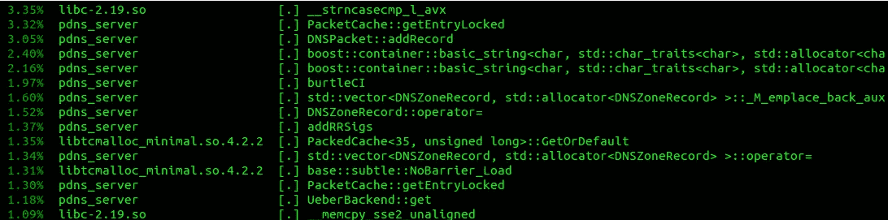
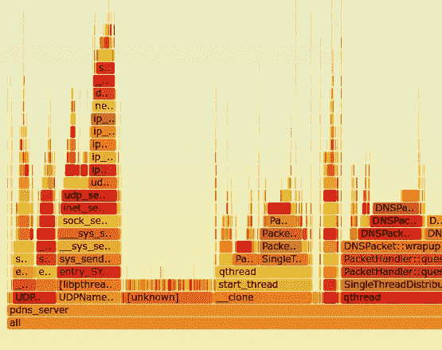
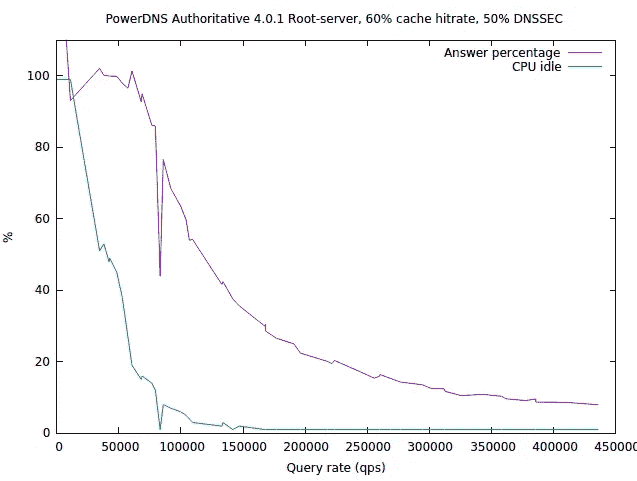
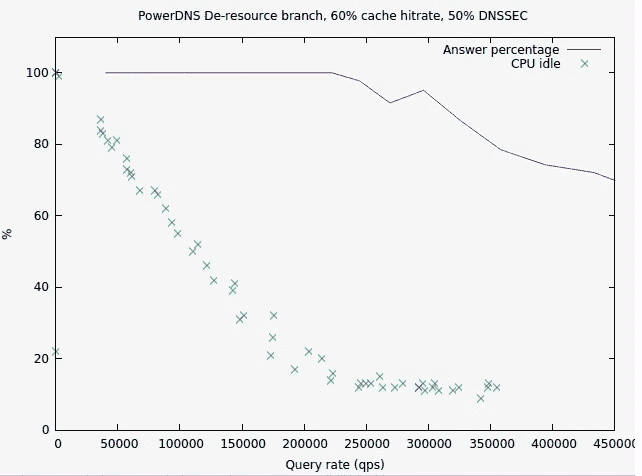

# 优化优化:导致 PowerDNS 加速 400%的一些见解

> 原文：<https://medium.com/hackernoon/optimizing-optimizing-some-insights-that-led-to-a-400-speedup-of-powerdns-5e1a44b58f1c>

所以不管你的代码有多漂亮，最终总会有人[对它进行基准测试](https://hackernoon.com/tagged/benchmark)并要求最高的性能。挤压微秒是一种非常容易上瘾，甚至是破坏性的活动。它破坏了你的夜晚，破坏了你与人交流的能力，通常会让你的代码变得一团糟。

然而，没有一个程序员可以逃避这个问题:这个世界需要速度，或者一个相当的现代标准，更长的电池寿命。

挤出更多的性能不仅仅是“写出更好的代码”的问题。这是一门艺术。在过去的 30 年里，我取得了一些成功，但许多性能改进都是在太长的时间之后才实现的。也有很多误导性的建议。

在这篇文章中，我将强调我多年来学到的一些东西。

> 注意:这不是一个优化教程，但它可能有助于形成一种有用的心态。

## 宽刷优化

所以这真的是神奇的调味汁(或者蛇油，如果你愿意的话)。“不要使用引用计数指针”。“使用无锁代码”。“离 STL 远点”。这通常是相当无用的，也是相当不科学的建议，因为它很难伪造。

Using tools sparingly

当然，我们可以指出一个非常快的项目，它没有使用异常、RTTI 和动态分配。但是 1)这不是你的项目 2)这种禁欲主义的代价是巨大的 3)我们甚至不能确定把代码放在饮食上是否真的是导致它快速的原因。

这种建议仍然存在的一个原因是很难实施或反驳它。也许有用，也许没用，但通常需要修改整个项目才能找到答案。

要点是，如果您的真实项目使用了动态内存和异常等新奇的东西，不要放弃优化，因为几乎没有证据表明没有它性能会突然提高。更别说你的项目会按时完成。

## 看简介:令人印象深刻的大改进

因此，当开始优化代码库时，经常会有一些令人印象深刻的唾手可得的成果。你做了一个性能分析，你的项目花了 50%的时间在一个超级慢的函数上。砰。工作五分钟，性能翻倍。

我已经用我的[阿端 DNA 工具](https://github.com/beaumontlab/antonie)处理过这个问题，结果它花了大部分时间做**T5 e T6 T7 的幂运算来得到一个不重要的统计数据。**

修复这样一个问题的冲动是如此强大，以至于我们为加速代码所做的其他努力都被它糟蹋了。我们希望其他大人物不假思索地跳出来给我们看！但是你可以继续寻找他们，他们不会来了:剩下的加速将是实际的艰苦工作。

## 思维模式:cpu /编译器/库/操作系统/语言是白痴

我认为这可以追溯到 20 世纪 80 年代，当时所有这些都是真的。**异或 ax，ax** 比设置 **ax** 为 **0** 快。系统 random()调用缓慢传递交替的奇数和偶数，都位于 [n 维超平面](https://en.wikipedia.org/wiki/Linear_congruential_generator)上。你可以通过用 **> > 3** 替换 **/8** 来帮助编译器。操作系统做的任何事情，你都可以绕过它做得更好。不要让我们开始学习这种语言，因为它有可怕的函数调用开销！

如今，事实证明，最明显的优化..已经由编译器或 CPU 为您完成了(这两者都比您更了解您的代码在做什么)。

我们中的许多人已经浪费了大量时间来实现用户空间多任务和异步 I/O，因为这些系统线程肯定很糟糕，却发现内核对 CPU 和 I/O 的了解比我们多得多。我们的情况不够特殊。

类似地，许多项目已经放弃了虚方法(用 C++的说法是 RTTI ),只是在每个方法函数开始时将它们重新实现为 switch 语句。这是一个实实在在的倒退，因为编译器通常可以将调用非虚拟化，而 switch 语句(或函数指针结构)却不能。

很多时候，我们“帮助”CPU/编译器/操作系统的努力充其量只是重复已经发生的事情，但也使我们的代码去个体化，或者使其可读性大大降低。**没有任何加速**。更多时候，事实证明我们实际上让事情变得更糟。

> 一个值得注意的例外是，如果你实际上是在一个已知缓慢的平台上，比如 Python，避开它以获得性能是有意义的。但是无论如何，你可能在错误的地方得到快速软件！

因此，在你陷入假设你可以轻松地做得比你的基础设施更好的陷阱之前，要么选择更好的基础设施，要么衡量事情是否真的像你认为的那样糟糕。

## 平坦剖面:检查调用图

在第一次大的优化完成后，你经常会看到一些不可避免的函数做了 20%的工作，另外还有大量的函数各做了 2-5%的工作。

我已经花费了大量的工作来加速这些单独的函数，但是这非常令人沮丧——你意识到即使你设法加速了这样一个函数，所以它花费了 **_no_** 更多的周期，你仍然只能提高 3%的整体性能。

起初，这种平坦的轮廓只是难倒了我，让我放弃了进一步的优化。然而，随着更好的剖析器的出现，我明白了这样的平坦是骗人的。

你可能会在 10 个函数中各花 3%的时间，然后发现你花在那里的总时间的 30%是因为有一个高阶函数调用所有这些小函数太频繁了。而这个更高的函数永远不会出现在你的平面轮廓里！

A PowerDNS Flame Graph made with [http://www.brendangregg.com/perf.html#FlameGraphs](http://www.brendangregg.com/perf.html#FlameGraphs). Actual data [here](http://ds9a.nl/tmp/perf-kernel.svg).

因此，要点是:获取基于调用图的性能分析。这通常有点麻烦，而且通常会慢很多，但是它们是值得的，因为它们会占用你 3%的时间。

## 超级优化

这是加速的奥运会。这些故事吸引了我们。亲自阅读它们，让我感到自己的渺小和不足。举例来说，如果我编写一个 AES 加密函数，它的速度会比那些超级密码英雄所实现的速度慢几个数量级。现代 AES 实现可以在 11 个时钟周期/字节内进行加密，而无需特殊的硬件辅助。在这 5 纳秒中，它执行了大量的异或和移位操作。而在 11 个时钟周期内，像我这样的普通程序员只能数到 4。

**如果你确实知道自己不熟悉现代 CPU 上的流水线和矢量化机器，这种英雄般的性能可能是放弃优化的一个理由**。但是不要害怕。即使是这样英勇的程序员也只能为定义非常严格和简单的函数梳理出这种性能，即使这样，他们也要花费数周时间。

因此，尽管有[很多](http://www.agner.org/optimize/)让[钦佩](https://cr.yp.to/qhasm.html)的[人](https://www.imperialviolet.org/2010/12/21/eccspeed.html)能够[让](http://bellard.org/pi/pi2700e9/)所有的推测性执行引擎在一个 CPU 上旋转，意识到他们通过花费数周时间在数百字节的代码上实现如此出色的性能，这些代码很少超出加密、哈希和编解码器库的规模。不要太难过。感激地利用他们的工作，然后继续前进。

## 随着时间的推移，每个人都知道:少做事

每个人都在重新发明这个。在对一个函数进行强力优化的过程中有一些“男子气概”(因为没有更好的词)。但通常它最多能让你提升 20%的速度。当然，除非你是上一节的人之一！

Swoosh your code

**加速代码的最好方法是..而不是运行它。**它需要一种非常不同的思维方式，而不是关注单独的代码行，甚至是功能。它包括真正理解你的程序在做什么。

在您花了足够的时间之后，您经常发现您的代码从数据库中检索 12 个字段，但是只查看一个。或者更有趣的是，它根本不看任何字段，而是将所有行存储在一个向量中，只返回它的大小。

因《毁灭战士》和《雷神之锤》而出名的约翰·卡马克，第一次让我[明白了这个观点](https://m.reddit.com/r/programming/comments/13tvk9/speeding_up_go_and_c_with_custom_allocators/):

> "与实现自定义分配器相比，花时间减少分配的总数几乎总是更好的."—约翰·卡马克

在编写[一些工具](https://github.com/PowerDNS/pdns/blob/master/pdns/malloctrace.hh)来找出所有这些分配的确切来源之前，我已经在分配器改进上花费了比我愿意承认的更多的时间。减少 malloc 流量比试图优化实际的分配器本身有更大的效果。

作为一个恰当的例子， [PowerDNS](https://hackernoon.com/tagged/powerdns) 最近发起了一场[为期一个月的优化狂欢](https://mailman.powerdns.com/pipermail/pdns-users/2016-September/024457.html)(这顺便引出了本文)，当我们发现我们正在对我们也可以以二进制(解析)形式存储的内容进行大量的字符串操作，将 ascii/DNS 往返转换为整数比较时，最终实现了“3 倍”的加速。

因此，当寻找进一步优化的东西时，从代码的单个行后退很多步，以弄清楚你的代码到底试图实现什么，如果事实上与做事情太慢相比，它可能做了太多的事情。

## marginal^H^H^H^H^H^H 指数收益定律

这个真的打在我脸上了。PowerDNS 权威服务器需要的不仅仅是 20%的加速，我们需要对某个重要的工作负载进行全面的改进。所以当我开始的时候，我很快发现了两个算法优化，每个都提供了 15%的性能提升。咩。所以我没有追求这个角度，因为 15%的加速并不能让你达到 200%的加速。或者他们有吗？

在我花了几天时间进行重大重构以实现 50%的性能提升后，我思考了下一步该做什么。我把 100 微秒的操作缩短到了 50 微秒。**然后我就想到了**。我丢弃的那些 15%的加速值每 15 微秒。而且他们现在会从 50 微秒的预算中出来！所以我们 30%的综合加速突然变成了..60%加速！**我们从 50 微秒/操作到 20 微秒/操作，快了两倍多**。

现在，这仅适用于完全独立的优化，但这也是您经常会发现的情况——包含许多步骤的操作，而您的单个加速只达到其中的一些步骤。

回想起来，这并不令人惊讶。sqlite 项目在 2014 年通过微优化[实现了速度翻倍](https://news.ycombinator.com/item?id=8420274)。

因此，要点是，每当您削减“15%”时，要意识到您实际上可能是在削减时钟周期而不是百分比，并且这些周期中的每一个在面对其他优化时都会变得越来越重要。在你放弃仅仅 15%的进步之前，要意识到它可能会在一天结束前变成 30%的进步！

## 包装它

*   另一个项目是如此之快，没有使用任何功能？请注意，1)这是另一个项目 2)他们的禁欲主义肯定会耗费他们的时间，但可能不是他们快速的原因
*   在重新实现基础设施功能之前，请三思而行。你真的比全职的编译器/cpu/OS 设计师更聪明吗？
*   修复一个函数的巨大改进是:这只发生一次。进一步的改进将是非常困难的工作。准备好迎接一场苦战。
*   扁平的 CPU 配置文件:投资于基于调用图的配置文件。获取火焰图。
*   那些“0.4 周期/字节”的速度记录是伟大的。用那个作品。但是对于大规模代码来说这是不可行的，所以对于电子表格来说做不到也不要难过。
*   少做就好。
*   不要否定最初 15%的改进。相对来说，一旦你实现了其他的加速，你的 15%的加速可能会使性能翻倍。指数回报定律。

**祝好运！如果你对代码加速有什么个人见解，请分享。或许这篇文章还有优化的空间！**

> [黑客中午](http://bit.ly/Hackernoon)是黑客如何开始他们的下午。我们是 [@AMI](http://bit.ly/atAMIatAMI) 家庭的一员。我们现在[接受投稿](http://bit.ly/hackernoonsubmission)，并乐意[讨论广告&赞助](mailto:partners@amipublications.com)机会。
> 
> 如果你喜欢这个故事，我们推荐你阅读我们的[最新科技故事](http://bit.ly/hackernoonlatestt)和[趋势科技故事](https://hackernoon.com/trending)。直到下一次，不要把世界的现实想当然！

