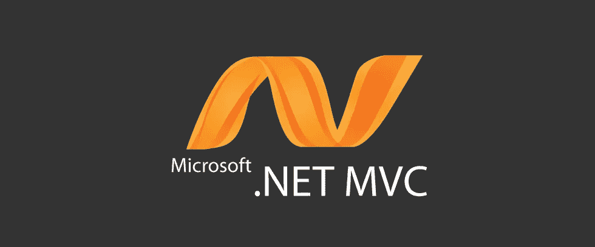

# 将博客添加到现有。NET Web 应用程序

> 原文：<https://medium.com/hackernoon/options-for-adding-a-blog-to-an-existing-net-web-app-4a990ee7e046>



如果您有一个现有的网站或应用程序，突然需要像博客这样的高级内容管理功能，您会怎么做？拆了在 WordPress 这样的博客平台上重建？将自己的博客作为现有网站的一个组成部分？这两种解决方案都需要大量的工作。围绕一个特定的平台重新构建一个应用程序不是一件简单的事情，您的应用程序将永远与这个平台结合在一起。考虑到写博客是一个已经解决了很多次的问题，建立自己的博客系统似乎是一种浪费。

理想情况下，你可以利用一个现有的博客平台，将它整合到你的网站中，只需对你现有的做最小的改动。为了找到一个符合这个要求的平台，我们需要从一个基本需求清单开始。这里有一些我们需要的东西:

*   **关注点分离:**假设我们有一个 web 应用程序，其现有的业务逻辑与博客无关。我们不想给应用程序本身增加博客功能——我们想保持它的实现是独立的，但从用户的角度来看是无缝集成的。
*   **最少的开发人员工作:**我们不想为了在应用程序和博客页面上获得相同的外观和感觉而维护视图模板的不同版本。
*   **常见的博客功能:**我们不妨定义一下博客的含义——我们需要创建博客帖子和单个页面的能力，与多个作者打交道，并拥有发布工作流。

当我们这样做的时候，我们还应该考虑一些“值得拥有”的东西:

*   粒度(Granularity):如果能够用博客驱动页面的特定部分就好了，而不是采取全有或全无的方法，即某些页面完全由博客控制，而其他页面必须在没有博客支持的情况下完全存在。例如，我们可能有一个现有的应用程序，它有一个登陆/登录页面。如果我们可以在侧边栏中显示最近的帖子列表，而不必将整个页面的控制权移交给博客平台，那就太好了。
*   **语言不可知**:我们更喜欢一个通用的解决方案——如果 [CMS](https://hackernoon.com/tagged/cms) 碰巧是用不同于我们现有应用程序的语言编写的，我们不必担心维护两个独立的运行时。
*   **主持人**:如果我们可以完全避免支持博客的实现，那就太理想了。如果我们真的想把它从我们现有的应用程序中分离出来，我们很可能会以[维护](https://hackernoon.com/tagged/maintaining)两个独立的代码体和两个独立的数据库而告终。最好的情况是，我们可以使用托管解决方案，但显示内容和页面，就好像它们是我们自己网站的一部分。这也可能使我们不必担心上面提到的多运行时问题。

对于我们的例子来说，假设我们有一个用. NET 编写的 web 应用程序，那么什么样的博客平台能满足我们的需求呢？

# wordpress 软件

考虑到 WordPress 的受欢迎程度和出色的社区支持，认真考虑它是很自然的。它当然有我们创建页面和博客文章所需的功能。然而，除此之外，我们很快就会遇到问题。

WordPress 的托管实例是存在的，但是我们如何将这些整合到一个现有的网站中还不清楚。如果我们的站点在`example.com`，我们可以将`blog.example.com`指向我们托管的 WordPress，但是如果我们不想这么做呢？这种解决方案缺乏灵活性。这也意味着我们可以忘记粒度。

如果我们希望我们的博客驻留在`example.com/blog`，我们需要自己托管它，并将某些页面发送到 WordPress。同样，这缺乏粒度。没有简单的方法从 WordPress 中提取最近的文章标题列表，并将其插入到我们的。NET 应用程序可能会使用。这也意味着我们必须维护自己的 WordPress 代码、数据库和 PHP 运行时，以及为 WordPress/PHP 编写的视图模板的单独版本。

# DotNetNuke / SiteFinity

DotNetNuke 是一个流行的。NET CMS 通过插件模块支持博客。利用 DNN 或其他人。像 SiteFinity 这样的. NET CMS 可以立即缓解维护独立技术栈的问题——但这仅仅是因为我们的示例 web 应用程序碰巧是用. NET 编写的。

我们还需要维护一个单独的数据库，或者在我们现有的模式中包含 CMS 数据库表。

# 卷你自己的

开始感觉像是推出我们自己的博客平台，虽然是一个糟糕的解决方案，但和前面提到的那些一样好。我们可以根据自己的需要将它细化，随意将单个内容字段或整个页面放入现有的模板中。也许我们可以用这样一种方式来设计我们的代码，将博客代码与现有的应用程序完全分离。但是这仍然需要大量的努力和费用。

当考虑建立我们自己的博客时，很明显我们真正需要的是一个博客引擎。我们需要逻辑和管理 UI 来管理内容，但没有前端——它应该完全不受路由、模板和呈现页面的影响。这将给我们处理内容的工具，同时给我们以我们认为合适的方式显示和整合内容的灵活性。

# 无头内容管理

“博客引擎”的另一个词，按照我们的设想，可能是一个*无头博客*或*无头 CMS* 。这是一个 CMS，有后端，但没有前端。内容是通过引擎的 API 获取的，但是向用户显示内容则完全由开发人员决定。由于其灵活性和非侵入式集成，这种架构最近变得非常流行。

一个这样的平台是 ButterCMS。这是一个托管解决方案，带有一个管理仪表板，用于编辑博客文章、处理创作工作流、国际化等。通过这个后端创建的内容通过 REST API 公开，可以通过用多种语言(包括 C#/编写的各种客户端库访问该 API。网)。

这可能有用。让我们看看我们的需求，看看它是否能满足我们的需求:

*   **关注点分离:**因为 ButterCMS 是托管的，所以代码、数据库和维护完全由 ButterCMS 处理。
*   **最少的开发工作:**通过调用 REST API，使用字符串键来识别页面和博客文章，从而获取内容。在大多数情况下，显示一个页面就像向 API 请求原始 HTML 内容一样简单，将它放在视图模板中，然后呈现它。
*   **通用 CMS 特性:**博客文章、自定义页面、多作者和发布工作流都受支持。
*   **粒度:** ButterCMS 允许创建多种类型的内容，从整个页面到文本字段，再到简单的对象和数组结构。
*   **语言不可知:**官方 Ruby，JavaScript，Python，PHP，和。当前存在. NET 客户端。
*   托管: ButterCMS 是一个完全托管的解决方案。您所需要的只是一个帐户、一个 API 密匙和一个您选择的语言的客户端。

通过 API 客户端获取内容并呈现它听起来确实很简单，但是让我们尝试一下以确保万无一失。我们将用 C#实现一个简单的[ASP.NET](http://asp.net/)MVC 控制器来为一条路线呈现合适的博客文章。

在此之前，我们需要一个 ButterCMS 帐户。注册并登录后，我们可以在控制面板的左上角单击我们的名字。在出现的下拉菜单中，单击“设置”并转到 API 选项卡。这将显示我们的 API 令牌。我们需要将这个令牌传递给我们的 API 客户机，客户机在每次请求时将这个令牌传递给 ButterCMS API 来标识我们。

我们还需要一些博客文章来渲染。点击左侧边栏菜单上的“新文章”。写“我的第一篇测试文章”作为标题，并添加一些内容(不管是什么，我们只需要一些东西来渲染)，然后单击顶部的“发布”按钮。然后做同样的事情添加另一个帖子，但标题是“我的第二个测试帖子”。

每个帖子都有一个唯一的可读标识符，称为“slug”，默认情况下由帖子标题自动生成。我们刚刚创建的两个帖子的 slugs 分别是“我的第一个测试帖子”和“我的第二个测试帖子”。我们将在 MVC 控制器中使用这些来处理路由到适当的 post。

在我们的 MVC 应用程序中，我们首先需要安装 [ButterCMS NuGet 包](https://www.nuget.org/packages/ButterCMS/)。这个包包含我们将用来与 API 通信的客户端。

安装完这个包之后，让我们制作一个新的 MVC 控制器，我们将使用它来呈现博客文章:

```
using ButterCMS;
using System.Threading.Tasks;
using System.Web.Mvc;
using System.Net;namespace MyApp.Controllers 
{
  public class BlogController : Controller 
  {
    private static string _apiToken = "{your_api_token}"; private ButterCmsClient _client; public BlogController() 
    {
      _client = new ButterCMSClient(_apiToken);
    }
  }
}
```

这将创建一个新的 ButterCMS 客户端，它被配置为从我们刚刚创建的 ButterCMS 帐户获取内容。现在，让我们创建一个简单的路线，并获取我们的邮件。

```
public class BlogController : Controller 
{
  /// ... [Route("blog/{slug}")]
  public async Task<ActionResult> ShowPost(string slug) 
  {
    var response = await Client.RetrievePostAsync(slug);
    ViewBag.Post = response.Data;
    return View("Post");
  }
}
```

这将根据我们通过 URL 传递的 slug 为我们获取一篇博客文章的内容。因此，如果我们启动应用程序并导航到`http://{my_app_host}/blog/my-first-test-post`，我们将获取我们写的第一篇文章的内容。

显然这是不完整的——我们还没有制作一个“Post”视图模板来呈现。让我们现在就开始吧:

```
<h2>@ViewBag.Post.Title</h2>@Html.Raw(ViewBag.Post.Body)
```

这只是呈现文章的标题和正文内容。我们应该总是使用`@Html.Raw()`来呈现文章内容，因为 ButterCMS 使用 HTML 标签进行格式化，无论是手动还是使用其内置的 WYSIWYG 编辑器。

就是这样！很简单。API 客户端有其他方法来列出和分页文章，按作者或类别获取文章，等等。，但它们都像上面的例子一样容易使用。

*本文原载于 ButterCMS 博客上的*[](https://buttercms.com/blog/options-for-adding-a-blog-to-an-existing-dot-net-web-app)**。ButterCMS 是一个* [*托管的 API-first CMS*](https://buttercms.com/api-first-cms/) *和* [*博客引擎*](https://buttercms.com/blog-engine/) *让您使用任何编程语言构建基于 CMS 的应用程序，包括*[*Ruby*](https://buttercms.com/ruby-cms)*、*[*Rails*](https://buttercms.com/rails-blog-engine/)*、* [*Node.jsNET*](https://buttercms.com/nodejs-cms) *，*[*Python*](https://buttercms.com/python-cms)*，*[*React*](https://buttercms.com/react-cms)*，*[*Angular*](https://buttercms.com/angular-cms)*，*[*PHP*](https://buttercms.com/php-cms)*，*[*Laravel*](https://buttercms.com/laravel-cms)*

*[](http://bit.ly/HackernoonFB)**[](https://goo.gl/k7XYbx)**[](https://goo.gl/4ofytp)*

> *[黑客中午](http://bit.ly/Hackernoon)是黑客如何开始他们的下午。我们是 [@AMI](http://bit.ly/atAMIatAMI) 家庭的一员。我们现在[接受投稿](http://bit.ly/hackernoonsubmission)并乐意[讨论广告&赞助](mailto:partners@amipublications.com)机会。*
> 
> *如果你喜欢这个故事，我们推荐你阅读我们的[最新科技故事](http://bit.ly/hackernoonlatestt)和[趋势科技故事](https://hackernoon.com/trending)。直到下一次，不要把世界的现实想当然！*

**