# 订单接受者与价值创造者

> 原文：<https://medium.com/hackernoon/order-takers-vs-value-builders-f4cd387462b8>

一线个人贡献者接触机器，他们关心影响。他们熬过了银子弹、紧急任务、被要求抄近路的痛苦，以及闪闪发光的物体带来的灾难。他们知道在某件事情上工作了几个月，结果却成了泡影，或者更糟的是，作品被运出去，没有被顾客使用。

核心问题是个人能动性、自主性、工艺和创造影响力的愿望。充满激情的问题解决者不想成为命令接受者。除非问题得到解决(近期和长期)，否则他们不会感到满意。在我的职业生涯中，我一遍又一遍地听到这句话…

> 它就像一个传送带。我们因产出而获得奖励。还不清楚这些东西是否有用！我进入这个行业不是为了成为售票机。

这不仅仅是头条新闻。你会从经理和副总裁那里听到同样的话，他们的反应和产出与他们创造和保持的价值相比是被衡量的。我们有时称之为“在餐桌上获得一个座位”，但我认识的很多坐在“餐桌”上的人都有同样的挣扎。

我没有什么神奇的地方。只是大声思考和制作剪贴画卡通。我认为“要点”是，在许多关于软件开发的争论的基础上，你有人类和他们创造影响的需要(相对于控制、确定性和邀功的其他需要)。

考虑这些权力动态…

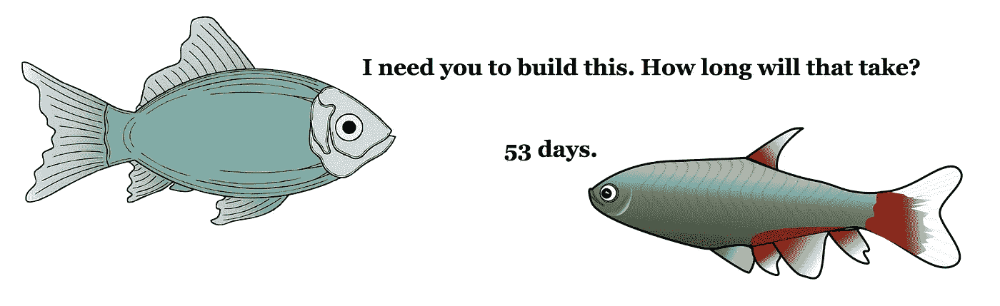

The ticket-machine.

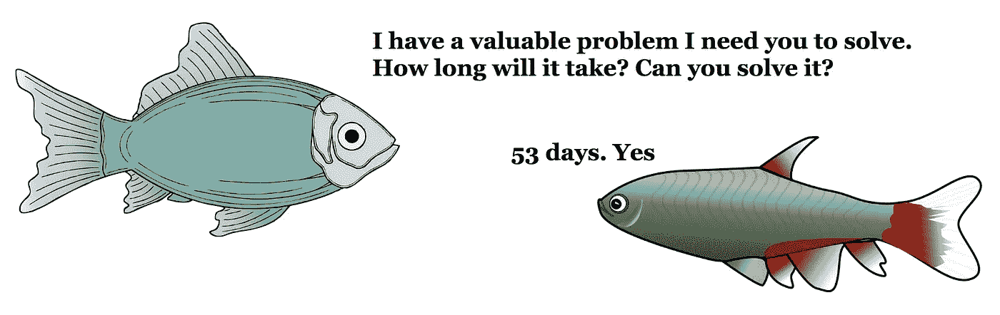

A problem is presented …

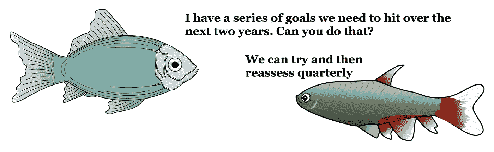

More autonomy to achieve those goals …

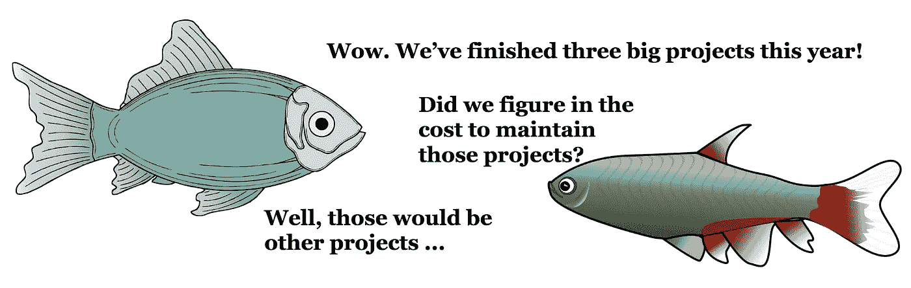

Projects create complexity that must be managed.

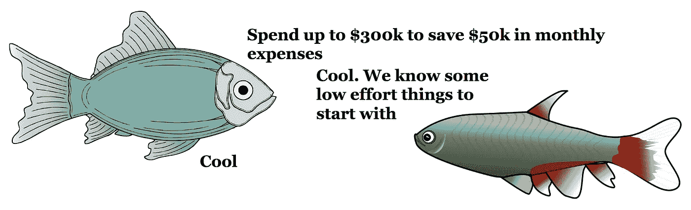

Some autonomy and guard rails.

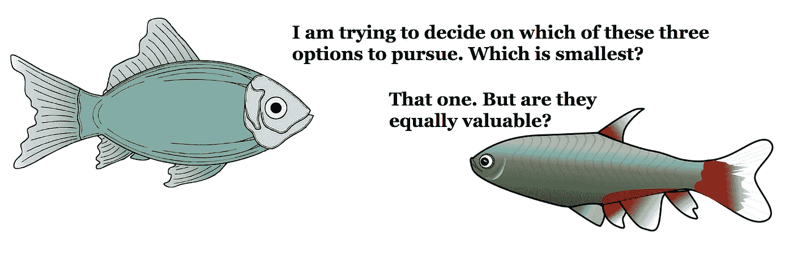

“Size” can play a role in prioritization. But value is the key ingredient …

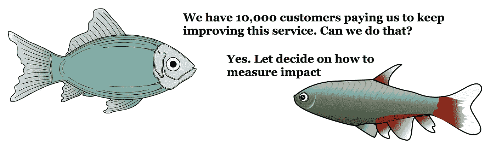

When customers “rent”, the challenge shifts to measuring impact …

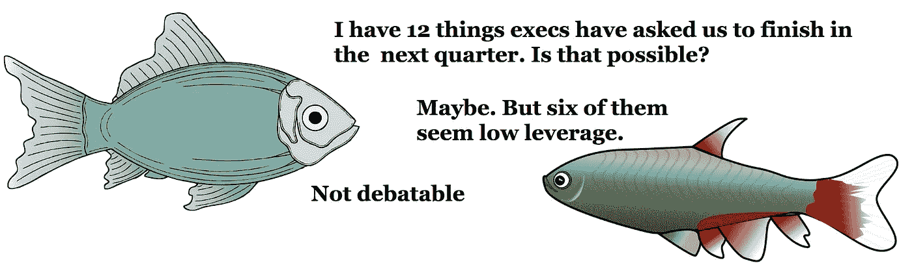

Rejected! Rightmost fish doesn’t understand the game.

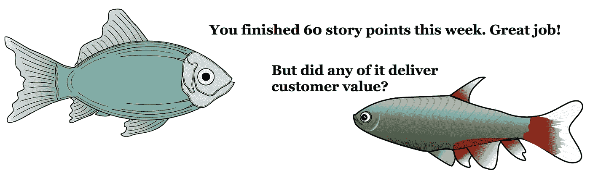

Engaged employees care if the work had any impact.

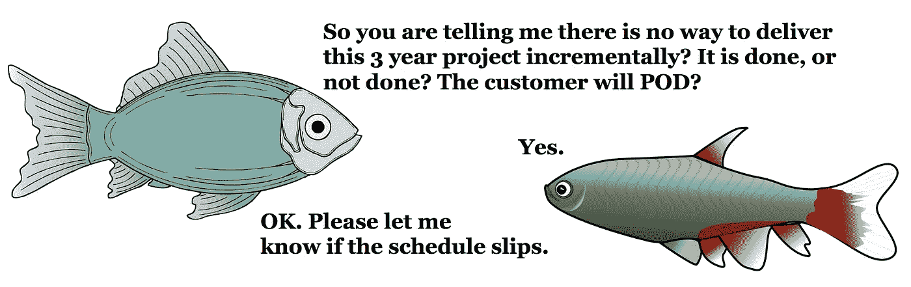

Customer pays on delivery. Value delivery is binary, not continuous …

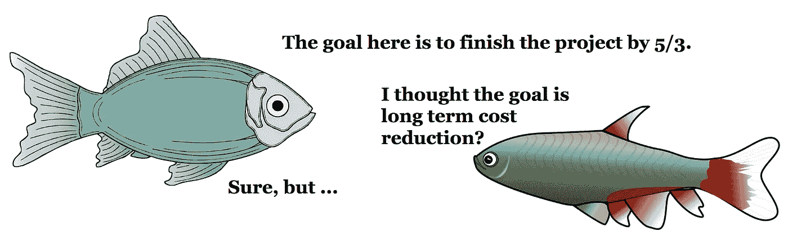

One person’s goal, is another person’s proxy metric.

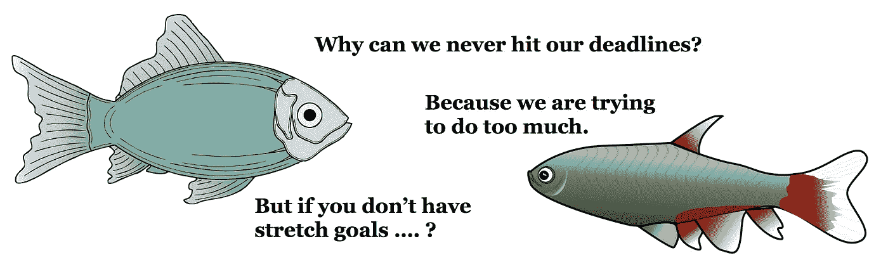

If people don’t give us estimates, how will we hold them accountable?

> [黑客中午](http://bit.ly/Hackernoon)是黑客如何开始他们的下午。我们是 [@AMI](http://bit.ly/atAMIatAMI) 家庭的一员。我们现在[接受投稿](http://bit.ly/hackernoonsubmission)，并乐意[讨论广告&赞助](mailto:partners@amipublications.com)机会。
> 
> 如果你喜欢这个故事，我们推荐你阅读我们的[最新科技故事](http://bit.ly/hackernoonlatestt)和[趋势科技故事](https://hackernoon.com/trending)。直到下一次，不要把世界的现实想当然！

