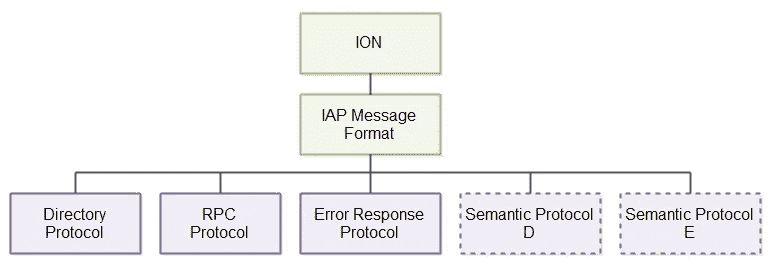

# 我们雄心勃勃地追求分布式系统的民主化——第一幕:协议

> 原文：<https://medium.com/hackernoon/our-ambitious-quest-to-democratize-distributed-systems-act-1-protocols-b6bec5297213>

在我们的[上一篇文章](https://hackernoon.com/should-early-stage-startups-adopt-microservices-50280c77603a#.wiemqlih2)中，我们提出了早期初创企业是否应该采用微服务架构的问题。今天，我们将进一步强调分布式系统可以给初创公司带来的巨大潜力，并提出一种采用新型分布式系统的简单可行的方法，使用我们目前在 Nanosai.com[研发的一些工具。](http://www.nanosai.com)

**为什么要实现分布式系统？**

几年前，分布式计算的好处似乎只集中在学术研究的用例上。经常引用的一个常见用例是，科学家能够通过跨学科/跨机构的协作，使用网格计算轻松执行原本需要几个月才能完成的大量数据处理/分析任务，从而解决基因组学等领域的科学难题。

快进到今天，我们生活在一个 24/7 数据驱动的世界，据估计，我们平均每天生成约 2.5 万亿字节的数据，其中许多数据是由谷歌、脸书、亚马逊、网飞等家喻户晓的热门服务的用户生成的。思科最近的一份[报告也预测如下:](http://www.cisco.com/c/en/us/solutions/collateral/service-provider/visual-networking-index-vni/vni-hyperconnectivity-wp.html)

●到 2020 年，每两分钟就会有相当于所有电影的千兆字节(GB)通过全球互联网。

●在全球范围内，IP 流量将在 2020 年达到 511 万亿比特每秒(Tbps)，相当于 1.42 亿人每天全天同时传输互联网高清(HD)视频。

●2020 年全球 IP 流量将相当于每年 5040 亿张 DVD，每月 420 亿张 DVD，或每小时 5800 万张 DVD。

构建更智能的分布式系统来处理如此大量的数据，对于初创公司和消费者来说都是一个巨大的机会。例如，对于金融服务领域的初创公司来说，这使它们在挑战大型现有金融机构方面处于有利地位，这些机构主要依赖集中式遗留技术，而这些技术并不是为当前连通性和大数据的爆炸而设计的。对消费者来说，它提供了更多的选择和更好的服务质量，而且价格比大公司更有竞争力。

**为什么协议很重要？**

良好的通信是分布式系统顺利工作的关键，因为节点需要能够在内部彼此适当通信，并且通常还需要在外部通信，这取决于系统是否需要访问第三方或向第三方公开。

今天，开发人员在构建现代分布式系统时面临的一个基本挑战是，目前没有可行的标准协议可以让他们更容易地实现分布式系统，就像 HTTP 为旧 web 所做的那样。在处理现代分布式系统(如微服务)时，关于节点如何相互通信的一种常见方法是使用同步协议(如 HTTP/REST)或异步协议(如 AMQP)。我们说 HTTP 是一个同步协议，因为它以请求/响应模式工作，即客户端发出请求并等待响应(通常等待时间很长！).另一方面，与 HTTP 方法相反，消息传递(例如 AMQP)方法是异步的，因为作为客户端，您不需要等待响应，特别是对消息的响应可以以不同于它们被发送的顺序被发送回来。

为了解决开发人员今天面临的协议挑战，在 [Nanosai](http://www.nanosai.com) 我们正在开发一种新的开放式网络协议，称为 IAP，旨在为现代分布式系统带来更广泛的适用性、性能、简单性和智能，作为智能生态系统的一部分。我们从零开始设计 IAP，目的如下:

成为 HTTP、FTP、SNMP、ODBC、RPC 等的可行替代/补充。

支持比 HTTP 更多的消息流和用例

比 HTTP 更简单、更通用

比 HTTP 更简洁

比 HTTP 聪明得多

**什么是 IAP 协议？**

简而言之，IAP(参见 [IAP 规范](http://tutorials.jenkov.com/iap/index.html))是一个异步的面向自由流消息的协议。自由流动是指消息可以在通信节点之间自由地双向流动。IAP 并不局限于 HTTP 或其他 RPC 协议的请求-响应通信模式。作为一个面向自由流消息的协议意味着，例如，以下任何一种情况都是有效的:

*   a 向 B 发送了 N 条消息，而 B 没有响应。
*   a 向 B 发送 N 条消息，B 每 M 条消息响应一次。
*   a 向 B 发送 1 条消息，B 用 1 条消息回应。
*   a 向 b 发送 1 条消息，b 向 a 发送 N 条消息。
*   b 向 A 发送了 N 条消息，A 没有响应。

IAP 的一个有趣的特性是它的消息是用一种叫做 ION 的二进制编码来编码的。ION 类似于 JSON 的二进制版本，但在网络上更紧凑，读写更容易、更快，而且它的数据类型比 JSON 多一些。从本质上讲，IO 更加通用，可用于数据文件、日志文件和网络消息等。我们将在以后的文章中提供更多的细节。

IAP 的另一个有趣的特性是，它允许开发人员在基本消息格式的基础上定义不同的语义协议。基本消息格式包含一组在网络通信中经常使用的字段。因此，语义协议可以扩展这种消息格式，并添加特定于协议的字段。

我们的最终目标是使 IAP 成为 HTTP 的可行替代方案，并能够支持更广泛的消息交换模式。我们相信，为了创建一个更通用的互联网通信，我们真的需要一个比 HTTP 更通用的协议。事实上，我们的联合创始人兼首席技术官 Jakob Jenkov 也写了一篇文章“为什么 HTTP2 和 WebSockets 还不够”( T1 ),解释了为什么我们需要放弃 HTTP。

最后，在接下来的几周和几个月里，我们会在后续的帖子中与你分享我们的旅程，即**第二幕**，**第三幕** … **第 N 幕**。与此同时，请随时访问[github.com/nanosai](https://github.com/nanosai)查看我们的代码并了解我们的最新进展。

*由*[*Zaiku*](http://zaiku.co.uk/)*联合创始人 Bambordé Baldé发布。*

> [黑客中午](http://bit.ly/Hackernoon)是黑客如何开始他们的下午。我们是 T21 家庭的一员。我们现在[接受投稿](http://bit.ly/hackernoonsubmission)并乐意[讨论广告&赞助](mailto:partners@amipublications.com)机会。
> 
> 如果你喜欢这个故事，我们推荐你阅读我们的[最新科技故事](http://bit.ly/hackernoonlatestt)和[趋势科技故事](https://hackernoon.com/trending)。直到下一次，不要把世界的现实想当然！

