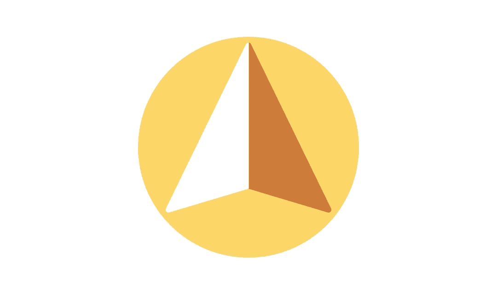
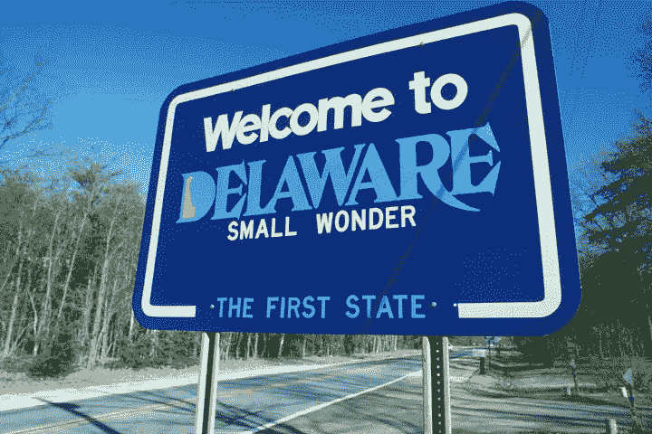

# 我们对条纹图谱的体验

> 原文：<https://medium.com/hackernoon/our-experience-with-stripe-atlas-fcccafe6fff8>

## 在朋友们的帮助下，我们度过了难关

现在，我们已经完全合并，并开始在我们的银行账户上收到一些钱，是时候总结和回顾我们用 Stripe Atlas 合并我们公司的经历了。

**TL；博士**:太棒了。

提醒一下， [Stripe Atlas](https://stripe.com/atlas) 是一项帮助你从地球上任何地方开始全球业务的服务。只需 500 美元，他们就能及时地在美国(特拉华州、[因为显而易见的原因](http://www.bendlawoffice.com/2011/08/01/reasons-to-incorporate-in-delaware/))注册你的公司，帮你开一个[硅谷银行](https://www.svb.com/)账户和与之关联的 Stripe 账户。其他额外待遇包括 15，000 美元的 AWS 促销积分(通过 [AWS 激活](https://aws.amazon.com/activate/))以及来自 [Orrick](https://www.orrick.com/) 和 [PwC](https://www.pwc.com/) 的免费(但有限)建议。

当一些人(主要是朋友和家人)对我们正在建设的东西感兴趣，并希望投资一些资金来帮助我们时，我们有义务建立一个法律实体，以便能够接受这些资金。

我们最严肃的选择是在比利时(因为大多数创始人都在那里)或美国建立业务。此时，我们申请了 Stripe Atlas，并不真正知道我们是否(以及何时)会被选中。

## 那么，为什么选择美国呢？

在美国创业的主要优势是成为一家全球性公司。由于我们的业务是 100% SaaS 的，潜在客户遍布全球，这对我们来说很有意义。

此外，如果你对自己的企业真的很认真，很有抱负(我认为你应该如此)，如果你想在某个时候从美国顶级投资者那里融资，拥有一家美国公司可能是一大优势。投资人一般不是找理由投资你的企业，而是找理由不投资你的企业。对于一个美国投资者来说，不是一家美国公司(尤其不是一家特拉华州的公司)可能是一个很好的理由来淘汰你，甚至不看看你在做什么。

另一方面，处理外国和未知的法律法规可能会令人生畏，而且美国并不是一个创业者从政府那里获得大量财政援助的国家(这在比利时和欧洲其他国家是很常见的事情)。

回过头来看，这两个主题毕竟不是什么大问题。处理美国法律并不那么麻烦，因为你可以在网上找到几乎所有你想找的东西。多亏了 Stripe Atlas，我们有机会与之交谈的顾问们也很有帮助。

你也意识到，如果你一开始没有被抢劫，你并不真的需要公共财政援助。在比利时创建 SPRL/BVBA，资本必须在公司成立时全部认缴，[金额为 18，550€](https://www.business.belgium.be/en/managing_your_business/setting_up_your_business/company_types/private_limited_liability_company)(其中€6，200 必须实际缴入 SPRL/BVBA 账户)。此外，公司章程必须在公证人面前书写。你需要亲自出现在一个陌生人的办公室里，这个人你从未见过，以后也不会再见到，以确保你的公司能够被合并。

*有人能解释一下为什么这个职业在 2017 年还存在，为什么有用吗？*

现在，将这一切与 Stripe Atlas 要求的 500 美元相比，毫无疑问，你就会明白为什么我们一被录取就跳上了 Stripe Atlas 列车。

Our company is based in Delaware but we might never go there for our entire life.

## 一旦你上了条纹阿特拉斯列车，会发生什么

整个过程花了大约两个星期，在十二月底我们的 [EIN](https://en.wikipedia.org/wiki/Employer_Identification_Number) 的接待中结束。如果我们阅读、讨论和签署他们交给我们的所有法律文件的速度不那么慢的话(那是在假期期间，我们都非常忙着吃喝),可能用不了 10 天。

事后看来，我们实际上应该在提交签署的文件之前再等一会儿，因为尽管我们的公司在 2016 年只存在了几天，但我们必须支付全年 400 美元的税款。

除了我们本可以轻松避免的错误，一切都超级顺利，在流程的每一步都收到了电子邮件，与 Stripe 工作人员进行了友好的讨论，我们可以无缝地用 [DocuSign](https://www.docusign.com/) 或 [HelloSign](https://www.hellosign.com) 电子签署文件。

*是的，我们在 2017 年，再也不需要打印/签名/扫描了。*

在那之后，我们被介绍给了一位律师，并不得不额外支付 250 美元来购买 Stripe Atlas 公司合并后的套餐。我们必须决定我们公司的总股份数、每位创始人的股份数、我们的授权时间、授权悬崖日期以及在触发事件(如收购我们公司)发生时我们的授权将如何加速。

250 美元对于把所有这些东西写在官方文件上是非常便宜的。作为对比，我们被问及€1500 英镑买类似的东西。

为了能够从投资者那里获得资金，我们流程的最后一步是签署可转换票据合同。可转换票据是一种可以转换成股票的短期债务。投资者借钱给一家初创公司作为第一轮融资，而不是连本带利地收回他们的钱，他们在第一轮融资(通常是种子或首轮融资)后获得公司的股份。

我们决定采用一种叫做 [SAFE](https://www.ycombinator.com/documents/) 的改良形式的可转换票据，因为它们对企业家更友好，同时对投资者来说仍然和旧的一样好。我们主要是要决定我们的超早期投资者的估值上限和折扣，就是这样，我们准备好了！

## 现在登机

作为一个结论，我想说 Stripe Atlas 是一个伟大的推动者，我毫无疑问地向任何人推荐它。在做这些对我们这些没有法律或金融经验的普通公民来说非常陌生的事情时，得到他们的支持非常有用。这有助于我们专注于我们的主要使命，即打造人们愿意使用和购买的令人惊叹的产品。

## 需要邀请吗？

这里是。

> [黑客中午](http://bit.ly/Hackernoon)是黑客如何开始他们的下午。我们是 [@AMI](http://bit.ly/atAMIatAMI) 家庭的一员。我们现在[接受投稿](http://bit.ly/hackernoonsubmission)，并乐意[讨论广告&赞助](mailto:partners@amipublications.com)机会。
> 
> 如果你喜欢这个故事，我们推荐你阅读我们的[最新科技故事](http://bit.ly/hackernoonlatestt)和[趋势科技故事](https://hackernoon.com/trending)。直到下一次，不要把世界的现实想当然！

