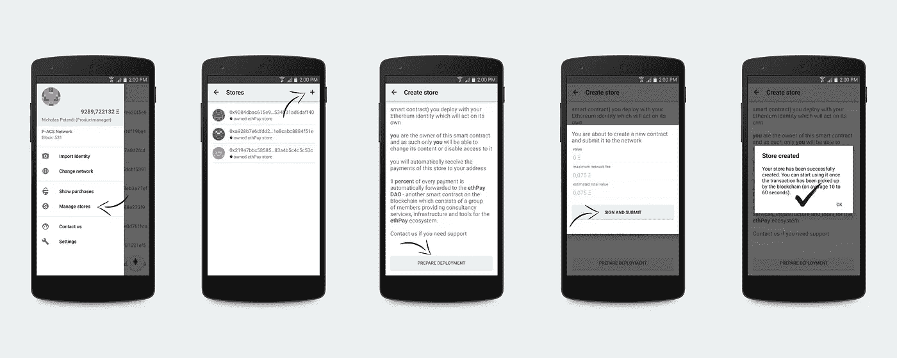
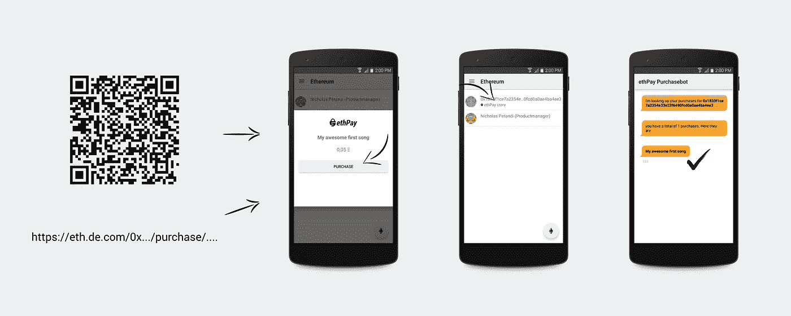

# 我们的首款移动 dApp

> 原文：<https://medium.com/hackernoon/our-first-mobile-dapp-7653cd1ec087>

除了对几个主要行业非常有吸引力之外，区块链技术还具有在全球范围内推动繁荣的潜力。现在可以在双方之间直接安全地转移价值，不需要中间人，也不需要银行账户，这一事实可能会对我们如何看待货币和贸易产生巨大影响。智能合约(运行在区块链上的小块代码)实现了全新的去中心化商业模式，每个人——包括我们自己——都对未来充满期待。

如果你没有关注我们过去几个月的进展，我们正在 Android 上开发一个[移动平台](https://ethereum-android.com/)，它涵盖了区块链以太坊的一系列用例。可能的利益相关者不仅是希望通过平台的钱包部分发送和接收以太网的最终用户，还包括可以使用我们的 API 让他们的应用程序代表用户发送交易和访问智能合同的 Android 开发者([了解更多](/@pacs_IT/an-ethereum-api-for-android-app-developers-3f46b820f8f6))。

自从我们的平台进入[公测](/@pacs_IT/ethereum-android-goes-beta-e4eb404b4f53)以来，来自世界各地的人们开始使用它，并给我们反馈下一步要改进什么和增加什么。我们决定，展示人们如何在移动环境中受益于区块链技术的最佳方式是基于我们的平台开发一款产品。

## ethPay——一个分散的支付框架

ethPay 是一款 dApp，让您只需使用手机就能轻松销售产品和服务。但是在更详细地讨论之前，让我们先来看一个例子。

我非常喜欢弹吉他，很多人都说我很有天赋，所以我想尝试一下，录了我的第一首歌。人们喜欢这首歌，并告诉我，我甚至可以用它赚钱。然而，我不想花太多精力来赚钱，所以我用 ethPay 创建了一个商店，并生成了一个可以用来购买我的歌曲的链接。

我从创建一家新商店开始:

Creating a new store

正如你所看到的，我已经拥有三家商店，我也可以用其中一家来卖我的歌，但我更喜欢把我的生意分开，所以我只为我的音乐创建了一家。

一旦创建了商店，我就生成一个新的报价，包含我的产品的标题、价格和可选的标识符(这有助于我对购买的商品进行分类)。

Generating a new offer

该应用程序生成了一个链接，我可以在任何地方分享，让人们有可能购买我的歌曲。例如，我可以建立一个 facebook 粉丝页面，将我的歌曲样本和这个链接一起上传，或者我也可以生成一个链接的二维码，将其打印出来，并发布到任何我想让人们扫描的地方。

然后，客户只需打开链接或用应用程序扫描代码，就能看到详细信息:

Making a purchase

就是这样！我刚刚在几分钟内卖出了我的第一首歌！

ethPay 的预览版已经是我们最新发布的钱包应用的一部分。当时它只在我们的私人测试链上运行，所以还不可能在主网络上购买。正如你在截图中看到的，在 UI 和元数据方面还有很多工作要做，例如商店命名和顾客与商家之间的沟通渠道。我们想向您展示我们的进展，并邀请您参与测试阶段。

> [黑客中午](http://bit.ly/Hackernoon)是黑客如何开始他们的下午。我们是 [@AMI](http://bit.ly/atAMIatAMI) 家庭的一员。我们现在[接受投稿](http://bit.ly/hackernoonsubmission)并乐意[讨论广告&赞助](mailto:partners@amipublications.com)机会。
> 
> 如果你喜欢这个故事，我们推荐你阅读我们的[最新科技故事](http://bit.ly/hackernoonlatestt)和[趋势科技故事](https://hackernoon.com/trending)。直到下一次，不要把世界的现实想当然！

