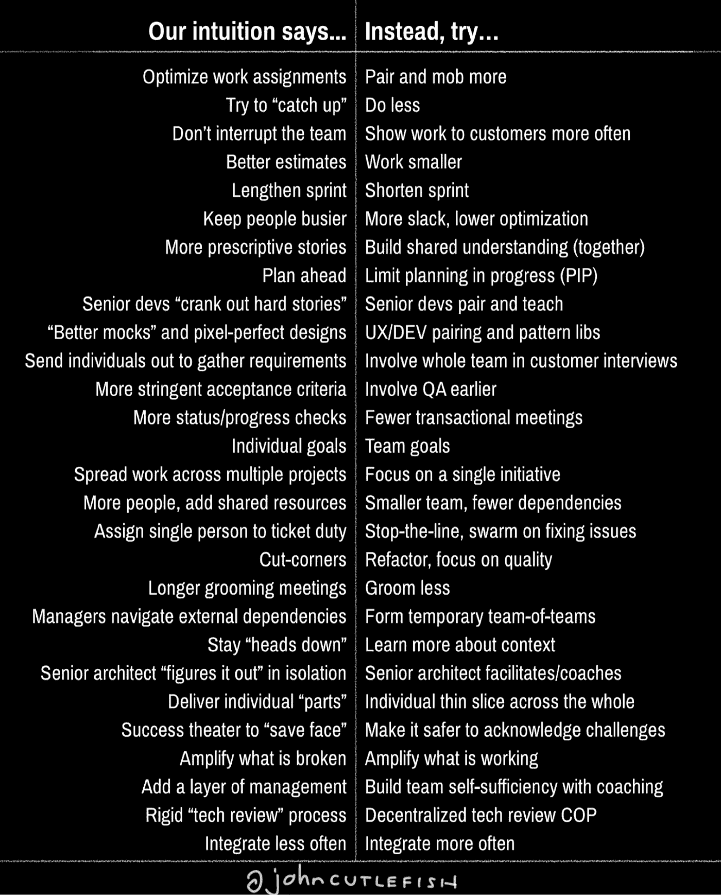

# 我们的直觉告诉我们……相反，尝试……

> 原文：<https://medium.com/hackernoon/our-intuition-says-instead-try-7808c0bfd0bb>

当你看到一些工作时，你倾向于认为它更“直观”。人们很容易忘记最初的感觉是多么违反直觉。下面是我们直觉可能会让我们误入歧途的领域的快速头脑风暴。

## 当我们遇到软件产品开发的阻力时…

# 我们的直觉(经常)说…——>相反，尝试…

*   优化工作分配— > **结对，群殴更多**
*   试着“赶上”——**少做**
*   不要打断团队— > **更频繁地向客户展示作品**
*   更好的估计— > **工作更小**
*   加长冲刺— > **缩短冲刺**
*   让人们更加忙碌— > **更加懈怠，降低优化**
*   更多说明性故事— > **(共同)建立共识**
*   提前计划— > **限制进行中的计划(PIP)**
*   高级开发人员“制作硬故事”— > **高级开发人员结对授课**
*   “更好的模拟”和像素完美的设计—>**UX/开发配对和模式库**
*   派个人出去收集需求— > **让整个团队参与客户访谈**
*   更严格的验收标准— > **更早地涉及质量保证**
*   更多的状态/进度检查— > **更少的事务性会议**
*   个人目标— > **团队目标**
*   将工作分散到多个项目中— > **专注于单个计划**
*   更多的人，增加共享资源— > **更小的团队，更少的依赖**
*   指派一个人去售票->**停止排队，集中精力解决问题**
*   偷工减料— > **重构，关注质量**
*   较长的培训会议— > **较少的培训**
*   经理浏览外部依赖关系— > **形成临时团队**
*   保持“低调”——**了解更多背景知识**
*   高级架构师独立“计算”——>**高级架构师协助/指导**
*   传送单个“零件”— > **单个薄片穿过整个**
*   成功剧场要“挽回面子”——>**让承认挑战更安全**
*   放大坏掉的东西— > **放大正在工作的东西**
*   加一层管理— > **用教练建立团队自给自足**
*   严格的“技术审查”流程—>**分散的技术审查 COP**
*   少积分— > **多积分**

如果这有所帮助，并且你想在 Twitter 上分享它… [这里有一条附有图片的推文](https://twitter.com/johncutlefish/status/944448608652361728)。