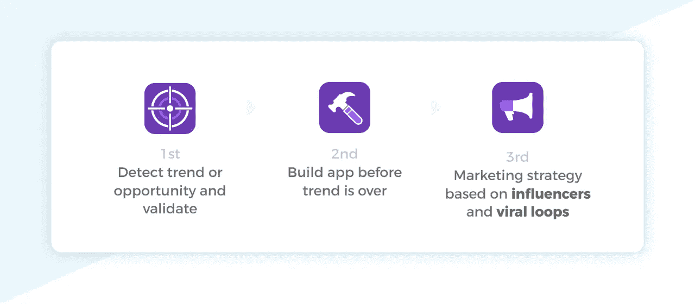
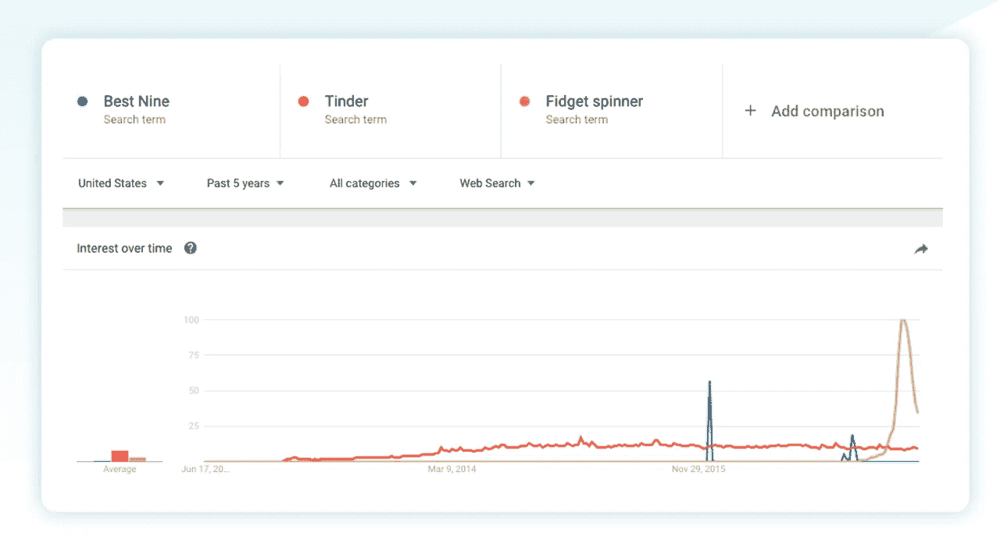
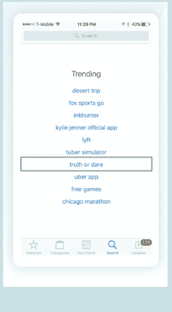
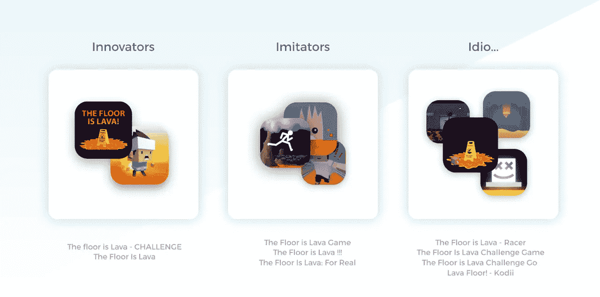
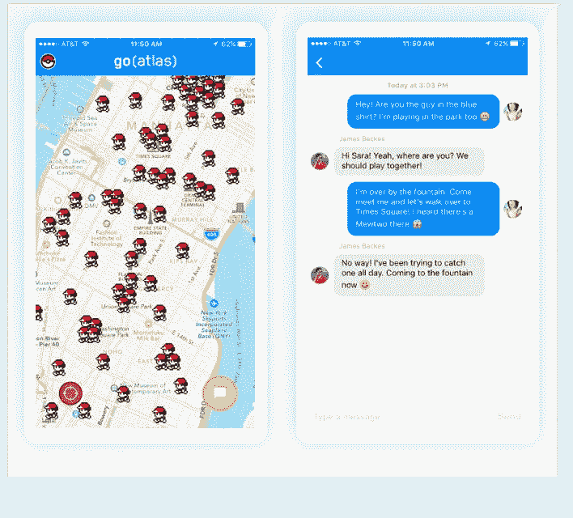
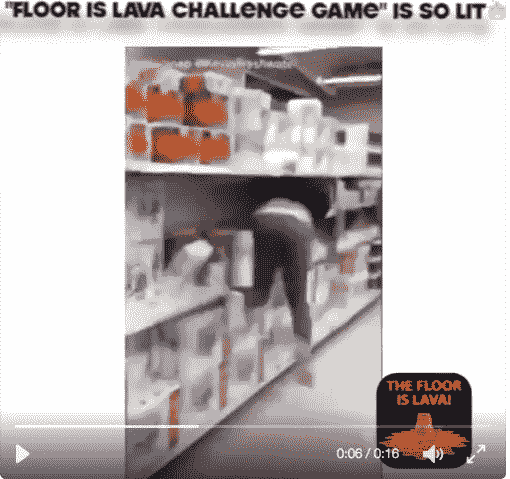
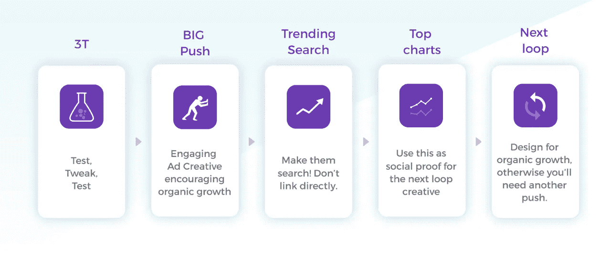
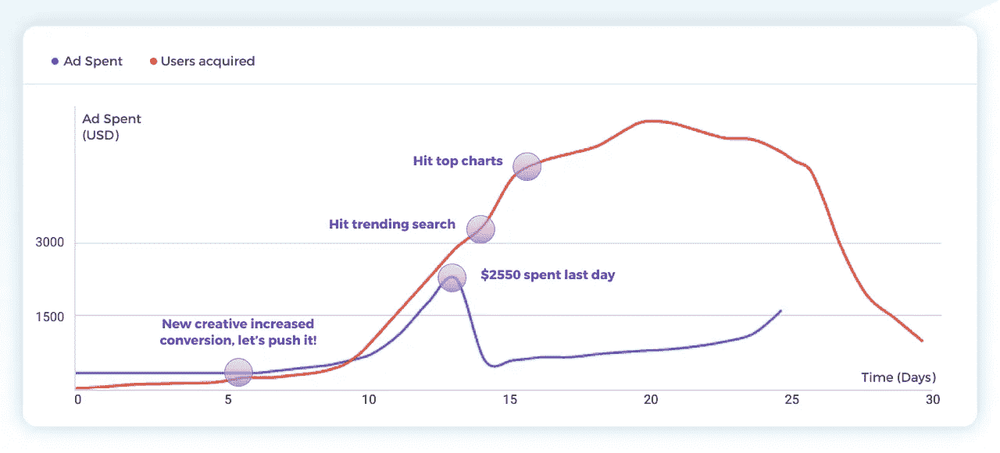

# 一年多前，我们成立了 Beta Labs，目标是为年轻的千禧一代和 z 世代量身定制引人入胜的移动应用。幸运的是，迄今为止，已有超过 400 万用户下载了我们在 2016 年开发的应用。

> 原文：<https://medium.com/hackernoon/our-legacy-to-app-makers-how-we-succeeded-on-the-app-store-and-acquired-4-000-000-users-a66a9e01253d>

## 我们如何在 App Store 上取得成功并获得 400 万用户

今天，[我们想与您分享我们的新重点，Want](/@kevntz/our-vision-for-want-e58ea3c2d46c) 。这一努力不仅仅是创造盈利的“短期”应用程序，这是 Beta Labs 的主要关注点。因此，我们决定花一点时间，分享一些秘密、关键知识和有趣的见解，供其他应用程序开发人员使用营销魔法来获取用户。

Top Nine, Game Switch and Animately on the Charts

# 那么我们成功的关键是什么呢？一个简单的三步过程。

【TL；DR]在 App Store 上有很多成功的方法。我们的结合了**影响者营销和开发利用某种趋势的应用程序。**

**影响者营销一直是我们战略的核心。**我们已经与数百名有影响力的人和拥有大量受众的社交媒体账户的所有者建立了合作关系，主要是基于每次展示或每次发布的计划。

影响者使我们能够成功地宣传和推广我们的应用，但由于 App Store 上有超过 500，000 名活跃开发人员和 2，200，000 款应用，**您需要做的不仅仅是运用出色的营销技巧来从人群中脱颖而出**。在我们的案例中，另一个关键因素是我们总是会利用某种趋势或机会缺口。在这篇文章中，我将只讲述我们在游戏切换方面的经验。

这个过程非常简单:

Our three step process

可以想象，执行并不是那么简单直接。然而，它在大多数情况下对我们很有效。

# 1-发现趋势和机会

【TL；利用季节性趋势。关注排行榜上的新人。在搜索选项卡上发现趋势搜索。定期查看操作系统发行说明。使用移动数据智能平台。

在这关键的一步上，可能有数百种不同的成功方式。我们也用了很多。 [Top 9 是安迪的想法](/@andym/how-we-got-300k-users-in-24-hours-and-reached-1-in-the-app-store-c997a8f83756)，基于每年 12 月 Instagram 用户寻找一款应用程序，该应用程序可以生成一年中他们最好的 9 张照片的拼贴画。**要点是** [**谷歌趋势**](http://trends.google.com) **可能是验证季节趋势**的绝佳工具。看看去年的趋势:

有了游戏切换，我们只看排行榜。“[史蒂夫——跳跃的恐龙](https://itunes.apple.com/us/app/steve-the-jumping-dinosaur-widget-arcade-game/id1090617661?mt=8)”出现在 App Store 的第 150 个位置。我们看到从 iOS 通知中心玩游戏是一个有趣的范例，所以我们马上投入进来。然后它登上了排行榜的榜首，围绕它的[传言开始](https://techcrunch.com/2016/05/23/steve-the-jumping-dinosaur-lands-on-his-feet/)。

了解趋势的另一个**关键方法是查看应用商店中的搜索标签**。这就是 Animately 的情况。我们看到了关键词“壁纸”，在查看了 iOS 9.1.0 的[发行说明的“实时照片”部分后，我们看到了创建实时照片壁纸的机会。**简单的操作系统更新可能会让位于全新应用空间的创建。**](https://developer.apple.com/library/content/releasenotes/General/WhatsNewIniOS/Articles/iOS9_1.html#//apple_ref/doc/uid/TP40016572-SW2)

举个例子，如果你几乎每周六晚上 8 点打开 App Store 搜索标签，你会看到真心话大冒险是一个热门搜索。这是因为在过去的 5 个月里，几乎每个周末都有超过 700 万的用户在搜索关键词“真心话大冒险”。很酷的机会，对吧？是的，这是一个惊人的机会。现在它已经饱和了，它只对那些第一批结果中的人来说很酷，这些结果恰好是第一批创建了一个体面且有吸引力的应用程序的人。与任何其他搜索算法一样，它会偏向旧的算法而不是新的算法。

如果你想通过构建应用程序来创造一个有利可图的业务，关键是要理解**这一步与拥有“应用程序创意”非常不同**我奶奶和我 7 岁的表妹都有 app 的想法。更重要的是**了解潜力、竞争、趋势，以及利用正确的营销策略开发相对简单的产品的机会。**你会发现大量有趣的帖子，讲述如何找到有利可图的机会，[包括呼吁道德装备较差的人利用系统来欺骗更脆弱的用户。](/@johnnylin/how-to-make-80-000-per-month-on-the-apple-app-store-bdb943862e88)

# 在趋势结束之前开发应用程序

【TL；你已经发现了一个趋势或机会；这意味着许多其他人可能也这样做了。以 MVP 的心态快速构建。很多开发者会立刻复制创新者的应用。

在技术上，开发一件东西所花的时间和最终产品的质量之间总是有一个权衡。

Charly 是一个专注于细节、以设计为中心的软件工程师。你明白了，对吧？作为我们工程团队的领导，他希望确保我们的基础设施能够在任何给定时刻处理成千上万的用户，提供最佳的 UX。我们制作的大多数应用程序都像病毒一样传播开来，在排行榜上停留了几天。跻身美国应用商店前 10 名意味着每天至少有 10 万次下载。

如果你正在开发基于趋势的应用程序，请注意，数百个类似的应用程序将会出现。 [**沃伦特·巴菲特的“三个我”**](https://hbr.org/2008/10/wisdom-of-warren-buffet-on-imi) 的理念在 App Store 上得到了完美的体现:首先是**创新者**。然后是**模仿者**。然后就是**傻逼**。白痴充斥着这个行业。

有许多开发人员会对现有的应用程序进行渐进式创新。但是**有很多很多其他人会创建你的应用程序的精确副本。这意味着大致相同的图标，相同的 UX，甚至几乎相同的用户界面。作为一名创新者，你投入时间了解和 A/B 测试高转化率 UX，以获得应用内购买或更好的参与度(=更多广告)。作为模仿者，他们只需要复制就可以了！App Store 处理山寨的方式很让人沮丧。说实话，还有很大的提升空间。**

MVP mindset

**正确地权衡时间和质量可以让你的应用从失败走向成功。**你希望设计令人惊叹，并推出 100%的功能，但最好是创新者之一。如果你不够快，你可能已经是模仿者了。

我们从惨痛的教训中学到了这一点。还记得口袋妖怪 Go 聊天应用吗？你听说过 GoAtlas 应用吗？你当然没有，因为在我们准备发射的时候已经太晚了，所以我们没有发射。我们有信心它将每天处理 30 万活跃用户，不像排名第一的应用程序[因为不能处理](https://www.theverge.com/2016/7/11/12153370/gochat-pokemon-go-chat-app-jonathan-zarra-interview)而崩溃。开发一个大规模实时消息传递的复杂架构，我们花费的时间超过了市场所能等待的时间。

# **3-基于影响者和病毒循环的营销策略**

【TL；DR]如果你想了解病毒循环如何为应用程序工作，请阅读。有影响力的人是执行“大推动”的一种令人惊讶的方式你也会发现许多营销秘诀。

如果你想创建病毒式应用，需要考虑的最重要的一点是，营销策略需要在任何人写一行代码之前就制定好。理想情况下，应用程序需要为增长而设计，将营销策略与产品相结合。否则，你需要对广告创意有一个很好的了解。如果是一个游戏，**考虑使用有影响力的人或随机的人玩游戏的视频。**这就是[彩色开关](https://itunes.apple.com/us/app/color-switch/id1053533457?mt=8)最初成功登顶的原因。围绕一个简单的 [BuildBox](http://buildbox.com) 应用的另一个惊人的营销策略的例子是当前的热门:“地板是熔岩”。看看背后天才们的创意:

Clear brand + engaging video playing floor is lava at Wallmart

## 直播带货

**影响者营销是介于展示推荐的广告和几乎融为一体的微妙的产品提及之间的灰色地带。这也正是美国联邦贸易委员会不喜欢的地方，因为公司“被要求确保其影响者清楚地披露他们什么时候得到了补偿以换取他们的支持。”相信我，[这是强制执行的](https://www.ftc.gov/news-events/press-releases/2016/03/lord-taylor-settles-ftc-charges-it-deceived-consumers-through)。Instagram 上的影响者开始使用#Ad 来遵从，这就是为什么 Instagram [现在推出“付费合作关系”](http://mashable.com/2017/06/14/instagram-paid-partnership-ad-spon/#5c3Op5wZ_kqW)。影响者营销最近已经成为一个热门词汇，但它是一种吸引某人追随者的非常有效的方式。毕竟，他们之所以关注这个账户，是因为它的影响力让他们产生了兴趣。**

有不同类型的影响者:名人、小众影响者或拥有大量追随者的出版商如恶搞账号或简单发布吸引人内容的账号。我们从未和名人合作过，部分原因是我们没有预算，但主要是因为这些有影响力的人不会推动即时转化。相反，他们帮助你发展品牌形象。我们通常把另外两个结合起来。我们将利用小众影响者来产生社交证明，同时利用大客户来帮助我们扩大社交证明。社交网络的选择将取决于你的目标受众。我们主要使用 Twitter 和 Instagram，但你会在所有网络上找到有影响力的人。例如，Pinterest 的影响者是锁定 30 多岁女性的金矿。Snapchat 和 Youtube 是接近 Z 世代的众所周知的方式，但你会对 [Musical.ly 的](http://Musical.ly)表现感到惊讶。

**然而，与有影响力的人共事并不简单。你需要和他们每个人谈判，而且价格不菲。我们知道，在登上排行榜和热门搜索之后，我们将获得有机下载，从而保持盈利。如果病毒环结构在某处断裂，我们甚至可能会赔钱。[Coast9.com](http://Coast9.com)是一家有影响力的营销机构，能够帮助你完成所有这些工作。**

## 病毒环

这就是 viral loops 在 App Store 中的工作方式，也是我们任何营销活动的流程:

Viral loops for Apps

**与任何营销渠道一样，广告创意起着关键作用。每个营销人员都会告诉你，了解什么是最好的创意的唯一方法是用几个创意进行测试，直到你看到更好的结果。一旦你得到了一些结果，就在更好的结果上增加预算。我们在创意上投入了大量精力，试图**让他们尽可能与社交媒体影响者的关注者相关**。例如，这是我们用来推广 Animately 应用程序的创意之一:**

**我们使用了一种观众容易联想到的壁纸**。如果你检查一下[@ animate ly](http://twitter.com/animateiy)账号，你可能无法忍受关注我们，因为我们会在 10 天内向你发送垃圾邮件。这个阶段代表了病毒循环模型的“大推进”。

(更新:此帐户不再有效)

Ad Spent through time (not exact values)

动态地分析这个策略，你也可以看到几个阶段:首先，我称之为**“三 T 阶段”测试，调整，测试**。在此期间，我们优化了创意和应用程序(措辞、标题等。)，直到我们找到了表现最好的。**然后，“大推进”**这一阶段包括与所有影响者同时安排一个同步活动，因此效果被放大了。关键在于只在两天内投入大部分预算，如果你依赖有影响力的人，最好是周六和周日。**周末期间的参与度和转化率要高得多。**

强大的推动力加上引人入胜的创意引发了下一轮循环，用户可以分享、评论和喜欢创意，从而引发热议。这里更大的风险是无法进入下一个循环。但是，我们不希望花费超出所需的预算。当对应用程序进行病毒循环时，**当到达趋势搜索和排行榜时，下一个循环被触发。**这将带来成千上万的“有机”浏览量，我们将通过惊人的应用商店列表将其转化为下载量。

两周前，[蒂姆·库克宣布 **5 亿**](https://www.apple.com/lae/apple-events/june-2017/) **人每周都会去 App Store 搜索应用**。如果应用程序在第一阶段获得的收入不能覆盖“大推进”的成本，这也没关系。相信我，它会在到达顶端图表之后工作，只要确保在第一时间到达他们！

**接下来的循环真的取决于 app** 。在这一点上，应用程序有多好并不重要，只要它符合有趣的趋势，营销活动足够好(包括应用程序商店列表)。)**如果你的应用是为了鼓励有机增长而设计的，那么进入下一个循环可能会很容易。** Top 9 是为增长而设计的。要了解我们如何进入下一个循环，你可以在这里阅读我们使用的营销策略，也可以 [**了解我们如何使用 Coast9 在 24 小时内获得 30 万用户**](https://hackernoon.com/how-we-got-300k-users-in-24-hours-and-reached-1-in-the-app-store-c997a8f83756) **。**

另一方面，如果你的应用不是为增长而设计的，坏消息是病毒式的东西不会持续太久。正如你在图表上看到的，你需要为最后阶段节省广告预算。这个阶段包括努力“抓住”图表。即使在趋势开始下降后的一段时间内，也会有新的应用程序商店访问者看到你的应用程序并下载它。然而，两三天后，这还不足以挂在图表上。**你将需要另一次推送**，也许没有上次那么大或积极，但足以抵消你之前有机下载量的下降。这就是为什么你应该逐步增加它，直到它不再是一个好的权衡。

你可以尝试使用原生的 Twitter 和 Instagram 广告，**针对那些关注某个有影响力的人的所有过去的推文和 Instagram** 帖子的人。确保也把目标锁定在该受众的朋友/追随者身上。再次，社会证明是关键。

**App Store 的另一个秘密是** [**搜索广告**](https://searchads.apple.com/) 。机会在于平台上的广告客户还不多，所以你的出价可以相对低一些。通过正确的定位/设置，**您可以以低至 0.10 美元(是的，10 美分)的价格获得安装。)**

## 这是否意味着我可以轻松构建“百万美元应用”？

【TL；DR]在 App Store 上击败它的唯一方法是建立一些真正令人惊讶的东西。这需要做大量的工作，而且这是一个与我们在 Beta Labs 时完全不同的商业模式。请继续阅读，了解 ASO 技巧。

哈哈。当我们第一次登上排行榜的时候，有那么一瞬间我想象自己也是这样。很棒的感觉。所以，答案是否定的。绝对否定。成功的唯一途径是一年中的每一天都非常努力地工作，而不是耍花招。这篇文章旨在对走上这条道路的人有所帮助。当然，有许多高利润的增长黑客，但没有一个会持续太久。

实现高留存率和有机增长将使一个巨大的成功区别于又一个登上排行榜榜首并放弃的应用(尽管达到这些目标肯定能让你从中获得短期利润。)[我们让应用成为盈利业务的原因主要是因为我们能够利用我们的影响者网络。然而，ASO 也是一个巨大的收购来源。可以想象，关于这个话题有很多来龙去脉。我推荐你在](https://medium.com/u/295258f6269d#1 for the Key Word</figcaption></figure><p id=)[移动行动](http://mobileaction.co)上付费购买关键词分析数据。iOS 11 刚刚重建了 App Store 应用。这里也有**新人的大量机会**。就个人而言，我认为视频会自动播放这一事实是关键，所以如果你要发布一个应用程序，请确保你有一个迷人的应用程序。

# 我们为什么要写这个？我们在招人。

我们开始写这篇文章的主要原因是为了帮助尽可能多的应用程序开发者，但我们也希望与愿意为这个庞大项目做出贡献的人合作。什么样的侧写？各种各样。开发人员、营销人员、内容创作者、有影响力的人、顾问或任何花了 20 分钟阅读本文的人。年龄不限，愿意在旧金山、乌拉圭或偏远地区工作。如果你觉得这篇文章对你有帮助，并且知道某个人可能很适合你，鼓励他们[联系我们](http://want.af/contactus.html)是你回报的方式。

# 喜欢这篇文章吗？分享一下！

当与年轻观众合作时，我们已经知道了一些关于病毒循环的事情，但这是我们第一次为技术人员创造一些东西。我们相信这些内容对您的网络很有价值，如果是这样，请**点击任何分享按钮帮助我们进入下一个循环。这对我们来说意义重大。**

[Beta Labs](http://beta.uy) 是一家在美国成立的新公司，因此感谢 Stripe 创建了 [Atlas](http://atlas.stripe.com) ，以及团队在此过程中给予的所有支持。**我们将分享我们在这里无法涵盖的许多主题的见解，如营销人员的盈利秘密、开发人员关于我们技术堆栈的提示以及我们旅途中的有趣故事**。点击这里订阅 [Beta Labs 博客，或者在 Twitter 上关注](http://blog.beta.uy) [Beta Labs](https://medium.com/u/2468c5a3f869?source=post_page-----a66a9e01253d--------------------------------) ！