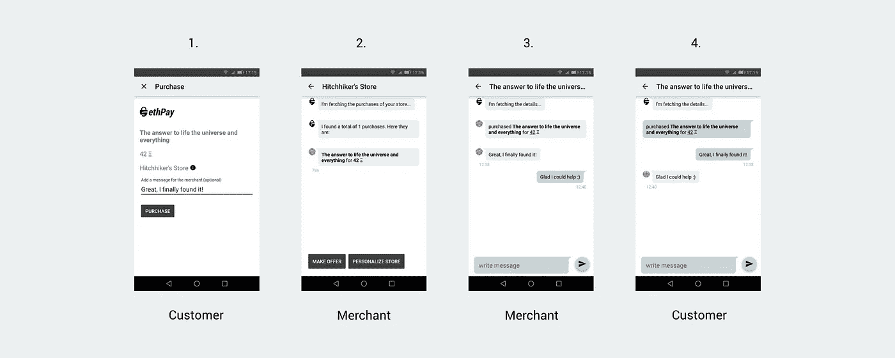
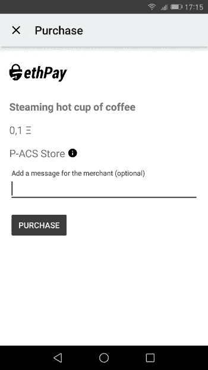
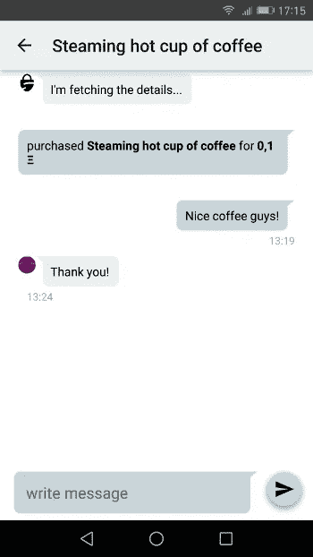

# 我们在 ethPay 上的进展:通过耳语加密聊天

> 原文：<https://medium.com/hackernoon/our-progress-on-ethpay-encrypted-chatting-via-whisper-6a9550ef036a>

我们想给你一个快速更新，关于过去几周我们一直在酝酿的关于 ethPay 的内容。

对于那些不知道 ethPay 的人来说，它基本上是一个分散的支付框架，使得建立虚拟商店来销售各种无形和有形的商品成为可能。我们喜欢车库拍卖或街头市场的比喻，只是它实际上位于区块链。我们在之前的文章中已经介绍了 ethPay。

我们面临的一个大问题是，我们将如何设计商家和客户之间的购后沟通流程。我们希望在应用程序中集成一个解决方案，但同时尽可能保持分散，即专有的聊天服务器是不行的。熟悉以太坊项目的人会知道接下来会发生什么:耳语。

耳语到底是什么？它被描述为 dApps 之间相互通信的通信协议，与以太坊虚拟机和分散存储系统 Swarm 一起构成以太坊世界计算机的“[圣三位一体](http://www.coindesk.com/ethereums-holy-trinity-takes-shape-swarm-testnet-arrives/)”。基本上，Whisper 使得在 dApps 之间安全地发送消息成为可能，并且支持终端用户之间的对等消息传递。

我们使用 Whisper，以便商家在购买后，如果需要，可以直接通过应用程序与客户沟通，反之亦然。在下面的简短示例中，您可以看到客户如何使用 ethPay 购买产品，以及给商家的消息。然后，商家会看到他的一个商店的产品被购买，当他点击购买时，应用程序会打开他和客户之间的聊天。

你可以自己尝试一下，我们已经在我们的测试网络上建立了一个名为“P-ACS Store”的商店，并提供了一杯虚拟咖啡，你可以用我们的测试以太网购买，并“耳语”我们一些东西。

用[钱包 app](https://play.google.com/store/apps/details?id=de.petendi.ethereum.android) 扫一扫这个码就行了。

扫码后屏幕应该是这样的。

购买后，您应该会在应用程序的主屏幕上看到 P-ACS 商店。只需点击它或打开菜单，点击“显示购买”。要加入我们的聊天，只需点击购买即可开始聊天，如下图所示:

ethPay 目前处于早期状态，只在我们的测试网络上运行，这就是为什么你不能失去任何真正的以太，所以不要担心:)

当然，如果您对 ethPay 有任何疑问，也可以给我们发一封老式的电子邮件。只需访问 [ethpay.world](https://ethpay.world) 。

这就是现在的全部，我们将在未来为您提供最新消息。

> [黑客中午](http://bit.ly/Hackernoon)是黑客如何开始他们的下午。我们是 [@AMI](http://bit.ly/atAMIatAMI) 家庭的一员。我们现在[接受投稿](http://bit.ly/hackernoonsubmission)并乐意[讨论广告&赞助](mailto:partners@amipublications.com)机会。
> 
> 如果你喜欢这个故事，我们推荐你阅读我们的[最新科技故事](http://bit.ly/hackernoonlatestt)和[趋势科技故事](https://hackernoon.com/trending)。直到下一次，不要把世界的现实想当然！

