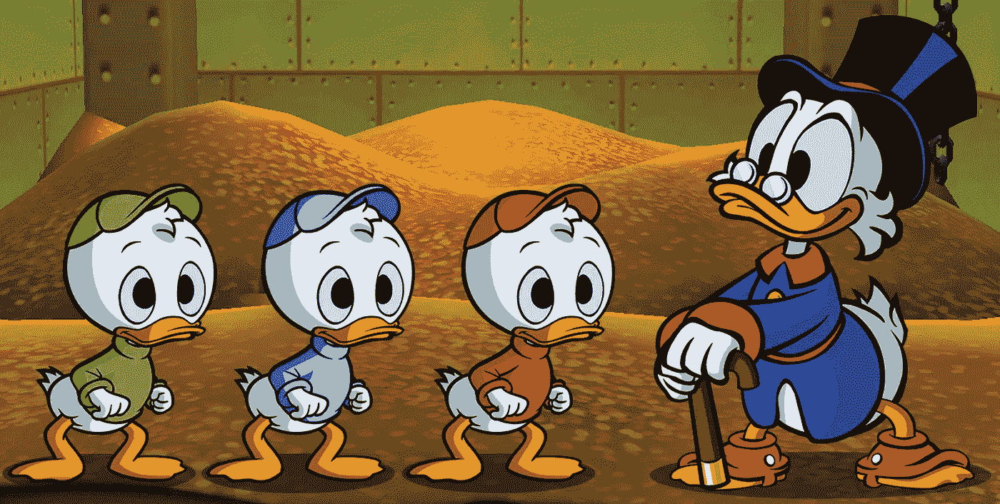
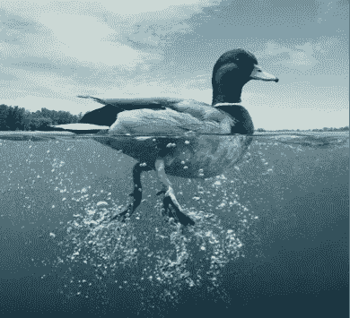
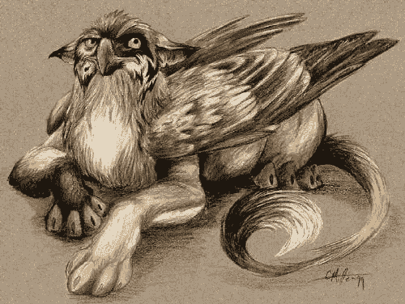
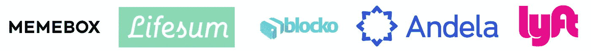

# 我们的启动资金是一只鸭子而不是天鹅

> 原文：<https://medium.com/hackernoon/our-startup-fund-is-a-duck-not-a-swan-a8fe48feb023>

在过去的几个月里，我们公司([www.sparklabsgroup.com](http://www.sparklabsgroup.com))发布了几份公告，内容涉及 [SparkLabs Beijing](https://techcrunch.com/2017/04/18/sparklabs-china/) 、 [SparkLabs Taipei](https://techcrunch.com/2017/08/07/sparklabs-launches-its-latest-accelerator-program-in-taipei/) 、 [SparkLabs Ventures](https://www.techinasia.com/sparklabs-ventures-korea-launch) ( *南韩和东南亚的 A 轮基金*)、[spark labs cultiv 8](http://www.afr.com/business/agriculture/sparklabs-ploughs-10m-into-orange-agriculture-technology-accelerator-20170914-gyh539)(*ag tech、FoodTech 和可持续发展加速器*)和[spark chain Capital](https://venturebeat.com/2017/10/19/sparkchain-capital-is-a-new-100-million-fund-for-blockchain-and-cryptocurrency-startups/)(*区块链和*

许多人向我们的一名团队成员发送了电子邮件、短信或电话，对我们的“快速增长”表示祝贺或评论。但与一家科技初创公司类似，上市并不意味着什么。虽然我们感谢这些善意的话语，这可能会让我们的自尊心受到几分钟的打击，但这些里程碑只是我们未来漫长旅程中的里程碑。此外，这些新的发射不支付账单:)

事实上，这些计划中的大部分已经酝酿了一年多，随机地，它们都是在过去的六个月中宣布的。例如，我们两年前开始在北京 SparkLabs 工作。我们花了两年多的时间，调查中国的创业环境，与几个潜在的合作伙伴交谈，谈判条款，寻找合适的人来领导加速器和其他重要步骤。SparkLabs Group 可能会被视为一只划过池塘的鸭子。滑翔，轻快地穿过创新的水域，到处添加新的加速器和资金，但现实是，我们正在表面下激烈地划桨。腿踢，心脏跳动，汗水淋漓和休息的梦想比比皆是。

运营 SparkLabs 类似于运营我们所有人以前都做过的任何科技创业公司或[目前正在做的任何科技创业公司](http://www.n3n.io/)(关于 [HanJoo 的创业公司](http://www.businesswire.com/news/home/20170714005016/en/Bespin-Global-Raises-15-Million-Series-Funding)和 [Frank 的创业公司](https://techcrunch.com/2017/02/14/gamed-learning-app-smartup-raises-5-5m-from-notion-capital-hong-leong/))。我们开玩笑的唯一区别是我们更经常筹款。说真的。

As VCs, all we do is fundraise :)

我们是一家年轻的风险投资公司，专注于成立不到五年的种子期创业公司。我们还没有任何签名出口。红杉(Sequoia)、Benchmark 和 Accel 等老牌风险投资公司几乎可以在几周内打响指，关闭它们的基金。

虽然硅谷有很多快速退出的好故事，比如 Cruise ( [在成立三年内被通用汽车以超过 1B](http://fortune.com/2016/03/11/gm-buying-self-driving-tech-startup-for-more-than-1-billion/) 美元的价格收购)，但我们却没有这么幸运。我们专注于选择要投资的创业公司，然后帮助他们在任何需要的领域发展他们的公司。嗯，这也不会随着我们基金投资组合的大规模退出而改变。至少我认为这不会改变我们团队的任何动力或努力，因为我们都热衷于帮助创业者。

我的联合创始人吉米·金(Jimmy Kim)开玩笑说，作为风险投资家，我们应该受到附带权益的激励，但作为一家没有大规模退出的新基金，“附带权益对我来说就像一只神秘的野兽，我可以想象它，但不能触摸或感受它，也不能相信它是真实的。”

Gryphon by Cara Mitten / “Carried interest is like a mythical beast to me!” Jimmy Kim, Co-founder of SparkLabs

因此 [SparkLabs Group](http://www.sparklabsgroup.com) 不是一只优雅的水鸟，而是一只奋力划水的鸭子，致力于建立我们在全球创业生态系统中的记录、影响力和影响力。

Some of SparkLabs Group’s portfolio companies. 154 companies across 6 continents since 2012.