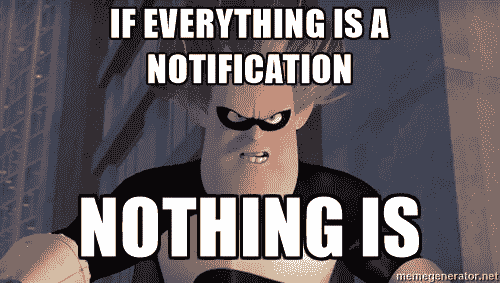
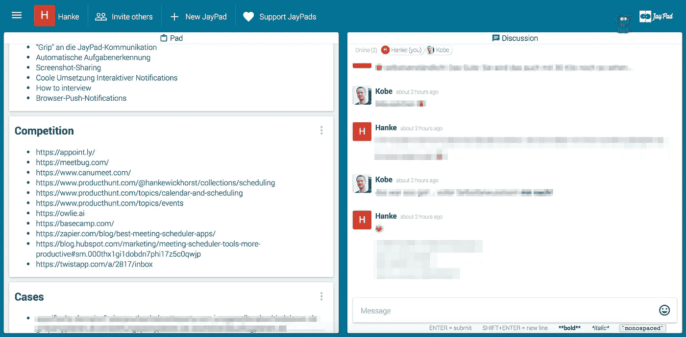
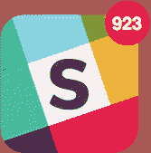
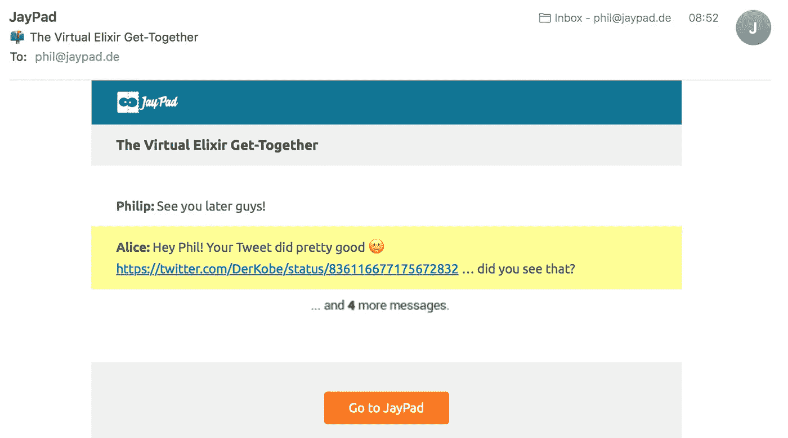

# 在松散协作工具中发出非恼人通知的 2 种方式

> 原文：<https://medium.com/hackernoon/our-take-on-non-annoying-notifications-for-collaboration-tools-8163d4604abe>

## 在“懈怠”或类似的群体聊天时代，基本上每个工作场所的未读气泡和通知都或多或少地过时了

[JayPads](https://jaypad.de/) 的一角是一个强大的讨论功能，很像一个单独的 Slack 频道或 WhatsApp 群聊。这些系统的一些主要问题在这里被很好地描述了(并且有争议地讨论了)[。尤其是过度告知和过度告知的缺点在我们当中引起了很大的共鸣。除了让人失去理智，最大的问题本质上是:如果一切都是一种通知——那什么都不是。](https://m.signalvnoise.com/is-group-chat-making-you-sweat-744659addf7d#.ahtxror96)

If your notification should somehow signal “this is important” — sending that signal hundreds of times daily might not be your best bet.

我们通过两种方式解决这个问题:

1.  我们提供了一种在接下来的五分钟内分离相关信息的方法(即“重要信息”)来自正在进行的讨论，讨论是由聊天的精髓[促成的](https://hackernoon.com/how-planning-a-weekend-trip-with-our-buddies-changed-our-perception-of-slack-and-whatsapp-1d53058f51d0#.l7rthhi3h)。
2.  我们处理通知的方式有点不同。

# 1.使相关信息易于获取

既然我们已经在聊天中描述了我们对小组交流的看法[这里](https://hackernoon.com/how-planning-a-weekend-trip-with-our-buddies-changed-our-perception-of-slack-and-whatsapp-1d53058f51d0#.v8k54yucc)和[这里](https://hackernoon.com/how-jaypads-help-us-build-jaypads-c66c07c6c3ae#.yecnbsmkq)——简单来说就是总结:

聊天对完成工作有很大的帮助，尤其是帮助远程团队“毫不费力”地保持联系(我们相信不止一些人会不同意这一点)。但是聊天的巨大力量也是它最大的缺点:发送信息的简单性。实际上，发送任何刚进入大脑的想法都没有任何障碍——这通常会将讨论聚集在一起，让它们变得非常难以理解。

> 聊天的巨大力量也是它最大的缺点:发送信息的简单性。

当减少聊天交流时，无论是在专业环境还是在私人环境中，就其核心而言，我们看到了两个维度:

1.  相关内容:如“我周一和周二有空”或“我想去拉斯维加斯”以及“见见这个竞争对手”或“我们的截止日期延至 5 月 15 日”等信息。
2.  不太相关的内容:*信息*比如“看这个可爱的猫视频”以及“我有点想在这里写点什么，以便在这里写点什么”。

我们通过将这些维度分开，解决了将它们混合在一个正在进行的对话流中的问题。

Relevant information on the left — ongoing discussions on the right: The [JayPad](https://jaypad.de/)-principle.

这种分离使得相关信息易于访问，同时还提供了以简单(且有趣)的方式进行讨论的便利方式。

# 2.以不打扰的方式告知活动

在每个单独的群组聊天或讨论频道中接收关于每个单独活动的通知会使这些通知变得过时。一旦积累了几十个甚至几百个未阅读，用户就会放弃，不再注意它们。如果你曾经在一个公共的 Slack 频道上加入了一个有几百甚至上千用户的“讨论”,你会感到痛苦。

Just returned from lunch.

与现有的每一种消息传递或群组通信工具相比，我们对群组聊天中活动信息的“重要性”有着不同的看法:聊天并不是通知某人的最紧急的工具——它仍然是你桌子上或口袋里曾经被称为“电话”的设备。把它捡起来，伸出手。如果你安排网上会议:很好。每个人都将在同一个频道，不需要通知。如果你只是写了一些正在进行的异步讨论的一部分:接受这样一个事实:这种讨论不会仅仅通过屏幕上某个地方弹出的一个简单的通知就演变成同步对话。

> 如果你的通知应该以某种方式发出“这很重要”的信号，那么每天数百次发送这个信号可能不是你的最佳选择。

在用户不在时发生了一些事情之后，通过电子邮件给一个主播说“发生了一些事情”。如果在接下来的 24 小时内，用户决定这个锚点足够相关，可以返回到 JayPad，则通知过程重新开始。

然而，这种机制本身可能是不够的，因为正在进行的对话发生了，并且一个小时前的指示“用户 A 说*嗨*”的锚可能掩盖了这样一个事实，即在这封电子邮件发送之后发生了更重要的讨论。这就是为什么我们在这封邮件中加入了一种访问 JayPad 活动信息的方式:每次打开邮件时都会有一个小的 gif 更新，并显示通知发出后发生的活动量。

A small gif updates with new information on activity every time Philip opens this email.

这种机制有助于用户更好地决定活动是否是一个足够相关的触发器，以加入对话或远离而不受打扰。

从技术角度来看，这也是很酷的东西，菲利普·克莱恩通过一些神奇的灵丹妙药一次解决了几个问题——如果这是你的堡垒，你应该看看 T2 的这篇文章，他详细介绍了如何建立这样的东西。

> [黑客中午](http://bit.ly/Hackernoon)是黑客如何开始他们的下午。我们是 [@AMI](http://bit.ly/atAMIatAMI) 家庭的一员。我们现在[接受投稿](http://bit.ly/hackernoonsubmission)并乐意[讨论广告&赞助](mailto:partners@amipublications.com)机会。
> 
> 如果你喜欢这个故事，我们推荐你阅读我们的[最新科技故事](http://bit.ly/hackernoonlatestt)和[趋势科技故事](https://hackernoon.com/trending)。直到下一次，不要把世界的现实想当然！

