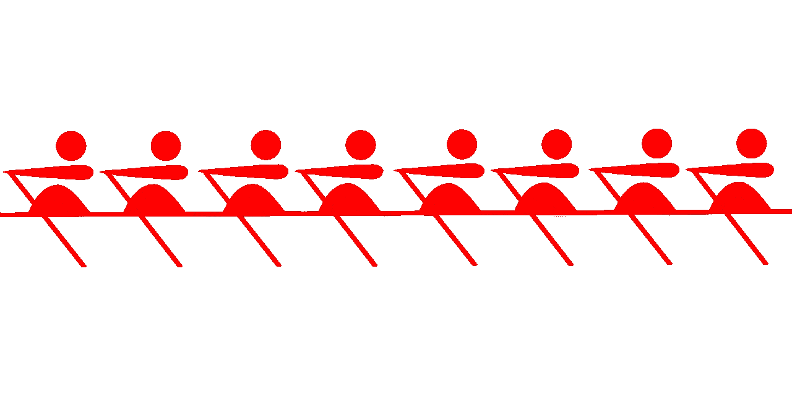

# ES6 对象中的乱序键

> 原文：<https://medium.com/hackernoon/out-of-order-keys-in-es6-objects-d5cede7dc92e>



最近在一篇关于 JavaScript [ES6](https://hackernoon.com/tagged/es6) Maps 的文章中，我写了关于属性键在遍历过程中的排序。在 ES6 之前的 JavaScript 中，期望键的顺序与它们被添加时的顺序相同是一个长期以来的错误假设。

ES6 引入了属性键排序，在规范中加入了对键排序方式的预期。键本质上是由 [JavaScript](https://hackernoon.com/tagged/javascript) 排序的，然而，键可能并不总是像你所期望的那样排序。

我建议，ES6 引入这个标准可能不是开始编写依赖于预期顺序的代码的理由。当然，在 ES6 中，可以使用地图作为数据结构。

[](https://hackernoon.com/what-you-should-know-about-es6-maps-dc66af6b9a1e) [## 关于 ES6 地图你应该知道什么

### JavaScript ES6 引入了一种新的数据结构，称为 maps。地图被设计为使用对象的替代方案…

hackernoon.com](https://hackernoon.com/what-you-should-know-about-es6-maps-dc66af6b9a1e) 

基本上，这就是问题所在。您可以这样做:

```
x = {zzz:1}
// Object {zzz: 1}x.a = 2
// Object {zzz: 1, a: 2}x[window] = 3
// Object {zzz: 1, a: 2, [object Window]: 3}x['0'] = 4
// Object {0: 4, zzz: 1, a: 2, [object Window]: 3}Object.keys(x)
// ["0", "zzz", "a", "[object Window]"]
```

在现实世界中，您可能不会遇到这个例子，但是您也不能依赖于这些键是按照它们被添加的顺序列出的，或者依赖于系统对这些键的一致排序。

根据规范，*没有规定枚举属性的机制和顺序*。

[](http://www.ecma-international.org/ecma-262/6.0/#sec-ordinary-object-internal-methods-and-internal-slots-enumerate) [## ECMAScript 2015 语言规范- ECMA-262 第 6 版

### 本软件由 ECMA 国际“按原样”提供，并有任何明示或暗示的担保，包括但不限于…

www.ecma-international.org](http://www.ecma-international.org/ecma-262/6.0/#sec-ordinary-object-internal-methods-and-internal-slots-enumerate) 

当然，您可以花时间研究规范，以及不同类型的枚举的不同含义，或者像过去一样，不要创建依赖于键的顺序的代码。

犯一些错误并不难。在这里，我们看到我们没有得到输入键的顺序，而是系统对它们进行排序。整数，然后正常的字母排序，然后符号。

```
o = {a:0, 2:1, 1:2, b:2, ['zz']:4, window:5}
// Object {1: 2, 2: 1, a: 0, b: 2, zz: 4, window: 5}Object.keys(o)
// ["1", "2", "a", "b", "zz", "window"]
```

这是在 Chrome 56 里。然而，正如 ES6 中的属性排序所预期的，这些键都是字符串，即使 ES6 调用非字符串键类型。这些键是字符串，按字母顺序排序，但不是。这里发生了一点事情。

因此，一个选择是不要对普通的旧 JS 对象中的键排序做太多假设，而是继续编写不依赖于它的代码，或者在 ES6 中使用 map，这非常适合这个目的。


Like these articles? Please Recommend Below. Thanks.

[](http://bit.ly/HackernoonFB)[](https://goo.gl/k7XYbx)[](https://goo.gl/4ofytp)

> [黑客中午](http://bit.ly/Hackernoon)是黑客如何开始他们的下午。我们是 [@AMI](http://bit.ly/atAMIatAMI) 家庭的一员。我们现在[接受投稿](http://bit.ly/hackernoonsubmission)，并乐意[讨论广告&赞助](mailto:partners@amipublications.com)机会。
> 
> 如果你喜欢这个故事，我们推荐你阅读我们的[最新科技故事](http://bit.ly/hackernoonlatestt)和[趋势科技故事](https://hackernoon.com/trending)。直到下一次，不要把世界的现实想当然！

