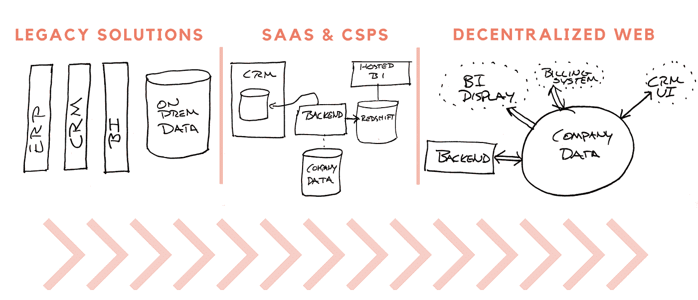
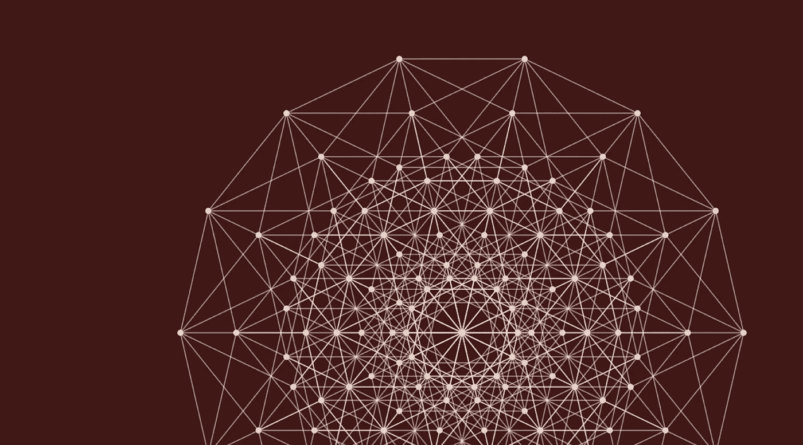

# 超越我们的互联网:夹在内部网和分散网络之间

> 原文：<https://medium.com/hackernoon/outgrowing-our-internet-caught-between-the-intranet-and-the-decentralized-web-707c532abbe2>

Photo: [Wikipedia](https://en.wikipedia.org/wiki/Hughes_H-4_Hercules#/media/File:H-4_Hercules_2.jpg)

*由*[诺亚杰索普 ](https://twitter.com/njess)

SaaS 已经运行良好。在过去的十年中，它成为向客户交付软件和价值的主要方式。为个人或公司想要完成的任何可能的任务建立新的提供商变得比以往任何时候都快。

但并不是所有的好事都能持久。我已经在前面的“[中详细地描述过这个问题，SaaS 之后会发生什么？](https://hackernoon.com/what-comes-after-saas-1f71ec40de45)”

但在过去的一年里，我越来越清楚的是，云 3.0——一个开放认证和微服务的时代——不是下一个 SaaS。相反，这是一个尴尬的“tweener”年。

我们将看到这些云原生平台的寒武纪大爆发——以及试图将我们今天拥有的混乱系统粘合在一起的服务。【也许我们可以称之为“连接服务平台？”或者简称为“CSP”？]

这种公司爆炸式增长之后，将会是一次大规模的灭绝，这是由流星般的生产就绪型 [**分散式网络**](https://ischoolonline.syr.edu/blog/what-is-the-decentralized-web/) 的到来造成的。

让我们开始吃吧。

SaaS 的成功产生了意想不到的副作用:需要管理的工具太多了。整个行业都围绕着“影子 IT”建立起来，影子 IT 是指找出一家公司实际使用什么样的云工具的过程。数字惊人。

SkyHigh networks(影子 IT 领导者之一)发现普通企业拥有 759 种不同的云服务。这一数字比上一季度增长了 21%，而这项研究是在 2014 年的 Q1 进行的。

# 连接服务平台的差距

正如吉姆·巴克斯代尔(网景公司和马克·安德森的联合创始人)所说

> 赚钱的方式只有两种:捆绑销售和非捆绑销售

SaaS 提供捆绑软件*和*托管。

连接服务平台将*不同的 SaaS 系统捆绑在一起*。

一个最好的早期例子是一家名为 Segment 的公司。他们发现他们无法让人们转向他们的 SaaS 分析产品，所以他们制作了一个中间件平台，以便更容易在分析提供商之间切换。迄今为止，他们已经从谷歌、Accel 和其他公司筹集了超过 1 亿美元。

另一个非常有价值的例子是一家名为 LiveRamp 的数据翻译公司(该公司随后被 Acxiom 以超过 3 亿美元的价格[收购——这个价格现在看起来像是他们在其公开收购方内建立的业务的一个偷窃)。LiveRamp 的连接服务很简单:不同广告技术公司内部用户 id 之间的翻译。创始人 Auren Hoffman](https://adexchanger.com/data-exchanges/acxiom-to-buy-liveramp-for-310m/)[指出](https://www.quora.com/What-must-every-entrepreneur-working-on-a-SaaS-B2B-startup-know#!n=36)连接和中间件公司具有的结构优势:

> *“我喜欢中间件公司(集成中心)和数据合作社的原因之一是，市场上有一个明确的领导者通常是有道理的。”*

在 [Founder Collective](http://www.foundercollective.com/) 这里，我们现在每周都会看到 2-3 家公司有意或无意地在所有不同的垂直领域采用类似的模式:

*   举例来说，[幸福地](https://www.blissfully.com/)(披露:我是一个投资者)为统一发票和控制汇总 SaaS 使用。
*   金融 API company [Plaid](https://plaid.com/) (披露:希望我是投资者)在一个统一的 API 中集合了对许多不同银行系统的访问。
*   API connectivity company[za pier](https://zapier.com/)让更多的人一起构建公司的关键系统。

其他公司试图从认证任何一系列服务中提供新的见解——更好地了解客户成功的努力，更好地了解通过聚合来自许多系统的信息的销售渠道，以及无数其他例子。

通过提供对他们已经使用的所有工具的统一访问*对公司来说有难以置信的价值。无论这是机器可消耗的饲料，见解或报告，以更好地管理公司，还是连接核心系统的关键胶水。*

对于连接服务平台(及其投资者)来说，仍然有一些有利的网络效应需要追逐——第一个能够在任何空间释放真正价值的企业有机会最快地建立最多的集成。更多的整合为新客户带来更多的价值(核心的正向内生循环)，并给早期领导者赢得品类领导者的机会。

其中一些电信运营商——特别是当他们在类别中的地位不确定时——试图利用客户的聚合信息来创造附加价值(并试图拥有真正的护城河)。陈佳瑞将这种行为称为“智能系统”

但是，通常情况下，连接服务平台的核心价值主张是汇集和组织来自许多不同客户系统的数据。

# 分散式网络的到来

下一个销售团队不会是一家公司。这将是一个特别擅长存储客户数据的协议。它将拥有一个庞大的生态系统，包括 GUI 提供程序、报告生成器、连接管道、导入/导出工具以及 Salesforce 生态系统中存在的所有其他东西。

让它深入人心。打破 Salesforce 近乎垄断的竞争对手不会是一个人、一家公司或你可以抢先收购的东西。

在去中心化的网络中，企业数据的每一个元素都是活的、加密的，以特定的协议供其使用。

正如电子邮件和 HTML 是任何人都可以解析的标准一样，新的协议开发将提供全新的方式来安全地存储、索引、访问、共享和检索数据。

当“后端”和“数据库”都是分散的、标准化的元模式时，疯狂的事情就开始发生了:

*   软件公司可以提供 SaaS 式的便利和部署，而无需自己托管和管理任何基础架构
*   CSP 的整个核心价值可能会消失，除了为遗留系统提供 ETL。当有标准化的方案(通过协议)时，你可以免费获得“集成”——就像你不必编写定制软件来浏览一个新网站一样。
*   你将能够把两个(或者更多的)软件连接在一起，这些软件*从来不需要互相集成或者与任何中间件*集成。并获得完美的开箱即用功能。
*   正如 WhatsApp 是第一个拥有 1B+用户的应用程序，由<50 engineers, we may well see the first app used by 1B+ people written by just 1 or 2 crypto engineers.

Experts in the Decentralized Web have brought forward many other shortcomings of our current system: open systems like Wikipedia lack authorship; internet content is easily mutable and non durable; and many fascinating problems to explore more fully in future research.

The limelight is still on these companies **带领我们度过后 SaaS 时代、去中心化前的那些年**。

都是为了今天错综复杂的网络。以及构建下一代互联网所需的基础研究和协议开发。

如果你喜欢读到这里，请👏以帮助传播作品。嘿，用于出版的去中心化网络的 1.0 版可能没有这些好的社交功能，所以我们必须尽可能地使用它们。

*您是构建人力资源细分数据的团队吗？很乐意见到你。在人力资源技术变得分散之前，有一个非常大的业务要建立…*

*你是一个团队建设加密技术吗？职业交易员？我们将在旧金山举办一系列秘密沙龙——如果你想在未来的活动中加入我们，请写信告诉我你的一些兴趣。*