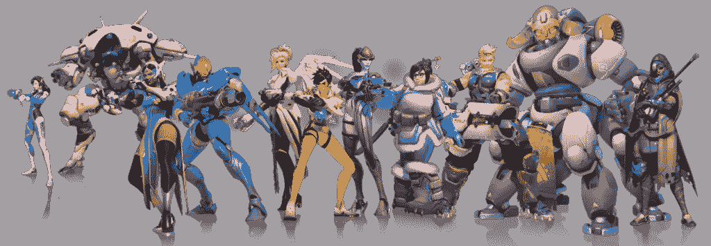
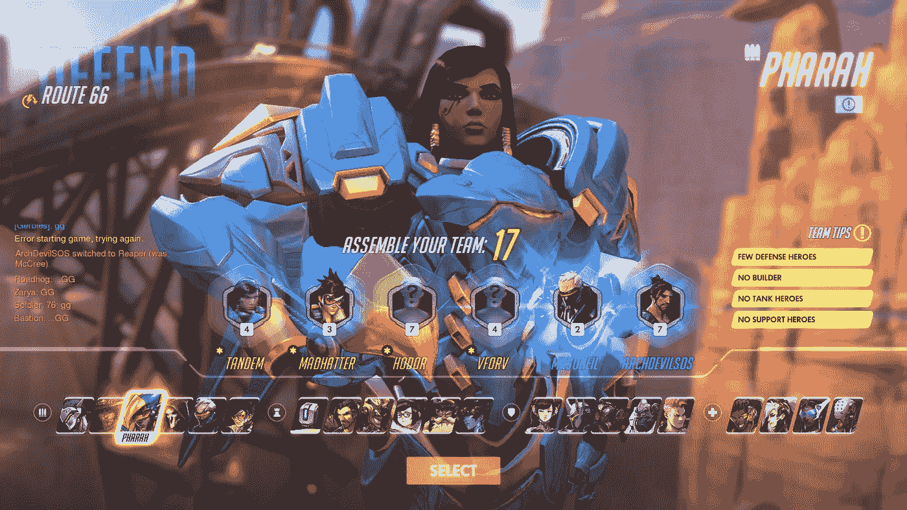
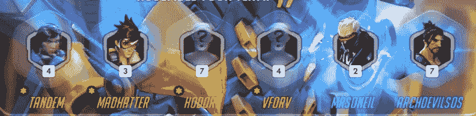
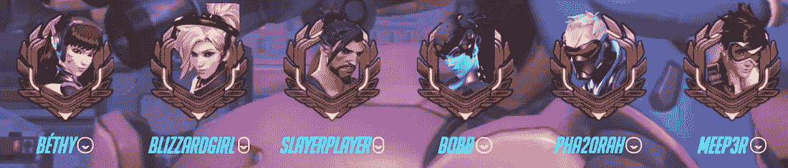
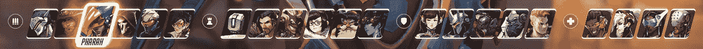
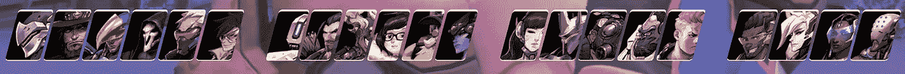
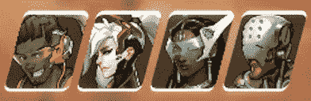
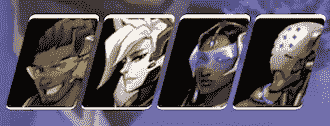
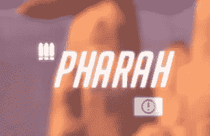

# 反应+魅力+监视=过度反应:监视菜单的复制品

> 原文：<https://medium.com/hackernoon/over-reacting-d4d3d08c62ef>

## 用 React.js 重新创建*看守*英雄选择 UI

Video demo of Over-React. Assets courtesy of Blizzard Entertainment.

*守望* 是一款高度风格化的团队射击游戏，设定在一个值得为之奋斗的未来。每一场比赛都是一场激烈的多人对决，不同类型的英雄相互较量。守望先锋的特色是以小队为单位的战斗，两个对立的队伍各有六名玩家。玩家从几个英雄中选择一个，每个英雄都有自己独特的能力和职业。四个英雄类别包括:进攻型英雄，速度和攻击高，但防御低；防御型英雄，旨在为敌人形成[瓶颈](https://en.wikipedia.org/wiki/Choke_point)；支援型英雄，分别为盟友和敌人提供[buff](https://en.wikipedia.org/wiki/Status_effect)和 debuffs(如治疗或速度改变)；以及[坦克型英雄](https://en.wikipedia.org/wiki/Tank_(gaming))，拥有大量护甲和生命值，以抵御敌人的攻击并吸引队友的火力。在赛前设置期间，如果一个团队中的玩家的团队不平衡，例如他们缺乏防守英雄，则游戏会给他们提供建议，鼓励玩家尝试新的英雄，以便平衡首发团队。

暴雪娱乐公司仍然是世界上最著名和最受欢迎的游戏公司之一，因为他们拥有令人惊叹的用户友好界面和简单易学的游戏环境。 *Overwatch* 是艺术设计的绝佳范例——纯粹的触觉享受与精致、智能的设计相遇，创造出罕见的魔法火花。虽然它没有完全淹没我的选项，地图和模式，但它有众多的战术层，没有一个能阻止我享受它激烈，旋转的团队战斗和激动人心的加时赛。让包括我自己在内的大多数人享受这个游戏的是，在进入游戏之前，看看五颜六色的英雄阵容，从仿生牛仔，到绿色电子忍者，到来自月球的转基因大猩猩(不，我是认真的。即使我尝试，我也不能编造这个)每个人都有一个英雄。**由于暴雪努力制作一款像 *Overwatch、*这样多样化的游戏，尤其是一款有着强壮的，特别是披着斗篷的女性主角的游戏，我在比赛中遇到了不少女性，尤其是黑人女性，她们和技术团队都同意，她们终于可以和视频游戏扯上关系，并可能从事游戏开发。**

Female Heroes from left to right: D.Va, Symmetra, Pharah, Mercy, Tracer, Widowmaker, Mei, Zarya, Orisa, and Ana

# 项目灵感

有一天在等比赛的时候，我决定佩服一下游戏的英雄选择 UI。古怪的角色舞蹈和特效让我目不转睛地盯着屏幕。这是一个长队，我甚至有时间仔细检查元素。现在我离开了学校，有更多的时间做个人项目，这可能是一个提升我的 UI 和 UX 技能的好机会，并满足我对*守望者*的痴迷。

# 为什么要反应？⚛️

没有详细的用户界面和用户体验，暴雪游戏就不是暴雪游戏。 *Overwatch* 的英雄选择界面有相当多的组件，复制起来会很吓人。React 无疑简化了事情的计划方面，因为组件是它的一个非常基本的部分。

Original hero selection UI. Courtesy of Blizzard Entertainment.

UI 的每一部分都被视为小部件和模块。当您想到要构建的用户界面(使用 React)时，最好从您可以定义的最小可能组件的角度来考虑。

这些组件包括定义如何创建 DOM 元素以及用户如何与之交互的代码。组件可以完全用 JavaScript 定义，也可以用 JavaScript 的一个超集(或扩展变体)定义，称为 JSX。这个项目是用`creat-react-app`构建的，它包含了在产品构建过程中将 ES6 代码转换成纯 JavaScript 的工具。

## UI 组件

我将 Hero Select UI 分成了 5 个组件:

1.  **游戏信息**:玩家可以在屏幕顶部看到地图名称、游戏模式和英雄的名字。
2.  **英雄选择**:六个玩家都选择的战斗英雄。

Original hero selections

Replicated hero selections (no real usernames were used)

**3。英雄**:按职业分类的英雄线性网格。使用了暴雪娱乐提供的 PNG 资产。

Original grid of Heroes

Replicated grid of Heroes

Close ups of original grid of Support Heroes, and replicated grid of Support Heroes

**4。英雄视频**:玩家选择英雄后显示英雄介绍的背景屏幕

**5。选择按钮**:屏幕底部的按钮。它还没有功能，但是它显示了我提升了多少 UI 技能

我用了暴雪提供的“大面条”作为 UI 字体。一旦我将主 UI 划分成独立的组件，我就可以轻松地定义构成五个主要 UI 组件的常量和属性。

## 代码片段

主应用程序整合了所有这些组件。下面是使用五个主要组件的主要代码:

Main code consolidating all React components

当用户访问该网站时，它默认选择 Tracer(她是我的最爱之一)。React 的另一个基本部分是它的状态管理，这意味着它跟踪用户的最后一次交互。然后，我们有一个功能来改变用户选择的英雄的当前状态。`render()`在后台创建带有英雄介绍视频的 UI，其余组件放在容器中。

# 为什么迷人？💄

[光鲜亮丽](https://glamorous.rocks/getting-started/)天赐良机(谢谢[肯特](https://blog.kentcdodds.com/introducing-glamorous-fb3c9f4ed20e))。它让一种风格直接在 React 代码中反应组件。这是以优雅的方式整合代码的好方法。不再需要在`css`和`js`文件之间来回切换。对于 laz 来说，这是一个神奇的工具…我的意思是高效的程序员💅

## 创造迷人的组件

由于魅力，我在 React 文件中为每个组件定义了样式。下面是选择按钮代码的一个片段:

该按钮有两个组件:选择 div 和填充 div 的按钮。这些风格和它们的变化将通过代码和构建来实现。

虽然 UI 有五个主要组件，但每个组件都需要被分解成更小的部分，以便更容易地设计样式，如上面的代码所示——我将使用游戏信息组件作为一个更复杂的示例。游戏信息部分被分成三个不同的部分:游戏类型、地图和角色。离开原来的界面，它在上面显示游戏处于防御模式，地图名称是 66 号公路，和选择的英雄 Pharah。

Parts making up the Game Info component

Parts making up the Game Info components in the replica

下面的要点展示了游戏信息的每个部分是如何制作和风格化的。

Component styles for Game Info

在 React 的默认`localhost`服务器上部署开发人员版本时，laminary 简化了测试和调试过程。我能够更新功能和风格，同时保持在同一个文件中，并自动部署应用程序的新变化。这产生了一个*非常*简约的`css`文件，只有 4 行代码:

# 外卖食品

总的来说，这是我最喜欢的项目之一，因为我极大地提高了我的 UI 技能。我了解了我最喜欢的一款游戏的各个部分，并熟悉了新的风格框架。我期待将这些应用到未来的 UI 项目中(希望是游戏 UI 的另一个复制品)。我想继续努力，直到我能让它尽可能接近原来的 UI，比如为所有新英雄添加英雄介绍，添加英雄类别图标，为所选英雄添加信息图标，等等。

# 教育福利

尽管人们普遍认为电子游戏有其教育意义，但我相信这对学生来说是一个有用的框架，尤其是那些渴望成为游戏行业设计师或开发人员的女性和女孩。女性玩家和男性玩家一样喜欢《守望相助》。

根据最近的一项研究，女性和女孩占了《T2 守望先锋》玩家总数的 16%。16%可能看起来不是很多，但对于像《守望先锋》这样受欢迎的游戏来说，这意味着数百万额外的玩家，相比之下，像《使命召唤》或《战地》这样以香肠为中心的专营权。美元:由于 *Overwatch* 已经卖出了超过 3000 万份，这款游戏的女性用户群大约有 500 万——她们给了暴雪大约 2 . 5 亿美元。

像 [Any Key](http://www.anykey.org/) 、 [Girls Make Games](http://girlsmakegames.com/program.html) 、 [Black Girls Code](http://www.blackgirlscode.com/) 、[Girls Code](https://girlswhocode.com/)这样的组织，或者任何其他在这里找到[的组织](https://www.womentechmakers.com/communities)都可以利用这种增长，为渴望成为视频游戏设计师和开发者的女性和女孩提供类似的课程。虽然这些组织大多迎合 18 岁及以下的女孩，但剖析和复制面向所有年龄段玩家的流行视频游戏的用户界面和 UX，可以增强所有年龄段女性的自信心，她们可能已经成为性别歧视之外的年龄歧视的受害者。这也可能导致女性对视频游戏行业做出更多贡献。

我希望这篇文章能促使你提高你的用户界面技能，并了解你最喜欢的视频游戏是如何制作的！