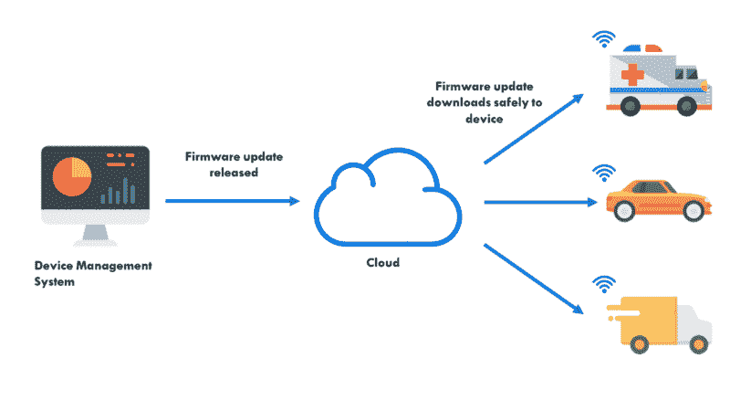
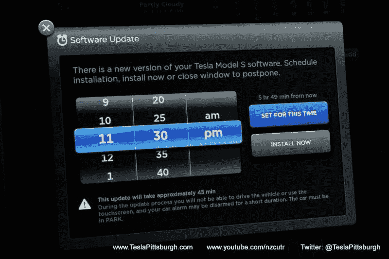

# 无线固件:物联网成功的关键驱动力

> 原文：<https://medium.com/hackernoon/over-the-air-firmware-the-critical-driver-of-iot-success-f4604bd0b881>

## 了解 OTA 固件更新的基础知识，以及它们如何改变物联网产品的未来。

在[物联网](https://hackernoon.com/tagged/iot)的早期，更新远程设备经常会导致间歇性中断和性能下降。随着物联网平台的成熟，它们已经采用了一种新的方式来远程可靠地更新联网设备，几乎没有中断:**空中下载(OTA)固件更新。**

无线固件更新是指远程更新嵌入式设备上的代码。嵌入式硬件必须构建有 OTA 功能，这种机制才能工作。

下面是如何使用[设备管理系统](https://console.particle.io/login)将 OTA 固件交付给远程设备的可视化展示:

# 为什么是 OTA 固件？

在 OTA 更新之前，你必须出去取回设备，拆开它，将其连接到你的电脑，重新编程，将设备装回一起，然后再把设备拿回来。

然而，对于在现场使用设备的公司来说，这一过程过于繁琐且不可扩展。尽管如此，这并没有阻止一些人的尝试。。。

*   2015 年，克莱斯勒因通过邮寄 USB 驱动器修补[软件](https://hackernoon.com/tagged/software)漏洞而受到批评。克莱斯勒的方法将许多消费者置于风险之中，因为 USB 驱动器可能被拦截、修改和重新发送。

另一方面，

*   2016 年，在该公司发出 OTA 固件更新后，特斯拉司机醒来后发现他们的汽车有了大量新功能。消费者现在可以自己停车，而不必手动更新他们的车辆。

你告诉我哪个标题更好。

# OTA 固件优势

1.  **缺陷和产品行为**即使在设备到了消费者手中之后，也可以持续改进。
2.  **公司可以通过向一个或多个设备发送更新来测试新功能**。
3.  **公司可以通过无缝、统一的界面管理设备群中的固件，从而节省成本**。
4.  **开发人员可以频繁而可靠地部署，**知道随着更新的发布，产品将保持功能。
5.  **OTA 固件通过在产品发布后添加新功能和基础设施来增强可扩展性**。

# OTA 固件和设备管理

要发送 OTA 固件更新，您需要一个能够与物联网设备上的微处理器和本地软件相连接的设备管理系统。这很难构建，因为很少有公司拥有能够处理 OTA 固件更新和管理远程设备的物联网软件和硬件生态系统。

> “软件/固件的空中更新(SOTA/FOTA)被视为在系统的整个生命周期内使用最新版本管理软件更新的重要方法。”—夏羽·斯特拉姆，智能 2.0

# 实施 OTA 固件更新

公司可以采取两种选择:您可以构建自己的 OTA 固件系统或购买托管的 OTA 固件系统。对于构建路线，您必须研究、规划并咨询领域专家，以帮助您将 OTA 功能添加到硬件和软件中。实施适当的行业加密、找到兼容的硬件/软件，以及找到能够真正帮助您的领域专家将是您最关心的问题。

然而，由于数据传输的复杂性和安全性问题，您可以利用托管平台解决方案。例如，一个这样的平台是粒子平台。

# 粒子和 OTA 固件入门

[Particle](https://www.particle.io/) 是一个全栈物联网平台，提供硬件和软件工具，将日常电子设备连接到互联网。这个平台的一部分，粒子云和控制台，也允许消费者通过无线固件更新来控制设备和产品的车队。以下是使用 Particle 进行 OTA 固件更新的一些好处:

1.  **让您的产品经得起未来考验**知道 Particle 会照顾好基础设施、硬件和软件。
2.  **OTA 固件更新是分块发送的**，这样你的设备就不会死机。如果您的设备在更新过程中失去连接，它将在连接恢复时恢复。
3.  **固件更新会立即交付**，因为更新只是发送到应用层，而不是系统层。系统固件由粒子团队维护，因此您可以专注于用例。
4.  **轻松地从 1 台设备向 1，000 台设备发送 OTA** 固件更新，没有硬件可扩展性或软件问题。
5.  **通过向一个或一组受控设备发送固件更新来测试应用程序更新**。
6.  **安全交付更新**了解设备和粒子云之间的所有通信渠道都经过完全加密和授权。
7.  **通过粒子控制台完整地记录每个版本**,为您的团队提供每个版本中变化的全面描述。
8.  **设备可以被设置为安全模式**，因此它不会执行任何应用程序代码，如果新的应用程序代码包含阻止设备连接到云的错误，这将非常有用。

# 所有的一切

OTA 固件是物联网成功的关键驱动因素，因为它为互联设备的可靠性和可扩展性提供了动力。公司必须决定构建自己的 OTA 固件系统是否值得花费时间和潜在成本，或者购买具有 OTA 固件功能的平台是否是更新远程无线设备的更高效和有效的方式。