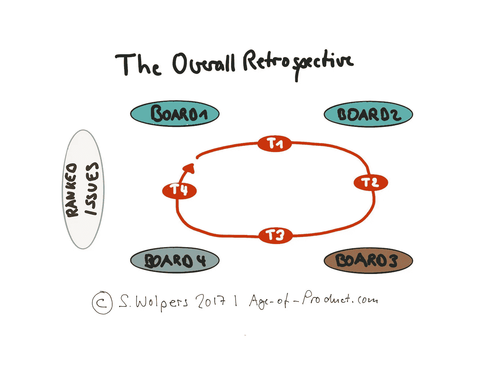

# 团队和涉众的整体回顾

> 原文：<https://medium.com/hackernoon/overall-retrospective-ae537cfac36f>

在时间和预算范围内，在新的技术堆栈上重建了现有的应用程序后，我们的团队本周与利益相关者进行了全面的回顾，以确定系统问题。我们总共发现了 20 多个问题，并得出了 8 个详细的建议，这些建议是组织在向敏捷产品创建的下一个阶段前进时需要解决的。

请继续阅读，了解我们是如何在不到两个小时的时间内，通过 16 人参与的整体回顾取得这一成果的。

# 整体回顾的起源和目的

全面回顾的概念是从大规模 Scrum 借用来的:

> *“整体回顾会是一次新的见面会。其目的是讨论跨团队、组织和组织内部的系统性问题。”*

**来源** : [大规模混战](https://less.works/less/framework/overall-retrospective.html)。

通过比较，我们决定采用两个变更:a)在取得一个重要的结果后，我们运行团队的整体回顾:应用程序在四周前成功地启动，b)所有团队成员都参与，而不仅仅是团队的代表。(无论如何，我们不是有两个团队，而是作为一个大型的分布式团队工作。)

这个全面回顾的目的是向组织提供关于如何为未来的团队和产品以敏捷的方式改进工作的建议。

***请点击【拍手】*👏如果你觉得这篇文章有用，那对我来说意义重大！**

# 为整体回顾做准备

要进行全面回顾，您需要:

1.  一个大房间，提供足够的空间容纳多达 20 人在几块板前工作，并在它们之间行走
2.  不同颜色的大贴纸——每个团队应该有不同的颜色
3.  夏普斯
4.  用于点投票的粘性点
5.  讨论整个回顾主题的标牌。

对于预期的发现和讨论，我选择了以下四个主题:

1.  与组织合作
2.  与客户合作
3.  敏捷和 Scrum
4.  技术卓越。

# 下载敏捷过渡 PDF

最新的、174 页的《敏捷过渡——来自战壕的实践手册》就在这里**可以找到，而且是**免费的！****

****

# **开始整体回顾**

**整个回顾始于创建四个团队——每个主题一个团队。考虑到有 16 个人参加了这个仪式，我们最终组成了 4 个团队，每个团队 4 个人，并行处理 4 个问题。**

**整个回顾分为三个不同的阶段:**

## **构思阶段**

**在构思阶段，所有团队同时就一个主题工作七分钟，每个团队在公开讨论中提出三个最重要的问题。在时间盒结束时，该小组将产生的三个胶粘物移动到板的背面，以防止在随后的组中产生偏见。然后每个队都移动到相邻的棋盘上。这样，所有团队在大约 30 分钟内循环通过所有四个主题。**

## **聚类阶段**

**在第四轮结束时，每个小组不仅要把他们的三个问题放到后面，还要看一看已经存在的其他九个问题。他们的任务是将所有 12 个帖子聚集到相似的主题中，为整个回顾的第三阶段做准备:通过点投票对问题进行排序。**

**聚类阶段花了大约 10 分钟，因为我们发现我们在不同的板上列出了相似的主题。因此，团队决定对所有四块电路板进行简单检查，以确定相关问题，并将它们放在同一块电路板上。**

## **排名和讨论阶段**

**总体回顾的第三阶段开始于对所有董事会确定的问题进行点投票。每个参与者总共有六个点，每个人都可以自由分配它们。(单个问题可附加的点数没有限制。)这部分大概花了十分钟。**

**排名最高的三个问题是:**

1.  **技术问题自主权(96 票中的 17 票)**
2.  **团队寿命(96 票中的 11 票)**
3.  **文化冲突:敏捷与瀑布。(96 票中的 7 票。)**

**这三大问题吸引了近 35%的选票。**

**总体回顾的最后一部分是[精益咖啡](http://leancoffee.org/)，根据排名前三的问题向组织提出建议。这部分大约需要 60 分钟，总共提供了 8 条建议，例如:**

*   **授权团队为他们的产品/项目做出适当的技术决策**
*   **让整个团队参与产品/项目的初始定义阶段**
*   **不要让人们在团队中进进出出**
*   **在 Scrum 指南的意义上授权给产品负责人**
*   **将项目治理与敏捷实践相结合，例如，在采购、法律、人力资源方面。**

**如果你现在认为这个组织仍然处于敏捷之旅的早期阶段，那么你是对的。然而，好消息是，该团队的成功也引发了一个有希望的发展:该团队明年将成为一个产品团队，因为应用程序不再被视为一个项目。**

# **结论**

**团队及其利益相关者的整体回顾被证明是成功的。每个人都对回顾展的紧凑性及其结果感到非常惊讶。当然，总体回顾不能保证建议最终被接受。至少，参与构建新应用程序的人员履行了他们对持续改进的职责。**

**你如何教育你的组织？请在评论中与我分享。**

***请点击“拍手”*👏*,如果你觉得这篇文章有用——它对我来说意义重大！***

***你想读更多这样的书吗？嗯:***

*   **📰*加入 12，623 位同行和* [*报名参加本周简讯*](https://age-of-product.com/subscribe/?ref=Food4ThoughtMedium)**
*   **🐦*关注我的* [*推特*](https://twitter.com/stefanw) *订阅我的博客* [*产品时代*](https://age-of-product.com)**
*   **💬*或者，免费加入* [*Slack 团队的 1980 多名同行“动手敏捷”*](https://goo.gl/forms/XIsABn0fLn9O0hqg2) *…***

***原载于 2017 年 11 月 8 日 age-of-product.com***。****